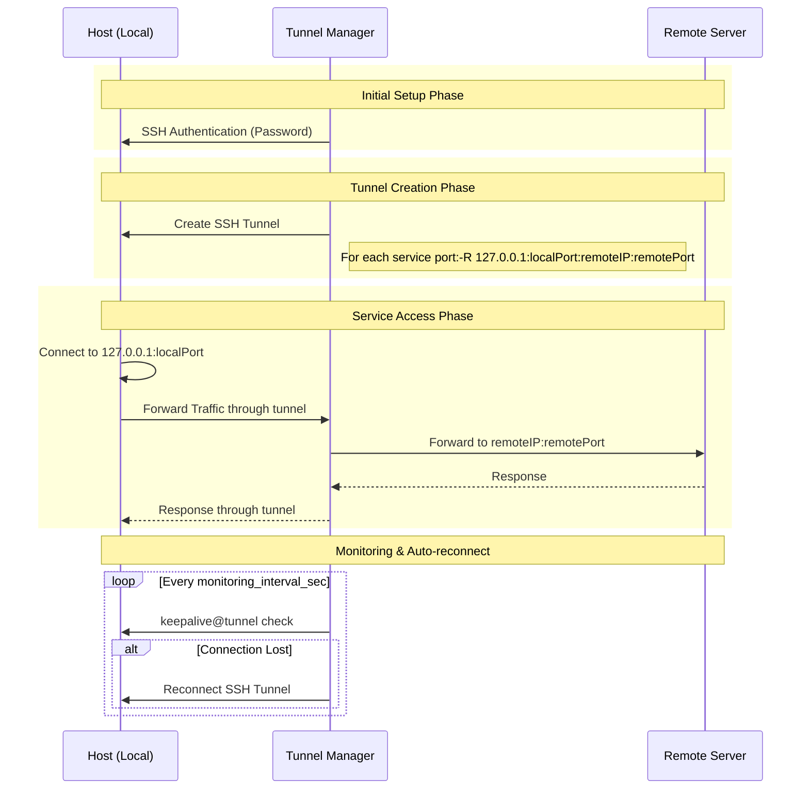

# Tunnel Manager

SSH 터널을 관리하기 위한 RESTful API 서버입니다. 여러 Host에 대한 SSH 터널을 생성하고 관리할 수 있습니다.

## 주요 기능

- Host 및 서비스 포트 관리
- SSH 터널 자동 생성 및 관리
- 터널 상태 모니터링
- 장애 발생 시 자동 재연결
- RESTful API 인터페이스

## 시스템 요구사항

- Go 1.23 이상
- MySQL 5.7 이상 또는 MariaDB 10.3 이상
- Docker & Docker Compose (선택사항)

## 동작 방식



## 설치 및 실행

### Docker Compose를 사용하는 경우

1. 저장소 클론
```bash
git clone https://github.com/jollaman999/tunnel-manager.git
cd tunnel-manager
```

2. 설정 파일 수정
```bash
# config.yaml 파일을 환경에 맞게 수정
vi config/config.yaml
```

3. Docker Compose로 실행
```bash
docker-compose up -d
```

### 직접 실행하는 경우

1. 저장소 클론
```bash
git clone https://github.com/jollaman999/tunnel-manager.git
cd tunnel-manager
```

2. 의존성 다운로드
```bash
go mod tidy
```

3. 설정 파일 수정
```bash
# config.yaml 파일을 환경에 맞게 수정
vi config/config.yaml
```

4. 빌드 및 실행
```bash
make run
```

## API 엔드포인트

### Host 관리
- `POST /api/host` - Host 생성
- `GET /api/host` - Host 목록 조회
- `GET /api/host/:id` - 특정 Host 조회
- `PUT /api/host/:id` - Host 정보 수정
- `DELETE /api/host/:id` - Host 삭제

### 서비스 포트 관리
- `POST /api/service-port` - 서비스 포트 생성
- `GET /api/service-port` - 서비스 포트 목록 조회
- `GET /api/service-port/:id` - 특정 서비스 포트 조회
- `PUT /api/service-port/:id` - 서비스 포트 정보 수정
- `DELETE /api/service-port/:id` - 서비스 포트 삭제

### 상태 모니터링
- `GET /api/status` - 전체 터널 상태 조회
- `GET /api/status/:hostId` - 특정 Host의 터널 상태 조회

## 설정 파일 구조

config.yaml:
```yaml
database:
  host: tunnel-manager-db
  port: 3306
  user: tunnel-manager
  password: tunnel-manager-pass
  name: tunnel-manager
  timeout_sec: 30

api:
  port: 8888

monitoring:
  interval_sec: 5

logging:
  level: info     # Available levels: debug, info, warn, error, dpanic, panic, fatal
  format: json    # Available formats: json, console
  file:
    path: "/var/log/tunnel-manager/tunnel-manager.log"
    max_size: 100    # Maximum size in megabytes before rotation
    max_backups: 5   # Number of rotated files to keep
    max_age: 7       # Days to keep rotated files
    compress: true   # Whether to compress rotated files
```

## 라이선스

MIT License
