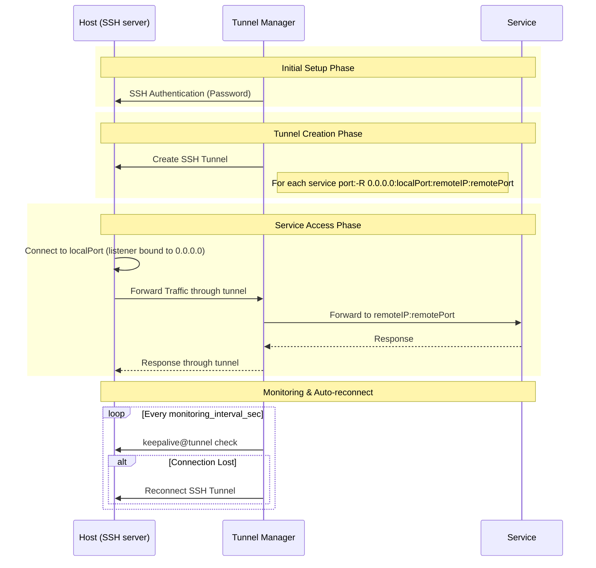

# Tunnel Manager

[한국어](docs/README.ko.md)

Tunnel Manager opens SSH tunnels and keeps them open. You register the SSH
servers it should log in to (a **Host**) and the services it should publish (a
**service port**), and it builds one tunnel for every combination of the two and
watches it from then on. It is a single binary that serves a REST API, a browser
UI and the tunnels themselves.

The tunnels are **reverse** tunnels, which means the listening socket is opened
on the Host and not on the machine Tunnel Manager runs on. A client that
connects to `local_port` **on the Host** is carried through the SSH connection to
Tunnel Manager, which then connects to `service_ip:service_port` and copies the
bytes in both directions. That is how a service only Tunnel Manager can reach is
made reachable from the Host.

| What you register | Fields | What it is |
|-------------------|--------|------------|
| Host | `ip`, `port`, `user`, `password`, `description`, `enabled` | An SSH server Tunnel Manager logs in to with a username and a password. The password is stored encrypted. |
| Service port | `service_ip`, `service_port`, `local_port` | The service to publish, and the port opened on every Host to reach it. |

Both `ip` and `service_ip` take an IPv4 or an IPv6 address. An IPv6 address is
written plainly, as `2001:db8::1`, and the brackets a dialer needs are put on
where the address is used. A zone, as in `fe80::1%eth0`, is refused.

Every **enabled** Host combined with every service port is one tunnel. Two
enabled Hosts and three service ports means six tunnels.

## Contents

- [Requirements](#requirements)
- [How it works](#how-it-works)
- [Install and run](#install-and-run)
- [First startup and the account](#first-startup-and-the-account)
- [The built-in UI](#the-built-in-ui)
- [Calling the API from a script](#calling-the-api-from-a-script)
- [API endpoints](#api-endpoints)
- [Reading the tunnel status](#reading-the-tunnel-status)
- [Configuration file](#configuration-file)
- [Encryption key](#encryption-key)
- [Running as a non-root user](#running-as-a-non-root-user)
- [Upgrading from v1.0.0](#upgrading-from-v100)
- [License](#license)

## Requirements

- Go 1.23 or newer, to build
- MySQL 5.7 or newer, or MariaDB 10.3 or newer
- Docker and Docker Compose, optional

### Platforms

`make release` builds a binary for each of these. `go build` works on anything
else Go supports, with the note below.

| Platform | Release binary |
|----------|----------------|
| Linux amd64 | `tunnel-manager-linux-amd64` |
| Linux arm64 | `tunnel-manager-linux-arm64` |
| macOS Intel | `tunnel-manager-darwin-amd64` |
| macOS Apple silicon | `tunnel-manager-darwin-arm64` |
| Windows amd64 | `tunnel-manager-windows-amd64.exe` |

On Unix the process raises its own limit on open file descriptors at startup,
because every tunnel holds several of them. Windows has no such per process
limit to raise, so that step does nothing there. Nothing else differs.

The bundled systemd unit is for Linux. On the other platforms the process has to
be kept running by whatever that system uses.

Only the Linux binaries have been run. The others are built and checked by the
compiler and the vet tool for their platform, and no more than that.

## How it works

### The reconcile loop

Tunnel Manager holds two pictures of the world and keeps comparing them.

| Picture | What it is | Where it comes from |
|---------|------------|---------------------|
| Desired | Every enabled Host combined with every service port | The `hosts` and `service_ports` rows |
| Actual | The tunnels that are running right now | The manager inside the process, and the `tunnels` rows it writes |

A **reconcile pass** compares the two and closes the gap: what is desired but not
running is started, what is running but no longer desired is stopped, and a
tunnel whose connection settings (server address, remote address, local port,
user, password) no longer match the rows is stopped and started again with the
new ones.

This is what an API request does now:

```text
POST /api/service-port
  transaction { INSERT INTO service_ports } commit
  wake the reconcile loop
  201 Created          <- the answer does not wait for any tunnel

reconcile loop
  desired = enabled Hosts x service ports
  actual  = the running tunnels
  desired but not running  -> start
  running but not desired  -> stop
  running with stale settings -> stop and start again
```

A pass runs at three moments:

| When | Why |
|------|-----|
| At startup, before the API answers anything | The tunnels of the stored rows are up by the time the first request can ask about them |
| Right after a `POST`, `PUT` or `DELETE` is committed | The change takes effect at once instead of waiting for the next tick |
| Every `reconcile.interval_sec` seconds, 5 by default | Anything a failed pass left undone is tried again |

Because the answer is sent before the tunnel exists, **a write that succeeds does
not mean the tunnel came up.** `GET /api/status` is what answers that. See
[Reading the tunnel status](#reading-the-tunnel-status).

### A single tunnel


```mermaid
sequenceDiagram
    participant Host as Host (SSH server)
    participant Bastion as Tunnel Manager
    participant WAS as Service

    rect rgb(255, 255, 220)
        Note over Host,WAS: Initial Setup Phase
        Bastion->>Host: SSH Authentication (Password)
    end

    rect rgb(255, 255, 220)
        Note over Host,WAS: Tunnel Creation Phase
        Bastion->>Host: Create SSH Tunnel
        Note right of Bastion: For each service port:-R 0.0.0.0:localPort:remoteIP:remotePort
    end

    rect rgb(255, 255, 220)
        Note over Host,WAS: Service Access Phase
        Host->>Host: Connect to localPort (listener bound to 0.0.0.0)
        Host->>Bastion: Forward Traffic through tunnel
        Bastion->>WAS: Forward to remoteIP:remotePort
        WAS-->>Bastion: Response
        Bastion-->>Host: Response through tunnel
    end

    Note over Host,WAS: Monitoring & Auto-reconnect
    loop Every monitoring_interval_sec
        Bastion->>Host: keepalive@tunnel check
        alt Connection Lost
            Bastion->>Host: Reconnect SSH Tunnel
        end
    end
```

Whether the listener on the Host really opens on `0.0.0.0` is up to the SSH
server on the Host. When its `GatewayPorts` is off, the listener is bound to the
loopback address whatever address was asked for, and the log says so.

`monitoring.interval_sec` and `reconcile.interval_sec` are two different jobs.
The monitor asks a tunnel that is already up whether it is still alive and
reconnects it when it is not. The reconcile loop asks whether the right set of
tunnels exists at all.

## Install and run

### With Docker Compose

1. Clone the repository.

```bash
git clone https://github.com/jollaman999/tunnel-manager.git
cd tunnel-manager
```

2. Edit the configuration file.

```bash
vi config/config.yaml
```

3. Start it.

```bash
docker-compose up -d
```

The compose file mounts `./config/config.yaml` into the container as
`/config/config.yaml`, which is the path the process reads by default. Note that
only the **file** is mounted and not the directory around it, so the initial
password file described below is written **inside the container** and does not
appear on the host.

### Without Docker

1. Clone the repository.

```bash
git clone https://github.com/jollaman999/tunnel-manager.git
cd tunnel-manager
```

2. Download the dependencies.

```bash
go mod tidy
```

3. Edit the configuration file.

```bash
vi config/config.yaml
```

4. Build and run.

```bash
make run
```

`-config` names the configuration file and defaults to `config/config.yaml`,
resolved against the working directory of the process. `-version` prints the
version and exits.

## First startup and the account

**The API and the UI are behind a login.** There is one account, and it is
created on the first startup. Read this section before the first startup, or you
will not be able to log in.

1. The first startup creates the single row of the `user` table. It has **no
   username yet** and is marked as needing setup.
2. The initial password is written to a file named `initial-password` **in the
   directory the configuration file is in**, with permission `0600`. It is 52
   characters of upper case letters and digits. Where that lands depends on how
   the process was started:

   | Started with | The file is at |
   |--------------|----------------|
   | `-config config/config.yaml` (the default) | `config/initial-password`, next to the configuration file |
   | The bundled systemd unit, `-config /etc/tunnel-manager/config.yaml` | `/etc/tunnel-manager/initial-password` |
   | Docker Compose | `/config/initial-password` **inside the container**: `docker compose exec tunnel-manager cat /config/initial-password` |

3. **The log holds the path, never the password.** The log goes to the console
   as well as to a file that is kept and rotated, so a password written there
   would outlive the setup in places nobody is watching. The file is the only
   copy.
4. Log in with it. The username is ignored at this point, so send it empty. The
   answer carries `"setup_required": true`, and the UI moves to the setup screen.
   There you choose the username and the password the account keeps.
5. **The setup deletes the initial password file.** The password in it stops
   opening the account at that moment, so what is left would be nothing but a
   readable copy of a dead credential. Every other session that was opened with
   the initial password is dropped at the same time; the one doing the setup is
   kept.
6. **Until the setup is done, a session may call `POST /api/setup` and nothing
   else.** Every other path under `/api` answers `403` with `The account setup is
   not finished`.

The password chosen at the setup has to be **12 to 72 bytes** long. Bytes, not
characters: one Hangul syllable is three of them. The upper limit is 72 because
bcrypt, which hashes the password, reads no further than that, and anything past
the limit would not be part of what the login checks. A password that is too
long is refused rather than silently cut.

The setup runs **once**. It asks for no current password, so it is not a way to
change the credentials later; a second call answers `409`.

A session lives for 12 hours after the last request that used it, and every
request pushes that deadline out. Sessions are kept in memory, so a restart ends
all of them and you log in again.

## The built-in UI

Open `http://<address>:<port>/` in a browser. `/` answers with a redirect to
`/ui/`, which is where the UI is served from.

**There is nothing to deploy for it.** The files are compiled into the binary, so
no directory travels next to it, no path has to be configured, and the working
directory the process starts from does not matter.

| Screen | Path | What it shows and does |
|--------|------|------------------------|
| Status | `/ui/status` | The three counts (desired, rows, connected), a sentence about the difference between them, and one line per tunnel: Host, service port, status, server, local, remote, retries, last connected, last error. It asks again every 5 seconds. |
| Hosts | `/ui/hosts` | One row per Host with ID, IP, port, user, description, enabled and updated. Add a Host, edit one, enable or disable one, delete one. |
| Service Ports | `/ui/service-ports` | One row per service port with ID, service IP, service port, local port, description and updated. Add, edit and delete. |
| Login | `/ui/login` | Where a client without a session lands. Leave the username empty on the first sign in. It leads to the setup screen while the account still needs one. |

The version of the binary is in the bottom right corner of every screen, the
login one included.

The forms check what is typed before anything is sent. A port takes digits only
and has to be between 1 and 65535; an IP field takes only what an address is
made of and has to read as an IPv4 or an IPv6 address. What is wrong is said
next to the field it is wrong in, and nothing leaves the browser until it is
right.

The UI files are served without a session on purpose: they are the same bytes for
every client and carry no data. Everything they show is fetched from `/api/**`,
and that is what the login guards.

## Calling the API from a script

**Every path under `/api` needs a session, and every `POST`, `PUT` and `DELETE`
needs a CSRF token as well.** A script written against an earlier release will
get `401` on the first call until it does the following.

1. `POST /api/login` with the username and the password. Keep the cookies it
   sets, `tm_session` and `tm_csrf`.
2. Read `data.csrf_token` out of the answer and send it as an `X-CSRF-Token`
   header on **every** `POST`, `PUT` and `DELETE`.
3. `GET` needs no token. Nothing it reaches changes anything.

CSRF stands for cross site request forgery: another site making your browser send
a request with your cookies attached. The token defeats it because that site
cannot read the answer of your login and cannot set the header.

The example below is a complete session. It uses a cookie jar file: `-c` writes
the cookies the server sets, `-b` sends them back.

```bash
BASE=http://127.0.0.1:8888

# 1. Log in. -c stores tm_session and tm_csrf in cookies.txt.
curl -s -c cookies.txt -X POST "$BASE/api/login" \
  -H 'Content-Type: application/json' \
  -d '{"username":"operator","password":"<your-password>"}' > login.json

# {"success":true,"data":{"setup_required":false,"csrf_token":"<token>"}}

# 2. Take the token out of the answer.
CSRF=$(python3 -c 'import json; print(json.load(open("login.json"))["data"]["csrf_token"])')

# 3. A read needs the cookies and nothing else.
curl -s -b cookies.txt "$BASE/api/status"

# 4. A write needs the header as well.
curl -s -b cookies.txt -X POST "$BASE/api/host" \
  -H 'Content-Type: application/json' \
  -H "X-CSRF-Token: $CSRF" \
  -d '{"ip":"192.0.2.10","port":22,"user":"ubuntu","password":"<host-password>","description":"example"}'

curl -s -b cookies.txt -X POST "$BASE/api/service-port" \
  -H 'Content-Type: application/json' \
  -H "X-CSRF-Token: $CSRF" \
  -d '{"service_ip":"198.51.100.20","service_port":8080,"local_port":18080}'

# 5. Log out when the script is done.
curl -s -b cookies.txt -X POST "$BASE/api/logout" -H "X-CSRF-Token: $CSRF"
```

On the very first sign in, log in with an empty username and the initial
password, then finish the setup before anything else:

```bash
curl -s -c cookies.txt -X POST "$BASE/api/login" \
  -H 'Content-Type: application/json' \
  -d "{\"username\":\"\",\"password\":\"$(cat config/initial-password)\"}" > login.json

CSRF=$(python3 -c 'import json; print(json.load(open("login.json"))["data"]["csrf_token"])')

curl -s -b cookies.txt -X POST "$BASE/api/setup" \
  -H 'Content-Type: application/json' \
  -H "X-CSRF-Token: $CSRF" \
  -d '{"username":"operator","password":"<your-password>"}'
```

What goes wrong, and what it looks like:

| Answer | What it means |
|--------|---------------|
| `401 Authentication required` | No session cookie was sent, or the session has run out. Log in again. |
| `403 The request carries no valid X-CSRF-Token header...` | The write carried no token, or the wrong one. Send `data.csrf_token` from the login. |
| `403 The account setup is not finished...` | The account still has no username. Call `POST /api/setup` first. |
| `401 Invalid username or password` | The login was refused. It does not say which of the two was wrong, on purpose. |

Every answer has the same shape: `{"success":true,"data":...}` or
`{"success":false,"error":"..."}`.

## API endpoints

Everything under `/api` requires a session, except `POST /api/login`. Everything
that is not a `GET` requires the `X-CSRF-Token` header.

### Account

| Method | Path | What it does |
|--------|------|--------------|
| `POST` | `/api/login` | Takes `username` and `password`, sets the session and CSRF cookies, answers with `setup_required` and `csrf_token` |
| `POST` | `/api/logout` | Drops the session and expires both cookies |
| `POST` | `/api/setup` | Sets the username and the password once, on the account that still needs them |

### Hosts

| Method | Path | What it does |
|--------|------|--------------|
| `POST` | `/api/host` | Creates a Host |
| `GET` | `/api/host` | Lists the Hosts |
| `GET` | `/api/host/:id` | Reads one Host |
| `PUT` | `/api/host/:id` | Updates a Host. Every field is optional; `enabled` false stops its tunnels |
| `DELETE` | `/api/host/:id` | Deletes a Host |

### Service ports

| Method | Path | What it does |
|--------|------|--------------|
| `POST` | `/api/service-port` | Creates a service port |
| `GET` | `/api/service-port` | Lists the service ports |
| `GET` | `/api/service-port/:id` | Reads one service port |
| `PUT` | `/api/service-port/:id` | Updates a service port. `service_ip`, `service_port` and `local_port` are all required |
| `DELETE` | `/api/service-port/:id` | Deletes a service port |

### Status

| Method | Path | What it does |
|--------|------|--------------|
| `GET` | `/api/status` | The counts and every tunnel |
| `GET` | `/api/status/:hostId` | The Host and the tunnels of that Host |

### UI

| Method | Path | What it does |
|--------|------|--------------|
| `GET` | `/` | Redirects to `/ui/` with a `302` |
| `GET` | `/ui` | Redirects to `/ui/` with a `302` |
| `GET` | `/ui/version.json` | The version of the binary, as `{"version":"2.1.0"}` |
| `GET` | `/ui/*` | Serves the UI out of the binary |

`/ui/version.json` is answered without a session, like the rest of `/ui/`. The
login screen shows the version too, and the number is on the release page of a
public repository either way.

The SSH password of a Host and the password hash of the account are left out of
every answer.

## Reading the tunnel status

```bash
curl -s -b cookies.txt http://127.0.0.1:8888/api/status
```

```json
{
  "success": true,
  "data": {
    "desired_tunnels": 1,
    "total_tunnels": 1,
    "connected_tunnels": 0,
    "tunnels": [
      {
        "host_id": 1,
        "sp_id": 1,
        "status": "starting",
        "last_error": "",
        "retry_count": 0,
        "last_connected_at": "0001-01-01T00:00:00Z",
        "server": "192.0.2.10:22",
        "local": "0.0.0.0:18080",
        "remote": "198.51.100.20:8080"
      }
    ]
  }
}
```

The three counts answer three different questions, and the gaps between them
mean different things.

| Count | What it counts |
|-------|----------------|
| `desired_tunnels` | How many tunnels **should** be running: enabled Hosts multiplied by service ports, counted the same way a reconcile pass builds its desired state |
| `total_tunnels` | How many tunnel **rows** exist, one per tunnel that has been started at all, whatever state it ended in |
| `connected_tunnels` | How many of those rows say `connected` |

| Gap | What it means |
|-----|---------------|
| `desired > total` | A tunnel that should be running has not been started at all. Either a pass has not run yet, which lasts a moment, or the pass could not start it, for example because the stored password does not open with the encryption key in use. The reason is in the log. |
| `total > connected` | A tunnel was started and is not carrying traffic. Its row says why in `status` and `last_error`. |

`status` is one of:

| Value | Meaning |
|-------|---------|
| `starting` | The row was written and the SSH connection is being built |
| `connected` | The listener is open on the Host |
| `reconnecting` | The connection dropped or a keepalive went unanswered, and it is being built again |
| `error` | The attempt failed. `last_error` holds the reason |

`GET /api/status/:hostId` answers with the same counts except `desired_tunnels`,
plus the Host itself.

## Configuration file

`config/config.yaml`, complete:

```yaml
database:
  host: tunnel-manager-db
  port: 3306
  user: tunnel-manager
  password: tunnel-manager-pass
  name: tunnel-manager
  timeout_sec: 30

api:
  port: 8888

monitoring:
  interval_sec: 5

reconcile:
  interval_sec: 5

security:
  key_file: "keys/tunnel-manager.key"

logging:
  level: info     # debug, info, warn, error, dpanic, panic, fatal
  format: json    # json, console
  file:
    path: "/var/log/tunnel-manager/tunnel-manager.log"
    max_size: 100    # megabytes before the file is rotated
    max_backups: 5   # rotated files to keep
    max_age: 7       # days to keep rotated files
    compress: true   # compress rotated files
```

| Setting | Default | Left out |
|---------|---------|----------|
| `database.host` | none | Startup fails: `database host is required` |
| `database.port` | none | Startup fails: `invalid database port: 0` |
| `database.user` | none | Startup fails: `database user is required` |
| `database.password` | none | Startup fails: `database password is required` |
| `database.name` | none | Startup fails: `database name is required` |
| `database.timeout_sec` | none | Startup fails: `invalid database timeout: 0` |
| `api.port` | none | Startup fails: `invalid API port: 0` |
| `monitoring.interval_sec` | none | Startup fails: `invalid monitoring interval: 0` |
| `reconcile.interval_sec` | `5` | The default applies |
| `security.key_file` | `keys/tunnel-manager.key` | The default applies |
| `logging.level` | `info` | The default applies |
| `logging.format` | `json` | The default applies |
| `logging.file.path` | `logs/tunnel-manager.log` | The default applies |
| `logging.file.max_size` | `100` | The default applies |
| `logging.file.max_backups` | `5` | The default applies |
| `logging.file.max_age` | `30` | The default applies |
| `logging.file.compress` | `false` | Rotated files are not compressed |

The settings with no default are checked before anything else runs, and a value
outside its range is refused the same way: `database.port` and `api.port` have to
be 1 to 65535, `database.timeout_sec`, `monitoring.interval_sec` and
`reconcile.interval_sec` have to be above zero, `logging.level` and
`logging.format` have to be one of the values listed above, and the three
`logging.file` numbers must not be negative.

`database.timeout_sec` bounds the **wait for the database at startup**, not a
query. The startup retries the connection once a second until this many seconds
have passed and then gives up and exits. A single connect attempt is given 3
seconds of its own, so that one attempt against an address that swallows packets
cannot eat the whole budget: without that bound the kernel takes over two minutes
to give up on the handshake.

A relative path in `security.key_file` or `logging.file.path` is resolved against
the working directory of the process, not against the configuration file. That
directory is not the same everywhere, so the default key file lands in different
places:

| Started by | Working directory | Default key file |
|------------|-------------------|------------------|
| `make run` | The repository | `keys/tunnel-manager.key` in it |
| Docker Compose | `/` | `/keys/tunnel-manager.key`, which the compose file maps to `./_data/keys` |
| The bundled systemd unit | `/var/lib/tunnel-manager`, which the unit creates | `/var/lib/tunnel-manager/keys/tunnel-manager.key` |

**Give `security.key_file` an absolute path and none of this applies.** A unit
without the `WorkingDirectory` line the bundled one carries leaves the working
directory at `/`, which puts the key at `/keys/tunnel-manager.key`. The startup
logs the path it resolved to, so the log says which file was opened.

## Encryption key

The SSH password of a Host is encrypted with AES-256-GCM before it is stored. The
key is read from the file `security.key_file` names, `keys/tunnel-manager.key` by
default. If that file does not exist, the first startup creates a 32 byte key
with permission `0600`; if it does, it is read as it is.

> **Lose the key and no stored password can be read again.** There is nothing to
> do about it but register every Host once more. Back the key file up together
> with the database, or the two will not match.

If the key file can be read by the group or by others, the startup refuses to go
on. Narrow it with `chmod 600 keys/tunnel-manager.key` and start again.

If the key opens none of the stored passwords and at least one of them is marked
as having been encrypted, the startup stops rather than serving an API that looks
healthy while no Host can be connected to. If it opens some but not all, the ones
it does not open are named in a warning, their tunnels are not built, and the
stored values are left untouched: a password that does not open exists nowhere
else and is gone once it is written over. Set those through the API again.

With Docker Compose the container path `/keys` is bound to `./_data/keys` on the
host, so the key survives the container being deleted and recreated. The database
lives separately under `./_data/mariadb`, which means deleting `./_data/keys`
alone leaves a database full of passwords nothing can read.

## Running as a non-root user

The process starts without root. It logs a `not running as root` warning and two
things are limited.

- It tries to raise the file descriptor limit to 65535. Without root the soft
  limit can only go as high as the hard limit, and when the hard limit is lower
  it logs `max ulimit is low` and goes on. Raise the hard limit in advance if you
  run many tunnels.
- The default log path is `/var/log/tunnel-manager/tunnel-manager.log`, which a
  non-root user usually cannot create. This does not stop the startup: file
  logging is turned off, the console keeps everything, and the reason is in the
  `logging to file is disabled` warning.

An `api.port` below 1024 cannot be bound by a non-root process. Use 1024 or
above, or give the executable `CAP_NET_BIND_SERVICE`.

The process also has to be allowed to **write to the directory the configuration
file is in**, because that is where the initial password file goes on the first
startup. A directory it cannot write to stops the startup, since an account whose
password nobody can read is an API nobody can log in to.

For systemd, `_scripts/systemd/tunnel-manager.service` ships with `User=root`.
Change the account and let it own the log directory.

```ini
[Service]
User=tunnel-manager
Group=tunnel-manager
LogsDirectory=tunnel-manager
```

`LogsDirectory=tunnel-manager` makes systemd create `/var/log/tunnel-manager`
owned by `User=`/`Group=`, so `logging.file.path` can stay as it is. A directory
that was already there owned by root changes owner too. The key file has to be
readable by that account as well, so change its owner and leave the permission at
`0600`.

The container runs as root, because `Dockerfile` ends with `USER root`. To run it
as somebody else, give the service in docker-compose.yaml a `user: "<uid>:<gid>"`
and make the two bind mounted directories, `./_data/tunnel-manager` for the logs
and `./_data/keys` for the key, owned by that uid on the host. If it ever ran as
root, both are owned by root and have to be changed first. The file descriptor
limit comes from `ulimits` in docker-compose.yaml and has nothing to do with the
account inside the container.

A `service_ports.local_port` below 1024 will not be opened by the sshd on the
Host. That listener is created by the sshd and not by Tunnel Manager, so the
restriction applies to the SSH account registered for the Host and not to the
account Tunnel Manager runs as. As ssh(1) puts it, privileged ports are forwarded
only for the root user. If the SSH account on the Host is not root, keep
`local_port` at 1024 or above.

## Upgrading from v1.0.0

Six things change for anyone calling the API.

| # | What changed | What the client has to do |
|---|--------------|---------------------------|
| 1 | Every path under `/api` requires a session | Call `POST /api/login` first and send the cookies with every request |
| 2 | `POST`, `PUT` and `DELETE` require a CSRF token | Send `data.csrf_token` from the login answer as the `X-CSRF-Token` header |
| 3 | `POST /api/service-port` no longer answers `500` when a tunnel cannot be built | It answers `201` once the row is stored. Check the result with `GET /api/status` |
| 4 | A database error answers `500` where it used to answer `404` | A `404` now means the row is not there. Review anything that retries or branches on `404` |
| 5 | A `500` body no longer repeats the database error | The body says what failed, the server log says why |
| 6 | There is a new `user` table | `AutoMigrate` creates it at startup. Nothing to do by hand |

On top of that, the first startup after the upgrade creates the account and
writes the initial password file. Read
[First startup and the account](#first-startup-and-the-account) before you
restart, or you will not be able to log in.

### CORS headers are gone

The server no longer sends any `Access-Control-Allow-Origin` header. The UI is
built into the binary and served from `/ui/`, so every call it makes is
same origin and needs no grant.

This breaks **only a page in a browser calling this API from another origin**.
CORS is a rule browsers apply to pages, not a check this server performs, so
`curl`, scripts and server to server calls are untouched.

### The local_port unique index

`service_ports.local_port` has a unique index. If a database from an earlier
release holds two rows with the same `local_port`, the migration is refused at
startup. Check for duplicates before upgrading.

```sql
SELECT local_port, COUNT(*) FROM service_ports GROUP BY local_port HAVING COUNT(*) > 1;
```

Keep one row per port listed there and delete or renumber the rest. Left alone,
the failed migration looks like a failed database connection: the log repeats
`attempting to connect to database...` and the process exits once
`database.timeout_sec` has passed. The real reason is in the `error` field of
that log line.

## License

MIT License
