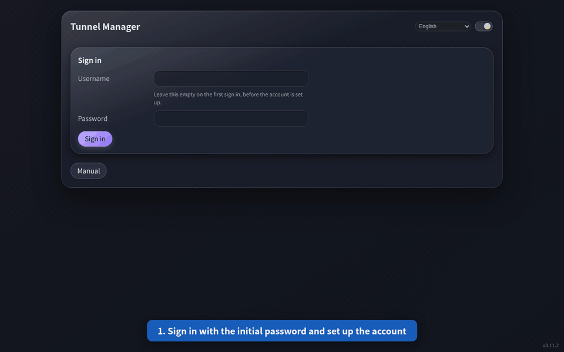
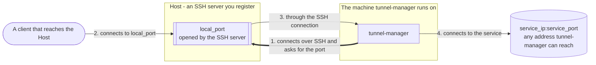

# Tunnel Manager

[한국어](docs/README.ko.md) · [日本語](docs/README.ja.md) · [中文](docs/README.zh.md)



**Tunnel Manager publishes a service on machines that have no route to it.** It
connects to those machines over SSH, has each of them open a port, and carries
whatever arrives on that port back through the SSH connection to the service.
It then keeps the tunnels up: one that drops is built again, and a screen in
the browser shows what each of them is doing.

It is one file. The database is a SQLite file it creates itself, the settings
are in that file and are changed in the browser, and the UI and the API are
compiled into the binary. There is nothing to install beside it and nothing to
configure before the first start.


```mermaid
flowchart LR
    client([A client that reaches the Host])
    subgraph host [Host - an SSH server you register]
        port[["local_port<br/>opened by the SSH server"]]
    end
    subgraph here [The machine tunnel-manager runs on]
        tm[tunnel-manager]
    end
    service[("service_ip:service_port<br/>any address tunnel-manager can reach")]

    tm ==>|"1. connects over SSH and asks for the port"| port
    client -->|"2. connects to local_port"| port
    port -->|"3. through the SSH connection"| tm
    tm -->|"4. connects to the service"| service
```

An installation is made of three things. You register a Host and a service
port, the assignment between them is made for you unless you say otherwise, and
one assignment is what one tunnel is built from.

| Part | What it is |
|------|------------|
| Host | An SSH server to connect to: address, port, user, and a private key or a password |
| Service port | The service to publish, at any address this machine can reach, and the port to open on the Hosts that carry it |
| Assignment | Which Host carries which service port. One assignment whose Host is enabled is one tunnel |
| Local forward | A port opened on this machine, carried through one Host to an address that Host reaches |

The last row is optional and runs the other way, the way `ssh -L` does: this
machine opens the port and the connection is made from the Host. A local forward
belongs to the Host it is made on and is added from the **Local forwards** button
in the row of that Host.

## What it does

- Builds a tunnel for every assignment, watches it, and builds it again when the
  connection drops.
- Opens local forwards as well: a port on this machine that reaches, through a
  Host, an address only that Host can reach. They are kept up the same way.
- Connects to the forwarded port itself once the tunnel is up and says whether
  it answered, since which address the SSH server binds it to is that server's
  decision.
- Serves the UI and the API over HTTPS, with a certificate it makes on the first
  start and one of your own once you register it.
- Keeps the SSH passwords, the private keys and the certificate key encrypted
  with a key file of this installation.
- Carries the whole configuration to another installation as one encrypted file.
- Shows the screens in thirteen languages, picked in the corner of the browser
  or set for the installation. The log file stays English.
- Runs on Linux, macOS and Windows as a single binary, with no C library and no
  database server behind it.

## Quick start

Download the binary for your platform from the
[releases page](https://github.com/jollaman999/tunnel-manager/releases), make it
executable and start it.

```bash
chmod +x tunnel-manager-linux-amd64
./tunnel-manager-linux-amd64
```

The first start creates the database, the account and the certificate, and
writes where the password of that account is:

```text
created the account with an initial password. Read the password from the file, log in with it,
and set a username and a password. The file is written with permission 0600 and holds the only
copy of the password  {"log_id": "account.created_with_initial_password",
"initial_password_file": "<dir>/initial-password"}
```

```bash
cat <dir>/initial-password
```

Open `https://127.0.0.1:8888/` in a browser. The certificate is one this
installation signed for itself, so the browser warns about it; the fingerprint
to check that warning against is in the startup log and on the Settings screen.

Log in with an **empty username** and the password from that file, choose the
username and password the account will keep, and the setup deletes the file.
Then add a Host and a service port on their screens. The Status screen says what
each tunnel is doing.

The database goes under the user data directory of the platform unless `-db`
names a file. Docker Compose, the systemd unit and building from source are in
the reference below.

## Install as a service

`-install` makes this a service of the machine: the executable is put in place,
the data directory is made, the service is registered with systemd, launchd or
the Windows service control manager, and it is started. It comes up at boot from
then on, and is started again on its own when it exits.

```bash
sudo ./tunnel-manager-linux-amd64 -install
```

On Windows, run the same command from a PowerShell or a Command Prompt
started with **Run as administrator**:

```powershell
.\tunnel-manager-windows-amd64.exe -install
```

| Platform | Executable | Data |
|----------|------------|------|
| Linux | `/usr/local/bin/tunnel-manager` | `/var/lib/tunnel-manager/` |
| macOS | `/usr/local/bin/tunnel-manager` | `/Library/Application Support/tunnel-manager/` |
| Windows | `C:\Program Files\tunnel-manager\tunnel-manager.exe` | `C:\ProgramData\tunnel-manager\` |

**What is installed is the latest release**, downloaded from GitHub and checked
against the `SHA256SUMS` of that release when the release carries one. A release
that cannot be reached is not a failure: the executable that was run is installed
instead, and the report says which of the two landed.

`sudo tunnel-manager -uninstall` takes it away again. The service is stopped, the
registration goes and the installed executable is removed. **The data is kept**,
and the report says where it was left. `-purge` removes the data directory as
well, and what `-purge` removes cannot be brought back.

## Where to read more

[docs/reference.md](docs/reference.md) is the whole of it.

| Section | What is in it |
|---------|---------------|
| [How it works](docs/reference.md#how-it-works) | The reconcile loop, the assignments, one tunnel end to end, local forwards |
| [Install and run](docs/reference.md#install-and-run) | The flags, where the files go, Docker Compose, systemd, from source |
| [Installing as a service](docs/reference.md#installing-as-a-service) | The four flags, what an install does over one that is already there, what a removal reads the paths from |
| [HTTPS and the certificate](docs/reference.md#https-and-the-certificate) | The browser warning, registering a certificate of your own, renewing, turning HTTPS off |
| [First startup and the account](docs/reference.md#first-startup-and-the-account) | The initial password, the setup, changing the credentials |
| [The built-in UI](docs/reference.md#the-built-in-ui) | What each screen shows and does, and the languages it comes in |
| [Settings](docs/reference.md#settings) | Every setting, what it applies at, and the way back when the server will not start |
| [API endpoints](docs/reference.md#api-endpoints) | Every call, with the login and the CSRF token a script needs |
| [Reading the tunnel status](docs/reference.md#reading-the-tunnel-status) | The three counts, what a status means, and whether the forwarded port was reached |
| [Encryption key](docs/reference.md#encryption-key) | What it encrypts and what losing it costs |
| [Running as a non-root user](docs/reference.md#running-as-a-non-root-user) | The file descriptor limit, the ports, the ownership of the files |

The manual inside the UI says the same as the first sections of that file. It is
a tab of its own, and the login screen opens it in a panel for somebody who
cannot sign in yet.

## License

MIT License. See [LICENSE](LICENSE).
