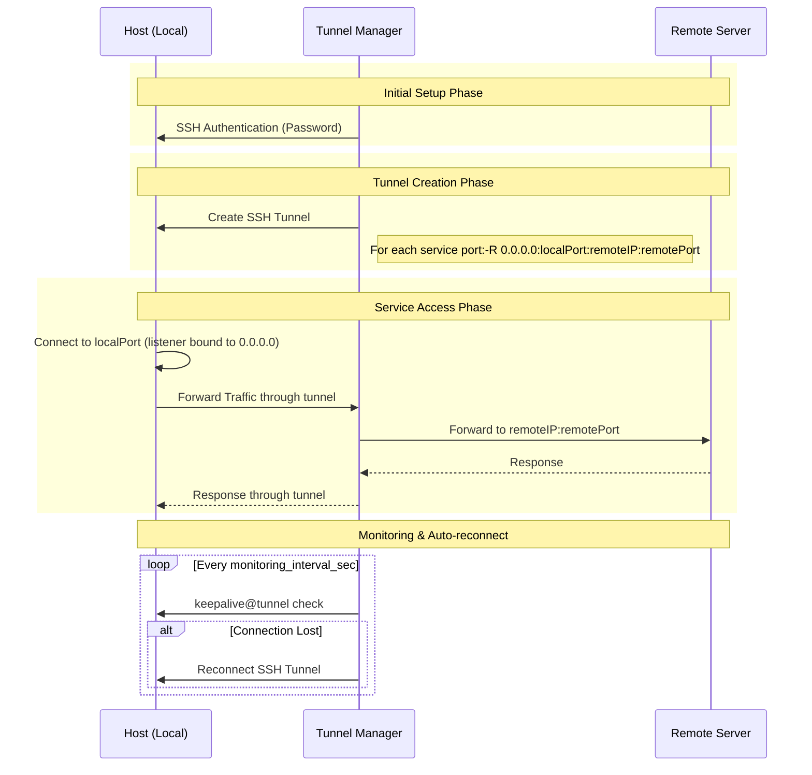

# Tunnel Manager

SSH 터널을 관리하기 위한 RESTful API 서버입니다. 여러 Host에 대한 SSH 터널을 생성하고 관리할 수 있습니다.

## 주요 기능

- Host 및 서비스 포트 관리
- SSH 터널 자동 생성 및 관리
- 터널 상태 모니터링
- 장애 발생 시 자동 재연결
- RESTful API 인터페이스

## 시스템 요구사항

- Go 1.23 이상
- MySQL 5.7 이상 또는 MariaDB 10.3 이상
- Docker & Docker Compose (선택사항)

## 동작 방식


```mermaid
sequenceDiagram
    participant Host as Host (Local)
    participant Bastion as Tunnel Manager
    participant WAS as Remote Server
    
    rect rgb(255, 255, 220)
        Note over Host,WAS: Initial Setup Phase
        Bastion->>Host: SSH Authentication (Password)
    end

    rect rgb(255, 255, 220)
        Note over Host,WAS: Tunnel Creation Phase
        Bastion->>Host: Create SSH Tunnel
        Note right of Bastion: For each service port:-R 0.0.0.0:localPort:remoteIP:remotePort
    end
    
    rect rgb(255, 255, 220)
        Note over Host,WAS: Service Access Phase
        Host->>Host: Connect to localPort (listener bound to 0.0.0.0)
        Host->>Bastion: Forward Traffic through tunnel
        Bastion->>WAS: Forward to remoteIP:remotePort
        WAS-->>Bastion: Response
        Bastion-->>Host: Response through tunnel
    end

    Note over Host,WAS: Monitoring & Auto-reconnect
    loop Every monitoring_interval_sec
        Bastion->>Host: keepalive@tunnel check
        alt Connection Lost
            Bastion->>Host: Reconnect SSH Tunnel
        end
    end
```

원격 리스너가 `0.0.0.0`으로 열리는지는 Host의 SSH 서버 설정에 달려 있습니다. sshd의 `GatewayPorts`가 꺼져 있으면 요청한 주소와 관계없이 루프백에만 바인딩될 수 있습니다.

## 설치 및 실행

### Docker Compose를 사용하는 경우

1. 저장소 클론
```bash
git clone https://github.com/jollaman999/tunnel-manager.git
cd tunnel-manager
```

2. 설정 파일 수정
```bash
# config.yaml 파일을 환경에 맞게 수정
vi config/config.yaml
```

3. Docker Compose로 실행
```bash
docker-compose up -d
```

### 직접 실행하는 경우

1. 저장소 클론
```bash
git clone https://github.com/jollaman999/tunnel-manager.git
cd tunnel-manager
```

2. 의존성 다운로드
```bash
go mod tidy
```

3. 설정 파일 수정
```bash
# config.yaml 파일을 환경에 맞게 수정
vi config/config.yaml
```

4. 빌드 및 실행
```bash
make run
```

### 비root로 실행하는 경우

프로세스는 root가 아니어도 뜹니다. root가 아니면 기동할 때 `not running as root` 경고를 남기고, 아래 두 가지가 제약을 받습니다.

- 파일 디스크립터 한도를 65535까지 올리려 하지만, root가 아니면 하드 리밋까지만 올릴 수 있습니다. 하드 리밋이 그보다 낮으면 `max ulimit is low` 경고를 남기고 그대로 진행합니다. 터널이 많으면 하드 리밋을 미리 올려 두어야 합니다.
- 로그 파일 기본 경로가 `/var/log/tunnel-manager/tunnel-manager.log`라서 쓰기 권한이 없으면 디렉터리와 파일을 만들지 못합니다. 이때는 종료하지 않고 파일 로깅만 끈 채 콘솔에만 남기며, 이유는 `logging to file is disabled` 경고에 적힙니다.

`api.port`를 1024 미만으로 두면 비root 프로세스는 바인딩에 실패합니다. 1024 이상을 쓰거나 실행 파일에 `CAP_NET_BIND_SERVICE`를 주어야 합니다.

systemd로 돌릴 때는 `_scripts/systemd/tunnel-manager.service`가 `User=root`이므로 계정을 바꾸고 로그 디렉터리를 그 계정이 쓸 수 있게 만들어야 합니다.

```ini
[Service]
User=tunnel-manager
Group=tunnel-manager
LogsDirectory=tunnel-manager
```

`LogsDirectory=tunnel-manager`를 주면 systemd가 `/var/log/tunnel-manager`를 `User=`/`Group=`의 소유로 만들어 주므로 `logging.file.path`는 그대로 두면 됩니다. 이미 root 소유로 있던 디렉터리도 소유자가 바뀝니다. 암호화 키 파일도 그 계정이 읽을 수 있어야 하니 소유자를 바꾸고 권한은 `0600`으로 둡니다.

컨테이너는 `Dockerfile`이 `USER root`라서 root로 돕니다. 비root로 돌리려면 docker-compose.yaml의 서비스에 `user: "<uid>:<gid>"`를 주고, 볼륨으로 연결한 `./_data/tunnel-manager`(로그)와 `./_data/keys`(키)를 호스트에서 그 uid 소유로 만들어 두어야 합니다. root로 한 번 띄운 뒤라면 두 디렉터리가 root 소유로 남아 있으니 소유자부터 바꿔야 합니다. 파일 디스크립터 한도는 docker-compose.yaml의 `ulimits`가 정하므로 컨테이너 안의 계정과는 상관이 없습니다.

`service_ports.local_port`가 1024 미만이면 Host의 sshd가 리스너를 열어 주지 않습니다. 이 리스너는 tunnel-manager가 아니라 Host의 sshd가 만들기 때문에, 이 제약은 tunnel-manager를 돌리는 계정이 아니라 Host에 등록한 SSH 접속 계정에 걸립니다. ssh(1)에 적힌 대로 특권 포트는 원격 계정이 root일 때만 포워딩됩니다. Host의 SSH 계정이 root가 아니면 `local_port`는 1024 이상으로 잡아야 합니다.

## API 엔드포인트

### Host 관리
- `POST /api/host` - Host 생성
- `GET /api/host` - Host 목록 조회
- `GET /api/host/:id` - 특정 Host 조회
- `PUT /api/host/:id` - Host 정보 수정
- `DELETE /api/host/:id` - Host 삭제

### 서비스 포트 관리
- `POST /api/service-port` - 서비스 포트 생성
- `GET /api/service-port` - 서비스 포트 목록 조회
- `GET /api/service-port/:id` - 특정 서비스 포트 조회
- `PUT /api/service-port/:id` - 서비스 포트 정보 수정
- `DELETE /api/service-port/:id` - 서비스 포트 삭제

### 상태 모니터링
- `GET /api/status` - 전체 터널 상태 조회
- `GET /api/status/:hostId` - 특정 Host의 터널 상태 조회

## 설정 파일 구조

config.yaml:
```yaml
database:
  host: tunnel-manager-db
  port: 3306
  user: tunnel-manager
  password: tunnel-manager-pass
  name: tunnel-manager
  timeout_sec: 30

api:
  port: 8888

monitoring:
  interval_sec: 5

logging:
  level: info     # Available levels: debug, info, warn, error, dpanic, panic, fatal
  format: json    # Available formats: json, console
  file:
    path: "/var/log/tunnel-manager/tunnel-manager.log"
    max_size: 100    # Maximum size in megabytes before rotation
    max_backups: 5   # Number of rotated files to keep
    max_age: 7       # Days to keep rotated files
    compress: true   # Whether to compress rotated files
```

### 암호화 키

Host의 SSH 비밀번호는 AES-256-GCM으로 암호화해서 데이터베이스에 저장합니다. 암호화 키는 `security.key_file`이 가리키는 파일에서 읽고, 기본값은 `keys/tunnel-manager.key`입니다. 상대 경로는 프로세스의 작업 디렉터리를 기준으로 하므로 `make run`으로 실행하면 저장소 루트의 `keys/` 아래에 만들어집니다. 다른 경로를 쓰려면 config.yaml에 아래 항목을 추가합니다.

```yaml
security:
  key_file: "keys/tunnel-manager.key"
```

키 파일이 없으면 첫 기동 때 32바이트 키를 만들어 권한 `0600`으로 저장하고, 이미 있으면 그대로 읽습니다.

> **키를 잃어버리면 저장된 비밀번호를 하나도 복호할 수 없습니다.** 이때는 등록된 Host를 전부 다시 등록하는 것 말고는 방법이 없습니다. 데이터베이스를 백업할 때 키 파일도 같이 백업해야 짝이 맞습니다.

키 파일을 그룹이나 다른 사용자가 읽을 수 있으면 기동을 거부하고 종료합니다. 이때는 `chmod 600 keys/tunnel-manager.key`로 권한을 좁힌 뒤 다시 실행합니다.

Docker Compose로 실행하면 컨테이너의 `/keys`가 호스트의 `./_data/keys`에 연결되므로 컨테이너를 지웠다 다시 만들어도 키가 남습니다. 컨테이너는 root로 도는 탓에 이 디렉터리와 키 파일은 호스트에서 root 소유로 보입니다. 데이터베이스는 `./_data/mariadb`에 따로 남으니, `./_data/keys`만 지우면 데이터베이스에 있는 비밀번호를 읽을 수 없게 됩니다.

## 업그레이드 시 주의사항

### local_port 유니크 인덱스

`service_ports.local_port`에 유니크 인덱스가 생겼습니다. 이전 버전으로 만든 데이터베이스에 같은 `local_port`를 쓰는 행이 둘 이상 있으면 기동할 때 마이그레이션이 거부됩니다. 올리기 전에 아래 쿼리로 중복을 확인합니다.

```sql
SELECT local_port, COUNT(*) FROM service_ports GROUP BY local_port HAVING COUNT(*) > 1;
```

여기에 나온 포트는 한 행만 남기고 나머지를 지우거나 다른 포트로 바꿔야 합니다. 정리하지 않으면 마이그레이션 실패가 데이터베이스 연결 실패처럼 보여서, `attempting to connect to database...` 로그만 반복되다가 `database.timeout_sec`가 지나면 프로세스가 종료됩니다. 실제 원인은 그 로그의 `error` 필드에 있습니다.

## 라이선스

MIT License
