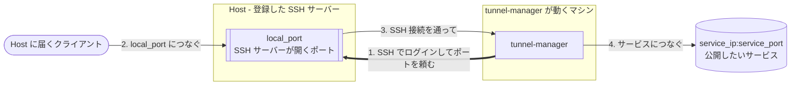

# Tunnel Manager

[English](../README.md) · [한국어](README.ko.md) · [中文](README.zh.md)

**Tunnel Manager は、サービスに直接届かないマシンからそのサービスを使えるようにします。**
そうしたマシンに SSH でログインし、それぞれにポートを 1 つ開かせて、そのポートに届いた
ものを SSH 接続を通してサービスまで運びます。あとはトンネルを保ち続けます。切れたトンネル
は張り直し、どのトンネルが今どうなっているかはブラウザの画面に出ます。

実体はファイル 1 つです。データベースは自分で作る SQLite ファイル、設定はその中にあって
ブラウザから変更でき、UI と API はバイナリに組み込まれています。ほかにインストールするもの
はなく、最初の起動の前に用意しておく設定もありません。



インストールは 3 つのものからできています。はじめの 2 つは自分で登録し、3 つ目はその登録に
合わせて自動で作られます。トンネルはその 3 つ目から作られます。

| 構成要素 | 何か |
|----------|------|
| Host | ログイン先の SSH サーバーです。アドレス、ポート、ユーザー、そして秘密鍵かパスワードを登録します |
| サービスポート | 公開したいサービスと、それを担当する Host の上に開くポートです |
| 割り当て | どの Host がどのサービスポートを担当するかです。Host が有効になっている割り当て 1 つが、トンネル 1 本です |

## できること

- 割り当てごとにトンネルを作り、見張り、接続が切れたら作り直します。
- トンネルが上がったら転送ポートに自分でつないでみて、届いたかどうかを伝えます。待ち受けを
  どのアドレスに開くかは SSH サーバー側が決めることだからです。
- UI と API を HTTPS で提供します。証明書は初回起動のときに自分で作り、自分の証明書を
  登録すればそちらを使います。
- SSH のパスワード、秘密鍵、証明書の秘密鍵を、このインストールのキーファイルで暗号化した
  まま保存します。
- 設定一式を暗号化して 1 つのファイルにまとめ、別のインストールへ運べます。
- 画面を 13 の言語で表示します。ブラウザの隅で選ぶか、インストールに設定しておきます。
  ログファイルは英語のままです。
- Linux、macOS、Windows でバイナリ 1 つとして動きます。C ライブラリも、後ろで動かす
  データベースサーバーも要りません。

## クイックスタート

[リリースページ](https://github.com/jollaman999/tunnel-manager/releases)から使っている
プラットフォーム向けのバイナリをダウンロードし、実行権限を付けて起動します。

```bash
chmod +x tunnel-manager-linux-amd64
./tunnel-manager-linux-amd64
```

初回起動でデータベースとアカウントと証明書が作られ、そのアカウントのパスワードがどこにある
かがログに出ます。

```text
created the account with an initial password. Read the password from the file, log in with it,
and set a username and a password. The file is written with permission 0600 and holds the only
copy of the password  {"log_id": "account.created_with_initial_password",
"initial_password_file": "<dir>/initial-password"}
```

```bash
cat <dir>/initial-password
```

ブラウザで `https://127.0.0.1:8888/` を開きます。証明書はこのインストールが自分自身に向けて
署名したものなので、ブラウザは警告を出します。その警告と突き合わせる指紋は、起動ログと設定
画面にあります。

**ユーザー名は空のまま**、さきほどのファイルにあるパスワードでログインし、アカウントが持つ
ユーザー名とパスワードを決めます。初期設定が終わると、そのファイルは削除されます。あとは
それぞれの画面から Host とサービスポートを追加します。どのトンネルが何をしているかは状態
画面が教えてくれます。

データベースは `-db` でファイルを指定しない限り、プラットフォームのユーザーデータ
ディレクトリの下に置かれます。Docker Compose、systemd ユニット、ソースからのビルドは
下のリファレンスにあります。

## さらに読むなら

[reference.ja.md](reference.ja.md) がすべてです。

| 節 | 何が書いてあるか |
|----|------------------|
| [動作の仕組み](reference.ja.md#動作の仕組み) | 調整ループ、割り当て、トンネル 1 本の最初から最後まで |
| [インストールと起動](reference.ja.md#インストールと起動) | フラグ、ファイルの置き場所、Docker Compose、systemd、ソースから |
| [HTTPS と証明書](reference.ja.md#https-と証明書) | ブラウザの警告、自分の証明書の登録、更新、HTTPS を切る |
| [初回起動とアカウント](reference.ja.md#初回起動とアカウント) | 初期パスワード、初期設定、認証情報の変更 |
| [内蔵 UI](reference.ja.md#内蔵-ui) | それぞれの画面が何を見せ、何ができるか、そしてどの言語で表示できるか |
| [設定](reference.ja.md#設定) | すべての設定項目、いつ効くか、サーバーが起動しなくなったときの戻り道 |
| [API エンドポイント](reference.ja.md#api-エンドポイント) | すべての呼び出しと、スクリプトに要るログインと CSRF トークン |
| [トンネルの状態を読む](reference.ja.md#トンネルの状態を読む) | 3 つの数、状態が意味するもの、転送ポートに届いたかどうか |
| [暗号化キー](reference.ja.md#暗号化キー) | 何がそのキーで封をされるか、失うと何を払うか |
| [非 root ユーザーで動かす](reference.ja.md#非-root-ユーザーで動かす) | ファイルディスクリプタの上限、ポート、ファイルの所有権 |

UI の中のマニュアルは、そのファイルの前半と同じことを書いています。マニュアルは独立した
タブで、まだログインできない人のために、ログイン画面もパネルとして開けるようになっています。

## ライセンス

MIT License。[LICENSE](../LICENSE) を参照してください。
