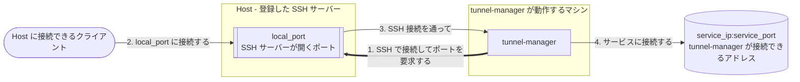
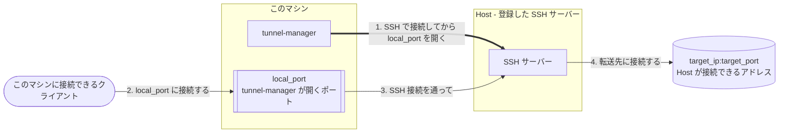

# Tunnel Manager

[English](../README.md) · [한국어](README.ko.md) · [中文](README.zh.md)


**Tunnel Manager は、サービスへの経路がないマシンからそのサービスを使えるようにします。**
そうしたマシンに SSH で接続し、それぞれにポートを 1 つ開かせて、そのポートへの接続を
SSH 接続を通してサービスまで転送します。あとはトンネルを維持し続けます。切れたトンネルは
再接続し、ブラウザの画面が、トンネルごとに今何をしているかを示します。

実体はファイル 1 つです。データベースは自分で作る SQLite ファイル、設定はその中にあって
ブラウザから変更でき、UI と API はバイナリに組み込まれています。ほかにインストールするもの
はなく、最初の起動の前に用意しておく設定もありません。

**サービスポート: Host がポートを開きます。** サービスポートを担当する Host がそれぞれ
`local_port` を開き、そこに届いた接続を tunnel-manager が `service_ip:service_port` へ運びます。



**ローカルフォワード: このマシンがポートを開きます。** 向きが逆で、`ssh -L` と同じです。
tunnel-manager がこのマシンに `local_port` を開き、そこへの接続を Host の SSH 接続を通して、
その Host が接続できるアドレス `target_ip:target_port` へ運びます。



インストールは 3 つのものからできています。Host とサービスポートは自分で登録し、両者をつなぐ
割り当ては、別に指定しなければ登録と同時に作られます。トンネル 1 本は割り当て 1 つから
作られます。

| 構成要素 | 何か |
|----------|------|
| Host | 接続先の SSH サーバーです。アドレス、ポート、ユーザー、そして秘密鍵かパスワードを登録します |
| サービスポート | 公開したいサービス (このマシンが接続できるアドレスなら、どこにあっても構いません) と、このサービスポートを担当する Host の上に開くポートです |
| 割り当て | どの Host がどのサービスポートを担当するかです。Host が有効になっている割り当て 1 つが、トンネル 1 本です |
| ローカルフォワード | このマシンに開くポートです。届いた接続を 1 台の Host を経由して、その Host が届くアドレスへ送ります |

最後の行は任意で、上の 2 つ目の図がこれです。ローカルフォワードは作成した Host に属し、その Host の行の **Local forwards**
ボタンから追加します。

## できること

- 割り当てごとにトンネルを確立し、監視し、接続が切れたら再接続します。
- ローカルフォワードも開きます。このマシンのポートが Host を経由して、その Host だけが届く
  アドレスへつながります。トンネルと同じように維持します。
- `ssh -D` と同じく Host を SOCKS5 プロキシにします。このマシンのポートをプロキシに設定した
  ブラウザは、その Host が届く先に届きます。接続は許可したアドレスからだけ受けます。
- トンネルが確立したら転送ポートに自分で接続してみて、到達できたかどうかを伝えます。転送ポートを
  どのアドレスに開くかは SSH サーバー側が決めることだからです。
- UI と API を HTTPS で提供します。証明書は初回起動のときに自分で作り、独自の証明書を
  登録すればそちらを使います。
- SSH のパスワード、秘密鍵、証明書の秘密鍵を、このインストールのキーファイルで暗号化した
  まま保存します。
- 設定一式を暗号化して 1 つのファイルにまとめ、別のインストールへ移行できます。
- 画面を 13 の言語で表示します。ブラウザの隅で選ぶか、インストールに設定しておきます。
  ログファイルは英語のままです。
- Linux、macOS、Windows でバイナリ 1 つとして動作します。C ライブラリも、別に動かす
  データベースサーバーも要りません。

## クイックスタート

[リリースページ](https://github.com/jollaman999/tunnel-manager/releases)から使っている
プラットフォーム向けのバイナリをダウンロードし、実行権限を付けて起動します。

```bash
chmod +x tunnel-manager-linux-amd64
./tunnel-manager-linux-amd64
```

初回起動でデータベースとアカウントと証明書が作られ、そのアカウントのパスワードがどこにある
かがログに出ます。

```text
created the account with an initial password. Read the password from the file, log in with it,
and set a username and a password. The file is written with permission 0600 and holds the only
copy of the password  {"log_id": "account.created_with_initial_password",
"initial_password_file": "<dir>/initial-password"}
```

```bash
cat <dir>/initial-password
```

ブラウザで `https://127.0.0.1:8888/` を開きます。証明書はこのインストールが自分自身に向けて
署名したものなので、ブラウザは警告を出します。その警告と照合する指紋は、起動ログと設定
画面にあります。

**ユーザー名は空のまま**、さきほどのファイルにあるパスワードでログインし、アカウントがこの先
使うユーザー名とパスワードを決めます。初期設定が終わると、そのファイルは削除されます。あとは
Host とサービスポートを、それぞれの画面から追加します。どのトンネルが何をしているかは状態
画面で分かります。

データベースは `-db` でファイルを指定しない限り、プラットフォームのユーザーデータ
ディレクトリの下に置かれます。Docker Compose、systemd ユニット、ソースからのビルドは
下のリファレンスにあります。

## サービスとしてインストール

`-install` は、このプログラムをその機械のサービスにします。実行ファイルを所定の場所に置き、
データディレクトリを作り、systemd か launchd か Windows のサービス制御マネージャーに
サービスを登録して起動します。以後は起動時に立ち上がり、落ちても自分で立ち上がり直します。

```bash
sudo ./tunnel-manager-linux-amd64 -install
```

Windows では、**管理者として実行**で開いた PowerShell かコマンドプロンプトから同じコマンドを実行します。

```powershell
.\tunnel-manager-windows-amd64.exe -install
```

| プラットフォーム | 実行ファイル | データ |
|------------------|--------------|--------|
| Linux | `/usr/local/bin/tunnel-manager` | `/var/lib/tunnel-manager/` |
| macOS | `/usr/local/bin/tunnel-manager` | `/Library/Application Support/tunnel-manager/` |
| Windows | `C:\Program Files\tunnel-manager\tunnel-manager.exe` | `C:\ProgramData\tunnel-manager\` |

**インストールされるバイナリは最新リリースです。** GitHub からダウンロードし、そのリリースに
`SHA256SUMS` が入っていれば、ダウンロードしたファイルをそのチェックサムと照合します。リリース
に接続できなくても失敗にはなりません。そのときは、いま実行したファイルを代わりにインストール
し、どちらがインストールされたかを報告に出します。

`sudo tunnel-manager -uninstall` で元に戻します。サービスを止め、登録を外し、インストールした
実行ファイルを削除します。**データは残します。** どこに残したかは報告に出ます。データ
ディレクトリごと削除するには `-purge` を付けますが、`-purge` が削除したものは元に戻せません。

## さらに読むなら

[reference.ja.md](reference.ja.md) がすべてです。

| 節 | 何が書いてあるか |
|----|------------------|
| [動作の仕組み](reference.ja.md#動作の仕組み) | 調整ループ、割り当て、トンネル 1 本の最初から最後まで、ローカルフォワード、Host の SOCKS5 プロキシ |
| [インストールと起動](reference.ja.md#インストールと起動) | フラグ、ファイルの置き場所、Docker Compose、systemd、ソースから |
| [サービスとしてインストールする](reference.ja.md#サービスとしてインストールする) | 4 つのフラグ、すでにインストールされているときの動き、アンインストールがパスをどこから読むか |
| [HTTPS と証明書](reference.ja.md#https-と証明書) | ブラウザの警告、独自の証明書の登録、更新、HTTPS の無効化 |
| [初回起動とアカウント](reference.ja.md#初回起動とアカウント) | 初期パスワード、初期設定、認証情報の変更 |
| [内蔵 UI](reference.ja.md#内蔵-ui) | それぞれの画面が何を見せ、何ができるか、そしてどの言語で表示できるか |
| [設定](reference.ja.md#設定) | すべての設定項目、いつ有効になるか、サーバーが起動しなくなったときの復旧手順 |
| [API エンドポイント](reference.ja.md#api-エンドポイント) | すべての呼び出しと、スクリプトに要るログインと CSRF トークン |
| [トンネルの状態を読む](reference.ja.md#トンネルの状態を読む) | 3 つの数、状態が意味するもの、転送ポートに到達できたかどうか |
| [暗号化キー](reference.ja.md#暗号化キー) | 暗号化キーが何を暗号化するか、失うと何が起きるか |
| [非 root ユーザーで動かす](reference.ja.md#非-root-ユーザーで動かす) | ファイルディスクリプタの上限、ポート、ファイルの所有権 |

UI の中のマニュアルは、そのファイルの前半と同じことを書いています。マニュアルは独立した
タブで、まだログインできない人のために、ログイン画面からもパネルとして開けるようになっています。

## ライセンス

MIT License。[LICENSE](../LICENSE) を参照してください。
