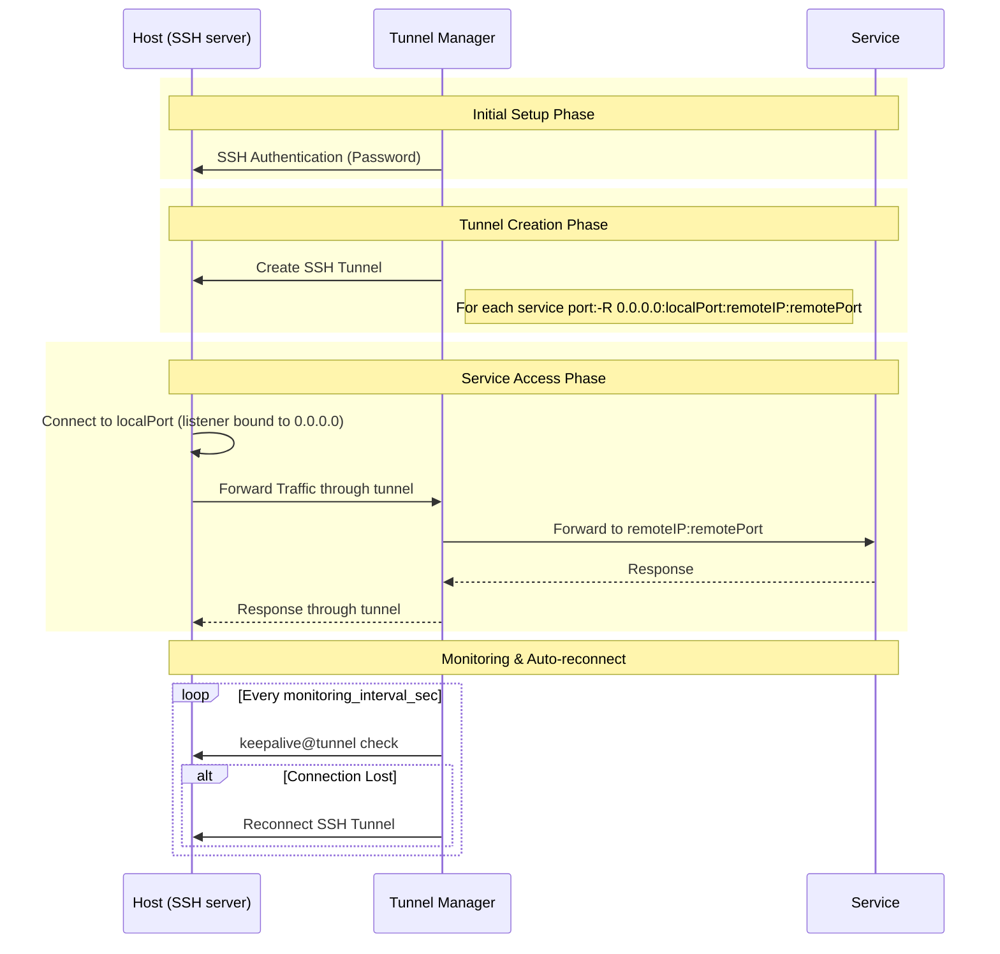

# Tunnel Manager

[English](../README.md)

Tunnel Manager 는 SSH 터널을 열고 그 상태를 계속 유지합니다. 접속할 SSH 서버(**Host**)와
내보낼 서비스(**서비스 포트**)를 등록해 두면, 둘의 모든 조합마다 터널을 하나씩 만들고
그때부터 계속 지켜봅니다. REST API 와 브라우저 UI 와 터널을 한 바이너리가 전부 맡습니다.

여기서 만드는 터널은 **역방향(reverse)** 터널입니다. 즉 대기 소켓이 Tunnel Manager 가 도는
장비가 아니라 **Host 쪽에** 열립니다. Host 의 `local_port` 로 접속한 클라이언트는 SSH 연결을
타고 Tunnel Manager 까지 오고, Tunnel Manager 가 `service_ip:service_port` 로 연결해 양방향으로
바이트를 옮깁니다. Tunnel Manager 만 닿을 수 있는 서비스를 Host 에서 쓸 수 있게 만드는 것이
이 구조입니다.

| 등록하는 것 | 항목 | 무엇인가 |
|-------------|------|----------|
| Host | `ip`, `port`, `user`, `password`, `description`, `enabled` | Tunnel Manager 가 사용자명과 비밀번호로 접속하는 SSH 서버입니다. 비밀번호는 암호화해서 저장합니다. |
| 서비스 포트 | `service_ip`, `service_port`, `local_port` | 내보낼 서비스와, 그 서비스에 닿기 위해 각 Host 에 열 포트입니다. |

**활성(enabled)** Host 하나와 서비스 포트 하나의 조합이 터널 하나입니다. 활성 Host 둘에
서비스 포트 셋이면 터널은 여섯입니다.

## 목차

- [시스템 요구사항](#시스템-요구사항)
- [동작 방식](#동작-방식)
- [설치 및 실행](#설치-및-실행)
- [첫 기동과 계정 설정](#첫-기동과-계정-설정)
- [내장 UI](#내장-ui)
- [스크립트에서 API 호출하기](#스크립트에서-api-호출하기)
- [API 엔드포인트](#api-엔드포인트)
- [터널 상태 읽기](#터널-상태-읽기)
- [설정 파일](#설정-파일)
- [암호화 키](#암호화-키)
- [비root로 실행하는 경우](#비root로-실행하는-경우)
- [v1.0.0 에서 올릴 때](#v100-에서-올릴-때)
- [라이선스](#라이선스)

## 시스템 요구사항

- 빌드하려면 Go 1.23 이상
- MySQL 5.7 이상 또는 MariaDB 10.3 이상
- Docker 와 Docker Compose (선택사항)

## 동작 방식

### 조정 루프

Tunnel Manager 는 세상을 두 그림으로 나눠 들고 계속 견줍니다.

| 그림 | 무엇인가 | 어디서 오나 |
|------|----------|-------------|
| 목표 상태 | 활성 Host 전부와 서비스 포트 전부의 조합 | `hosts`, `service_ports` 행 |
| 실제 상태 | 지금 돌고 있는 터널 | 프로세스 안의 매니저와 그것이 쓰는 `tunnels` 행 |

**조정 패스(reconcile pass)** 는 둘을 견줘서 차이만 메웁니다. 목표에 있는데 안 도는 것은
띄우고, 도는데 목표에 없는 것은 끄고, 접속 정보(서버 주소, 원격 주소, 로컬 포트, 사용자,
비밀번호)가 행과 어긋난 채 돌고 있는 터널은 끄고 새 정보로 다시 띄웁니다.

지금 API 요청은 이렇게 처리됩니다.

```text
POST /api/service-port
  트랜잭션 { INSERT INTO service_ports } 커밋
  조정 루프 깨우기
  201 Created          <- 터널을 기다리지 않고 바로 응답한다

조정 루프
  목표 = 활성 Host x 서비스 포트
  실제 = 돌고 있는 터널
  목표에 있는데 안 돈다   -> 띄운다
  도는데 목표에 없다      -> 끈다
  도는데 설정이 옛것이다  -> 끄고 다시 띄운다
```

패스는 세 시점에 돕니다.

| 언제 | 왜 |
|------|-----|
| 기동할 때, API 가 아무것도 응답하기 전에 | 첫 요청이 물어보는 시점에는 저장된 행의 터널이 이미 떠 있다 |
| `POST`·`PUT`·`DELETE` 가 커밋된 직후 | 다음 주기를 기다리지 않고 바로 반영된다 |
| `reconcile.interval_sec` 마다 (기본 5초) | 실패한 패스가 못 한 일을 다시 시도한다 |

터널이 생기기 전에 응답이 나가므로, **쓰기가 성공했다고 터널이 떴다는 뜻은 아닙니다.**
그것에 답하는 것은 `GET /api/status` 입니다. [터널 상태 읽기](#터널-상태-읽기)를 보십시오.

### 터널 하나의 동작



Host 쪽 리스너가 정말 `0.0.0.0` 으로 열리는지는 Host 의 SSH 서버 설정에 달려 있습니다.
`GatewayPorts` 가 꺼져 있으면 요청한 주소와 관계없이 루프백에만 바인딩되고, 그 사실이
로그에 남습니다.

`monitoring.interval_sec` 과 `reconcile.interval_sec` 은 다른 일을 합니다. 모니터는 이미 떠
있는 터널이 아직 살아 있는지 물어보고 죽었으면 다시 잇습니다. 조정 루프는 떠 있어야 할
터널이 애초에 전부 있는지를 봅니다.

## 설치 및 실행

### Docker Compose 를 쓰는 경우

1. 저장소 클론

```bash
git clone https://github.com/jollaman999/tunnel-manager.git
cd tunnel-manager
```

2. 설정 파일 수정

```bash
vi config/config.yaml
```

3. 실행

```bash
docker-compose up -d
```

compose 파일은 `./config/config.yaml` 을 컨테이너의 `/config/config.yaml` 로 연결하고,
이 경로가 프로세스가 기본으로 읽는 경로입니다. 연결되는 것은 디렉터리가 아니라 **파일
하나**뿐이라서, 아래에 나오는 임시 비밀번호 파일은 **컨테이너 안에** 써지고 호스트에는
보이지 않습니다.

### 직접 실행하는 경우

1. 저장소 클론

```bash
git clone https://github.com/jollaman999/tunnel-manager.git
cd tunnel-manager
```

2. 의존성 다운로드

```bash
go mod tidy
```

3. 설정 파일 수정

```bash
vi config/config.yaml
```

4. 빌드 및 실행

```bash
make run
```

`-config` 가 설정 파일을 지정하며 기본값은 `config/config.yaml` 로, 프로세스의 작업
디렉터리를 기준으로 합니다. `-version` 은 버전을 찍고 끝납니다.

## 첫 기동과 계정 설정

**API 와 UI 는 로그인 뒤에 있습니다.** 계정은 하나이고 첫 기동 때 만들어집니다. 첫 기동
전에 이 절을 읽으십시오. 모르면 로그인을 못 합니다.

1. 첫 기동이 `user` 테이블의 유일한 행을 만듭니다. 이 행에는 **아직 사용자명이 없고**
   설정이 필요한 상태로 표시됩니다.
2. 임시 비밀번호는 **설정 파일이 있는 디렉터리**의 `initial-password` 파일에 권한 `0600`
   으로 써집니다. 대문자와 숫자 52자입니다. 어디에 생기는지는 어떻게 띄웠는지에 따라
   갈립니다.

   | 이렇게 띄우면 | 파일 위치 |
   |---------------|-----------|
   | `-config config/config.yaml` (기본값) | 설정 파일 옆의 `config/initial-password` |
   | 동봉한 systemd 유닛, `-config /etc/tunnel-manager/config.yaml` | `/etc/tunnel-manager/initial-password` |
   | Docker Compose | **컨테이너 안**의 `/config/initial-password`: `docker compose exec tunnel-manager cat /config/initial-password` |

3. **로그에는 경로만 남고 값은 안 남습니다.** 로그는 콘솔에도 나가고 보관·회전되는 파일에도
   쌓이므로, 거기에 비밀번호를 적으면 아무도 안 보는 곳에 계정 설정보다 오래 남습니다.
   파일이 유일한 사본입니다.
4. 그 비밀번호로 로그인합니다. 이 시점에는 사용자명을 보지 않으므로 빈 값으로 보냅니다.
   응답에 `"setup_required": true` 가 실리고 UI 는 설정 화면으로 갑니다. 거기서 계정이
   계속 쓸 사용자명과 비밀번호를 정합니다.
5. **설정이 끝나면 임시 비밀번호 파일이 지워집니다.** 그 시점에 파일 속 비밀번호는 계정을
   더 이상 열지 못하므로, 남겨 두면 읽을 수 있는 죽은 자격증명 사본일 뿐입니다. 임시
   비밀번호로 열린 다른 세션도 같이 끊깁니다. 설정을 하고 있는 그 세션만 남습니다.
6. **설정이 끝나기 전에는 세션이 `POST /api/setup` 말고 아무것도 못 부릅니다.** `/api` 아래
   다른 경로는 전부 `403` 과 `The account setup is not finished` 로 응답합니다.

설정에서 정하는 비밀번호는 **12바이트 이상 72바이트 이하**여야 합니다. 글자 수가 아니라
바이트 수입니다. 한글 한 글자는 3바이트입니다. 상한이 72인 이유는 비밀번호를 해시하는
bcrypt 가 앞의 72바이트까지만 읽기 때문입니다. 그 뒤는 로그인에서 검사되지 않으므로,
조용히 잘라 쓰지 않고 거부합니다.

설정은 **한 번만** 됩니다. 현재 비밀번호를 묻지 않기 때문에 나중에 자격증명을 바꾸는
통로가 아니며, 두 번째 호출은 `409` 로 응답합니다.

세션은 마지막으로 쓰인 시점부터 12시간 살아 있고, 요청이 있을 때마다 그 시한이 미뤄집니다.
세션은 메모리에만 있으므로 재기동하면 전부 사라지고 다시 로그인해야 합니다.

## 내장 UI

브라우저로 `http://<주소>:<포트>/` 를 엽니다. `/` 는 `/ui/` 로 리다이렉트하고, UI 는
거기서 제공됩니다.

**따로 배포할 것이 없습니다.** 화면 파일이 바이너리 안에 들어 있어서, 옆에 딸려 다녀야 할
디렉터리도 없고 설정할 경로도 없으며 프로세스를 어느 작업 디렉터리에서 띄우든 상관없습니다.

| 화면 | 경로 | 무엇을 보여주고 무엇을 하나 |
|------|------|------------------------------|
| 상태 | `/ui/status` | 숫자 셋(목표, 행, 연결됨)과 그 차이를 설명하는 한 줄, 그리고 터널마다 한 줄씩 Host, 서비스 포트, 상태, 서버, 로컬, 원격, 재시도 횟수, 마지막 연결 시각, 마지막 오류. 5초마다 다시 물어봅니다. |
| 호스트 | `/ui/hosts` | Host 마다 한 줄씩 ID, IP, 포트, 사용자, 설명, 활성 여부, 수정 시각. 추가, 수정, 활성·비활성 전환, 삭제를 합니다. |
| 서비스 포트 | `/ui/service-ports` | 서비스 포트마다 한 줄씩 ID, 서비스 IP, 서비스 포트, 로컬 포트, 설명, 수정 시각. 추가, 수정, 삭제를 합니다. |
| 로그인 | `/ui/login` | 세션이 없는 클라이언트가 도착하는 화면. 첫 로그인에서는 사용자명을 비워 둡니다. 계정 설정이 아직이면 설정 화면으로 이어집니다. |

UI 파일은 일부러 세션 없이 제공합니다. 누구에게나 같은 바이트이고 그 자체에 데이터가 없기
때문입니다. 화면이 보여주는 내용은 전부 `/api/**` 에서 가져오고, 로그인이 지키는 것은
그쪽입니다.

## 스크립트에서 API 호출하기

**`/api` 아래 모든 경로는 세션이 필요하고, `POST`·`PUT`·`DELETE` 는 CSRF 토큰도 필요합니다.**
이전 릴리스에 맞춰 짠 스크립트는 아래를 하기 전까지 첫 호출부터 `401` 을 받습니다.

1. `POST /api/login` 에 사용자명과 비밀번호를 보냅니다. 서버가 내려주는 쿠키
   `tm_session` 과 `tm_csrf` 를 보관합니다.
2. 응답의 `data.csrf_token` 을 꺼내서 **모든** `POST`·`PUT`·`DELETE` 에 `X-CSRF-Token`
   헤더로 붙입니다.
3. `GET` 은 토큰이 필요 없습니다. 바꾸는 것이 없기 때문입니다.

CSRF 는 cross site request forgery, 즉 다른 사이트가 내 브라우저를 시켜 내 쿠키가 붙은
요청을 보내게 하는 공격입니다. 그 사이트는 내 로그인 응답을 읽을 수도 없고 헤더를 붙일
수도 없으므로, 토큰을 검사하면 막힙니다.

아래 예제가 한 세션 전체입니다. 쿠키 항아리 파일을 씁니다. `-c` 는 서버가 내려준 쿠키를
적고, `-b` 는 그것을 다시 보냅니다.

```bash
BASE=http://127.0.0.1:8888

# 1. 로그인한다. -c 가 tm_session 과 tm_csrf 를 cookies.txt 에 적는다.
curl -s -c cookies.txt -X POST "$BASE/api/login" \
  -H 'Content-Type: application/json' \
  -d '{"username":"operator","password":"<your-password>"}' > login.json

# {"success":true,"data":{"setup_required":false,"csrf_token":"<token>"}}

# 2. 응답에서 토큰을 꺼낸다.
CSRF=$(python3 -c 'import json; print(json.load(open("login.json"))["data"]["csrf_token"])')

# 3. 읽기는 쿠키만 있으면 된다.
curl -s -b cookies.txt "$BASE/api/status"

# 4. 쓰기는 헤더까지 필요하다.
curl -s -b cookies.txt -X POST "$BASE/api/host" \
  -H 'Content-Type: application/json' \
  -H "X-CSRF-Token: $CSRF" \
  -d '{"ip":"192.0.2.10","port":22,"user":"ubuntu","password":"<host-password>","description":"example"}'

curl -s -b cookies.txt -X POST "$BASE/api/service-port" \
  -H 'Content-Type: application/json' \
  -H "X-CSRF-Token: $CSRF" \
  -d '{"service_ip":"198.51.100.20","service_port":8080,"local_port":18080}'

# 5. 스크립트가 끝나면 로그아웃한다.
curl -s -b cookies.txt -X POST "$BASE/api/logout" -H "X-CSRF-Token: $CSRF"
```

맨 처음 로그인할 때는 사용자명을 비우고 임시 비밀번호로 로그인한 다음, 다른 것을 하기
전에 계정 설정부터 끝냅니다.

```bash
curl -s -c cookies.txt -X POST "$BASE/api/login" \
  -H 'Content-Type: application/json' \
  -d "{\"username\":\"\",\"password\":\"$(cat config/initial-password)\"}" > login.json

CSRF=$(python3 -c 'import json; print(json.load(open("login.json"))["data"]["csrf_token"])')

curl -s -b cookies.txt -X POST "$BASE/api/setup" \
  -H 'Content-Type: application/json' \
  -H "X-CSRF-Token: $CSRF" \
  -d '{"username":"operator","password":"<your-password>"}'
```

무엇이 잘못됐을 때 어떻게 보이는지는 이렇습니다.

| 응답 | 무슨 뜻인가 |
|------|-------------|
| `401 Authentication required` | 세션 쿠키를 안 보냈거나 세션이 만료됐습니다. 다시 로그인하십시오. |
| `403 The request carries no valid X-CSRF-Token header...` | 쓰기에 토큰이 없거나 틀렸습니다. 로그인 응답의 `data.csrf_token` 을 보내십시오. |
| `403 The account setup is not finished...` | 계정에 아직 사용자명이 없습니다. `POST /api/setup` 을 먼저 부르십시오. |
| `401 Invalid username or password` | 로그인이 거부됐습니다. 둘 중 무엇이 틀렸는지는 일부러 알려주지 않습니다. |

모든 응답은 같은 모양입니다. `{"success":true,"data":...}` 또는
`{"success":false,"error":"..."}` 입니다.

## API 엔드포인트

`POST /api/login` 을 뺀 `/api` 아래 전부가 세션을 요구합니다. `GET` 이 아닌 것은 전부
`X-CSRF-Token` 헤더를 요구합니다.

### 계정

| 메서드 | 경로 | 하는 일 |
|--------|------|---------|
| `POST` | `/api/login` | `username` 과 `password` 를 받아 세션·CSRF 쿠키를 내리고 `setup_required` 와 `csrf_token` 을 응답 |
| `POST` | `/api/logout` | 세션을 지우고 쿠키 둘을 만료시킴 |
| `POST` | `/api/setup` | 아직 설정이 필요한 계정에 사용자명과 비밀번호를 한 번 정함 |

### Host 관리

| 메서드 | 경로 | 하는 일 |
|--------|------|---------|
| `POST` | `/api/host` | Host 생성 |
| `GET` | `/api/host` | Host 목록 조회 |
| `GET` | `/api/host/:id` | 특정 Host 조회 |
| `PUT` | `/api/host/:id` | Host 수정. 모든 항목이 선택이며, `enabled` 를 false 로 하면 그 Host 의 터널이 멈춤 |
| `DELETE` | `/api/host/:id` | Host 삭제 |

### 서비스 포트 관리

| 메서드 | 경로 | 하는 일 |
|--------|------|---------|
| `POST` | `/api/service-port` | 서비스 포트 생성 |
| `GET` | `/api/service-port` | 서비스 포트 목록 조회 |
| `GET` | `/api/service-port/:id` | 특정 서비스 포트 조회 |
| `PUT` | `/api/service-port/:id` | 서비스 포트 수정. `service_ip`, `service_port`, `local_port` 가 모두 필수 |
| `DELETE` | `/api/service-port/:id` | 서비스 포트 삭제 |

### 상태 조회

| 메서드 | 경로 | 하는 일 |
|--------|------|---------|
| `GET` | `/api/status` | 숫자 셋과 전체 터널 |
| `GET` | `/api/status/:hostId` | 그 Host 와 그 Host 의 터널 |

### UI

| 메서드 | 경로 | 하는 일 |
|--------|------|---------|
| `GET` | `/` | `302` 로 `/ui/` 로 보냄 |
| `GET` | `/ui` | `302` 로 `/ui/` 로 보냄 |
| `GET` | `/ui/*` | 바이너리 안의 UI 를 제공 |

Host 의 SSH 비밀번호와 계정의 비밀번호 해시는 어떤 응답에도 실리지 않습니다.

## 터널 상태 읽기

```bash
curl -s -b cookies.txt http://127.0.0.1:8888/api/status
```

```json
{
  "success": true,
  "data": {
    "desired_tunnels": 1,
    "total_tunnels": 1,
    "connected_tunnels": 0,
    "tunnels": [
      {
        "host_id": 1,
        "sp_id": 1,
        "status": "starting",
        "last_error": "",
        "retry_count": 0,
        "last_connected_at": "0001-01-01T00:00:00Z",
        "server": "192.0.2.10:22",
        "local": "0.0.0.0:18080",
        "remote": "198.51.100.20:8080"
      }
    ]
  }
}
```

숫자 셋은 서로 다른 세 질문에 답하고, 그 사이의 차이도 뜻이 다릅니다.

| 숫자 | 무엇을 세나 |
|------|-------------|
| `desired_tunnels` | 떠 **있어야 할** 터널 수. 활성 Host 곱하기 서비스 포트이며, 조정 패스가 목표 상태를 만드는 방식 그대로 셉니다 |
| `total_tunnels` | 터널 **행**의 수. 어떤 상태로 끝났든 한 번이라도 시작된 터널마다 하나씩 있습니다 |
| `connected_tunnels` | 그 행들 중 `connected` 인 것의 수 |

| 차이 | 무슨 뜻인가 |
|------|-------------|
| `desired > total` | 떠 있어야 할 터널이 아예 시작되지도 않았습니다. 아직 패스가 안 돈 순간이거나, 패스가 시작을 못 한 것입니다. 후자의 예로 저장된 비밀번호가 지금 쓰는 암호화 키로 안 열리는 경우가 있습니다. 이유는 로그에 있습니다. |
| `total > connected` | 시작은 됐는데 트래픽을 나르지 못하고 있습니다. 이유는 그 행의 `status` 와 `last_error` 에 있습니다. |

`status` 는 넷 중 하나입니다.

| 값 | 뜻 |
|----|-----|
| `starting` | 행은 써졌고 SSH 연결을 만드는 중 |
| `connected` | Host 에 리스너가 열려 있음 |
| `reconnecting` | 연결이 끊겼거나 keepalive 에 응답이 없어 다시 잇는 중 |
| `error` | 시도가 실패함. 이유는 `last_error` 에 있음 |

`GET /api/status/:hostId` 는 `desired_tunnels` 를 뺀 같은 숫자들과 그 Host 자체를 줍니다.

## 설정 파일

`config/config.yaml` 전체입니다.

```yaml
database:
  host: tunnel-manager-db
  port: 3306
  user: tunnel-manager
  password: tunnel-manager-pass
  name: tunnel-manager
  timeout_sec: 30

api:
  port: 8888

monitoring:
  interval_sec: 5

reconcile:
  interval_sec: 5

security:
  key_file: "keys/tunnel-manager.key"

logging:
  level: info     # debug, info, warn, error, dpanic, panic, fatal
  format: json    # json, console
  file:
    path: "/var/log/tunnel-manager/tunnel-manager.log"
    max_size: 100    # 회전하기 전까지의 크기, 메가바이트
    max_backups: 5   # 보관할 회전 파일 개수
    max_age: 7       # 회전 파일을 보관할 일수
    compress: true   # 회전 파일 압축 여부
```

| 항목 | 기본값 | 안 적으면 |
|------|--------|-----------|
| `database.host` | 없음 | 기동 실패: `database host is required` |
| `database.port` | 없음 | 기동 실패: `invalid database port: 0` |
| `database.user` | 없음 | 기동 실패: `database user is required` |
| `database.password` | 없음 | 기동 실패: `database password is required` |
| `database.name` | 없음 | 기동 실패: `database name is required` |
| `database.timeout_sec` | 없음 | 기동 실패: `invalid database timeout: 0` |
| `api.port` | 없음 | 기동 실패: `invalid API port: 0` |
| `monitoring.interval_sec` | 없음 | 기동 실패: `invalid monitoring interval: 0` |
| `reconcile.interval_sec` | `5` | 기본값이 적용됩니다 |
| `security.key_file` | `keys/tunnel-manager.key` | 기본값이 적용됩니다 |
| `logging.level` | `info` | 기본값이 적용됩니다 |
| `logging.format` | `json` | 기본값이 적용됩니다 |
| `logging.file.path` | `logs/tunnel-manager.log` | 기본값이 적용됩니다 |
| `logging.file.max_size` | `100` | 기본값이 적용됩니다 |
| `logging.file.max_backups` | `5` | 기본값이 적용됩니다 |
| `logging.file.max_age` | `30` | 기본값이 적용됩니다 |
| `logging.file.compress` | `false` | 회전 파일을 압축하지 않습니다 |

기본값이 없는 항목은 다른 것이 돌기 전에 검사하고, 범위를 벗어난 값도 같은 식으로
거부합니다. `database.port` 와 `api.port` 는 1에서 65535 사이여야 하고,
`database.timeout_sec`·`monitoring.interval_sec`·`reconcile.interval_sec` 은 0보다 커야 하며,
`logging.level` 과 `logging.format` 은 위에 적힌 값 중 하나여야 하고, `logging.file` 의 숫자
셋은 음수가 아니어야 합니다.

`database.timeout_sec` 는 질의가 아니라 **기동할 때 데이터베이스를 기다리는 시간**의
상한입니다. 기동은 1초에 한 번씩 접속을 다시 시도하다가 이 초가 지나면 포기하고 종료합니다.
접속 시도 하나에는 따로 3초를 줍니다. 패킷을 삼키는 주소로 한 번 시도한 것이 예산 전체를
먹지 않게 하기 위해서입니다. 이 상한이 없으면 커널이 핸드셰이크를 포기하는 데 2분이 넘게
걸립니다.

`security.key_file` 과 `logging.file.path` 의 상대 경로는 설정 파일이 아니라 프로세스의
작업 디렉터리를 기준으로 합니다.

## 암호화 키

Host 의 SSH 비밀번호는 AES-256-GCM 으로 암호화해서 저장합니다. 키는 `security.key_file` 이
가리키는 파일에서 읽고 기본값은 `keys/tunnel-manager.key` 입니다. 그 파일이 없으면 첫
기동이 32바이트 키를 만들어 권한 `0600` 으로 저장하고, 있으면 그대로 읽습니다.

> **키를 잃어버리면 저장된 비밀번호를 하나도 복호할 수 없습니다.** 등록된 Host 를 전부 다시
> 등록하는 것 말고는 방법이 없습니다. 데이터베이스를 백업할 때 키 파일도 같이 백업해야
> 짝이 맞습니다.

키 파일을 그룹이나 다른 사용자가 읽을 수 있으면 기동을 거부합니다.
`chmod 600 keys/tunnel-manager.key` 로 권한을 좁힌 뒤 다시 실행하십시오.

키로 저장된 비밀번호가 하나도 안 열리고 그중 암호화된 표시가 붙은 것이 하나라도 있으면,
기동을 멈춥니다. 겉보기에 멀쩡한 API 가 뜨는데 어떤 Host 에도 접속할 수 없는 상태를 만들지
않기 위해서입니다. 일부만 열리면 안 열리는 것들을 경고에 이름으로 남기고, 그 터널은 만들지
않으며, 저장된 값은 그대로 둡니다. 안 열리는 비밀번호는 다른 어디에도 없어서 덮어쓰면 영영
사라지기 때문입니다. 그 Host 들은 API 로 비밀번호를 다시 설정하십시오.

Docker Compose 로 실행하면 컨테이너의 `/keys` 가 호스트의 `./_data/keys` 에 연결되므로
컨테이너를 지웠다 다시 만들어도 키가 남습니다. 데이터베이스는 `./_data/mariadb` 에 따로
남으니, `./_data/keys` 만 지우면 데이터베이스에 있는 비밀번호를 읽을 수 없게 됩니다.

## 비root로 실행하는 경우

프로세스는 root 가 아니어도 뜹니다. `not running as root` 경고를 남기고 두 가지가 제약을
받습니다.

- 파일 디스크립터 한도를 65535까지 올리려 하지만, root 가 아니면 소프트 리밋을 하드 리밋까지만
  올릴 수 있습니다. 하드 리밋이 그보다 낮으면 `max ulimit is low` 경고를 남기고 그대로
  진행합니다. 터널이 많으면 하드 리밋을 미리 올려 두어야 합니다.
- 로그 파일 기본 경로가 `/var/log/tunnel-manager/tunnel-manager.log` 라서 비root 계정은 보통
  만들지 못합니다. 이때 기동을 멈추지는 않고 파일 로깅만 끈 채 콘솔에만 남기며, 이유는
  `logging to file is disabled` 경고에 적힙니다.

`api.port` 를 1024 미만으로 두면 비root 프로세스는 바인딩에 실패합니다. 1024 이상을 쓰거나
실행 파일에 `CAP_NET_BIND_SERVICE` 를 주어야 합니다.

프로세스는 **설정 파일이 있는 디렉터리에 쓸 수 있어야** 합니다. 첫 기동 때 임시 비밀번호
파일이 거기에 생기기 때문입니다. 쓸 수 없는 디렉터리면 기동이 멈춥니다. 아무도 비밀번호를
읽을 수 없는 계정은 아무도 로그인할 수 없는 API 이기 때문입니다.

systemd 로 돌릴 때는 `_scripts/systemd/tunnel-manager.service` 가 `User=root` 이므로 계정을
바꾸고 로그 디렉터리를 그 계정이 쓸 수 있게 만들어야 합니다.

```ini
[Service]
User=tunnel-manager
Group=tunnel-manager
LogsDirectory=tunnel-manager
```

`LogsDirectory=tunnel-manager` 를 주면 systemd 가 `/var/log/tunnel-manager` 를
`User=`/`Group=` 의 소유로 만들어 주므로 `logging.file.path` 는 그대로 두면 됩니다. 이미
root 소유로 있던 디렉터리도 소유자가 바뀝니다. 암호화 키 파일도 그 계정이 읽을 수 있어야
하니 소유자를 바꾸고 권한은 `0600` 으로 둡니다.

컨테이너는 `Dockerfile` 이 `USER root` 로 끝나서 root 로 돕니다. 비root 로 돌리려면
docker-compose.yaml 의 서비스에 `user: "<uid>:<gid>"` 를 주고, 볼륨으로 연결한
`./_data/tunnel-manager`(로그)와 `./_data/keys`(키)를 호스트에서 그 uid 소유로 만들어
두어야 합니다. root 로 한 번 띄운 뒤라면 두 디렉터리가 root 소유로 남아 있으니 소유자부터
바꿔야 합니다. 파일 디스크립터 한도는 docker-compose.yaml 의 `ulimits` 가 정하므로 컨테이너
안의 계정과는 상관이 없습니다.

`service_ports.local_port` 가 1024 미만이면 Host 의 sshd 가 리스너를 열어 주지 않습니다. 이
리스너는 Tunnel Manager 가 아니라 Host 의 sshd 가 만들기 때문에, 이 제약은 Tunnel Manager 를
돌리는 계정이 아니라 Host 에 등록한 SSH 접속 계정에 걸립니다. ssh(1) 에 적힌 대로 특권
포트는 원격 계정이 root 일 때만 포워딩됩니다. Host 의 SSH 계정이 root 가 아니면
`local_port` 는 1024 이상으로 잡아야 합니다.

## v1.0.0 에서 올릴 때

API 를 부르는 쪽에서 여섯 가지가 달라집니다.

| # | 무엇이 바뀌었나 | 클라이언트가 할 일 |
|---|-----------------|--------------------|
| 1 | `/api` 아래 모든 경로가 세션을 요구합니다 | `POST /api/login` 을 먼저 부르고 쿠키를 모든 요청에 보냅니다 |
| 2 | `POST`·`PUT`·`DELETE` 가 CSRF 토큰을 요구합니다 | 로그인 응답의 `data.csrf_token` 을 `X-CSRF-Token` 헤더로 보냅니다 |
| 3 | `POST /api/service-port` 가 터널을 못 만들어도 `500` 을 주지 않습니다 | 행이 저장되면 `201` 입니다. 결과는 `GET /api/status` 로 확인합니다 |
| 4 | 데이터베이스 오류가 `404` 가 아니라 `500` 으로 나갑니다 | 이제 `404` 는 행이 없다는 뜻입니다. `404` 로 재시도하거나 분기하던 곳을 다시 보십시오 |
| 5 | `500` 응답 본문이 데이터베이스 오류 문구를 그대로 싣지 않습니다 | 본문은 무엇이 실패했는지, 서버 로그는 왜 실패했는지를 말합니다 |
| 6 | `user` 테이블이 새로 생깁니다 | 기동할 때 `AutoMigrate` 가 만듭니다. 손으로 할 일은 없습니다 |

여기에 더해, 올린 뒤 첫 기동이 계정을 만들고 임시 비밀번호 파일을 씁니다. 재기동 전에
[첫 기동과 계정 설정](#첫-기동과-계정-설정)을 읽으십시오. 모르면 로그인을 못 합니다.

### CORS 헤더가 더 이상 안 나갑니다

서버는 `Access-Control-Allow-Origin` 헤더를 이제 하나도 보내지 않습니다. UI 가 바이너리 안에
들어와 `/ui/` 에서 제공되므로, UI 가 부르는 모든 요청이 같은 출처(same origin)여서 허용
헤더가 필요 없기 때문입니다.

이 때문에 깨지는 것은 **브라우저의 페이지가 다른 출처에서 이 API 를 부르던 경우**뿐입니다.
CORS 는 브라우저가 페이지에 적용하는 규칙이지 이 서버가 하는 검사가 아니므로, `curl` 과
스크립트와 서버 간 호출은 영향이 없습니다.

### local_port 유니크 인덱스

`service_ports.local_port` 에 유니크 인덱스가 있습니다. 이전 릴리스로 만든 데이터베이스에
같은 `local_port` 를 쓰는 행이 둘 이상 있으면 기동할 때 마이그레이션이 거부됩니다. 올리기
전에 아래 쿼리로 중복을 확인하십시오.

```sql
SELECT local_port, COUNT(*) FROM service_ports GROUP BY local_port HAVING COUNT(*) > 1;
```

여기에 나온 포트는 한 행만 남기고 나머지를 지우거나 다른 포트로 바꿔야 합니다. 정리하지
않으면 마이그레이션 실패가 데이터베이스 연결 실패처럼 보입니다. `attempting to connect to
database...` 로그만 반복되다가 `database.timeout_sec` 가 지나면 프로세스가 종료됩니다. 실제
원인은 그 로그의 `error` 필드에 있습니다.

## 라이선스

MIT License
