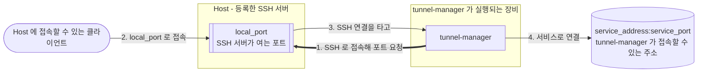
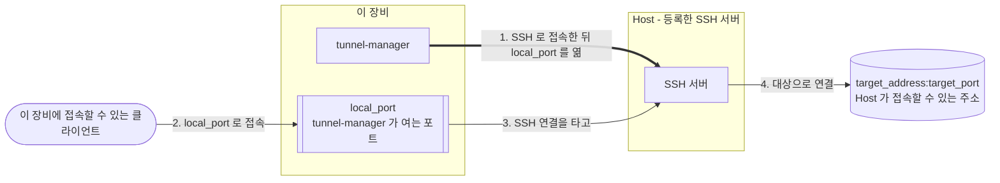

#  Tunnel Manager

[English](../README.md) · [日本語](README.ja.md) · [中文](README.zh.md)


**Tunnel Manager 는 서비스에 접속할 수 없는 장비에서 그 서비스를 쓸 수 있게 합니다.** SSH 로 그
장비들에 접속해 포트를 하나씩 열게 하고, 그 포트로 들어온 것을 SSH 연결을 통해 서비스까지
전달합니다. 그다음에는 터널의 연결을 유지합니다. 끊어진 터널은 다시 연결하고, 터널마다의
상태는 브라우저 화면에 나옵니다.

파일 하나가 전부입니다. 데이터베이스는 프로세스가 스스로 만드는 SQLite 파일이고, 설정은 그
파일 안에 있으며 브라우저에서 고칩니다. UI 와 API 는 바이너리 안에 들어 있습니다. 옆에 따로
설치할 것도, 처음 띄우기 전에 정해 둘 것도 없습니다.

**서비스 포트: Host 가 포트를 엽니다.** 서비스 포트를 담당하는 Host 마다 `local_port` 를 열고,
거기로 들어온 연결을 tunnel-manager 가 `service_address:service_port` 로 전달합니다.



**로컬 포워딩: 이 장비가 포트를 엽니다.** 방향이 반대이며 `ssh -L` 과 같습니다.
tunnel-manager 가 이 장비에 `local_port` 를 열고, 거기로 온 연결을 Host 의 SSH 연결을 타고 그
Host 가 닿는 주소 `target_address:target_port` 로 나릅니다.



설치본은 세 가지로 이루어집니다. Host 와 서비스 포트는 직접 등록하고, 둘을 잇는 할당은 따로
정하지 않으면 등록할 때 같이 만들어집니다. 터널 하나는 할당 하나에서 만들어집니다.

| 구성 요소 | 무엇인가 |
|-----------|----------|
| Host | 접속할 SSH 서버. 주소나 호스트 이름, 포트, 사용자, 그리고 개인키나 비밀번호 |
| 서비스 포트 | 내보낼 서비스(이 장비가 접속할 수 있는 주소면 됩니다)와, 이 서비스 포트를 담당하는 Host 에 열 포트 |
| 할당 | 어느 Host 가 어느 서비스 포트를 담당하는지. 활성 Host 의 켜져 있는 할당 하나가 터널 하나 |
| 로컬 포워딩 | 이 장비에 여는 포트. 들어온 연결을 Host 하나를 거쳐 그 Host 가 닿는 주소로 보냄 |

마지막 줄은 없어도 되고, 위의 두 번째 그림이 이것입니다. 로컬 포워딩은 만든 Host 에 딸리며, 그 Host 행의 **Local forwards** 버튼에서 추가합니다.

## 무엇이 다른가

포트 포워딩은 보통 한 번 걸어 두고 끝입니다. `ssh -R`, `-L`, `-D` 명령을 포워딩마다 하나씩,
필요하면 autossh 나 systemd 유닛으로 감싸 둡니다. Tunnel Manager 는 포워딩을 기록으로 저장하고,
기록에 적힌 대로 돌립니다.

- **서비스 포트로 짜는 reverse 터널.** 서비스는 이 장비에서 닿는 주소와 Host 들이 대신 열
  포트로 한 번만 저장합니다. 그 서비스를 Host 에 할당하면 Host 마다 그 포트를 열고, 들어온
  연결을 `ssh -R` 처럼 서비스로 되돌려 보냅니다. 서비스 하나를 여러 Host 로 내보내고 Host
  하나가 여러 서비스를 싣되, 짝마다 명령을 따로 두지 않습니다.
- **같은 Host 로 로컬 포워딩.** `ssh -L` 방향도 같은 방식으로 관리합니다. 이 장비에 연 포트가
  Host 를 거쳐 그 Host 만 닿는 주소로 이어집니다. 그 Host 에 딸린 기록으로 저장되고, 끊기면
  다시 연결되며, 터널과 같은 상태 표에 나옵니다. Host 를 `ssh -D` 처럼 SOCKS5 프록시로 쓸 수도
  있습니다.
- **명령 더미가 아니라 기록.** Host, 서비스 포트, 할당이 데이터베이스의 행입니다. 조정 루프가
  돌고 있는 터널을 저장된 것과 같게 맞추고, 끊어진 터널은 다시 연결합니다. 연달아 실패할 때마다
  기다리는 시간을 두 배로 늘리되 상한을 넘지 않습니다. 상태 화면 하나에 돌아야 할 수, 연결된 수,
  오류 수가 나옵니다.
- **열리는 범위를 포워딩마다 고르고, 실제로 재어 봅니다.** 할당과 로컬 포워딩마다 포트를 모든
  인터페이스에 열지 루프백에만 열지 고릅니다. 모든 인터페이스에 여는 터널은 연결된 뒤
  tunnel-manager 가 포워딩된 포트에 직접 접속해 보고 응답했는지 보여줍니다. 어디에 묶을지는
  마지막에 SSH 서버가 정하기 때문입니다 (OpenSSH 의 `GatewayPorts`). SOCKS5 프록시는 모든
  인터페이스를 고르지 않으면 루프백에 열리고, 프록시와 로컬 포워딩은 접속을 받을 클라이언트
  주소를 목록으로 제한할 수 있습니다.
- **알림.** 터널, 로컬 포워딩, 프록시가 정해 둔 시간보다 오래 끊겨 있으면 웹훅이나 메일로 알리고,
  다시 연결되면 한 번 더 알립니다.
- **설정이 한곳에.** 설정은 데이터베이스에 있고 브라우저에서 고칩니다. 설정 전체를 비밀번호로
  잠근 파일 하나로 옮깁니다. SSH 비밀번호, 개인키, 웹훅과 메일 설정은 이 설치본의 키 파일로
  암호화해 둡니다.
- **그 밖에:** 권한 범위가 정해진 API 토큰, `/api/metrics` 의 Prometheus 메트릭, `-install` 로
  스스로 서비스로 설치되는 단일 바이너리, 13개 언어로 된 화면.

## 하는 일

- 할당마다 터널을 하나씩 만들고 지켜보다가, 연결이 끊기면 다시 연결합니다.
- 로컬 포워딩도 엽니다. 이 장비의 포트가 Host 를 거쳐 그 Host 만 닿는 주소로 이어지며, 터널과
  같은 방식으로 연결을 유지합니다.
- `ssh -D` 처럼 Host 를 SOCKS5 프록시로 씁니다. 브라우저가 이 장비의 포트를 프록시로 쓰면 그
  Host 가 닿는 곳에 닿고, 접속은 허용한 주소에서만 받습니다.
- 터널이 연결되면 포워딩된 포트에 직접 접속해 보고 접속됐는지 알려줍니다. SSH 서버가 그 포트를
  어느 주소에 묶을지는 그 서버가 정하는 일이기 때문입니다.
- UI 와 API 를 HTTPS 로 제공합니다. 인증서는 첫 기동이 스스로 만들고, 내 인증서를 등록하면
  그때부터 그것으로 제공합니다.
- SSH 비밀번호와 개인키와 인증서의 키를 이 설치본의 키 파일로 암호화해 둡니다.
- 설정 전체를 암호화된 파일 하나에 담아 다른 설치본으로 옮깁니다.
- 설정 화면에서 만든 토큰으로 스크립트가 API 를 부를 수 있습니다. 토큰은 만들 때 고른 권한까지만
  닿습니다.
- 터널 상태를 Prometheus 메트릭으로 내보내, Prometheus 나 telegraf 가 읽기 토큰으로 수집할 수
  있습니다.
- 터널, 로컬 포워딩, SOCKS5 프록시가 정해 둔 시간보다 오래 끊겨 있으면 웹훅이나 메일로 알리고,
  다시 연결되면 한 번 더 알립니다.
- 화면을 13개 언어로 보여줍니다. 브라우저 구석에서 고르거나 설치본에 정해 둡니다. 로그 파일은
  영어로 남습니다.
- Linux, macOS, Windows 에서 단일 바이너리로 실행됩니다. C 라이브러리도, 따로 둘 데이터베이스
  서버도 필요 없습니다.

## 빨리 시작하기

[릴리즈 페이지](https://github.com/jollaman999/tunnel-manager/releases)에서 플랫폼에 맞는
바이너리를 내려받아 실행 권한을 주고 띄웁니다.

```bash
chmod +x tunnel-manager-linux-amd64
./tunnel-manager-linux-amd64
```

첫 기동이 데이터베이스와 계정과 인증서를 만들고, 그 계정의 비밀번호가 어디에 있는지를 로그에
남깁니다.

```text
created the account with an initial password. Read the password from the file, log in with it,
and set a username and a password. The file is written with permission 0600 and holds the only
copy of the password  {"log_id": "account.created_with_initial_password",
"initial_password_file": "<dir>/initial-password"}
```

```bash
cat <dir>/initial-password
```

브라우저로 `https://127.0.0.1:8888/` 를 엽니다. 인증서는 이 설치본이 스스로에게 발급한 것이라
브라우저가 경고합니다. 그 경고에서 확인할 지문은 기동 로그와 Settings 화면에 있습니다.

**사용자명을 비운 채로** 그 파일의 비밀번호로 로그인하고, 계정이 계속 쓸 사용자명과 비밀번호를
정하면 그 파일은 지워집니다. 그다음에 각자의 화면에서 Host 와 서비스 포트를 추가합니다.
터널마다의 상태는 Status 화면에서 확인합니다.

`-db` 로 파일을 지정하지 않으면 데이터베이스는 그 플랫폼이 사용자 데이터를 두는 자리에
생깁니다. Docker Compose 와 systemd 유닛과 소스 빌드는 아래 레퍼런스에 있습니다.

## 서비스로 설치

`-install` 은 이 프로그램을 장비의 서비스로 만듭니다. 실행 파일을 제자리에 놓고, 데이터
디렉터리를 만들고, systemd 나 launchd 나 Windows 서비스 제어 관리자에 서비스를 등록하고
띄웁니다. 그다음부터는 부팅할 때 올라오고, 꺼지면 스스로 다시 뜹니다.

```bash
sudo ./tunnel-manager-linux-amd64 -install
```

Windows 에서는 **관리자 권한으로 실행**한 PowerShell 이나 명령 프롬프트에서 같은 명령을 실행합니다.

```powershell
.\tunnel-manager-windows-amd64.exe -install
```

| 플랫폼 | 실행 파일 | 데이터 |
|--------|-----------|--------|
| Linux | `/usr/local/bin/tunnel-manager` | `/var/lib/tunnel-manager/` |
| macOS | `/usr/local/bin/tunnel-manager` | `/Library/Application Support/tunnel-manager/` |
| Windows | `C:\Program Files\tunnel-manager\tunnel-manager.exe` | `C:\ProgramData\tunnel-manager\` |

**설치되는 바이너리는 최신 릴리즈입니다.** GitHub 에서 내려받고, 그 릴리즈에 `SHA256SUMS` 가
들어 있으면 내려받은 파일을 그 체크섬으로 검증합니다. 릴리즈에 접속하지 못해도 실패로 끝나지
않습니다. 그때는 방금 실행한 파일을 대신 설치하고, 둘 중 무엇이 설치됐는지 보고에 찍습니다.

`sudo tunnel-manager -uninstall` 이 다시 걷어냅니다. 서비스를 멈추고, 등록을 지우고, 설치된
실행 파일을 지웁니다. **데이터는 남깁니다.** 어디에 남았는지는 보고에 나옵니다. 데이터
디렉터리까지 지우려면 `-purge` 를 붙이는데, `-purge` 가 지운 것은 되돌릴 수 없습니다.

## 어디서 더 읽나

[docs/reference.ko.md](reference.ko.md) 에 전부 있습니다.

| 절 | 무엇이 들어 있나 |
|----|------------------|
| [동작 방식](reference.ko.md#동작-방식) | 조정 루프, 할당, 터널 하나가 끝에서 끝까지 동작하는 과정, 로컬 포워딩, Host 의 SOCKS5 프록시 |
| [설치 및 실행](reference.ko.md#설치-및-실행) | 플래그, 파일이 어디에 생기는지, Docker Compose, systemd, 소스 빌드 |
| [서비스로 설치하기](reference.ko.md#서비스로-설치하기) | 플래그 넷, 이미 설치돼 있을 때 어떻게 되는지, 제거가 경로를 어디서 읽는지 |
| [HTTPS 와 인증서](reference.ko.md#https-와-인증서) | 브라우저 경고, 내 인증서 등록, 갱신, HTTPS 끄기 |
| [첫 기동과 계정 설정](reference.ko.md#첫-기동과-계정-설정) | 임시 비밀번호, 계정 설정, 자격증명 바꾸기 |
| [내장 UI](reference.ko.md#내장-ui) | 화면마다 무엇을 보여주고 무엇을 하는지, 그리고 어떤 언어로 나오는지 |
| [설정](reference.ko.md#설정) | 설정 항목 전부와 언제 반영되는지, 알림, 서버가 안 뜰 때 빠져나오는 길 |
| [API 엔드포인트](reference.ko.md#api-엔드포인트) | 호출 전부와, 스크립트에 필요한 로그인과 CSRF 토큰 |
| [터널 상태 읽기](reference.ko.md#터널-상태-읽기) | 숫자 셋, 상태 값의 뜻, 포워딩된 포트에 접속되는지 |
| [암호화 키](reference.ko.md#암호화-키) | 무엇이 그 키로 암호화되고, 잃어버리면 무엇을 잃는지 |
| [비root로 실행하는 경우](reference.ko.md#비root로-실행하는-경우) | 파일 디스크립터 한도, 포트, 파일 소유권 |

UI 안의 매뉴얼은 그 문서의 앞부분과 같은 내용을 담고 있습니다. 탭으로 따로 있고, 아직 로그인하지
못한 사람을 위해 로그인 화면에서도 패널로 열립니다.

## 라이선스

MIT License. [LICENSE](../LICENSE) 를 보십시오.
