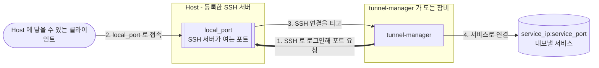

# Tunnel Manager

[English](../README.md) · [日本語](README.ja.md) · [中文](README.zh.md)

**Tunnel Manager 는 서비스에 닿지 못하는 장비에서 그 서비스를 쓸 수 있게 합니다.** SSH 로 그
장비들에 로그인해 포트를 하나씩 열게 하고, 그 포트로 들어온 것을 SSH 연결에 실어 서비스까지
날라 줍니다. 그다음에는 터널이 서 있도록 지킵니다. 끊어진 터널은 다시 만들고, 터널마다 지금
무엇을 하고 있는지는 브라우저 화면에 나옵니다.

파일 하나가 전부입니다. 데이터베이스는 프로세스가 스스로 만드는 SQLite 파일이고, 설정은 그
파일 안에 있으며 브라우저에서 고칩니다. UI 와 API 는 바이너리 안에 들어 있습니다. 옆에 따로
설치할 것도, 처음 띄우기 전에 정해 둘 것도 없습니다.



설치본은 세 가지로 이루어집니다. 앞의 둘은 직접 등록하고, 셋째는 그렇게 등록하는 동안
알아서 생깁니다. 터널이 세워지는 자리가 그 셋째입니다.

| 구성 요소 | 무엇인가 |
|-----------|----------|
| Host | 로그인할 SSH 서버. 주소, 포트, 사용자, 그리고 개인키나 비밀번호 |
| 서비스 포트 | 내보낼 서비스와, 그것을 나르는 Host 에 열 포트 |
| 할당 | 어느 Host 가 어느 서비스 포트를 나르는지. 활성 Host 의 할당 하나가 터널 하나 |

## 하는 일

- 할당마다 터널을 하나씩 만들고 지켜보다가, 연결이 끊기면 다시 만듭니다.
- 터널이 뜨면 포워딩된 포트에 직접 붙어 보고 닿았는지 알려줍니다. SSH 서버가 그 포트를 어느
  주소에 묶을지는 그 서버가 정하는 일이기 때문입니다.
- UI 와 API 를 HTTPS 로 제공합니다. 인증서는 첫 기동이 스스로 만들고, 내 인증서를 등록하면
  그때부터 그것으로 제공합니다.
- SSH 비밀번호와 개인키와 인증서의 키를 이 설치본의 키 파일로 암호화해 둡니다.
- 설정 전체를 암호화된 파일 하나에 담아 다른 설치본으로 옮깁니다.
- Linux, macOS, Windows 에서 단일 바이너리로 돕니다. C 라이브러리도, 따로 세울 데이터베이스
  서버도 필요 없습니다.

## 빨리 시작하기

[릴리즈 페이지](https://github.com/jollaman999/tunnel-manager/releases)에서 플랫폼에 맞는
바이너리를 내려받아 실행 권한을 주고 띄웁니다.

```bash
chmod +x tunnel-manager-linux-amd64
./tunnel-manager-linux-amd64
```

첫 기동이 데이터베이스와 계정과 인증서를 만들고, 그 계정의 비밀번호가 어디에 있는지를 찍어
줍니다.

```text
created the account with an initial password. Read the password from the file, log in with it,
and set a username and a password  {"initial_password_file": "<dir>/initial-password"}
```

```bash
cat <dir>/initial-password
```

브라우저로 `https://127.0.0.1:8888/` 를 엽니다. 인증서는 이 설치본이 스스로에게 발급한 것이라
브라우저가 경고합니다. 그 경고와 맞춰 볼 지문은 기동 로그와 Settings 화면에 있습니다.

**사용자명을 비운 채로** 그 파일의 비밀번호로 로그인하고, 계정이 계속 쓸 사용자명과 비밀번호를
정하면 그 파일은 지워집니다. 그다음에 각자의 화면에서 Host 와 서비스 포트를 추가합니다.
터널마다 무슨 일이 일어나고 있는지는 Status 화면이 말해 줍니다.

`-db` 로 파일을 지정하지 않으면 데이터베이스는 그 플랫폼이 사용자 데이터를 두는 자리에
생깁니다. Docker Compose 와 systemd 유닛과 소스 빌드는 아래 레퍼런스에 있습니다.

## 어디서 더 읽나

[docs/reference.ko.md](reference.ko.md) 에 전부 있습니다.

| 절 | 무엇이 들어 있나 |
|----|------------------|
| [동작 방식](reference.ko.md#동작-방식) | 조정 루프, 할당, 터널 하나가 끝에서 끝까지 도는 모습 |
| [설치 및 실행](reference.ko.md#설치-및-실행) | 플래그, 파일이 어디에 생기는지, Docker Compose, systemd, 소스 빌드 |
| [HTTPS 와 인증서](reference.ko.md#https-와-인증서) | 브라우저 경고, 내 인증서 등록, 갱신, HTTPS 끄기 |
| [첫 기동과 계정 설정](reference.ko.md#첫-기동과-계정-설정) | 임시 비밀번호, 계정 설정, 자격증명 바꾸기 |
| [내장 UI](reference.ko.md#내장-ui) | 화면마다 무엇을 보여주고 무엇을 하는지 |
| [설정](reference.ko.md#설정) | 설정 항목 전부와 언제 반영되는지, 서버가 안 뜰 때 빠져나오는 길 |
| [API 엔드포인트](reference.ko.md#api-엔드포인트) | 호출 전부와, 스크립트에 필요한 로그인과 CSRF 토큰 |
| [터널 상태 읽기](reference.ko.md#터널-상태-읽기) | 숫자 셋, 상태 값의 뜻, 포워딩된 포트에 닿았는지 |
| [암호화 키](reference.ko.md#암호화-키) | 무엇이 그 키로 봉해지고, 잃어버리면 무엇을 잃는지 |
| [비root로 실행하는 경우](reference.ko.md#비root로-실행하는-경우) | 파일 디스크립터 한도, 포트, 파일 소유권 |

UI 안의 매뉴얼은 그 문서의 앞부분과 같은 내용을 말합니다. 탭으로 따로 있고, 아직 로그인하지
못한 사람을 위해 로그인 화면에서도 패널로 열립니다.

## 라이선스

MIT License. [LICENSE](../LICENSE) 를 보십시오.
