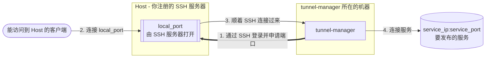

# Tunnel Manager

[English](../README.md) · [한국어](README.ko.md) · [日本語](README.ja.md)

**Tunnel Manager 把一个服务发布到本来访问不到它的机器上。** 它通过 SSH 登录这些机器，让每台
机器各开一个端口，再把送进那个端口的流量顺着 SSH 连接带回服务这边。之后它一直盯着这些隧道：断了的会
重新建起来，每条隧道正在做什么都摆在浏览器的页面上。

一套安装就是一个文件。数据库是它自己创建的 SQLite 文件，设置存在这个文件里、在浏览器里改，
界面和 API 都编译进了可执行文件。旁边不用另外装什么，第一次启动前也没有什么要先配好。



一套安装由三样东西组成。前两样由你注册，第三样在你注册时自动生成，隧道就是从它建起来的。

| 组成 | 是什么 |
|------|--------|
| Host | 要登录的 SSH 服务器：地址、端口、用户，以及私钥或密码 |
| 服务端口 | 要发布的服务，以及要在承载它的每台 Host 上打开的端口 |
| 分配关系 | 哪台 Host 承载哪个服务端口。一条分配关系，只要它的 Host 是启用的，就是一条隧道 |

## 它做什么

- 为每条分配关系建一条隧道，盯着它，连接断了就再建一次。
- 隧道起来之后自己去连那个转发端口，报告能不能连上。监听绑在哪个地址，是 SSH 服务器自己决定的。
- 用 HTTPS 提供界面和 API。证书在第一次启动时自己签一张，你注册了自己的就换成你的。
- 把 SSH 密码、私钥和证书私钥都用本安装的密钥文件加密保存。
- 把整套配置封进一个文件，带到另一套安装上。
- 在 Linux、macOS 和 Windows 上都是单个可执行文件，不依赖 C 库，背后也不用数据库服务器。

## 快速开始

到[发布页面](https://github.com/jollaman999/tunnel-manager/releases)下载对应平台的可执行
文件，加上执行权限再启动。

```bash
chmod +x tunnel-manager-linux-amd64
./tunnel-manager-linux-amd64
```

第一次启动会创建数据库、账号和证书，并告诉你这个账号的密码写在哪里：

```text
created the account with an initial password. Read the password from the file, log in with it,
and set a username and a password  {"initial_password_file": "<dir>/initial-password"}
```

```bash
cat <dir>/initial-password
```

在浏览器里打开 `https://127.0.0.1:8888/`。证书是本安装给自己签的，所以浏览器会警告；核对这个
警告要用的指纹在启动日志里，登录之后也在 Settings 页面上。

**用户名留空**，用那个文件里的密码登录，然后定下这个账号今后用的用户名和密码，初始化完成时
那个文件就被删掉了。接着在各自的页面上添加 Host 和服务端口。Status 页面会说每条隧道在做什么。

没有用 `-db` 指定文件的话，数据库放在所在平台的用户数据目录下。Docker Compose、systemd unit
和从源码构建都写在下面的参考手册里。

## 更多内容在哪里

[docs/reference.zh.md](reference.zh.md) 是全部内容。

| 章节 | 里面写了什么 |
|------|--------------|
| [工作原理](reference.zh.md#工作原理) | 调谐循环、分配关系，以及一条隧道从头到尾是怎么走的 |
| [安装与运行](reference.zh.md#安装与运行) | 命令行参数、文件放在哪里、Docker Compose、systemd、从源码构建 |
| [HTTPS 与证书](reference.zh.md#https-与证书) | 浏览器的警告、注册你自己的证书、更换证书、关掉 HTTPS |
| [首次启动与账号](reference.zh.md#首次启动与账号) | 初始密码、初始化，以及之后怎么改凭据 |
| [内置界面](reference.zh.md#内置界面) | 每个页面显示什么、能做什么 |
| [设置](reference.zh.md#设置) | 每一项设置、它什么时候生效，以及服务起不来时的退路 |
| [API 接口](reference.zh.md#api-接口) | 每个调用，连同脚本需要的登录和 CSRF 令牌 |
| [读懂隧道状态](reference.zh.md#读懂隧道状态) | 三个计数、每种状态是什么意思，以及转发端口到底连没连上 |
| [加密密钥](reference.zh.md#加密密钥) | 它封住了什么，弄丢了要付出什么代价 |
| [以非 root 用户运行](reference.zh.md#以非-root-用户运行) | 文件描述符上限、端口、文件的归属 |

界面里自带的手册讲的和这份文件前几章一样。它自己占一个标签页；还登不进去的人，也能从登录页面上
把它当作面板打开。

## 许可证

MIT License。见 [LICENSE](../LICENSE)。
