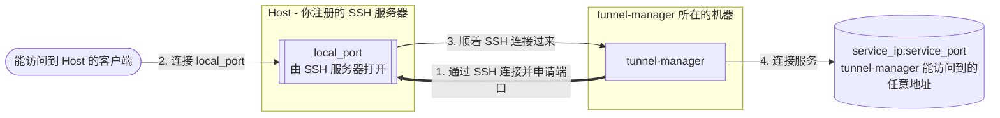

# Tunnel Manager

[English](../README.md) · [한국어](README.ko.md) · [日本語](README.ja.md)

**Tunnel Manager 把一个服务发布到本来没有路由能到达它的机器上。** 它通过 SSH 连接这些机器，
让每台机器各打开一个本地端口，再把到达本地端口的流量通过 SSH 连接转发回服务。之后它持续维护
这些隧道：断开的会重新建立，浏览器里的页面显示每条隧道正在做什么。

一套安装就是一个文件。数据库是它自己创建的 SQLite 文件，设置存在这个 SQLite 文件里、
在浏览器里改，界面和 API 都编译进了可执行文件。旁边不需要安装其他组件，第一次启动前也没有
什么需要配置。



一套安装由三样东西组成。你注册 Host 和服务端口，两者之间的分配关系会自动生成（除非你另行
指定），一条隧道就是根据一条分配关系建立的。

| 组成 | 是什么 |
|------|--------|
| Host | 要连接的 SSH 服务器：地址、端口、用户，以及私钥或密码 |
| 服务端口 | 要发布的服务，可以在本机能访问到的任意地址上，以及要在负责这个服务的每台 Host 上打开的端口 |
| 分配关系 | 哪台 Host 负责哪个服务端口。一条分配关系，只要它的 Host 是启用的，就是一条隧道 |

## 它做什么

- 为每条分配关系建立一条隧道，持续监控，连接断开就重新建立。
- 隧道建立后自行连接转发端口，报告是否可达。监听绑定哪个地址，由 SSH 服务器自己决定。
- 通过 HTTPS 提供界面和 API。证书在第一次启动时自签一张，你注册了自己的证书后就使用你的。
- 把 SSH 密码、私钥和证书私钥都用本安装的密钥文件加密保存。
- 把整套配置加密成一个文件，迁移到另一套安装。
- 页面有十三种语言，在浏览器角落选择，或者为本安装设置一个默认语言。日志文件还是英文。
- 在 Linux、macOS 和 Windows 上都是单个可执行文件，不依赖 C 库，也不需要数据库服务器。

## 快速开始

到[发布页面](https://github.com/jollaman999/tunnel-manager/releases)下载对应平台的可执行
文件，加上执行权限再启动。

```bash
chmod +x tunnel-manager-linux-amd64
./tunnel-manager-linux-amd64
```

第一次启动会创建数据库、账号和证书，并告诉你这个账号的密码写在哪里：

```text
created the account with an initial password. Read the password from the file, log in with it,
and set a username and a password. The file is written with permission 0600 and holds the only
copy of the password  {"log_id": "account.created_with_initial_password",
"initial_password_file": "<dir>/initial-password"}
```

```bash
cat <dir>/initial-password
```

在浏览器里打开 `https://127.0.0.1:8888/`。证书是本安装自签的，所以浏览器会警告；核对这个
警告要用的指纹在启动日志里，登录之后也在 Settings 页面上。

**用户名留空**，用初始密码文件里的密码登录，然后设置这个账号今后使用的用户名和密码，
初始化完成时初始密码文件会被删除。接着在各自的页面上添加 Host 和服务端口。Status 页面显示
每条隧道的状态。

没有用 `-db` 指定文件的话，数据库放在所在平台的用户数据目录下。Docker Compose、systemd unit
和从源码构建都写在下面的参考手册里。

## 作为服务安装

`-install` 把这个程序装成机器上的服务：把可执行文件放到位，建出数据目录，向 systemd、launchd
或 Windows 服务控制管理器注册服务并启动它。此后它随开机启动，退出了也会自己再起来。

```bash
sudo ./tunnel-manager-linux-amd64 -install
```

在 Windows 上，用**以管理员身份运行**打开的 PowerShell 或命令提示符执行同一条命令：

```powershell
.\tunnel-manager-windows-amd64.exe -install
```

| 平台 | 可执行文件 | 数据 |
|------|------------|------|
| Linux | `/usr/local/bin/tunnel-manager` | `/var/lib/tunnel-manager/` |
| macOS | `/usr/local/bin/tunnel-manager` | `/Library/Application Support/tunnel-manager/` |
| Windows | `C:\Program Files\tunnel-manager\tunnel-manager.exe` | `C:\ProgramData\tunnel-manager\` |

**装上去的是最新的发布版本**，从 GitHub 下载；这个发布版本带 `SHA256SUMS` 的话，下载下来的
文件会拿里面的校验和核对。连不上发布页面也不算失败：那时改装当前运行的这个文件，报告里会说
装上的是哪一个。

`sudo tunnel-manager -uninstall` 把它撤掉：停掉服务，删掉注册，删掉装上去的可执行文件。
**数据保留**，报告里会说留在哪里。要把数据目录也删掉就加 `-purge`，`-purge` 删掉的东西拿不
回来。

## 更多内容在哪里

[docs/reference.zh.md](reference.zh.md) 是全部内容。

| 章节 | 里面写了什么 |
|------|--------------|
| [工作原理](reference.zh.md#工作原理) | 调谐循环、分配关系，以及一条隧道的完整流程 |
| [安装与运行](reference.zh.md#安装与运行) | 命令行参数、文件放在哪里、Docker Compose、systemd、从源码构建 |
| [作为服务安装](reference.zh.md#作为服务安装) | 四个参数、已经装过一遍时会怎样、卸载从哪里读出路径 |
| [HTTPS 与证书](reference.zh.md#https-与证书) | 浏览器的警告、注册你自己的证书、更换证书、关闭 HTTPS |
| [首次启动与账号](reference.zh.md#首次启动与账号) | 初始密码、初始化，以及之后怎么改凭据 |
| [内置界面](reference.zh.md#内置界面) | 每个页面显示什么、能做什么，以及有哪些语言 |
| [设置](reference.zh.md#设置) | 每一项设置、它什么时候生效，以及服务无法启动时的恢复办法 |
| [API 接口](reference.zh.md#api-接口) | 每个调用，连同脚本需要的登录和 CSRF 令牌 |
| [读懂隧道状态](reference.zh.md#读懂隧道状态) | 三个计数、每种状态的含义，以及转发端口是否可达 |
| [加密密钥](reference.zh.md#加密密钥) | 它加密了什么，丢失后会怎样 |
| [以非 root 用户运行](reference.zh.md#以非-root-用户运行) | 文件描述符上限、端口、文件的归属 |

界面里自带的手册讲的和这份文件前几章一样。手册自己占一个标签页；尚未登录的人也能从登录页面把它
作为面板打开。

## 许可证

MIT License。见 [LICENSE](../LICENSE)。
