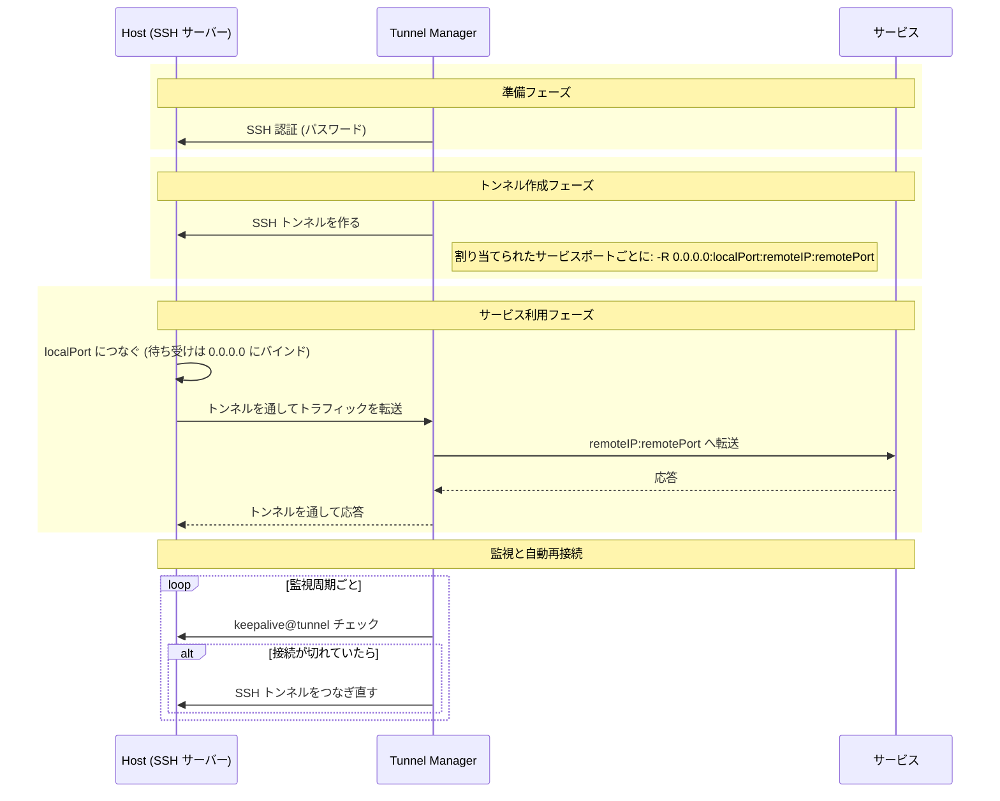

# Tunnel Manager リファレンス

[README に戻る](README.ja.md)

この文書にすべてが入っています。インストール、設定、API、そして画面の動きです。短い版は
[README](README.ja.md) です。

Tunnel Manager は SSH トンネルを開き、開いたままに保ちます。ログインする SSH サーバー
(**Host**) と、公開するサービス (**サービスポート**) を登録し、どの Host がどのサービス
ポートを担当するかを決めておくと、割り当て 1 つにつきトンネルを 1 本作り、そこから先はずっと
見張ります。REST API も、ブラウザ UI も、トンネルそのものも、1 つのバイナリが受け持ちます。

ここで作るトンネルは **リバース (reverse)** トンネルです。つまり待ち受けソケットは、
Tunnel Manager が動くマシンではなく Host の側に開きます。**Host の** `local_port` に
つないだクライアントは SSH 接続を通って Tunnel Manager まで運ばれ、Tunnel Manager が
`service_ip:service_port` につないで、バイトを両方向にコピーします。Tunnel Manager しか
届かないサービスを Host から使えるようにするのが、この仕組みです。

| 登録するもの | 項目 | 何か |
|--------------|------|------|
| Host | `ip`, `port`, `user`, `private_key`, `key_passphrase`, `password`, `description`, `enabled` | Tunnel Manager がログインする SSH サーバーです。秘密鍵でも、パスワードでも、その両方でもログインできますが、どちらか一方は必ず要ります。鍵も、そのパスフレーズも、パスワードも、すべて暗号化して保存します。 |
| サービスポート | `service_ip`, `service_port`, `local_port` | 公開したいサービスと、それを担当するすべての Host の上に開くポートです。 |
| 割り当て | `host_id`, `sp_id` | Host 1 つとサービスポート 1 つの組で、この Host がそれを担当するという意味です。トンネルはここから作られ、Host やサービスポートを登録したときに自動で作られます。 |

`ip` も `service_ip` も IPv4 と IPv6 の両方を受け取ります。IPv6 アドレスは `2001:db8::1`
のようにそのまま書き、接続のときに要る角かっこは、アドレスを使う側で付けます。
`fe80::1%eth0` のようなゾーン付きは受け付けません。

**Host が有効になっている割り当て 1 つが、トンネル 1 本です。** サービスポートを 3 つ担当する
Host はトンネルを 3 本動かし、1 つも担当していない Host は、サービスポートがいくつ保存されて
いてもトンネルを 1 本も動かしません。Host を登録すると、そのときあるサービスポートがすべて
その Host に割り当てられ、サービスポートを登録すると、そのときあるすべての Host に割り当て
られます。リクエストで別の指示をしない限りはそうなので、割り当てに一度も触らないインストール
は、これまでどおりすべての組み合わせを動かします。そのあと Host が何を担当するかは、Hosts
画面のその行にある **Service ports** ボタンと
[Host が持つサービスポート](#host-が持つサービスポート)から変えます。

**Host へのログインは、鍵か、パスワードか、その両方で行います。** `private_key` には PEM 形式
の秘密鍵ファイルの中身をそのまま送り、鍵がパスフレーズで守られているときは `key_passphrase`
を添えます。鍵は登録の時点で読まれるので、鍵ではないファイル、パスフレーズが要るのに渡されな
かった鍵、鍵を開けないパスフレーズは、次の接続のときではなくその場で拒否されます。両方が登録
されているときは鍵を先に試し、それで入れなかったときにパスワードを使います。ですからトンネルが動いている
Host に鍵を足しても、そのトンネルが落ちることはありません。トンネルが上がっている間に登録した
鍵は、次に接続するときから使われます。

鍵も、そのパスフレーズも、パスワードも、二度とプロセスの外には出ません。どの応答にも載らず、
編集のために開いた Host はその欄が空で戻ってきます。空のままにすれば保存されている値はその
ままで、鍵を送ると保存されている鍵とパスフレーズがまとめて置き換わります。

**バイナリのほかにインストールするものはありません。** データベースはプロセスが自分で作る
SQLite ファイル、設定はそのファイルの中にあってブラウザの画面から変更でき、UI は実行ファイル
に組み込まれています。データベースサーバーも、設定ファイルも、一緒に持ち歩くディレクトリも
ありません。

## 目次

- [動作要件](#動作要件)
- [動作の仕組み](#動作の仕組み)
- [インストールと起動](#インストールと起動)
- [HTTPS と証明書](#https-と証明書)
- [初回起動とアカウント](#初回起動とアカウント)
- [内蔵 UI](#内蔵-ui)
- [設定](#設定)
- [アンインストール](#アンインストール)
- [スクリプトから API を呼ぶ](#スクリプトから-api-を呼ぶ)
- [API エンドポイント](#api-エンドポイント)
- [トンネルの状態を読む](#トンネルの状態を読む)
- [暗号化キー](#暗号化キー)
- [非 root ユーザーで動かす](#非-root-ユーザーで動かす)
- [ライセンス](#ライセンス)

## 動作要件

リリースバイナリを動かすのに要るものはありません。SQLite エンジンも UI も、必要なものは
すべて中に入っています。

| したいこと | 要るもの |
|------------|----------|
| リリースバイナリを動かす | ほかには何も |
| ソースからビルドする | Go 1.23 以降 |
| コンテナを動かす | Docker と Docker Compose |

SQLite ドライバは純粋な Go 実装 (`modernc.org/sqlite` の上の `github.com/glebarez/sqlite`)
なので、バイナリは `CGO_ENABLED=0` でビルドしてあり、動かす先のマシンに C ライブラリは
要りません。

### 対応プラットフォーム

`make release` は下のそれぞれにバイナリを 1 つずつビルドします。Go が対応するほかの環境でも
`go build` は通りますが、下の注意があります。

| プラットフォーム | リリースバイナリ |
|------------------|------------------|
| Linux amd64 | `tunnel-manager-linux-amd64` |
| Linux arm64 | `tunnel-manager-linux-arm64` |
| macOS Intel | `tunnel-manager-darwin-amd64` |
| macOS Apple silicon | `tunnel-manager-darwin-arm64` |
| Windows amd64 | `tunnel-manager-windows-amd64.exe` |

Unix ではプロセスが起動時に、開けるファイルディスクリプタの上限を自分で引き上げます。
トンネル 1 本がそれをいくつも抱えるからです。Windows にはプロセスごとのそうした上限がない
ので、そこでは何もしません。違いはそれだけです。

同梱の systemd ユニットは Linux 用です。ほかのプラットフォームでは、その環境のやり方で
プロセスを動かし続ける必要があります。

実際に動かしてあるのは Linux のバイナリだけです。ほかはそれぞれのプラットフォーム向けの
コンパイラと vet が通ることを確かめてあるだけで、それ以上のことはしていません。

## 動作の仕組み

### 調整ループ

Tunnel Manager は、あるべき姿と今の姿を、たえず突き合わせています。

| 姿 | 何か | どこから来るか |
|----|------|----------------|
| あるべき姿 | 有効になっているすべての Host の上の、その Host に割り当てられたすべてのサービスポート | `hosts`, `service_ports`, `host_service_ports` の行 |
| 今の姿 | いま動いているトンネル | プロセスの中のマネージャと、それが書く `tunnels` の行 |

**調整パス (reconcile pass)** は 2 つを比べて差を埋めます。あるべきなのに動いていないものは
開始し、動いているのにもう要らないものは停止し、接続の設定 (サーバーのアドレス、リモート
アドレス、ローカルポート、ユーザー、パスワード) が行と合わなくなったトンネルは、止めてから
新しい設定で作り直します。

いま API リクエストが通る道は次のとおりです。

```text
POST /api/service-port
  トランザクション { INSERT INTO service_ports } コミット
  調整ループを起こす
  201 Created          <- 応答はトンネルを待たない

調整ループ
  あるべき姿 = Host が有効になっている割り当て
  今の姿     = 動いているトンネル
  あるべきなのに動いていない   -> 開始する
  動いているのにもう要らない   -> 停止する
  動いているが設定が古い       -> 止めて作り直す
```

パスが走るのは 3 つの場面です。

| いつ | なぜ |
|------|------|
| 起動時、API が何かに応答するより前 | 最初のリクエストが尋ねてくる時点では、保存されている行のトンネルはもう上がっている |
| `POST`, `PUT`, `DELETE` がコミットされた直後 | 次の周期を待たずにその場で反映される |
| 調整周期ごと、既定では 5 秒 | 失敗したパスがやり残したことを、もう一度試す |

トンネルができる前に応答が返るので、**書き込みが成功してもトンネルが上がったという意味には
なりません。** それに答えるのは `GET /api/status` です。
[トンネルの状態を読む](#トンネルの状態を読む)を参照してください。

### 割り当て

**トンネルは割り当てを表すもので、それ以外の何物でもありません。** `host_service_ports`
テーブルは Host とサービスポートの組 1 つにつき 1 行を持ち、その組が行のすべてです。
ですから同じ割り当てを二度持つことは、データベース自身が拒みます。

| 何が起きたか | 割り当てはどうなるか |
|--------------|----------------------|
| Host を登録した | その時点で保存されているサービスポートがすべて与えられます。リクエストが `assign_all_service_ports` を false で送った場合は別です |
| サービスポートを登録した | その時点で保存されているすべての Host に与えられます。リクエストが `assign_to_all_hosts` を false で送った場合は別です |
| Host を無効にした | 割り当てはそのまま残ります。そのトンネルは止まり、また有効にすれば戻ってきます |
| Host かサービスポートを削除した | それを指す割り当ても同じトランザクションで消えます |
| このテーブルを追加したバージョンに上げてからの最初の起動 | すべての Host にすべてのサービスポートが与えられます |

最後の行はアップグレードのためにあります。テーブルができる前は、すべての Host がすべての
サービスポートを担当するのが調整ループの前提で、どこにも保存されていませんでした。新しい
テーブルが空のまま起動すると、それは「どの Host も何も担当していない」と読めてしまい、
すべてのトンネルが落ちます。埋めるのはテーブルを作るその起動のときだけで、ほかの起動では
何もしません。あとの起動でも埋めてしまうと、せっかく外した割り当てが戻ってきてしまい、
それではテーブルを置いた意味がなくなるからです。

存在しない Host やサービスポートを指す割り当ては何も作らず、調整パスはそれを読み飛ばします。
そこから作れるものは何もありません。アドレスもポートも認証情報も、消えてしまった行の上に
あるからです。

### トンネル 1 本の動き



Host 側の待ち受けが本当に `0.0.0.0` に開くかどうかは、Host の SSH サーバー次第です。その
`GatewayPorts` が切ってあると、どのアドレスを頼んでも待ち受けはループバックにバインドされ、
そのことがログに出ます。トンネルが上がったあとは tunnel-manager が自分でその転送ポートに
つないでみて、結果を伝えます。[転送ポートに届くかどうか](#転送ポートに届くかどうか)を
参照してください。

監視周期と調整周期は別々の仕事です。監視は、すでに上がっているトンネルがまだ生きているかを
尋ね、死んでいればつなぎ直します。調整ループは、そもそも必要なトンネルが一式そろっているか
を見ます。

## インストールと起動

**インストールはファイル 1 つです。** リリースページから使っているプラットフォーム向けの
バイナリをダウンロードし、実行権限を付けて起動します。データベースファイルもアカウントも、
ほかに要るものもすべて、初回起動が作ります。

```bash
chmod +x tunnel-manager-linux-amd64
./tunnel-manager-linux-amd64
```

フラグはこれですべてです。

| フラグ | 何をするか |
|--------|------------|
| `-db <パス>` | データベースファイルです。設定も、登録した Host も、アカウントもこの中にあります。なければ上のディレクトリごと作ります |
| `-reset-settings` | 保存されている設定をすべて既定値に戻し、何を変えたかを出力して終了します。登録した Host、サービスポート、アカウント、証明書はそのままです。[サーバーが起動しないとき](#サーバーが起動しないとき)を参照してください |
| `-version` | バージョンを出力して終了します |
| `-help` | フラグを出力して終了します |

### ファイルが置かれる場所

**インストール一式はディレクトリ 1 つに収まります。** `-db` がデータベースファイルを指し、
このインストールを構成するそれ以外のものは、そのファイルがあるディレクトリの中に並びます。

```text
<データベースファイルがあるディレクトリ>/
    tunnel-manager.db          設定、Host、サービスポート、アカウント
    tunnel-manager.db-wal      SQLite が隣に置く write ahead log
    tunnel-manager.db-shm      SQLite が隣に置く共有メモリファイル
    initial-password           初回起動で書かれ、初期設定で削除される
    keys/tunnel-manager.key    SSH パスワードを暗号化するキー
    logs/tunnel-manager.log    ログファイルと、その隣のローテート済みファイル
```

キーファイルとログファイルはフラグではなく **設定** です。設定画面にあり、既定値は
`keys/tunnel-manager.key` と `logs/tunnel-manager.log` です。**設定に書いた相対パスは、
作業ディレクトリではなくデータベースファイルがあるディレクトリを基準に読まれます。**
作業ディレクトリは毎回同じとは限らないので、そこを基準にした相対の既定値では、ホストごとに
キーの置き場所がばらばらになってしまいます。絶対パスを書けばそのパスが優先されるので、
キーやログをインストールのディレクトリの外に置きたいときはそうします。

**プロセスを起動したディレクトリには何も作りません。**

データベースの行ではなくファイルとして残るのはログだけです。理由は 3 つあります。まず、
ロガーはデータベースを開く前に用意できていなければなりません。データベースを開く処理は最も失敗
しやすく、失敗の理由を言えるものが要るからです。次に、コネクションプールは接続を 1 つしか
持たないので、ログの 1 行ごとに、プロセスが本来こなすべきクエリの後ろへ並ぶことになります。
そして、データベース自身が実行した文をそのロガーに報告するので、ログを 1 行書くことがログを
1 行書くクエリになってしまいます。

`-db` を省くと、そのプラットフォームがユーザーデータを置く場所から割り出します。

| 起動のしかた | `-db` | インストールが置かれるディレクトリ |
|--------------|-------|------------------------------------|
| フラグなし、Windows | 指定しない | `%AppData%\tunnel-manager\` |
| フラグなし、macOS | 指定しない | `~/Library/Application Support/tunnel-manager/` |
| フラグなし、Linux | 指定しない | `$XDG_CONFIG_HOME/tunnel-manager/`。この変数がなければ `~/.config/tunnel-manager/` |
| 同梱の systemd ユニット | `/var/lib/tunnel-manager/tunnel-manager.db` | `/var/lib/tunnel-manager/` |
| Docker Compose | `/data/tunnel-manager.db` | `/data/`。compose ファイルがホストの `./_data` に結び付けます |

`$XDG_CONFIG_HOME` も `$HOME` もないマシンにはその場所がないので、起動は置き場所を
勝手にこしらえたりはせず、そのことを伝えます。

```text
Failed to work out where the database file goes: no default location for the database file
is available: neither $XDG_CONFIG_HOME nor $HOME are defined. Give -db an absolute path
```

起動時には、開いたデータベースファイルとキーファイルとログファイルの絶対パスがログに出ます。
どのファイルを使っているかは、いつでもログを見ればわかります。

### Docker Compose で動かす

```bash
git clone https://github.com/jollaman999/tunnel-manager.git
cd tunnel-manager
docker-compose up -d
```

イメージはバイナリを `-db /data/tunnel-manager.db` で起動し、compose ファイルが `/data` を
ホストの `./_data` に結び付けます。コンテナを入れ替えてもデータベースとキーとログが残るのは
そのためです。

初期パスワードのファイルもそのディレクトリの中に書かれるので、ホストからも読めます。

```bash
docker compose exec tunnel-manager cat /data/initial-password
```

### systemd サービスとして動かす

`_scripts/systemd/tunnel-manager.service` は、バイナリを絶対パスの `-db` 付きで起動します。

```ini
ExecStart=/usr/local/bin/tunnel-manager -db /var/lib/tunnel-manager/tunnel-manager.db
StateDirectory=tunnel-manager
```

`StateDirectory=tunnel-manager` が `/var/lib/tunnel-manager` を作り、`User=` のアカウントに
渡します。データベースもキーもログも初期パスワードも、すべてこの中に収まります。ユニットは
`User=root` で配布しています。変えたいときは
[非 root ユーザーで動かす](#非-root-ユーザーで動かす)を参照してください。

### ソースからビルドする

```bash
git clone https://github.com/jollaman999/tunnel-manager.git
cd tunnel-manager
make
./tunnel-manager
```

`make` はバイナリを `CGO_ENABLED=0` でビルドします。`make release` は上の表のプラット
フォームすべてに 1 つずつビルドします。

## HTTPS と証明書

**API と UI は HTTPS で提供し、証明書はこのインストールが自分で作ります。** ブラウザで
`https://<アドレス>:<ポート>/` を開いてください。初回起動が証明書を生成してデータベース
ファイルに保存するので、前もって用意するものも、どこかに置くファイルもありません。

**ポートは 1 つのままです。** そのポートに平文で届いたリクエストには、同じアドレスの
`https` 版への `307` リダイレクトを返します。`http://` のままのブックマークやスクリプトも、
行きたかった場所にたどり着きます。`307` はメソッドとボディを保ちます。`301` や `302` は
それを `GET` に変えてしまいます。平文で届いたリクエストのボディは決して読みません。書かれた
ままの姿で回線に乗っているので、クライアントが TLS の上で送り直します。ファイアウォールに
新しく開けるものもありません。

| 生成される証明書 | |
|------------------|--|
| 作られるとき | 初回起動のとき。保存されたものが読めないか期限切れのときも作り直します |
| 鍵 | P-256 曲線の ECDSA |
| 有効期間 | 5 年 |
| 宛先 | `localhost`, `127.0.0.1`, `::1`, マシンのホスト名、各インターフェースのアドレス |
| 保存先 | データベースファイルの中、設定の隣です。秘密鍵は SSH パスワードと同じキーで暗号化するので、データベースファイルのコピーだけでは持ち出せません |
| 署名者 | 自分自身 |

起動時に指紋がログに書かれます。証明書が対象とする名前と、期限が切れる日も一緒に出ます。

### ブラウザの警告

**この証明書には誰の署名もないので、ブラウザは警告を出し、スクリプトは受け取りを拒みます。**
認証局が発行していない証明書とはそういうものです。どの設定を変えても、警告がひとりでに消える
ことはありません。

その警告と突き合わせる値打ちがあるのは指紋です。指紋は起動ログにあり、ログインしたあとは設定
画面にもあります。書き方は `openssl x509 -fingerprint -sha256` と同じで、32 バイトを大文字の
16 進でコロン区切りにしたものです。ブラウザの証明書ビューアが見せる値と突き合わせてください。
同じ指紋ならその接続先はこのサーバーで、違う指紋なら何か別のものが代わりに答えています。

```bash
openssl s_client -connect 127.0.0.1:8888 </dev/null 2>/dev/null \
  | openssl x509 -noout -fingerprint -sha256
```

警告をクリックで通り抜けるのではなく消したいなら、その証明書をブラウザを動かすマシンの信頼
ストアに入れてください。そのために設定画面が PEM 形式で表示します。ハンドシェイクのたびに
サーバーがクライアントへ渡すのと同じバイト列です。もう 1 つの道は、自分の証明書を登録する
ことです。

`curl` はこの証明書を終了コード `60` で拒みます。`--cacert <ファイル>` で証明書の場所を教える
か、`-k` で検査を飛ばしてください。[スクリプトから API を呼ぶ](#スクリプトから-api-を呼ぶ)の
例では代わりに `CURL_CA_BUNDLE` を一度だけ設定していて、そのシェルの `curl` はすべてそれを
読みます。

### 自分の証明書を登録する

**設定画面には証明書とその秘密鍵の 2 つの欄があり、どちらも PEM 形式です。** 発行されたものを
貼り付けて Register certificate を押してください。次の接続から使われ、プロセスの再起動は
ありません。スクリプトからなら `PUT /api/certificate` が同じことをします。

発行元から中間証明書を渡されたときは、同じ欄の、サーバー証明書の下に、渡された順で貼り付けて
ください。サーバー証明書が先という順序は TLS 自身が求めるもので、チェーンはまとめて保存され、
まとめて提供されます。

秘密鍵は、生成したもののときと同じように暗号化して保存します。画面に表示することも、送り返す
こともありません。

貼り付けられたものは保存する前に読むので、間違いはサーバーが答えを返して知らせます。

| 貼り付けたもの | どうなるか |
|----------------|------------|
| PEM ブロックが 1 つもないテキスト | 拒否します。2 つの欄のどちらをそう読んだかを言います |
| 2 つの欄が逆 | 拒否し、そう見えるということを言います |
| パスフレーズで守られた秘密鍵 | 拒否し、パスフレーズを外す `openssl pkey` の 1 行を添えます |
| 別の証明書の秘密鍵 | 拒否します |
| 期限の切れた証明書 | 拒否します。誰も接続できないからです |
| 拡張鍵用途に `serverAuth` がない証明書 | 拒否します。サーバーからそうした証明書を受け取ったクライアントはすべて拒むので、直すための画面すら残らなくなります |
| 有効期間がまだ始まっていない証明書 | **保存します。** いつから使えるかを警告で添えます。時計が数分ずれていることはよくあり、拒否するとそうした証明書をそもそも入れられなくなるからです |

拒否したときは何も保存しないので、提供中のものはそれまでのままです。

### 証明書を更新する

設定画面の **Make a new certificate** は、使用中の証明書を別の自己署名証明書に入れ替えます。
初回起動が行うのと同じ生成なので、新しい証明書は、このマシンが **いま** 応答する名前と
アドレスに宛てて作られます。アドレスが変わったマシンに必要なのはこれです。スクリプトから
なら `POST /api/certificate/renew` が同じことをします。

**再起動はありません。** 証明書はハンドシェイクごとに選ばれるので、次の接続から新しいものが
使われます。指紋が変わったことから、2 つのことが続きます。

- ボタンを押したそのページは、まだ古い証明書で提供されています。すでに開いている接続は、
  開いたときの証明書を持ち続けます。新しいものを見るにはページを読み込み直してください。
- 古い証明書を信頼するように設定したブラウザとスクリプトは、新しい指紋も信頼するまで、
  もう一度警告を出します。

入れ替えは古い指紋と新しい指紋の両方をログに書きます。このインストールが変えた指紋なのか、
そうでないのかを見分けられるようにするためです。

### HTTPS を切る

設定画面の **Serve over HTTPS**、API では `api_https_enabled` がそれを決めます。ほかの設定と
同じく、次の起動から効きます。

切ると、そのポートは HTTP しか話しません。証明書もリダイレクトもなく、画面が送るものはすべて
書かれたままの姿で流れます。このアカウントのパスワードも、Host の SSH パスワードもその中に
あります。証明書に関する 3 つの呼び出しは、切っている間は `409` を返します。読んだり入れ替え
たりする対象の証明書が、そもそも使われていないからです。

証明書はデータベースに残ります。HTTPS を入れ直せば、そこにあったものが同じ指紋のまま提供
されます。

切れるようにしてあるのは、誰も署名していない証明書が邪魔になる場所があるからです。画面に
たどり着けない運用担当者は、その画面から何も直せません。

## 初回起動とアカウント

**API も UI も、ログインを通らないと使えません。** アカウントは 1 つだけで、初回起動の
ときに作られます。初回起動の前にこの節を読んでください。読まないとログインできません。

1. 初回起動が `user` テーブルの唯一の行を作ります。**ユーザー名はまだなく**、初期設定が必要
   という印が付いています。
2. 初期パスワードは、**データベースファイルがあるディレクトリ** の `initial-password` という
   ファイルに、パーミッション `0600` で書かれます。大文字と数字で 52 文字です。
3. **ログに載るのはそのパスまでで、パスワードは決して載りません。** ログはコンソールにも出る
   うえ、保存されローテートされるファイルにも残るので、そこに書かれたパスワードは初期設定が
   終わったあとも、誰も見ていない場所にいつまでも残ります。そのファイルが唯一の写しです。
4. そのパスワードでログインします。この時点ではユーザー名は読み飛ばされるので、空で送って
   ください。応答は `"setup_required": true` を返し、UI は初期設定画面に移ります。そこで
   アカウントが持つユーザー名とパスワードを決めます。
5. **初期設定は初期パスワードのファイルを削除します。** その瞬間からファイルのパスワードでは
   アカウントが開かなくなるので、残しておいても、死んだ認証情報を読める形で置いておくだけに
   なります。初期パスワードで開かれたほかのセッションも同時に切られます。初期設定を行って
   いるセッションだけは残ります。
6. **初期設定が終わるまで、セッションが呼べるのは `POST /api/setup` だけです。** `/api` の
   下のほかのパスはすべて `403` と `The account setup is not finished` を返します。

初期設定で決めるパスワードの長さは **12 バイト以上 72 バイト以下** です。文字数ではなく
バイト数で、ハングル 1 文字は 3 バイト、日本語のかな漢字も 1 文字 3 バイトです。上限が 72 な
のは、パスワードをハッシュする bcrypt がそこまでしか読まないからで、そこから先はログインの
照合に入りません。長すぎるパスワードは、黙って切り詰めずに拒否します。

初期設定が走るのは **一度だけ** です。現在のパスワードを尋ねないので、あとから認証情報を
変える手段にはなりません。二度目の呼び出しには `409` を返します。

セッションは、それを使った最後のリクエストから 12 時間生きます。リクエストのたびに期限は
先に延びます。セッションはメモリの中にあるので、再起動するとすべて切れ、ログインし直しに
なります。

### ユーザー名とパスワードを変更する

設定画面で両方とも変えられます。スクリプトからなら `PUT /api/account` が同じことをします。
現在のパスワードと一緒に、変えるほうを送ってください。`username`、`new_password`、あるいは
その両方です。送らなかった値はそのまま残り、どちらも送らないリクエストは拒否します。すでに
アカウントが持っている値を送った場合も同じです。新しいパスワードも、初期設定と同じ 12 バイト
以上 72 バイト以下です。

**現在のパスワードは毎回必要です。** 名前を変えるだけの変更でもです。本人が変えようと
しているのか、人のいない画面に開きっぱなしのセッションが変えようとしているのかを、そこで
見分けるからです。初期設定を二度走らせない理由と同じです。

**このセッションを除いて、ほかのセッションはすべてサインアウトされます。** 2 つのうちどちらを
変えたときもそうで、名前の変更でもそうです。セッションはアカウントの名前ではなくアカウント
そのものを指しているので、名前の変更でセッションをそのままにすると、サインインに使う名前だけ
が変わって、すでにサインインしている人はそのまま残ることになります。認証情報を変える理由の
半分は、誰かがそれを知っているかもしれないということです。ですから規則は 1 つです。認証情報が
変わったのだから、それを変えたセッション以外はすべて消えます。変更を行ったセッションは、すでに
持っている CSRF トークンも含めてそのまま使えるので、それを求めた画面が結果を表示できます。
ほかに何台のクライアントがサインアウトされたかは、応答に載ります。

現在のパスワードが違えば `401` を返し、何も変えません。画面は新しいパスワードを 2 回尋ねます
が、2 つ目はブラウザの外には出ません。同じ文字列を 2 回渡されたところで、サーバーが 2 つ目から
知ることは何もないからです。

```bash
curl -s -b cookies.txt -X PUT "$BASE/api/account" \
  -H "X-CSRF-Token: $CSRF" -H 'Content-Type: application/json' \
  -d '{"current_password":"<the password now>","username":"operator"}'
```

```json
{
  "success": true,
  "data": {
    "username": "operator",
    "username_changed": true,
    "password_changed": false,
    "sessions_ended": 1
  }
}
```

## 内蔵 UI

ブラウザで `https://<アドレス>:<ポート>/` を開きます。`/` は `/ui/` へのリダイレクトを返し、
UI はそこから提供されます。最初の一度はブラウザが証明書について警告します。何と突き合わせれば
よいかは [HTTPS と証明書](#https-と証明書)にあります。

**UI のためにデプロイするものはありません。** ファイルはバイナリに組み込まれているので、
一緒に持ち歩くディレクトリも、設定するパスもありません。

| 画面 | パス | 何を見せ、何をするか |
|------|------|----------------------|
| Status | `/ui/status` | 3 つの数 (あるべき数、行の数、接続中の数) と、その差についての 1 文、そしてトンネル 1 本につき 1 行です。行には Host、サービスポート、状態、サーバー、ローカル、リモート、ポートに届いたか、再試行回数、最終接続時刻が並びます。何か問題があるトンネルは、その下に表の幅いっぱいの行で何が起きたかを載せ、転送ポートに届かなかったトンネルは、そこに、名前の挙がった SSH サーバーの何を変えればよいか、ほかに何を確かめればよいかを載せます。トンネルの行は 1 ページずつ、はじめは 1 ページ 10 行で届き、表の上でサイズとページを選べます。3 つの数はページではなく常にトンネル全体の数です。5 秒ごとに問い合わせ、読んでいたページのまま戻ってきます。 |
| Hosts | `/ui/hosts` | Host 1 つにつき 1 行で、ID、IP、ポート、ユーザー、説明、有効かどうか、更新日時が並びます。行は 1 ページずつ、はじめは 1 ページ 10 行で届き、表の上でサイズ (10, 20, 30, 50, 100) とページを選べます。選んだ値はこの画面のものとして覚えられ、いちばん小さいサイズの 1 ページに収まる短い一覧では、操作は何も出ません。Host の追加、編集、有効化と無効化、削除ができます。追加と編集のフォームには秘密鍵を貼り付ける欄、鍵ファイルをドロップする場所、パスフレーズ付きの鍵のための欄があり、追加のフォームには既定でオンの **Assign all service ports** のチェックがあって、その Host が最初に何を担当するかを決めます。行の **Service ports** を押すと、すべてのサービスポートの一覧がパネルで開き、この Host が担当しているものにチェックが付いています。保存では変更した分だけを送るので、そこで付けたチェックは、読んでいないページに影響しません。 |
| Service Ports | `/ui/service-ports` | サービスポート 1 つにつき 1 行で、ID、サービス IP、サービスポート、ローカルポート、説明、更新日時が並びます。行は Hosts と同じように 1 ページずつ届き、サイズとページはこの画面専用のものです。追加、編集、削除ができます。追加のフォームには既定でオンの **Assign to all hosts** のチェックがあり、最初にどの Host が担当するかを決めます。そのあとどの Host が担当するかは Hosts 画面から変えます。 |
| Logs | `/ui/logs` | ログファイルの末尾を、新しいものを下にして表示します。レベルの絞り込みと表示件数を選べます。5 秒ごとに問い合わせます。読むのはプロセスがいま書いているファイルで、ローテート済みのファイルは表示しません。行は画面の言語で表示され、ファイルのほうは英語のままです。[画面の言語](#画面の言語)を参照してください。 |
| Settings | `/ui/settings` | 保存してあるがまだ反映されていない設定と、それを反映させる再起動ボタンをそのカードに、保存されているすべての設定と保存で何が変わったか (言語を選んでいないブラウザにこのインストールをどの言語で見せるかもここにあります)、提供中の証明書と更新ボタンと自分の証明書を登録する欄、このアカウントのユーザー名とパスワード、トンネル設定とこのマネージャの設定をそれぞれ暗号化した 1 ファイルに書き出すエクスポートとそれを取り込むインポート、サービスを落として戻す再起動、そしていちばん下にアンインストールがあります。[設定](#設定)を参照してください。 |
| Manual | `/ui/manual` | インストールが何でできているかを、図と文で 1 画面にまとめたものです。これが何をするか、トンネル 1 本の最初から最後まで、Host とサービスポートとその間の割り当て、ポートに届かないとはどういうことか、2 つの周期、ファイルの置き場所が載っています。サーバーには何も問い合わせません。だからこそログイン画面でも同じものを見せられます。 |
| Login | `/ui/login` | セッションを持たないクライアントがたどり着く先です。初回のサインインではユーザー名を空のままにしてください。アカウントにまだユーザー名がなければ、初期設定画面へ進みます。**Manual** ボタンがマニュアルをその上のパネルとして開きます。セッションは要りません。マニュアルがいちばん要るのは、まだ何も動いていない状態だからです。 |

バイナリのバージョンは、ログイン画面も含めたすべての画面の右下にあります。

**画面にはライトテーマとダークテーマがあり**、切り替えはログイン画面も含めたすべての画面の
右上にあります。押すまではブラウザが決め、画面を開いたままブラウザをライトからダークに変えた
場合も、ページを読み込み直さずに追従します。押した結果はそのブラウザのローカルストレージに
`tm_theme` として残り、どこにも送られません。どちらのテーマで読むかは、その画面を見る人の
話であってインストールの設定ではなく、同じサーバーを読む 2 人が別々のものを好むことも
あるからです。

**画面は 13 の言語で表示できます。** 選ぶ場所は、ログイン画面も含めたすべての画面の右上、
テーマの切り替えの隣にある一覧です。一覧には各言語がその言語自身の名前で並びます。English、
한국어、日本語、中文、Español、Français、Deutsch、Português (Brasil)、Русский、العربية、
हिन्दी、Tiếng Việt、ไทย です。アラビア語は右から左へ書く言語なので、ページ全体がその向きに
なります。言語を選んでいないブラウザに何を見せるかはインストールの設定です。その設定と、
言語が決まる順序は[画面の言語](#画面の言語)にあります。

フォームは、何かを送る前に入力された内容を検査します。ポートは数字だけを受け取り、1 から
65535 の間でなければなりません。IP の欄はアドレスを組み立てる文字だけを受け取り、IPv4 か
IPv6 のアドレスとして読めなければなりません。おかしい点はその欄の隣に出て、直るまで何も
ブラウザの外には出ません。

**ドロップされた鍵ファイルはブラウザの中で読みます。** 送られるのは鍵のテキストで、貼り付けた
ときとまったく同じです。ファイルそのものはアップロードされません。秘密鍵としてはあり得ない
大きさのファイルや、ファイルでないものをドロップした場合は、ドロップ領域の下に 1 行出して
受け付けません。鍵は貼り付けでも構いません。別の端末の中にある鍵はそうしたいはずです。

UI のファイルはわざとセッションなしで提供しています。どのクライアントにも同じバイト列で、
データを何も持たないからです。画面が見せるものはすべて `/api/**` から取ってきていて、
ログインが守っているのはそちらです。

### 画面の言語

画面をどの言語で描くかは次の順で決まり、最初に見つかった答えが使われます。

1. **このブラウザの隅で選んだ言語。** テーマと同じように、そのブラウザのローカルストレージに
   `tm_lang` として残り、どこにも送られません。
2. **インストールに設定した言語。** 設定画面の `ui_default_language` です。何も選んでいない
   人全員に見せる言語で、セッションができてから読まれます。
3. **ブラウザが求める言語。** 13 の言語と突き合わせます。まずタグ全体で突き合わせるので、
   `pt-BR` に設定したブラウザにはブラジルポルトガル語のカタログが渡り、次に言語の部分だけで
   突き合わせるので、`pt-PT` に設定したブラウザにも英語ではなく同じカタログが渡ります。
4. 英語。

隅で選んだものが設定に勝つのは、そう作ってあるからです。設定は、何も言っていない人に
インストールが見せる言語であり、言語を選んだ人は、いま読んでいるまさにその画面で、もう
意思を示しています。

**ログイン画面は設定に従いません。** 設定を読むにはセッションが要り、ログイン画面には
セッションがないので、このブラウザで選んだ言語、選んでいなければブラウザが求める言語で
描きます。これは不具合ではなく、そういう作りです。ログインが通った瞬間にページを読み込み
直さなくても設定が効き、設定を保存した瞬間にもまた効きます。

コードは `en`、`ko`、`ja`、`zh`、`es`、`fr`、`de`、`pt-BR`、`ru`、`ar`、`hi`、`vi`、`th` で、
`ui_default_language` が受け取るのはこの値です。[設定](#設定)を参照してください。

**翻訳されるのは、画面が言うことすべてです。** サーバーの応答も含みます。拒否の応答には
`error_code` にコードが、`error_args` にその文に入る値が載ってきて、画面はそのコードの文を
自分の言語で描きます。`error` は今までどおり英語の文のままです。ログの行には `log_id` が
載ってきて、Logs 画面はその識別子の文を、その行のフィールドで埋めて描きます。**ログファイル
そのものは英語のままです。** `grep` を掛けるのも、問い合わせに添えるのもそのファイルで、
画面に合わせて言語が変わるファイルなら、最後に誰が何を選んだかで違う言語で書かれてしまい
ます。拒否の応答の形は[スクリプトから API を呼ぶ](#スクリプトから-api-を呼ぶ)に、ログの
行の形は[設定とアンインストール](#設定とアンインストール)にあります。

言語ごとにカタログが 1 つあり、バイナリの中から `/ui/lang/<code>.json` として提供されるので、
どこにもつながらないホストにインストールしても 13 の言語がすべてそろいます。どのカタログも
同じキーを持ち、画面が見せられる文 1 つにキー 1 つです。ある言語にまだ言葉のないキーは、
空欄にはせず英語で描きます。ページが取ってくるのは、使っている言語のカタログと英語の
カタログの 2 つだけです。

**言語を足す**には、カタログ 1 つとコードの一覧 4 つに手を入れます。テストがこの 5 つを
突き合わせるので、1 か所にだけ足して残りを忘れると、ページではなくビルドが失敗します。

| どこ | 何 |
|------|----|
| `internal/web/static/lang/<code>.json` | カタログ。`en.json` のキーをすべて持たせます |
| `internal/web/static/app.js` の `languages` | コード、その言語が自分を呼ぶ名前、右から左へ書くかどうか |
| `internal/web/static/index.html` の `codes` と `rightToLeft` | 同じ 2 つの一覧。`app.js` を取ってくる前に head で読みます |
| `internal/settings/settings.go` の `uiLanguages` | `ui_default_language` を検査する基準 |
| `internal/web/web_test.go` の `catalogCodes` | テストが残りの 4 つと突き合わせる一覧 |

**翻訳にまだできないこと。** 数を数える文の形が、1 と複数の 2 通りしかありません。英語は
そうですが、ロシア語やアラビア語はそうではないので、各カタログは 2 通りで済むように文を
選んであります。アラビア語では、`/` で始まるパスのそのスラッシュが、残りから離れて描かれる
ことがあります。左から右へ書く文字列を右から左へ進む行に置くときのブラウザの流儀で、パス
そのものは欠けていません。そして、どのカタログもまだネイティブの目を通っていないので、
読んでおかしい文があれば知らせてください。

## 設定

**設定ファイルはありません。** すべての設定はデータベースファイルの `settings` テーブルの
たった 1 行の列で、変更する場所は設定画面です。同じ値は `GET /api/settings` と
`PUT /api/settings` からも読み書きできます。

| 画面での名前 | API のフィールド | 報告名 | 既定値 | いつ効くか |
|--------------|------------------|--------|--------|------------|
| API port | `api_port` | `api.port` | `8888` | 次の起動から |
| Serve over HTTPS | `api_https_enabled` | `api.https_enabled` | `true` | 次の起動から |
| Monitoring interval (seconds) | `monitoring_interval_sec` | `monitoring.interval_sec` | `5` | 次の起動から |
| Reconcile interval (seconds) | `reconcile_interval_sec` | `reconcile.interval_sec` | `5` | 次の起動から |
| Encryption key file | `security_key_file` | `security.key_file` | `keys/tunnel-manager.key` | 次の起動から |
| Log level | `logging_level` | `logging.level` | `info` | **保存したその場で** |
| Log format | `logging_format` | `logging.format` | `json` | 次の起動から |
| Log file | `logging_file_path` | `logging.file.path` | `logs/tunnel-manager.log` | 次の起動から |
| Log size before it is rotated (MB) | `logging_file_max_size` | `logging.file.max_size` | `100` | 次の起動から |
| Rotated log files kept | `logging_file_max_backups` | `logging.file.max_backups` | `5` | 次の起動から |
| Days a rotated log file is kept | `logging_file_max_age` | `logging.file.max_age` | `30` | 次の起動から |
| Compress rotated log files | `logging_file_compress` | `logging.file.compress` | `true` | 次の起動から |
| Language this installation is shown in | `ui_default_language` | `ui.default_language` | 空。どの言語も指定しない | **保存したその場で** |

**保存したその場で効く設定は、ログレベルと言語の 2 つです。** ログレベルは起動時に配られた
すべてのロガーに届きます。データベースが実行した文を書き出すロガーもその 1 つで、`debug` を
入れる目的の半分はそれです。言語はこのプロセスがまったく読みません。保存した要求の応答と、
それ以後のすべての読み出しからブラウザが読むので、再起動が反映するものは何もありません。
空の言語は空欄ではなく値です。このインストールは言語を指定しないという意味で、ブラウザには
ブラウザが求める言語が渡ります。この設定ができる前にすべてのブラウザが受け取っていたもの
です。それ以外は保存されるだけで、読まれるのは次の起動のときです。画面は項目ごとにそのことを
書いていて、保存の応答は変更ごとに `now` か `restart` の印を付けます。

値として通らないものは、保存する前に拒否します。

| 設定 | 規則 |
|------|------|
| `api_port` | 1 から 65535 |
| `monitoring_interval_sec`, `reconcile_interval_sec` | 0 より大きいこと |
| `security_key_file` | 空でないこと |
| `logging_level` | `debug`, `info`, `warn`, `error`, `dpanic`, `panic`, `fatal` のいずれか |
| `logging_format` | `json` か `console` |
| `logging_file_max_size`, `logging_file_max_backups`, `logging_file_max_age` | 0 以上 |
| `ui_default_language` | 空か、`en`、`ko`、`ja`、`zh`、`es`、`fr`、`de`、`pt-BR`、`ru`、`ar`、`hi`、`vi`、`th` のどれかをそのまま書いたもの。`EN` や `ko-KR` は拒否されます |

```bash
curl -s -b cookies.txt -X PUT "$BASE/api/settings" \
  -H 'Content-Type: application/json' \
  -H "X-CSRF-Token: $CSRF" \
  -d '{"api_port":9999,"logging_level":"debug"}'
```

```json
{
  "success": true,
  "data": {
    "settings": { "api_port": 9999, "logging_level": "debug", "...": "..." },
    "changes": [
      { "name": "api.port", "from": "8888", "to": "9999", "applied": "restart" },
      { "name": "logging.level", "from": "info", "to": "debug", "applied": "now" }
    ],
    "restart_required": true
  }
}
```

ボディは保存されている内容の上に重ねられるので、一部の設定だけを名指ししたリクエストはその
設定だけを変え、残りはそのままにします。

読み出しは、保存されている設定と、その隣に、このプロセスが動いていない設定を返します。

```bash
curl -s -b cookies.txt "$BASE/api/settings"
```

```json
{
  "success": true,
  "data": {
    "api_port": 9999,
    "logging_level": "debug",
    "...": "...",
    "pending_restart": [
      { "name": "api.port", "running": "8888", "stored": "9999" }
    ]
  }
}
```

`pending_restart` は、起動時に読んだ設定と保存されている設定を突き合わせて、サーバーが読み出し
のたびに割り出すものです。`running` はこのプロセスが動いている値、`stored` は再起動すれば
そうなる値です。どのクライアントにも、どのセッションにも同じ内容で、再起動すると何も消さずに
空になります。プロセスは保存されている値で戻ってくるからです。ログレベルと言語がここに載る
ことはありません。どちらも保存したその場で反映されるからです。保存されているものすべてで
動いているインストールは `[]` を受け取ります。

### サービスを再起動する

設定画面には **Restart** ボタンがあり、スクリプトからなら `POST /api/restart` が同じことを
します。起動を待っている設定を反映させるのはこれです。API は応答をやめ、すべてのトンネルは
いったん落ちて戻る途中で作り直されるので、トンネルを通っているものは再起動にかかる間だけ
途切れます。下のアンインストールと違って、アカウントのパスワードは尋ねません。ここには
取り返しのつかないものがないからです。

応答を先に書き、プロセスが去るのは約 3 秒後です。サービスが戻ってくると伝える画面を、ブラウザ
が描くための時間です。そのあとの終了は、シグナルを受けたときと同じ順序で進みます。API サーバー
を流し切り、次にリダイレクト用のサーバー、ポートを解放し、調整ループを止め、トンネルを落と
します。そのすべてが終わってはじめて、プロセスは同じ引数と同じ環境で、自分自身の代わりに
プログラムを走らせ直します。

**同じプロセスのままです。** Unix は動いているプロセスのイメージを差し替えるのであって、別の
プロセスを起こすのではありません。ですから PID は変わらず、systemd や Docker からは何も起きて
いないように見え、二重に起動することも、ポートを奪い合う 2 つ目のインスタンスが現れることも
ありません。ポートはイメージを差し替える前に解放します。差し替わったプログラムが、その直後に
同じポートを bind するからです。ディスク上のバイナリを置き換えてから再起動すると新しいほうが
走ります。ファイルはその瞬間に読まれるからです。

**Windows には exec がありません。** そこでの再起動は順序どおりに止めるだけで、プログラムを
もう一度起こすのは、そのサービスを見ている誰かの仕事です。手で起動したものは戻ってきません。
どちらの応答にも `comes_back` が載るので、何かを押す前に、このインストールがどちらなのかを
画面が言えます。`GET /api/restart` は、何もせずにそれだけを答えます。

セッションはメモリの中にあるので、プロセスと一緒に消えます。サービスが戻ってきたら、画面は
もう一度ログインを求めます。

```bash
curl -s -b cookies.txt -X POST "$BASE/api/restart" \
  -H "X-CSRF-Token: $CSRF"
```

```json
{
  "success": true,
  "data": {
    "exit_in_sec": 3,
    "comes_back": true
  }
}
```

### サーバーが起動しないとき

プロセスを起動させなくしてしまう設定は、かつては編集できるファイルにありました。いまはデータ
ベースの中にあり、それを変える画面は、起動しないそのサーバーが提供しています。`-reset-settings`
が抜け道です。

```bash
./tunnel-manager -db <パス> -reset-settings
```

すべての設定を既定値に戻し、何を変えたかを出力して終了します。次の起動は既定値で走り、設定
画面にまたたどり着けます。

**戻るのは設定だけです。** 登録した Host、サービスポート、アカウント、証明書は同じデータベース
ファイルの中にあり、そのまま残ります。登録し直すものはなく、いま持っているパスワードでログイン
できます。

保存されている値が上の規則を通らないときは、そのことを言い、このフラグの名前を出します。

```text
fatal  failed to read the settings  {"error": "the stored settings are refused: invalid API port: 0.
       Start with -reset-settings to put every setting back to its default"}
```

## アンインストール

設定画面のいちばん下から、このインストールを取り除けます。すべてのトンネルを止め、インストール
を構成するファイルを削除し、プロセスを終了します。スクリプトからなら `POST /api/uninstall` が
同じことをします。

> **暗号化キーの削除は取り消せません。** すべての Host の SSH パスワードはそのキーで封を
> されています。前もって取ったデータベースのバックアップも助けになりません。その中の
> パスワードは読めないままで、新しいインストールにすべての Host をパスワードごと登録し直す
> ことになります。

| 削除されるもの | 残るもの |
|----------------|----------|
| データベースファイルと、SQLite が隣に置く `-wal` と `-shm` のファイル | **プログラムのファイル** |
| 暗号化キーのファイル | それを起動するサービスの登録 |
| 初期パスワードのファイル (まだ残っていれば) | ファイルが入っていたディレクトリ |
| ログファイルと、その隣のローテート済みログファイル | |

**プログラムのファイルは削除しません。** Windows では動いているプロセスが自分自身のイメージを
削除できず、Unix でもプロセスが終わるまではディスクに残るので、やりかけの仕事にしかなりません。
サービスとして構成したのなら systemd ユニットや compose ファイルと一緒に、手で消してください。

**アカウントのパスワードをもう一度尋ね**、何かに触れる前に照合します。そうしないと、人のいない
画面に開きっぱなしのセッションからは、あと 1 回押すだけでこれができてしまいます。通りすがりの
人間に出せないものは、パスワードだけです。違っていれば `401` を返し、何も止めません。

順序は決まっていて、意味があります。まず調整ループを止めます。トンネルをまた起こすのはこれ
だからです。次にトンネルを落とします。リモートのホストに待ち受けを置き去りにしないためです。
それからデータベースを閉じてファイルを消し、応答を書き、約 3 秒後にプロセスが終わります。
ブラウザが応答を受け取る時間です。

```bash
curl -s -b cookies.txt -X POST "$BASE/api/uninstall" \
  -H 'Content-Type: application/json' \
  -H "X-CSRF-Token: $CSRF" \
  -d '{"password":"<your-password>"}'
```

```json
{
  "success": true,
  "data": {
    "removed": [
      { "path": "/var/lib/tunnel-manager/tunnel-manager.db", "what": "the database" },
      { "path": "/var/lib/tunnel-manager/keys/tunnel-manager.key", "what": "the encryption key" },
      { "path": "/var/lib/tunnel-manager/logs/tunnel-manager.log", "what": "the log file" }
    ],
    "failed": [],
    "exit_in_sec": 3
  }
}
```

消せなかったファイルは理由とともに `failed` に載り、あとで始末できるようにディスクに残ります。
それで残りが止まることはありません。Windows では、このプロセスが書いているログファイルは開いて
いる間は削除できません。そこで止まってしまうと、どうせ消せなかった 1 つのファイルのために、
データベースとキーが残ることになります。

## スクリプトから API を呼ぶ

**`/api` の下のすべてのパスにセッションが要り、`POST`, `PUT`, `DELETE` にはさらに CSRF
トークンが要ります。**

1. ユーザー名とパスワードで `POST /api/login` します。そこで設定されるクッキー `tm_session`
   と `tm_csrf` を保存してください。
2. 応答の `data.csrf_token` を取り出し、**すべての** `POST`, `PUT`, `DELETE` に
   `X-CSRF-Token` ヘッダとして付けてください。
3. `GET` にトークンは要りません。`GET` が届く先は、何も変えないからです。

CSRF はクロスサイトリクエストフォージェリのことで、別のサイトがあなたのブラウザに、あなたの
クッキーを付けたリクエストを送らせる攻撃です。トークンがそれを防げるのは、そのサイトには
ログインの応答が読めず、ヘッダも付けられないからです。

サーバーは `Access-Control-Allow-Origin` ヘッダをまったく送りません。それはブラウザがページに
対して適用する規則であって、このサーバーが行う検査ではありません。ですから `curl` も、
スクリプトも、サーバー間の呼び出しも影響を受けません。影響を受けるのは別オリジンのページです。

下の例はひととおりのセッションです。クッキーの入れ物としてファイルを使います。`-c` がサーバー
の設定したクッキーを書き、`-b` がそれを送り返します。

```bash
BASE=https://127.0.0.1:8888

# 証明書は自己署名なので、curl にその置き場所を教える。設定画面が PEM で表示する。
# 代わりに呼び出しごとに -k を付けて検査を飛ばしてもよい。
# [HTTPS と証明書](#https-と証明書) を参照。
export CURL_CA_BUNDLE=tm-cert.pem

# 1. ログインする。-c が tm_session と tm_csrf を cookies.txt に書く。
curl -s -c cookies.txt -X POST "$BASE/api/login" \
  -H 'Content-Type: application/json' \
  -d '{"username":"operator","password":"<your-password>"}' > login.json

# {"success":true,"data":{"setup_required":false,"csrf_token":"<token>"}}

# 2. 応答からトークンを取り出す。
CSRF=$(python3 -c 'import json; print(json.load(open("login.json"))["data"]["csrf_token"])')

# 3. 読み出しはクッキーだけでよい。
curl -s -b cookies.txt "$BASE/api/status"

# 4. 書き込みにはヘッダも要る。
curl -s -b cookies.txt -X POST "$BASE/api/host" \
  -H 'Content-Type: application/json' \
  -H "X-CSRF-Token: $CSRF" \
  -d '{"ip":"192.0.2.10","port":22,"user":"ubuntu","password":"<host-password>","description":"example"}'

curl -s -b cookies.txt -X POST "$BASE/api/service-port" \
  -H 'Content-Type: application/json' \
  -H "X-CSRF-Token: $CSRF" \
  -d '{"service_ip":"198.51.100.20","service_port":8080,"local_port":18080}'

# 5. スクリプトが終わったらログアウトする。
curl -s -b cookies.txt -X POST "$BASE/api/logout" -H "X-CSRF-Token: $CSRF"
```

いちばん最初のサインインでは、ユーザー名を空にして初期パスワードでログインし、ほかの何より先に
初期設定を終わらせてください。`initial-password` は、データベースファイルがあるディレクトリに
あります。

```bash
curl -s -c cookies.txt -X POST "$BASE/api/login" \
  -H 'Content-Type: application/json' \
  -d "{\"username\":\"\",\"password\":\"$(cat initial-password)\"}" > login.json

CSRF=$(python3 -c 'import json; print(json.load(open("login.json"))["data"]["csrf_token"])')

curl -s -b cookies.txt -X POST "$BASE/api/setup" \
  -H 'Content-Type: application/json' \
  -H "X-CSRF-Token: $CSRF" \
  -d '{"username":"operator","password":"<your-password>"}'
```

うまくいかないときに返るものと、その意味です。

| 応答 | 意味 |
|------|------|
| `401 Authentication required` | セッションのクッキーが送られていないか、セッションが切れています。ログインし直してください。 |
| `403 The request carries no valid X-CSRF-Token header...` | 書き込みにトークンが付いていないか、違うトークンです。ログインの `data.csrf_token` を送ってください。 |
| `403 The account setup is not finished...` | アカウントにまだユーザー名がありません。先に `POST /api/setup` を呼んでください。 |
| `401 Invalid username or password` | ログインが拒否されました。どちらが違ったかは、わざと言いません。 |
| `400 The settings are refused: ...` | 設定が上の規則のどれかに引っかかりました。何も保存されていません。 |
| `401 The password does not open this account` | アンインストールのパスワードが違いました。何も止まっておらず、何も削除されていません。 |

応答の形はどれも同じで、`{"success":true,"data":...}` か `{"success":false,"error":"..."}` です。
断る応答には、さらに 2 つのフィールドが載ります。`error_code` はその拒否の名前で、`error_args`
は文に入った値を、文が使う名前のまま持ち、値がなければ省かれます。`error` は画面がどの言語で
あっても英語の文なので、それを読んでいたスクリプトはそのまま動きます。画面が翻訳するのは
コードで、スクリプトも言葉ではなくコードで判定するほうがよいでしょう。

```json
{
  "success": false,
  "error": "No such service port: 99",
  "error_code": "assignment.service_port.not_found",
  "error_args": { "ids": "99" }
}
```

## API エンドポイント

`/api` の下はすべてセッションが要ります。`POST /api/login` だけが例外です。`GET` 以外はすべて
`X-CSRF-Token` ヘッダが要ります。

### ページング

`GET /api/host`, `GET /api/service-port`, `GET /api/status` は 1 ページずつ返します。全部を
返す一覧はインストールと一緒に育ちます。応答も、それを組み立てるメモリも、それを抱える画面も
行数とともに大きくなりますが、そのどれも一度に見られるものではありません。

| パラメータ | 既定値 | 受け取るもの |
|------------|--------|--------------|
| `page` | `1` | ページ番号で、1 から数えます。1 未満は 1 と読み、最後より後ろのページは拒否せず **最後のページ** を返します |
| `size` | `10` | 1 ページの行数です。`10`, `20`, `30`, `50`, `100` のいずれかで、それ以外は `400` で拒否します |

最後より後ろのページをエラーにしないのは、画面を開いている間にも行が削除されるからです。
クライアントがいるページは、次に問い合わせるころには消えているかもしれません。そこでエラーに
すると、残っている行が入るべき場所に、空の画面が残ります。何も保存されていない一覧は、`items`
が空のページ 1 になります。

`size` を任意の数ではなくこの一覧から選ばせているのは、リクエストが自由に選べるサイズは、
すべての行を 1 回の応答で寄こせと言う手段になるからです。ページングはまさにそれを防ぐために
あります。

**`/api/host` と `/api/service-port` は形が変わりました。** `data` はかつて行の配列でしたが、
いまはページを載せたオブジェクトです。

```json
{
  "success": true,
  "data": {
    "items": [ "..." ],
    "total": 25,
    "page": 2,
    "size": 10
  }
}
```

`items` がそのページ、`total` が全部で何行あるか、`page` と `size` は実際に返したもので、
頼まれたとおりとは限りません。`data[0]` を読んでいたクライアントは、これからは
`data.items[0]` を読みます。

`/api/status` はもともとオブジェクトでした。`tunnels` がトンネル行の 1 ページになり、その隣に
`page` と `size` が並びます。そして **3 つの数はページではなく全行にわたるもの** です。数が
言うのはインストールが何をしているかであって、いま見ているページのことではありません。

```bash
# Host を 20 件ずつにした 2 ページ目と、トンネル行の最後のページ。最後より後ろのページは
# 最後のページとして返るので、大きな数を渡せばそれが手に入る。
curl -s -b cookies.txt "$BASE/api/host?page=2&size=20"
curl -s -b cookies.txt "$BASE/api/status?page=99999&size=10"
```

### アカウント

| メソッド | パス | 何をするか |
|----------|------|------------|
| `POST` | `/api/login` | `username` と `password` を受け取り、セッションと CSRF のクッキーを設定し、`setup_required` と `csrf_token` を返します |
| `POST` | `/api/logout` | セッションを捨て、両方のクッキーを失効させます |
| `GET` | `/api/setup` | アカウントにまだユーザー名とパスワードがないかを返します。ログイン画面が使うので、セッションなしで答えます |
| `POST` | `/api/setup` | まだユーザー名とパスワードを持たないアカウントに、それを一度だけ設定します |
| `GET` | `/api/account` | アカウントの名前を返します |
| `PUT` | `/api/account` | `current_password` と、`username` か `new_password` かその両方を受け取り、変更してほかのセッションをすべてサインアウトさせます |

### Host

| メソッド | パス | 何をするか |
|----------|------|------------|
| `POST` | `/api/host` | Host を作ります。`enabled` は省略でき、指定のない Host は有効になります |
| `GET` | `/api/host` | Host の 1 ページを、古い順に返します。`page` と `size` を受け取ります。[ページング](#ページング)を参照してください |
| `GET` | `/api/host/:id` | Host を 1 つ読みます |
| `PUT` | `/api/host/:id` | Host を更新します。すべての項目が省略でき、`enabled` を false にするとそのトンネルが止まります |
| `DELETE` | `/api/host/:id` | Host と、それを指す割り当てを削除します |
| `GET` | `/api/host/:id/service-port` | サービスポートの 1 ページに、この Host の割り当てを重ねて返します。[Host が持つサービスポート](#host-が持つサービスポート)を参照してください |
| `PUT` | `/api/host/:id/service-port` | この Host の割り当てを足し、外します |

作成と更新のボディが受け取る項目です。

| 項目 | 作成のとき | 更新のとき |
|------|------------|------------|
| `ip`, `port`, `user` | 必須 | 省略可。省いたものはそのまま残ります |
| `private_key` | PEM 形式の秘密鍵ファイルの中身です。`password` があれば省略できます | 空か、送らなければ、保存されている鍵がそのまま残ります。鍵を送ると、保存されている鍵とパスフレーズがまとめて置き換わります |
| `key_passphrase` | パスフレーズで守られた鍵のときだけ必須です | 対応する鍵と一緒に送ります。`private_key` なしで単独では拒否されます |
| `password` | `private_key` があれば省略できます | 空か、送らなければ、保存されているパスワードがそのまま残ります |
| `description`, `enabled` | 省略可 | 省略可 |
| `assign_all_service_ports` | 省略可。省くと、保存されているサービスポートがすべてその Host に与えられます。何も担当しない Host として登録するには false を送ります | 読みません。Host が何を担当するかは `PUT /api/host/:id/service-port` から変えます |

鍵もパスワードも持たない作成は拒否します。使えない鍵も同じです。拒否の文言はどちらなのかを
言います。値が PEM でない、鍵がパスフレーズで守られているのにそれが送られていない、パスフレーズ
が鍵を開けない、のどれかです。いずれの場合も何も保存しません。

**どの応答も `private_key`, `key_passphrase`, `password` を載せません。** これらの呼び出しも
例外ではありません。保存された内容が正しいかどうかは、その Host が実際につながることで
確かめます。それを伝えるのが状態です。

```bash
# 鍵でログインする Host。鍵はファイルの中身をそのまま送るので、中の改行がそのまま残らなければ
# ならない。下は jq でファイルを読んでいる。
jq -n --arg key "$(cat ~/.ssh/id_ed25519)" \
  '{ip:"192.0.2.10",port:22,user:"ubuntu",private_key:$key,description:"example"}' |
curl -s -b cookies.txt -X POST "$BASE/api/host" \
  -H 'Content-Type: application/json' \
  -H "X-CSRF-Token: $CSRF" \
  --data-binary @-
```

### Host が持つサービスポート

**`GET /api/host/:id/service-port` は、サービスポートの 1 ページを、それぞれに `assigned` を
付けて返します。** その Host がそれを担当しているかどうかを表す値です。ページはサービス
ポートの側で切っていて、割り当ての側では切っていません。並び順も `GET /api/service-port` と
同じく id 順なので、ある行は、その Host が担当しているかどうかにかかわらず、どちらの一覧でも
同じページに現れます。`page` と `size` を受け取ります。[ページング](#ページング)を参照して
ください。存在しない Host には `404` を返します。すべてのサービスポートを割り当てなしで返して
しまうと、何も担当していない Host と見分けがつかないからです。

```json
{
  "success": true,
  "data": {
    "items": [
      { "id": 1, "service_ip": "198.51.100.20", "service_port": 8080,
        "local_port": 18080, "description": "", "assigned": true }
    ],
    "total": 1,
    "page": 1,
    "size": 10
  }
}
```

**`PUT /api/host/:id/service-port` が受け取るのは差分であって、全体ではありません。** 一覧は
1 ページずつ提供されるので、クライアントは 1 ページしか持たず、読んでいないページの行のことは
知りません。そこから全体を送れば、それは自分の見たページだけを名指ししたものになり、チェックを
1 つ付けるつもりのリクエストが、その外側の割り当てをすべて消してしまいます。

```bash
curl -s -b cookies.txt -X PUT "$BASE/api/host/1/service-port" \
  -H 'Content-Type: application/json' \
  -H "X-CSRF-Token: $CSRF" \
  -d '{"add":[1,3],"remove":[2]}'
```

```json
{ "success": true, "data": { "added": 2, "removed": 1 } }
```

`added` と `removed` が数えるのは行であって、リクエストの中身ではありません。すでに割り当てて
あるサービスポートをもう一度頼んでも行は書かれず、割り当てていないものを外しても行は消えま
せん。どちらのリストも省略でき、何も変えないリクエストも拒否せずに応答します。

| 送られたもの | どうなるか |
|--------------|------------|
| 同じサービスポートが `add` と `remove` の両方にある | `400` を返し、それを名指しします。どちらを優先するかはリクエストの意図の推測になり、その推測が決めるのはトンネルが動くかどうかです |
| 保存されていないサービスポートの id | `400` を返し、それを名指しします。何も書きません |
| 保存されていない Host の id | `404` |

変更は全部が通るか、全部が通らないかのどちらかです。コミットされると調整ループが起こされる
ので、トンネルはその場で追いついてきます。

### サービスポート

| メソッド | パス | 何をするか |
|----------|------|------------|
| `POST` | `/api/service-port` | サービスポートを作ります。`assign_to_all_hosts` は省略でき、省くと保存されているすべての Host に与えられ、false を送ると誰も担当しない状態で登録されます |
| `GET` | `/api/service-port` | サービスポートの 1 ページを、古い順に返します。`page` と `size` を受け取ります。[ページング](#ページング)を参照してください |
| `GET` | `/api/service-port/:id` | サービスポートを 1 つ読みます |
| `PUT` | `/api/service-port/:id` | サービスポートを更新します。`service_ip`, `service_port`, `local_port` はすべて必須です |
| `DELETE` | `/api/service-port/:id` | サービスポートと、それを指す割り当てを削除します |

### 状態

| メソッド | パス | 何をするか |
|----------|------|------------|
| `GET` | `/api/status` | インストール全体の数と、トンネル行の 1 ページを返します。`page` と `size` を受け取ります。[ページング](#ページング)を参照してください |
| `GET` | `/api/status/:hostId` | その Host と、その Host のトンネルを返します。ページングはしません。Host が持つトンネルは、担当するサービスポートの数だけだからです |

### 設定とアンインストール

| メソッド | パス | 何をするか |
|----------|------|------------|
| `GET` | `/api/settings` | 保存されている設定と、`pending_restart` にこのプロセスが動いていない設定を返します |
| `PUT` | `/api/settings` | ボディの設定を保存されているものの上に書き、何が変わったかと再起動が要るかどうかを返します |
| `GET` | `/api/certificate` | 提供中の証明書を返します。指紋、サブジェクト、発行者、対象の名前、有効期間、残り日数です |
| `POST` | `/api/certificate/renew` | 別の自己署名証明書を作り、次の接続から提供します |
| `PUT` | `/api/certificate` | `cert_pem` と `key_pem` を受け取って保存し、次の接続から提供します |
| `GET` | `/api/restart` | ここで再起動すると何が起きるかを返します。サービスが去るまでの時間と、ひとりでに戻ってくるかどうかです |
| `POST` | `/api/restart` | サービスを順序どおりに落とし、exec のあるプラットフォームでは、このプロセスの代わりにプログラムを走らせ直します |
| `POST` | `/api/uninstall` | `password` を受け取り、インストールを取り除いてプロセスを終了します |
| `GET` | `/api/logs` | ログファイルの末尾を返します。`lines` が行数で、上限は 2000 です |

証明書に関する 3 つの呼び出しは、`api_https_enabled` が切ってある間は `409` を返します。その
ときは使用中の証明書がないからです。入れ替えの応答も読み出しの応答も、秘密鍵を載せません。
秘密鍵は SSH パスワードと同じキーで暗号化して保存され、プロセスの外には出ません。`cert_pem`
はチェーンでも構いません。その場合はサーバー証明書が先で、中間証明書がその後ろです。

入れ替えが効くのは次の接続からで、すでに開いている接続には効きません。TLS はハンドシェイクの
間に証明書を決め、接続はそれ以上見直さないからです。ですから更新の応答は古い証明書の上を通って
届き、ブラウザはページを読み込み直すまで古い指紋を出し続けます。入れ替えが起きたときは、古い
指紋と新しい指紋の両方がログに書かれます。

`/api/logs` の応答には、行と、それを取るために何をしたかが載ります。`path` は読んだファイル、
`requested` と `max_lines` は頼まれた行数と上限、`capped` は上限のほうが効いたかどうか、
`size` と `read` はファイルの大きさと、その末尾をどれだけ読んだかです。ファイルは末尾から読む
ので、ファイルがどれだけ大きくても `read` は小さいままです。

各行は `level`, `time`, `caller`, `message`, `extra` に分けて返り、`raw` が書かれたままの行を、
`parsed` が分割できたかどうかを持ちます。分割できなかった行も `parsed` を false にして返します。
おかしく見える行こそ読む値打ちがあるからです。

`message` はファイルに書かれた英語の文で、`extra` のフィールドの中の `log_id` がその行の
名前です。`tunnel.connected` のような形で、Logs 画面はこれで文を引いて自分の言語で表示し、
値は同じ行の残りのフィールドから取ります。名前のなかった版が書いた行や、ほかの何かが
ファイルに書いた行には `log_id` がなく、そうした行は書かれたまま表示されます。

### エクスポートとインポート

| メソッド | パス | 何をするか |
|----------|------|------------|
| `POST` | `/api/export/tunnels` | `password` を受け取り、すべての Host とすべてのサービスポートを暗号化して 1 つのファイルにまとめ、それを返します |
| `POST` | `/api/import/tunnels` | `password`, `file`, `overwrite` を受け取り、ファイルの中身を書き込みます |
| `POST` | `/api/export/settings` | `password` を受け取り、保存されている設定を暗号化して 1 つのファイルにまとめ、それを返します |
| `POST` | `/api/import/settings` | `password` と `file` を受け取り、ファイルの中の設定を保存します |

この 4 つが、設定をあるインストールから別のインストールへ運びます。エクスポートがファイルを
渡し、インポートがそれを受け取るので、ファイルをどこにどれだけ置くかは自分で決められますし、
どちらのインストールも相手に届く必要がありません。

**エクスポートが渡すのは 1 行のテキストです。** 先頭が `tmpwenc:v1:` という目印で、その
後ろはすべて base64 です。ファイル全体が ASCII なので、入力欄やメッセージ、チケットに貼り
付けても改行で壊れることがありません。その中に入っているのは、鍵を導出したときのパラメータ、
ソルト、ノンス、そして暗号化された設定です。パラメータとソルトは暗号化せず改ざん検査だけを
かけてあり、そのおかげでパスワードが違うのかファイルが壊れているのかを区別して知らせられます。
人が読める中身はファイルのどこにもありません。インポート画面が長い 1 行を受け取るのも、
ファイルをドロップするのと中身を貼り付けるのが同じことなのも、これが理由です。

**ファイルには、どの Host がどのサービスポートを担当するかが書かれます。** 場所は Host の
`assigned_local_ports` で、行の id ではなくローカルポートで書かれます。id は、そのファイルを
書き出したインストールのものですが、ローカルポートは 1 つのインストールのサービスポートの中で
一意なので、両側で同じものを指せるからです。このリストはインポート後にその Host が担当する
ものであって、足すものではありません。ですからインポートが書いた Host は、ファイルが挙げた
ものだけを担当し、それ以外は担当しません。飛ばされた Host は、いま持っている割り当てのまま
です。ファイルが挙げていて、このインストールが持っていないローカルポートは、飛ばした割り当て
として Host とポートの組で応答に載り、インポートの残りはそのまま進みます。

割り当てが保存されるようになる前に書き出されたファイルには、この項目がありません。その場合は、
ファイルの中のすべての Host が、ファイルの中のすべてのサービスポートを担当するものとして扱い
ます。言葉にしていなかっただけで、そういうファイルの意味はそれでした。「何も担当しない」と
読んでしまうと、きれいにインポートされて、トンネルが 1 本もないインストールができあがります。
何も担当しない Host は `[]` としてファイルに書かれます。これが同じ区別を反対側から見たもの
です。

**ファイルは、すべての Host の SSH パスワードと秘密鍵と鍵のパスフレーズを平文で持ちます。**
それがこのファイルの役目です。データベースは、それらを保存したマシンの暗号化キーで
暗号化して持っているので、保存されたままの姿で運んでも、ほかのインストールでは開けません。
そこで、書き出すときにいったん復号し、受け取った側のインストールのキーで暗号化し直します。その間それらを守るのは
ファイル全体に掛けたパスワードだけなので、書き出したファイルは、そこに挙がったすべての Host
の認証情報そのものとして扱ってください。

エクスポートが `GET` ではなく `POST` なのは、パスワードがボディにあるからです。URL に入れれば、
このサーバーのアクセスログにも、問い合わせたブラウザの履歴にも書かれてしまいます。パスワード
の長さはアカウントのパスワードと同じ 12 バイト以上 72 バイト以下で、どこにも保存しません。
パスワードを忘れたファイルは、このプログラムを含め、誰にも開けません。

インポートは、ここに登録されていないものを足し、登録されているものは **飛ばします**。何を
なぜ飛ばしたかは応答に載ります。飛ばす代わりに置き換えたいときは、`overwrite` を true にして
同じファイルをもう一度送ってください。置き換えられた行は id を保つので、その Host のトンネル
は作り直されるのではなくつなぎ直されます。ファイルのすべての行が `added`, `replaced`,
`skipped` のどれかとして応答に載ります。上書きするかどうかを決める前に読むのはこれです。
インポート全体が 1 つのトランザクションなので、途中で拒否されたファイルは、データベースを
まったくそのままにして終わります。トンネルそのものは運ばれません。トンネルは、Host と
サービスポートとその間の割り当てから、調整ループが作るものだからです。

設定のインポートは設定を **保存する** だけで、動いているプロセスには 1 つも反映しません。
`api_port` も `api_https_enabled` もそうです。保存されたものは次の起動が走る値で、それまでは
`GET /api/settings` が差分を `pending_restart` で報告します。ですからインポートが、それを運ぶ
リクエストの足元からポートを動かしてしまうことはありません。設定画面の規則を通らない設定を持つ
ファイルは拒否し、何も保存しません。

開けないファイルは、4 つのうちどれなのかを言います。パスワードが違う、このプログラムが書いた
ファイルではない、壊れている、もう一方の種類のファイルである、のどれかです。

```bash
# 書き出して、出てきたファイルは秘密を置く場所に置く。
curl -s -b cookies.txt -X POST "$BASE/api/export/tunnels" \
  -H "X-CSRF-Token: $CSRF" -H 'Content-Type: application/json' \
  -d '{"password":"<the password that seals the file>"}' |
jq -r '.data.file' > tunnels.tmexport

# もう一方のインストールで取り込む。
jq -n --arg file "$(cat tunnels.tmexport)" \
  '{password:"<the same password>",file:$file,overwrite:false}' |
curl -s -b cookies.txt -X POST "$BASE/api/import/tunnels" \
  -H "X-CSRF-Token: $CSRF" -H 'Content-Type: application/json' \
  --data-binary @-
```

### UI

| メソッド | パス | 何をするか |
|----------|------|------------|
| `GET` | `/` | `302` で `/ui/` にリダイレクトします |
| `GET` | `/ui` | `302` で `/ui/` にリダイレクトします |
| `GET` | `/ui/version.json` | バイナリのバージョンを `{"version":"3.0.0"}` の形で返します |
| `GET` | `/ui/lang/<code>.json` | 言語 1 つ分のカタログ。`en` から `th` まで。[画面の言語](#画面の言語)を参照してください |
| `GET` | `/ui/*` | バイナリの中から UI を提供します |

`/ui/version.json` は `/ui/` の残りと同じく、セッションなしで応答します。ログイン画面にも
バージョンは出ていますし、どちらにせよその番号は公開リポジトリのリリースページにあります。

Host の SSH パスワードと、アカウントのパスワードハッシュは、どの応答からも外してあります。

## トンネルの状態を読む

```bash
curl -s -b cookies.txt https://127.0.0.1:8888/api/status
```

```json
{
  "success": true,
  "data": {
    "desired_tunnels": 1,
    "total_tunnels": 1,
    "connected_tunnels": 0,
    "page": 1,
    "size": 10,
    "tunnels": [
      {
        "host_id": 1,
        "sp_id": 1,
        "status": "starting",
        "last_error": "",
        "retry_count": 0,
        "last_connected_at": "0001-01-01T00:00:00Z",
        "server": "192.0.2.10:22",
        "local": "0.0.0.0:18080",
        "remote": "198.51.100.20:8080",
        "server_banner": "",
        "forward_reach": "unknown"
      }
    ]
  }
}
```

`tunnels` は行の 1 ページで、並び順は Host、次にサービスポートです。`page` と `size` が、
どのサイズのどのページなのかを言います。3 つの数は全行にわたるものです。トンネルが 25 本の
インストールは、1 ページ 10 行でも 25 と答え、`connected_tunnels` が数えるのはインストール
全体の接続中のトンネルであって、たまたまそのページに載っているものではありません。
[ページング](#ページング)を参照してください。

3 つの数は 3 つの別々の問いに答えていて、その間の差が意味するものも違います。

| 数 | 何を数えるか |
|----|--------------|
| `desired_tunnels` | 動いている **べき** トンネルの数です。Host が有効になっている割り当てを、調整パスがあるべき姿を組み立てるのと同じやり方で数えます |
| `total_tunnels` | トンネルの **行** がいくつあるかです。一度でも開始されたトンネルにつき 1 行で、最後にどの状態になったかは問いません |
| `connected_tunnels` | その行のうち `connected` と言っているものの数です |

| 差 | 何を意味するか |
|----|----------------|
| `desired > total` | 動いているべきトンネルが、そもそも開始されていません。パスがまだ走っていないか (これは一瞬です)、パスが開始できなかったかのどちらかです。後者は、たとえば保存されているパスワードが使用中の暗号化キーで開かない場合です。理由はログにあります。 |
| `total > connected` | トンネルは開始されましたが、トラフィックを運んでいません。理由はその行の `status` と `last_error` にあります。 |

`status` は次のいずれかです。

| 値 | 意味 |
|----|------|
| `starting` | 行が書かれ、SSH 接続を組み立てている最中です |
| `connected` | Host の上で待ち受けが開いています |
| `reconnecting` | 接続が切れたか keepalive に応答がなく、作り直している最中です |
| `error` | 試みが失敗しました。理由は `last_error` にあります |

### 転送ポートに届くかどうか

`connected` と言っているトンネルは、SSH 接続が立っているという意味です。転送ポートに届くと
いう意味ではありません。待ち受けを開くのは **SSH サーバー** で、どのアドレスにバインドするか
はこちらではなくそのサーバーが決めるからです。tunnel-manager が頼むのは
`0.0.0.0:<ローカルポート>` ですが、OpenSSH が既定の `GatewayPorts no` のままだったり、Dropbear
が `-a` なしで起動していたりすると、サーバーはループバックにだけバインドします。そのポートは
Host 自身からしか応答せず、ほかのどこからも応答しません。

それについてわかっていることは、トンネルの行の 2 つの項目が言います。

| 項目 | 何を持つか |
|------|------------|
| `server_banner` | ハンドシェイクで SSH サーバーが名乗った内容です。たとえば `SSH-2.0-OpenSSH_10.5p1 Ubuntu-1ubuntu2` です。目の前にいるのがどのサーバーかを言うもので、何を変えればよいかはサーバーによって違います |
| `forward_reach` | tunnel-manager が Host のそのポートに TCP 接続を開いて、転送ポートに届いたかどうかです。`reachable`, `unreachable`、あるいはまだ測っていない間は `unknown` です |

測るのはトンネルが上がったときと、再接続のたびの 1 回ずつで、状態を読むたびではありません。
これを決めるのは SSH サーバーの設定であり、それは接続が立っている間に変わるものではないから
です。

> **`unreachable` が言うのは、どこから届かなかったかであって、なぜ届かなかったかではありま
> せん。** ポートをループバックにだけバインドしたサーバーと、途中で接続を落とすファイア
> ウォールは、ここからはまったく同じに見えます。そもそも届かない接続には、その 2 つを
> 見分けられません。どちらかを変える前に、両方を確かめてください。

`GET /api/status/:hostId` は、`desired_tunnels` を除いて同じ数と、Host そのものを返します。
ページングはせず、その Host のトンネルをすべて載せます。

## 暗号化キー

Host の SSH パスワードは、保存する前に AES-256-GCM で暗号化します。キーは **Encryption key
file** 設定が指すファイルから読み、既定では `keys/tunnel-manager.key` です。そのファイルが
なければ、初回起動が 32 バイトのキーをパーミッション `0600` で作ります。あれば、そのまま
読みます。

> **キーを失うと、保存されているパスワードは二度と読めません。** すべての Host を登録し直す
> ほかに手はありません。キーファイルはデータベースファイルと一緒にバックアップしてください。
> 別々に取ると、2 つが噛み合わなくなります。

キーファイルがグループやその他から読める状態だと、起動はそこで止まります。`chmod 600` で
狭めてから起動し直してください。

保存されているパスワードをキーが 1 つも開けず、しかも暗号化済みの印が付いたものが 1 つでも
あるときは、起動を止めます。健康そうに見える API を出しながら、どの Host にも接続できない
状態にしないためです。一部は開けて一部は開けないときは、開けなかったものを警告で名指しし、
そのトンネルは作らず、保存されている値はそのままにします。開かないパスワードはほかのどこにも
なく、上書きしてしまえば消えるからです。それらは API からもう一度設定してください。

この設定に書いた相対パスは、データベースファイルがあるディレクトリを基準に読むので、既定値は
データベースの隣の `keys/` にキーを置きます。絶対パスはそのまま使われ、キーを別の場所、
たとえば専用のボリュームに置きたいときはそうします。起動時には開いたファイルの絶対パスがログ
に出るので、どのキーを読んだかはログでわかります。

## 非 root ユーザーで動かす

プロセスは root なしで起動します。`not running as root` の警告を出し、できる範囲で上限を
引き上げます。

- ファイルディスクリプタの上限を 65535 まで上げようとします。root でなければソフト上限は
  ハード上限までしか上げられず、ハード上限のほうが低いときは `max ulimit is low` と出して
  そのまま進みます。トンネルを多く動かすなら、ハード上限を前もって上げておいてください。
- 1024 未満の API ポートは、非 root のプロセスには bind できません。1024 以上を使うか、
  実行ファイルに `CAP_NET_BIND_SERVICE` を与えてください。
- プロセスには、**データベースファイルがあるディレクトリへの書き込み** が許されていなければ
  なりません。初回起動でそこに初期パスワードのファイルを置くので、書けないディレクトリでは
  起動が止まります。パスワードを誰も読めないアカウントは、誰もログインできない API だから
  です。

1024 未満の `service_ports.local_port` は、Host の sshd が開いてくれません。その待ち受けを
作るのは Tunnel Manager ではなく sshd なので、この制限が掛かるのは、その Host に登録した SSH
アカウントであって、Tunnel Manager を動かしているアカウントではありません。ssh(1) の言葉を
借りれば、特権ポートが転送されるのは root ユーザーに対してだけです。Host の SSH アカウントが
root でないなら、`local_port` は 1024 以上にしてください。

### 所有権とサービスアカウント

もう 1 つディレクトリを用意する必要はありません。キーとログは、データベースファイルがある
ディレクトリの下の `keys/` と `logs/` が既定なので、そのディレクトリに書けるアカウントには
必要なものがすべてそろっています。ログファイルが作れなくても起動は止まりません。ファイルへの
ログ出力が切られ、コンソールにはすべてが残り、理由は `logging to file is disabled` の警告に
出ます。

systemd では、`_scripts/systemd/tunnel-manager.service` は `User=root` で配布しています。
アカウントを変え、`StateDirectory=` はそのままにしてください。

```ini
[Service]
User=tunnel-manager
Group=tunnel-manager
```

`StateDirectory=tunnel-manager` が `/var/lib/tunnel-manager` を `User=`/`Group=` の持ち物に
します。すでに root の持ち物としてあったディレクトリも、持ち主が変わります。既存のキーファイル
もそのアカウントから読めなければならないので、持ち主を変えて、パーミッションは `0600` のまま
にしてください。

コンテナは root で動きます。`Dockerfile` が `USER root` で終わっているからです。別の誰かで
動かすには、docker-compose.yaml のサービスに `user: "<uid>:<gid>"` を与え、ホストの `./_data`
をその uid の持ち物にしてください。一度でも root で動かしたことがあれば、そのディレクトリは
root の持ち物になっているので、先に変える必要があります。ファイルディスクリプタの上限は
docker-compose.yaml の `ulimits` が決めるもので、コンテナの中のアカウントとは関係ありません。

## ライセンス

MIT License
