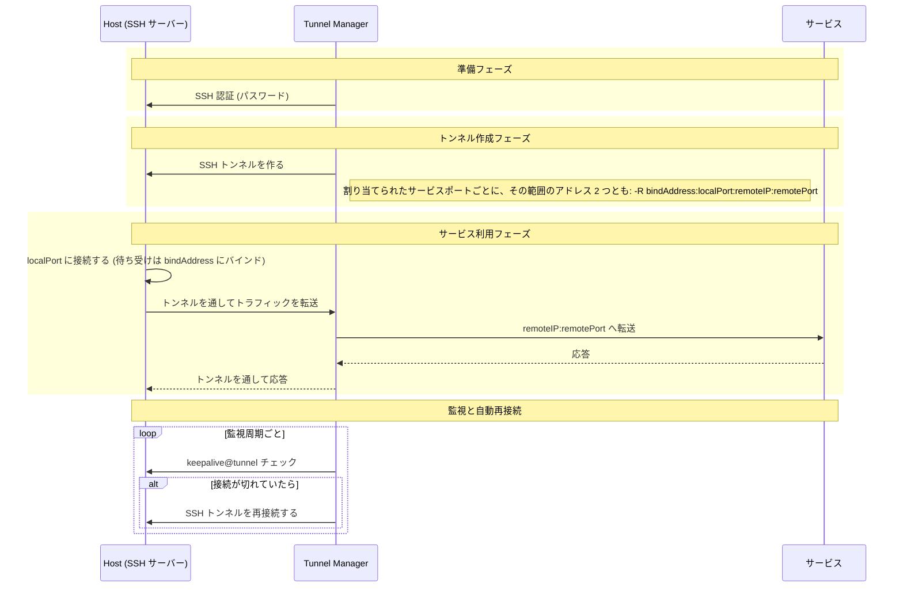
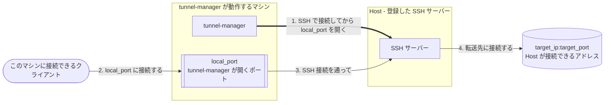

# Tunnel Manager リファレンス

[README に戻る](README.ja.md)

この文書にすべてが入っています。インストール、設定、API、そして画面の動きです。短い版は
[README](README.ja.md) です。

Tunnel Manager は SSH トンネルを確立し、維持し続けます。ログインする SSH サーバー
(**Host**) と、公開するサービス (**サービスポート**) を登録し、どの Host がどのサービス
ポートを担当するかを決めておくと、割り当て 1 つにつきトンネルを 1 本確立し、そこから先はずっと
監視します。REST API も、ブラウザ UI も、トンネルそのものも、1 つのバイナリが受け持ちます。

ここで作るトンネルは **リバース (reverse)** トンネルです。つまり待ち受けソケットは、
Tunnel Manager が動作するマシンではなく Host の側に開きます。**Host の** `local_port` に
接続したクライアントは SSH 接続を通って Tunnel Manager まで転送され、Tunnel Manager が
`service_ip:service_port` に接続して、バイトを両方向にコピーします。Tunnel Manager しか
接続できないサービスを Host から使えるようにするのが、この仕組みです。
[ローカルフォワード](#ローカルフォワード)だけは向きが逆で、ポートはこのマシンに開き、接続は
Host から出ていきます。

| 登録するもの | 項目 | 何か |
|--------------|------|------|
| Host | `ip`, `port`, `user`, `private_key`, `key_passphrase`, `password`, `description`, `enabled` | Tunnel Manager がログインする SSH サーバーです。秘密鍵でも、パスワードでも、その両方でもログインできますが、どちらか一方は必ず要ります。鍵も、そのパスフレーズも、パスワードも、すべて暗号化して保存します。 |
| サービスポート | `service_ip`, `service_port`, `local_port` | 公開したいサービスと、それを担当するすべての Host の上に開くポートです。 |
| 割り当て | `host_id`, `sp_id`, `bind_scope` | Host 1 つとサービスポート 1 つの組で、この Host がそれを担当するという意味です。トンネルはここから作られ、Host やサービスポートを登録したときに自動で作られます。`bind_scope` は転送されたポートを Host のどの範囲で開くよう要求するかで、`loopback` か `wildcard` のどちらかであり、与えなければワイルドカードです。 |
| ローカルフォワード | `local_port`, `bind_scope`, `target_ip`, `target_port`, `description` | このマシンに開くポートです。そこへの接続を 1 台の Host の SSH 接続を通して、Host から見た `target_ip:target_port` へ運びます。その Host だけに属します。 |

`ip` も `service_ip` も IPv4 と IPv6 の両方を受け取ります。IPv6 アドレスは `2001:db8::1`
のようにそのまま書き、接続のときに要る角かっこは、アドレスを使う側で付けます。
`fe80::1%eth0` のようなゾーン付きは受け付けません。

**Host が有効になっている割り当て 1 つが、トンネル 1 本です。** サービスポートを 3 つ担当する
Host はトンネルを 3 本動作させ、1 つも担当していない Host は、サービスポートがいくつ保存されて
いてもトンネルを 1 本も動作させません。Host を登録すると、そのときあるサービスポートがすべて
その Host に割り当てられ、サービスポートを登録すると、そのときあるすべての Host に割り当て
られます。リクエストで別の指示をしない限りはそうなので、割り当てに一度も触らないインストール
は、これまでどおりすべての組み合わせを動作させます。そのあと Host が何を担当するかは、Hosts
画面のその行にある **Service ports** ボタンと
[Host が持つサービスポート](#host-が持つサービスポート)から変えます。

**Host へのログインは、鍵か、パスワードか、その両方で行います。** `private_key` には PEM 形式
の秘密鍵ファイルの中身をそのまま送り、鍵がパスフレーズで守られているときは `key_passphrase`
を添えます。鍵は登録の時点で読まれるので、鍵ではないファイル、パスフレーズが要るのに渡されな
かった鍵、鍵を開けないパスフレーズは、次の接続のときではなくその場で拒否されます。両方が登録
されているときは鍵を先に試し、それで認証できなかったときにパスワードを使います。ですからトンネルが
動作している Host に鍵を追加しても、そのトンネルが切れることはありません。トンネルが確立している
間に登録した鍵は、次に接続するときから使われます。

鍵も、そのパスフレーズも、パスワードも、二度とプロセスの外には出ません。どの応答にも載らず、
編集のために開いた Host はその欄が空で戻ってきます。空のままにすれば保存されている値はその
ままで、鍵を送ると保存されている鍵とパスフレーズがまとめて置き換わります。

**バイナリのほかにインストールするものはありません。** データベースはプロセスが自分で作る
SQLite ファイル、設定はそのファイルの中にあってブラウザの画面から変更でき、UI は実行ファイル
に組み込まれています。データベースサーバーも、設定ファイルも、一緒に配置するディレクトリも
ありません。

## 目次

- [動作要件](#動作要件)
- [動作の仕組み](#動作の仕組み)
- [インストールと起動](#インストールと起動)
- [HTTPS と証明書](#https-と証明書)
- [初回起動とアカウント](#初回起動とアカウント)
- [内蔵 UI](#内蔵-ui)
- [設定](#設定)
- [アンインストール](#アンインストール)
- [スクリプトから API を呼ぶ](#スクリプトから-api-を呼ぶ)
- [OpenAPI と Swagger UI](#openapi-と-swagger-ui)
- [API エンドポイント](#api-エンドポイント)
- [トンネルの状態を読む](#トンネルの状態を読む)
- [暗号化キー](#暗号化キー)
- [非 root ユーザーで動かす](#非-root-ユーザーで動かす)
- [ライセンス](#ライセンス)

## 動作要件

リリースバイナリを実行するのに要るものはありません。SQLite エンジンも UI も、必要なものは
すべて中に入っています。

| したいこと | 要るもの |
|------------|----------|
| リリースバイナリを実行する | ほかには何も |
| ソースからビルドする | Go 1.26 以降 |
| コンテナで実行する | Docker と Docker Compose |

SQLite ドライバは純粋な Go 実装 (`modernc.org/sqlite` の上の `github.com/glebarez/sqlite`)
なので、バイナリは `CGO_ENABLED=0` でビルドしてあり、実行するマシンに C ライブラリは
要りません。

### 対応プラットフォーム

`make release` は下のそれぞれにバイナリを 1 つずつビルドします。Go が対応するほかの環境でも
`go build` は通りますが、下の注意があります。

| プラットフォーム | リリースバイナリ |
|------------------|------------------|
| Linux amd64 | `tunnel-manager-linux-amd64` |
| Linux arm64 | `tunnel-manager-linux-arm64` |
| macOS Intel | `tunnel-manager-darwin-amd64` |
| macOS Apple silicon | `tunnel-manager-darwin-arm64` |
| Windows amd64 | `tunnel-manager-windows-amd64.exe` |

Unix ではプロセスが起動時に、開けるファイルディスクリプタの上限を自分で引き上げます。
トンネル 1 本がそれをいくつも使うからです。Windows にはプロセスごとのそうした上限がない
ので、そこでは何もしません。違いはそれだけです。

同梱の systemd ユニットは Linux 用です。ほかのプラットフォームでは、その環境のやり方で
プロセスを常駐させる必要があります。

実際に動作を確認してあるのは Linux のバイナリだけです。ほかはそれぞれのプラットフォーム向けの
コンパイラと vet が通ることを確かめてあるだけで、それ以上のことはしていません。

## 動作の仕組み

### 調整ループ

Tunnel Manager は、あるべき状態と現在の状態を、たえず照合しています。

| 状態 | 何か | どこから来るか |
|------|------|----------------|
| あるべき状態 | 有効になっているすべての Host の上の、その Host に割り当てられたすべてのサービスポート | `hosts`, `service_ports`, `host_service_ports` の行 |
| 現在の状態 | いま動作しているトンネル | プロセスの中のマネージャと、それが書く `tunnels` の行 |

**調整パス (reconcile pass)** は 2 つを比べて差を埋めます。あるべきなのに動作していないものは
開始し、動作しているのにもう要らないものは停止し、接続設定 (サーバーのアドレス、リモート
アドレス、ローカルポート、ユーザー、パスワード) が行と合わなくなったトンネルは、停止してから
新しい設定で作り直します。

API リクエストの処理の流れは次のとおりです。

```text
POST /api/service-port
  トランザクション { INSERT INTO service_ports } コミット
  調整ループを起動する
  201 Created          <- 応答はトンネルを待たない

調整ループ
  あるべき状態 = Host が有効になっている割り当て
  現在の状態   = 動作しているトンネル
  あるべきなのに動作していない   -> 開始する
  動作しているのにもう要らない   -> 停止する
  動作しているが設定が古い       -> 停止して作り直す
```

パスが実行されるのは 3 つの場面です。

| いつ | なぜ |
|------|------|
| 起動時、API が何かに応答するより前 | 最初のリクエストが来る時点では、保存されている行のトンネルはもう確立している |
| `POST`, `PUT`, `DELETE` がコミットされた直後 | 次の周期を待たずにその場で反映される |
| 調整周期ごと、既定では 5 秒 | 失敗したパスがやり残したことを、もう一度試す |

トンネルができる前に応答が返るので、**書き込みが成功してもトンネルが確立したという意味には
なりません。** それに答えるのは `GET /api/status` です。
[トンネルの状態を読む](#トンネルの状態を読む)を参照してください。

### 割り当て

**トンネルは割り当てを表すもので、それ以外の何物でもありません。** `host_service_ports`
テーブルは Host とサービスポートの組 1 つにつき 1 行を持ち、その組が行のすべてです。
ですから同じ割り当てを二度持つことは、データベース自身が拒みます。

| 何が起きたか | 割り当てはどうなるか |
|--------------|----------------------|
| Host を登録した | その時点で保存されているサービスポートがすべて与えられます。リクエストが `assign_all_service_ports` を false で送った場合は別です |
| サービスポートを登録した | その時点で保存されているすべての Host に与えられます。リクエストが `assign_to_all_hosts` を false で送った場合は別です |
| Host を無効にした | 割り当てはそのまま残ります。そのトンネルは停止し、また有効にすれば復旧します |
| Host かサービスポートを削除した | それを指す割り当ても同じトランザクションで消えます |
| このテーブルを追加したバージョンに上げてからの最初の起動 | すべての Host にすべてのサービスポートが与えられます |

最後の行はアップグレードのためにあります。テーブルができる前は、すべての Host がすべての
サービスポートを担当するのが調整ループの前提で、どこにも保存されていませんでした。新しい
テーブルが空のまま起動すると、それは「どの Host も何も担当していない」と読めてしまい、
すべてのトンネルが停止します。埋めるのはテーブルを作るその起動のときだけで、ほかの起動では
何もしません。あとの起動でも埋めてしまうと、せっかく外した割り当てが戻ってきてしまい、
それではテーブルを置いた意味がなくなるからです。

存在しない Host やサービスポートを指す割り当ては何も作らず、調整パスはそれを読み飛ばします。
そこから作れるものは何もありません。アドレスもポートも認証情報も、消えてしまった行の上に
あるからです。

**転送されたポートがどこまで届くかは割り当てに付いています。** 行の `bind_scope` が、そのポートを
Host のどのアドレスで開くよう要求するかであり、アドレス 1 つではなく **2 つ 1 組の範囲**を指します。

| `bind_scope` | Host に要求するアドレス | 何のためのものか |
|--------------|--------------------------|------------------|
| `loopback` | `127.0.0.1` と `::1` | そのポートを Host 自身の上だけで応答させたいとき |
| `wildcard`、および空の値 | `0.0.0.0` と `::` | そのポートを Host に届くところならどこからでも応答させたいとき |

**範囲を選ぶと 2 つのアドレスの両方を要求します。** 2 つのアドレスファミリーは互いの代わりに
ならないからです。`127.0.0.1` で開いたポートに `::1` で接続するクライアントは届きませんし、
2 つのワイルドカードも同じです。範囲を選んだ人はアドレスファミリー 1 つではなくそのシステムに
ついて選んだのですから両方を要求し、SSH サーバーがそのどちらを受け入れたかはトンネルの行に
出ます。[トンネルの状態を読む](#トンネルの状態を読む)を参照してください。アドレスを手で書く欄は
ありません。このプログラムは Host にインターフェースを尋ねないので、ここに書くアドレスは推測で
あり、推測が外れれば開かない転送 1 本として静かに終わります。

範囲を割り当てが持つのは、Host とサービスポートの両方に言い分があるからです。Host 1 台が
サービスポートを複数担当していて、そのうち 1 つはそのシステムの中だけで使われるべきなのに、
次の 1 つは外から届かなければならないことがあります。サービスポート 1 つを複数の Host が担当して
いて、そのうち一部だけが他人に入られてはいけないネットワークに面していることもあります。
どちらか一方に置けば、もう一方に答えが 1 つ強制されます。

列ができる前に保存された割り当ては空の値を持っていて、それがワイルドカードなので、アップグレードが
いま動いているトンネルの到達範囲を狭めることはありません。v3.8.3 で **Host** にバインドアドレスを
指定していたインストールは、その答えがその Host のすべての割り当てへ引き継がれます。そこに書かれて
いたものがループバックアドレスなら `loopback` になり、それ以外の答えは、空の値であってもシステムの
どれかのインターフェースのアドレスであっても、すべてワイルドカードになります。割り当てそのものを
一度だけ埋めるのと同じく、列を追加するその起動のときだけ引き継ぎ、あとの起動では何もしません。
あとから引き継ぐと、その間に選ばれたものを上書きしてしまうからです。

### トンネル 1 本の動き



**これらすべてより先に、Host のホストキーを確認します。** 確認はハンドシェイクの中で行われる
ので、その Host が信頼しているサーバーでなければパスワードも秘密鍵も渡らず、誰も鍵を承認して
いない Host はトンネルを 1 本も作りません。[ホストキーの承認](#ホストキーの承認)を参照して
ください。

要求するアドレスは割り当ての `bind_scope` が指す 2 つで、何も選んでいなければワイルドカードです。
[割り当て](#割り当て)を参照してください。2 つとも 1 本の SSH 接続の上で要求するので、**トンネル
1 本が転送 2 本を持ちます。** サーバーが片方だけを開いてもう片方を拒否すると、そのトンネルは
要求したものの半分でトラフィックを運びます。それでも行は 1 行のままです。人が選んだものが
1 行だからです。

Host 側の待ち受けが本当に要求したところに開くかどうかは、Host の SSH サーバー次第です。その
`GatewayPorts` が無効だと、何を要求してもループバックのアドレスにバインドされ、有効だと、
ループバックの範囲を選んでいてもすべてのインターフェースにバインドされます。トンネルが確立した
あとは tunnel-manager が自分でその転送ポートに接続してみて、結果を伝えます。
[転送ポートに到達できるかどうか](#転送ポートに到達できるかどうか)を参照してください。

監視周期と調整周期は別々の仕事です。監視は、すでに確立しているトンネルがまだ応答するかを
確認し、応答しなければ再接続します。調整ループは、そもそも必要なトンネルが一式そろっているか
を見ます。

### ローカルフォワード

**ローカルフォワードは、トンネルと向きが逆です。** トンネルは Host にポートを開かせ、そこに届いた
ものをこのマシンが接続できるサービスへ運びます。ローカルフォワードは **このマシンが**
`local_port` を開き、そこへの接続を Host の SSH 接続を通して、Host が接続できるアドレス
`target_ip:target_port` へ運びます。`ssh -L` がすることを、トンネルと同じように維持するものです。



**ローカルフォワードは 1 台の Host に属します。** それ自体が 1 行で、作った Host だけが担当し、
割り当てはありません。サービスポートは担当する複数の Host で共有されますが、ローカルフォワード
はそうではありません。追加、変更、削除は、Hosts 画面のその Host の行にある **Local forwards**
ボタンか API から行います。[Host のローカルフォワード](#host-のローカルフォワード)を参照して
ください。Host を削除すると、そのローカルフォワードも同じトランザクションで削除されます。

| 項目 | 何か |
|------|------|
| `local_port` | このマシンに開くポート。1 から 65535 |
| `bind_scope` | このマシンのどのアドレスに開くか。下を参照 |
| `target_ip` | Host から接続しに行く先。IPv4 か IPv6 のアドレスで、名前は受け付けません |
| `target_port` | 転送先のポート。1 から 65535 |
| `description` | 自由記述 |

**ここでの `bind_scope` は Host ではなく、このマシンの話です。** 割り当てと同じ 2 つの語を
受け取り、同じアドレスの組を指します。

| `bind_scope` | このマシンで `local_port` を開く場所 |
|--------------|--------------------------------------|
| `wildcard`、および空の値 | `0.0.0.0` と `::`。これが既定です |
| `loopback` | `127.0.0.1` と `::1` |

**ワイルドカードは、このマシンを Host 側のネットワークへの入口にします。** このマシンの
`local_port` に届く人は誰でも、Host にログインすることなく、Host から見た
`target_ip:target_port` に届きます。SSH のログインは tunnel-manager がすでに済ませているから
です。このマシンの外から使う予定がなければ `loopback` を選び、使うならそのポートの前に
ファイアウォールを置いてください。

組の 2 つのアドレスはそれぞれのアドレスファミリーで開いてみて、**片方が開けば先に進みます。**
IPv6 のないマシンは IPv4 側だけを開きます。どちらも開けないとき、たとえば別のプログラムがその
ポートを使っているときは、`error` を報告してやり直します。

**`local_port` は、どの Host のものであっても、ローカルフォワード全体で一意です。** どれも同じ
このマシンにポートを開くからです。使用中のポートでのローカルフォワードは `409` で拒否され、この
サーバーが待ち受けるよう保存されているポート (`api_port`) と同じものも同様です。この検査は
ローカルフォワードを書き込むときに行います。あとで `api_port` を変えるときには、ローカル
フォワードとは比べません。1024 未満のポートはこのプロセス自身が開くので、
[非 root ユーザーで動かす](#非-root-ユーザーで動かす)の規則に従います。

**ローカルフォワードは、その Host が有効な間だけ動きます。** 調整ループが、トンネルと同じやり方
でローカルフォワードを起動し、組み直し、止めます。1 行が自分の SSH 接続 1 本で、Host、接続情報、
信頼しているホストキー、ポート、範囲、転送先のどれかが変わると、止めてから起動し直します。
説明だけの変更では何も組み直しません。

**`local_port` は SSH 接続がある間だけ開いています。** 接続ができてから開き、接続が切れるたびに
閉じます。そのため、運んでくれる Host がない間に接続したクライアントは、受け付けられてから
切られるのではなく、その場で拒否されます。接続はトンネルと同じく監視周期ごとに確かめ、切れた
接続は同じ周期のあとに再接続します。

**ログインの拒否とホストキーの拒否では止まります。** 同じパスワードや鍵でやり直しても同じように
失敗するだけなので、作られた材料が変わるまで待ちます。Host に新しい接続情報を入れるか、鍵を
承認してください。[ホストキーの承認](#ホストキーの承認)を参照してください。

`connected` は、SSH 接続があって `local_port` が開いていることを示します。転送先が応答すること
は示しません。クライアントの接続ごとに Host から転送先へ別々に接続し、届かなければその接続
1 つだけが閉じられ、理由はログに残ります。Host の SSH サーバーも、この向きの転送を許して
いなければなりません。OpenSSH は `AllowTcpForwarding` が `no` か `remote` なら拒否します。

| `status` | 意味 |
|----------|------|
| `disabled` | Host が無効です。何も開きません |
| `stopped` | Host は有効ですが、動いているローカルフォワードがありません。調整ループがまだその行に来ていないか、起動に失敗したかで、失敗ならログに出ます |
| `starting` | 最初の接続をしているところです |
| `connected` | SSH 接続があり、`local_port` が開いています |
| `reconnecting` | 接続が切れたか試行が失敗して、接続し直しているところです。`retry_count` がその回数です |
| `error` | 直前の試行が失敗し、`last_error` に理由があります。ログインが拒否されたときは Host を変更するまでここに留まり、それ以外は監視周期のあとにやり直します |
| `host_key_unapproved`、`host_key_mismatch` | トンネルと同じく、ホストキーが拒否されました。鍵を承認するまでここに留まります |

**状態は、ローカルフォワードを動かしているプロセスのメモリにあり**、ローカルフォワードの API
だけが返します。`GET /api/status` には含まれず、状態画面もローカルフォワードを数えません。

**エクスポートのファイルには、Host ごとにそのローカルフォワードが載ります。** Host の
`local_forwards` がそれです。[エクスポートとインポート](#エクスポートとインポート)を参照して
ください。

## インストールと起動

**インストールはファイル 1 つです。** リリースページから使っているプラットフォーム向けの
バイナリをダウンロードし、実行権限を付けて起動します。データベースファイルもアカウントも、
ほかに要るものもすべて、初回起動が作ります。

```bash
chmod +x tunnel-manager-linux-amd64
./tunnel-manager-linux-amd64
```

フラグはこれですべてです。

| フラグ | 何をするか |
|--------|------------|
| `-db <パス>` | データベースファイルです。設定も、登録した Host も、アカウントもこの中にあります。なければ親ディレクトリごと作ります |
| `-install` | このプログラムをこのシステムのサービスとしてインストールして終了します。実行ファイルを所定の場所に置き、データディレクトリを作り、起動時に立ち上がって落ちても自分で戻るようにサービスを登録します。root 権限が、Windows では管理者権限が要ります。[サービスとしてインストールする](#サービスとしてインストールする)を参照してください |
| `-uninstall` | サービスを止め、登録を外し、インストールした実行ファイルを削除して終了します。データは残します。[インストールを取り除く](#インストールを取り除く)を参照してください |
| `-bin` | `-install` が実行ファイルを置く場所であり、登録が残っていない機械で `-uninstall` が実行ファイルを探す場所です。指定しなければ、そのプラットフォームが管理者のインストールしたプログラムを置く場所になります。`-install` か `-uninstall` と一緒に使います |
| `-purge` | `-uninstall` と一緒に使うと、データディレクトリも削除します。これで削除したものは元に戻せません |
| `-reset-settings` | 保存されている設定をすべて既定値に戻し、何を変えたかを出力して終了します。登録した Host、サービスポート、アカウント、証明書はそのままです。[サーバーが起動しないとき](#サーバーが起動しないとき)を参照してください |
| `-trust-proxy-headers` | このサーバーの前にいるものが付けた `X-Forwarded-Proto` ヘッダを信用します。平文でこのプロセスに届いた接続でも、セッションクッキーに `Secure` が付きます。指定しなければ無効です。[リバースプロキシの後ろに置くとき](#リバースプロキシの後ろに置くとき)を参照してください |
| `-version` | バージョンを出力して終了します |
| `-help` | フラグを出力して終了します |

### ファイルが置かれる場所

**インストール一式はディレクトリ 1 つに収まります。** `-db` がデータベースファイルを指し、
このインストールを構成するそれ以外のものは、そのファイルがあるディレクトリの中に並びます。

```text
<データベースファイルがあるディレクトリ>/
    tunnel-manager.db          設定、Host、サービスポート、アカウント
    tunnel-manager.db-wal      SQLite が隣に置く write ahead log
    tunnel-manager.db-shm      SQLite が隣に置く共有メモリファイル
    initial-password           初回起動で書かれ、初期設定で削除される
    keys/tunnel-manager.key    SSH パスワードを暗号化するキー
    logs/tunnel-manager.log    ログファイルと、その隣のローテート済みファイル
```

キーファイルとログファイルはフラグではなく **設定** です。設定画面にあり、既定値は
`keys/tunnel-manager.key` と `logs/tunnel-manager.log` です。**どちらも、作業ディレクトリ
ではなくデータベースファイルがあるディレクトリを基準に読まれます。** 作業ディレクトリは毎回
同じとは限らないので、そこを基準にした相対の既定値では、マシンごとにキーの置き場所がばらばらに
なってしまいます。

**どちらもそのディレクトリの下に収まっていなければなりません。** 受け付けるのは相対パスで、
`logs/a/b/x.log` や `x.log` までが許される範囲です。絶対パスと `..` で外へ出るパスは、保存の
時点で拒否します。ログファイルはプロセスが作って追記し、Logs 画面がその末尾を読み返すので、
インストールの外へ出られるパスは、この設定を、このプロセスにマシン上のどのファイルへでも書かせ、
開けるファイルならどれでも読ませる通り道にしてしまいます。まだ受け付けていた頃にそうしたパスを
保存したインストールは、代わりに既定値で起動し、何を何に戻したかを知らせます。

```text
warn  a stored path setting names a place outside the directory the database file is in,
      which is no longer allowed, and was put back to its default
      {"setting": "logging.file.path", "from": "/var/log/tunnel-manager/x.log",
       "to": "logs/tunnel-manager.log"}
```

**インストールのディレクトリの外に置いていたキーは、それ以降読みません。** 起動がデータベース
の隣に新しいキーを作り、古いキーで封じたパスワードはそれでは開きません。[暗号化キー](#暗号化キー)
で起動が止まるのはこれです。キーファイルをインストールのディレクトリの中へ移し、その場所を設定
に書いてください。

**プロセスを起動したディレクトリには何も作りません。**

データベースの行ではなくファイルとして残るのはログだけです。理由は 3 つあります。まず、
ロガーはデータベースを開く前に用意できていなければなりません。データベースを開く処理は最も失敗
しやすく、失敗の理由を記録できるものが要るからです。次に、コネクションプールは接続を 1 つしか
持たないので、ログの 1 行ごとに、プロセスが本来処理すべきクエリの後ろへ並ぶことになります。
そして、データベース自身が実行した文をそのロガーに報告するので、ログを 1 行書くことがログを
1 行書くクエリになってしまいます。

`-db` を省くと、そのプラットフォームがユーザーデータを置く場所から割り出します。

| 起動のしかた | `-db` | インストールが置かれるディレクトリ |
|--------------|-------|------------------------------------|
| フラグなし、Windows | 指定しない | `%AppData%\tunnel-manager\` |
| フラグなし、macOS | 指定しない | `~/Library/Application Support/tunnel-manager/` |
| フラグなし、Linux | 指定しない | `$XDG_CONFIG_HOME/tunnel-manager/`。この変数がなければ `~/.config/tunnel-manager/` |
| 同梱の systemd ユニット | `/var/lib/tunnel-manager/tunnel-manager.db` | `/var/lib/tunnel-manager/` |
| Docker Compose | `/data/tunnel-manager.db` | `/data/`。compose ファイルがホストの `./_data` に結び付けます |

`$XDG_CONFIG_HOME` も `$HOME` もないマシンにはその場所がないので、起動は置き場所を
勝手に決めたりはせず、そのことを伝えます。

```text
Failed to work out where the database file goes: no default location for the database file
is available: neither $XDG_CONFIG_HOME nor $HOME are defined. Give -db an absolute path
```

起動時には、開いたデータベースファイルとキーファイルとログファイルの絶対パスがログに出ます。
どのファイルを使っているかは、いつでもログを見ればわかります。

### Docker Compose で動かす

```bash
git clone https://github.com/jollaman999/tunnel-manager.git
cd tunnel-manager
docker-compose up -d
```

イメージはバイナリを `-db /data/tunnel-manager.db` で起動し、compose ファイルが `/data` を
ホストの `./_data` に結び付けます。コンテナを入れ替えてもデータベースとキーとログが残るのは
そのためです。

初期パスワードのファイルもそのディレクトリの中に書かれるので、ホストからも読めます。

```bash
docker compose exec tunnel-manager cat /data/initial-password
```

### systemd サービスとして動かす

[`-install`](#サービスとしてインストールする)が書く systemd ユニットは、バイナリを絶対パスの
`-db` 付きで起動します。

```ini
ExecStart=/usr/local/bin/tunnel-manager -db /var/lib/tunnel-manager/tunnel-manager.db
StateDirectory=tunnel-manager
```

`StateDirectory=tunnel-manager` が `/var/lib/tunnel-manager` を作り、`User=` のアカウントを
所有者にします。データベースもキーもログも初期パスワードも、すべてこの中に収まります。ユニットは
`User=root` で書かれます。変えたいときは
[非 root ユーザーで動かす](#非-root-ユーザーで動かす)を参照してください。

### サービスとしてインストールする

**`-install` は、このプログラムを実行した機械のサービスにします。** 実行ファイルを、その
プラットフォームが管理者のインストールしたプログラムを置く場所に置き、データディレクトリを
作り、そのプラットフォームのサービスマネージャーにサービスを登録して起動します。以後
サービスは起動時に立ち上がり、落ちても自分で立ち上がり直します。

```bash
sudo ./tunnel-manager-linux-amd64 -install
```

Windows では、**管理者として実行**で開いた PowerShell かコマンドプロンプトから同じコマンドを
実行します。そうでない場所から実行すると、インストールは拒否して何にも触れません。

```powershell
.\tunnel-manager-windows-amd64.exe -install
```

パスを指定しなかったときに何がどこへ置かれるかは、次のとおりです。

| | Linux | macOS | Windows |
|---|-------|-------|---------|
| 実行ファイル | `/usr/local/bin/tunnel-manager` | `/usr/local/bin/tunnel-manager` | `C:\Program Files\tunnel-manager\tunnel-manager.exe` |
| データディレクトリ | `/var/lib/tunnel-manager` | `/Library/Application Support/tunnel-manager` | `C:\ProgramData\tunnel-manager` |
| サービスの登録 | systemd ユニット。すでに登録されているユニットがあればその場所に、なければ `/etc/systemd/system/tunnel-manager.service` に書きます | LaunchDaemon `/Library/LaunchDaemons/io.github.jollaman999.tunnel-manager.plist` | サービス制御マネージャーの `tunnel-manager` サービス |
| 実行するアカウント | `root` | `root` | `LocalSystem` |
| 落ちたときの再起動 | `Restart=always`、5 秒後 | `KeepAlive` | 5 秒間隔で 3 回 |

`-bin` は実行ファイルを、`-db` はデータベースを別の場所に置きます。ここで指定したデータベース
のパスがそのままサービスの登録に入り、あとでアンインストールがその登録から読み出すのも、この
パスです。

```bash
sudo ./tunnel-manager-linux-amd64 -install -bin /opt/tunnel-manager/tunnel-manager \
  -db /opt/tunnel-manager/tunnel-manager.db
```

**インストールされるバイナリは最新リリースであって、いま実行したファイルとは限りません。**
`-install` は GitHub から最新リリースを読み、このプラットフォームとアーキテクチャ向けの
アセットをダウンロードします。そのリリースに `SHA256SUMS` が入っていれば、ダウンロードした
ファイルをその中の該当行と照合し、チェックサムが合わなければファイルを置かずにインストールを
止めます。それ以外の場合 - リリースを読めなかった、このプラットフォーム向けのアセットが
リリースに無い、ダウンロードが失敗した - は、いま実行中のファイルを代わりにインストールし、
その理由も出力します。どちらがインストールされたかは報告に出ます。

```text
tunnel-manager install
  executable    /usr/local/bin/tunnel-manager
  taken from    the v3.5.1 release, checksum verified
  md5 before    no file was there
  md5 after     0b7f4b1c9d2e5a6f8c3d1e4b7a9f2c5d
  data          /var/lib/tunnel-manager
  database      /var/lib/tunnel-manager/tunnel-manager.db
  service       /etc/systemd/system/tunnel-manager.service
  registration  new, nothing was registered before
  state         started
```

すでにインストールされている機械で `-install` が何をするかは、登録が持っているパスで変わり
ます。

| 登録 | `-install` がすること |
|------|------------------------|
| 登録されたサービスが無い | サービスを登録して起動します |
| 実行ファイルもデータベースも同じパス | サービスを止め、実行ファイルを上書きし、登録し直して起動します。上書き前と後の md5 が両方とも報告に出ます |
| 実行ファイルかデータベースが別のパス | 拒否して両方のパスを示し、何にも触れません。先に `-uninstall` を実行してください |

**古いインストールを取り残すインストールは、行わずに拒否します。** 別のパスに登録されている
インストールは、今回のインストールが触れない実行ファイルとデータベースを持っています。新しい
登録は別のファイルを指すことになり、古いファイルは機械のどこからも指されないままディスクに
残って、あとのどのアンインストールからも見つけられません。

### インストールを取り除く

`-uninstall` はサービスを止め、登録を外し、その登録が起動していた実行ファイルを削除します。

```bash
sudo tunnel-manager -uninstall
```

**データは残します。** どこに残したかは報告が示します。

```text
tunnel-manager uninstall
  taken from    the registration of this system
  executable    /usr/local/bin/tunnel-manager, removed
  data          /var/lib/tunnel-manager, left in place
  database      /var/lib/tunnel-manager/tunnel-manager.db
  service       /etc/systemd/system/tunnel-manager.service, removed
  state         stopped and taken out of the service manager
```

**コマンドラインにパスを書く必要はありません。** このプログラムは状態ファイルをどこにも
置きません。登録そのものが実行ファイルのパスと `-db` のパスを両方持っていて、アンインストール
が読むのはその登録です。

| プラットフォーム | アンインストールがパスを読み出す場所 |
|------------------|--------------------------------------|
| Linux | `systemctl show tunnel-manager -p FragmentPath -p ExecStart` |
| macOS | `/Library/LaunchDaemons/io.github.jollaman999.tunnel-manager.plist` の `ProgramArguments` |
| Windows | サービス制御マネージャーが `tunnel-manager` サービスについて持っている `BinaryPathName` |

**登録されたサービスが無い機械では、何も削除しません。** 何がこのインストールのものかを示す
のは登録だけなので、登録がすでに失われた機械では、残っているものを `-bin` と `-db` で指定
します。

```bash
sudo tunnel-manager -uninstall -bin /usr/local/bin/tunnel-manager \
  -db /var/lib/tunnel-manager/tunnel-manager.db
```

この 2 つのフラグは登録が示さないものだけを埋め、登録がパスを持っていれば登録が優先されます。
フラグのほうを取るアンインストールは、機械の何ものも自分のものだと言っていないパスを削除し、
登録されたファイルのほうを残してしまいます。

`-purge` はデータディレクトリも削除します。

```bash
sudo tunnel-manager -uninstall -purge
```

> **`-purge` が削除したものは元に戻せません。** データベースと、その中のすべての Host と
> 認証情報が、保存されたパスワードを暗号化しているキーごと、そのディレクトリと一緒に消えます。
> そのキーファイル抜きで取ったデータベースのバックアップでは足りません。その中のパスワードは
> 読めないままです。`-purge` は削除する前に、どのディレクトリを削除するかを画面に出します。

`-purge` が丸ごと削除に渡すディレクトリは、手で書いた `-db` か、このプログラムが書いたとは
限らない登録から読み出した `-db` から割り出したものです。そのため、1 つのインストールの
データディレクトリでないものは拒否します。

| `-purge` が拒否するもの | なぜ |
|-------------------------|------|
| 指定されたデータベースファイルが入っていないディレクトリ | そもそもこのインストールのディレクトリではありません |
| 絶対パスでないパス | どこから実行したかで指す場所が変わります |
| ファイルシステムのルートと、その直下のディレクトリ | `/`、`/var`、`/opt`、`C:\ProgramData` は、このインストールよりはるかに多くのものを持っています |
| `/var/lib`、`/var/log`、`/var/tmp`、`/var/cache`、`/usr/bin`、`/usr/lib`、`/usr/local`、`/usr/share`、`/etc/systemd`、`/Library/Application Support`、`/Library/LaunchDaemons`、`C:\Windows\System32`、`C:\Program Files\Common Files` | どれも 1 つのインストールより多くのものを収めています |
| ホームディレクトリ、つまり `/home` か `/Users` の直下のディレクトリ | データベースファイルをホームに置いていたことは、その人のすべてを削除する理由にはなりません |

**Windows では、実行中の実行ファイルは削除できません。** Windows はプロセスが動いている間その
実行イメージを掴んだままにし、`-uninstall` は普通、インストールされたその実行ファイルから
実行されます。そのときはファイルを次の起動時に削除するよう渡し、報告には `removed` ではなく
`removed at the next reboot of this machine` と書きます。

**実際に動かしたのは Linux だけです。** macOS と Windows のバックエンドは、コンパイラと、その
プラットフォーム向けの vet ツールと、生成される plist とサービス設定を固定した単体テストで
確認しただけです。どちらも、対象の OS でインストールも起動も削除もしたことがありません。

### ソースからビルドする

```bash
git clone https://github.com/jollaman999/tunnel-manager.git
cd tunnel-manager
make
./tunnel-manager
```

`make` はバイナリを `CGO_ENABLED=0` でビルドします。`make release` は上の表のプラット
フォームすべてに 1 つずつビルドします。

## HTTPS と証明書

**API と UI は HTTPS で提供し、証明書はこのインストールが自分で作ります。** ブラウザで
`https://<アドレス>:<ポート>/` を開いてください。初回起動が証明書を生成してデータベース
ファイルに保存するので、前もって用意するものも、どこかに置くファイルもありません。

**ポートは 1 つのままです。** そのポートに平文で届いたリクエストには、同じアドレスの
`https` 版への `307` リダイレクトを返します。`http://` のままのブックマークやスクリプトも、
目的の場所にたどり着きます。`307` はメソッドとボディを保ちます。`301` や `302` は
それを `GET` に変えてしまいます。平文で届いたリクエストのボディは決して読みません。平文の
まま回線に流れているので、クライアントが TLS の上で送り直します。ファイアウォールに
新しく開けるものもありません。

| 生成される証明書 | |
|------------------|--|
| 作られるとき | 初回起動のとき。保存されたものが読めないか期限切れのときも作り直します |
| 鍵 | P-256 曲線の ECDSA |
| 有効期間 | 5 年 |
| 宛先 | `localhost`, `127.0.0.1`, `::1`, マシンのホスト名、各インターフェースのアドレス |
| 保存先 | データベースファイルの中、設定と同じ場所です。秘密鍵は SSH パスワードと同じキーで暗号化するので、データベースファイルのコピーだけでは持ち出せません |
| 署名者 | 自分自身 |

起動時に指紋がログに書かれます。証明書が対象とする名前と、期限が切れる日も一緒に出ます。

### ブラウザの警告

**この証明書には誰の署名もないので、ブラウザは警告を出し、スクリプトは接続を拒否します。**
認証局が発行していない証明書とはそういうものです。どの設定を変えても、警告が自動的に消える
ことはありません。

その警告と照合すべきものは指紋です。指紋は起動ログにあり、ログインしたあとは設定
画面にもあります。書き方は `openssl x509 -fingerprint -sha256` と同じで、32 バイトを大文字の
16 進でコロン区切りにしたものです。ブラウザの証明書ビューアが表示する値と照合してください。
同じ指紋ならその接続先はこのサーバーで、違う指紋なら何か別のものが代わりに応答しています。

```bash
openssl s_client -connect 127.0.0.1:8888 </dev/null 2>/dev/null \
  | openssl x509 -noout -fingerprint -sha256
```

警告をクリックで通り抜けるのではなく消したいなら、その証明書をブラウザを使うマシンの信頼
ストアに入れてください。そのために設定画面が PEM 形式で表示します。ハンドシェイクのたびに
サーバーがクライアントへ送るのと同じ内容です。もう 1 つの方法は、独自の証明書を登録する
ことです。

`curl` はこの証明書を終了コード `60` で拒否します。`--cacert <ファイル>` で証明書の場所を指定する
か、`-k` で検証をスキップしてください。[スクリプトから API を呼ぶ](#スクリプトから-api-を呼ぶ)の
例では代わりに `CURL_CA_BUNDLE` を一度だけ設定していて、そのシェルの `curl` はすべてそれを
読みます。

### 独自の証明書を登録する

**設定画面には証明書とその秘密鍵の 2 つの欄があり、どちらも PEM 形式です。** 発行されたものを
貼り付けて Register certificate を押してください。次の接続から使われ、プロセスの再起動は
ありません。スクリプトからなら `PUT /api/certificate` が同じことをします。

発行元から中間証明書を渡されたときは、同じ欄の、サーバー証明書の下に、渡された順で貼り付けて
ください。サーバー証明書が先という順序は TLS 自身が求めるもので、チェーンはまとめて保存され、
まとめて提供されます。

秘密鍵は、生成したもののときと同じように暗号化して保存します。画面に表示することも、送り返す
こともありません。

貼り付けられたものは保存する前に解析するので、間違いはサーバーが応答で知らせます。

| 貼り付けたもの | どうなるか |
|----------------|------------|
| PEM ブロックが 1 つもないテキスト | 拒否します。2 つの欄のどちらをそう判定したかを示します |
| 2 つの欄が逆 | 拒否し、そう見えるということを示します |
| パスフレーズで守られた秘密鍵 | 拒否し、パスフレーズを外す `openssl pkey` の 1 行を添えます |
| 別の証明書の秘密鍵 | 拒否します |
| 期限の切れた証明書 | 拒否します。誰も接続できないからです |
| 拡張鍵用途に `serverAuth` がない証明書 | 拒否します。サーバーからそうした証明書を受け取ったクライアントはすべて拒否するので、直すための画面すら残らなくなります |
| 有効期間がまだ始まっていない証明書 | **保存します。** いつから使えるかを警告で添えます。時計が数分ずれていることはよくあり、拒否するとそうした証明書をそもそも入れられなくなるからです |

拒否したときは何も保存しないので、提供中のものはそれまでのままです。

### 証明書を更新する

設定画面の **Make a new certificate** は、使用中の証明書を別の自己署名証明書に入れ替えます。
初回起動が行うのと同じ生成なので、新しい証明書は、このマシンが **いま** 応答する名前と
アドレスに宛てて作られます。アドレスが変わったマシンに必要なのはこれです。スクリプトから
なら `POST /api/certificate/renew` が同じことをします。

**再起動はありません。** 証明書はハンドシェイクごとに選ばれるので、次の接続から新しいものが
使われます。指紋が変わったことから、2 つのことが続きます。

- ボタンを押したそのページは、まだ古い証明書で提供されています。すでに開いている接続は、
  開いたときの証明書を使い続けます。新しいものを見るにはページを読み込み直してください。
- 古い証明書を信頼するように設定したブラウザとスクリプトは、新しい指紋も信頼するまで、
  もう一度警告を出します。

入れ替えは古い指紋と新しい指紋の両方をログに書きます。このインストールが変えた指紋なのか、
そうでないのかを見分けられるようにするためです。

### HTTPS を無効にする

設定画面の **Serve over HTTPS**、API では `api_https_enabled` がそれを決めます。ほかの設定と
同じく、次の起動から有効になります。

無効にすると、そのポートは HTTP しか受け付けません。証明書もリダイレクトもなく、画面が送信する
内容はすべて平文のまま流れます。このアカウントのパスワードも、Host の SSH パスワードもその中に
あります。証明書に関する 3 つの呼び出しは、無効にしている間は `409` を返します。読んだり入れ替え
たりする対象の証明書が、そもそも使われていないからです。

証明書はデータベースに残ります。HTTPS を再び有効にすれば、そこにあったものが同じ指紋のまま提供
されます。

無効にできるようにしてあるのは、誰も署名していない証明書が邪魔になる場所があるからです。画面に
アクセスできない運用担当者は、その画面から何も直せません。

### リバースプロキシの後ろに置くとき

TLS を終端し、このサーバーまでは平文でつなぐプロキシを前に置くと、サーバーが見るのはただの
HTTP 接続になります。セッションクッキーに `Secure` が付くのは TLS の接続のときだけなので、
ブラウザは最初から最後まで HTTPS なのに、クッキーはその印のないまま流れることになります。

`-trust-proxy-headers` が、そうではないと伝えるものです。これを指定すると、
`X-Forwarded-Proto: https` を付けて届いた要求は TLS で届いたものとして扱われ、2 つの
セッションクッキーに `Secure` が付きます。

```bash
./tunnel-manager -db /var/lib/tunnel-manager/tunnel-manager.db -trust-proxy-headers
```

**指定しなければ無効で、これはほかに何も決めません。** このヘッダはどのクライアントでも送れる
ので、読む値打ちがあるのは、運用担当者が動かしているプロキシだけがこのサーバーに届く場所に
限られます。直接公開しているサーバーはそのままにしてください。そこで有効にすると、クライアント
が自分の接続を安全だと申告できてしまいます。

設定ではなくフラグなのは、これが動いている間に変えるものではなく、このプロセスの周りの配置を
言い表すものだからであり、設定にすると、前に何もないインストールの設定画面にまでこの問いが
並んでしまうからです。

## 初回起動とアカウント

**API も UI も、ログインを通らないと使えません。** アカウントは 1 つだけで、初回起動の
ときに作られます。初回起動の前にこの節を読んでください。読まないとログインできません。

1. 初回起動が `user` テーブルの唯一の行を作ります。**ユーザー名はまだなく**、初期設定が必要
   というフラグが付いています。
2. 初期パスワードは、**データベースファイルがあるディレクトリ** の `initial-password` という
   ファイルに、パーミッション `0600` で書かれます。大文字と数字で 52 文字です。
3. **ログに載るのはそのパスまでで、パスワードは決して載りません。** ログはコンソールにも出る
   うえ、保存されローテートされるファイルにも残るので、そこに書かれたパスワードは初期設定が
   終わったあとも、誰も見ていない場所にいつまでも残ります。そのファイルが唯一のコピーです。
4. そのパスワードでログインします。この時点ではユーザー名は無視されるので、空で送って
   ください。応答は `"setup_required": true` を返し、UI は初期設定画面に移ります。そこで
   アカウントが持つユーザー名とパスワードを決めます。
5. **初期設定は初期パスワードのファイルを削除します。** その瞬間からファイルのパスワードでは
   ログインできなくなるので、残しておいても、無効になった認証情報を読める形で置いておくだけに
   なります。初期パスワードで開かれたほかのセッションも同時に終了します。初期設定を行って
   いるセッションだけは残ります。
6. **初期設定が終わるまで、セッションが呼べるのは `POST /api/setup` だけです。** `/api` の
   下のほかのパスはすべて `403` と `The account setup is not finished` を返します。

初期設定で決めるパスワードの長さは **12 バイト以上 72 バイト以下** です。文字数ではなく
バイト数で、ハングル 1 文字は 3 バイト、日本語のかな漢字も 1 文字 3 バイトです。上限が 72 な
のは、パスワードをハッシュする bcrypt がそこまでしか読まないからで、そこから先はログインの
照合に入りません。長すぎるパスワードは、黙って切り詰めずに拒否します。

初期設定が実行されるのは **一度だけ** です。現在のパスワードを求めないので、あとから認証情報を
変える手段にはなりません。二度目の呼び出しには `409` を返します。

セッションは、それを使った最後のリクエストから 12 時間有効です。リクエストのたびに期限は
先に延びます。セッションはメモリの中にあるので、再起動するとすべて失われ、ログインし直しに
なります。

### ユーザー名とパスワードを変更する

設定画面で両方とも変えられます。スクリプトからなら `PUT /api/account` が同じことをします。
現在のパスワードと一緒に、変えるほうを送ってください。`username`、`new_password`、あるいは
その両方です。送らなかった値はそのまま残り、どちらも送らないリクエストは拒否します。すでに
アカウントが持っている値を送った場合も同じです。新しいパスワードも、初期設定と同じ 12 バイト
以上 72 バイト以下です。

**現在のパスワードは毎回必要です。** 名前を変えるだけの変更でもです。本人が変えようと
しているのか、人のいない画面に開きっぱなしのセッションが変えようとしているのかを、そこで
見分けるからです。初期設定を二度実行させない理由と同じです。

**このセッションを除いて、ほかのセッションはすべてログアウトされます。** 2 つのうちどちらを
変えたときもそうで、名前の変更でもそうです。セッションはアカウントの名前ではなくアカウント
そのものを指しているので、名前の変更でセッションをそのままにすると、ログインに使う名前だけ
が変わって、すでにログインしている人はそのまま残ることになります。認証情報を変える理由の
半分は、誰かがそれを知っているかもしれないということです。ですから規則は 1 つです。認証情報が
変わったのだから、それを変えたセッション以外はすべて終了します。変更を行ったセッションは、すでに
持っている CSRF トークンも含めてそのまま使えるので、それを要求した画面が結果を表示できます。
ほかに何台のクライアントがログアウトされたかは、応答に載ります。

現在のパスワードが違えば `401` を返し、何も変えません。画面は新しいパスワードを 2 回入力させます
が、2 つ目はブラウザの外には出ません。同じ文字列を 2 回受け取ったところで、サーバーが 2 つ目から
知ることは何もないからです。

```bash
curl -s -b cookies.txt -X PUT "$BASE/api/account" \
  -H "X-CSRF-Token: $CSRF" -H 'Content-Type: application/json' \
  -d '{"current_password":"<the password now>","username":"operator"}'
```

```json
{
  "success": true,
  "data": {
    "username": "operator",
    "username_changed": true,
    "password_changed": false,
    "sessions_ended": 1
  }
}
```

## 内蔵 UI

ブラウザで `https://<アドレス>:<ポート>/` を開きます。`/` は `/ui/` へのリダイレクトを返し、
UI はそこから提供されます。最初の一度はブラウザが証明書について警告します。何と照合すれば
よいかは [HTTPS と証明書](#https-と証明書)にあります。

**UI のためにデプロイするものはありません。** ファイルはバイナリに組み込まれているので、
一緒に配置するディレクトリも、設定するパスもありません。

| 画面 | パス | 何を見せ、何をするか |
|------|------|----------------------|
| Status | `/ui/status` | 3 つの数 (あるべき数、行の数、接続中の数) と、その差についての 1 文、そしてトンネル 1 本につき 1 行です。行には Host、サービスポート、状態、サーバー、ローカル、リモート、ポートに到達できたか、再試行回数、最終接続時刻が並びます。何か問題があるトンネルは、その下に表の幅いっぱいの行で何が起きたかを載せ、転送ポートに到達できなかったトンネルは、そこに、バナーから分かった SSH サーバーの何を変えればよいか、ほかに何を確認すればよいかを載せます。確立しているトンネルは、その下にその転送のアドレスについて分かっていることを載せ、要求したこと、SSH サーバーが応答したこと、ここから開いた接続で確認したことを分けて書きます。ポートが開いているとは書きません。トンネルの行は 1 ページずつ、はじめは 1 ページ 10 行で返り、表の上でサイズとページを選べます。3 つの数はページではなく常にトンネル全体の数です。5 秒ごとに問い合わせ、読んでいたページのまま更新されます。 |
| Hosts | `/ui/hosts` | Host 1 つにつき 1 行で、ID、IP、ポート、ユーザー、説明、有効かどうか、更新日時が並びます。行は 1 ページずつ、はじめは 1 ページ 10 行で返り、表の上でサイズ (10, 20, 30, 50, 100) とページを選べます。選んだ値はこの画面のものとして覚えられ、いちばん小さいサイズの 1 ページに収まる短い一覧では、操作は何も出ません。Host の追加、編集、有効化と無効化、削除ができます。追加と編集のフォームには秘密鍵を貼り付ける欄、鍵ファイルをドロップする場所、パスフレーズ付きの鍵のための欄があり、追加のフォームには既定でオンの **Assign all service ports** のチェックがあって、その Host が最初に何を担当するかを決めます。その隣の **Host での到達範囲** のリストが、そのチェックで作られる割り当てすべての出発点になる範囲です。行の **Service ports** を押すと、すべてのサービスポートの一覧がパネルで開き、この Host が担当しているものにチェックが付いていて、行ごとに到達範囲が横に並びます。上で範囲を選んでチェックしたものすべてに適用することも、1 行だけを変えることもでき、チェックしていない行はそのままです。保存では変更した分だけを送るので、その一覧で付けたチェックは、読んでいないページに影響しません。行の **Local forwards** を押すと、その Host のローカルフォワードが状態とともにパネルで開き、そこで追加、変更、削除ができます。[ローカルフォワード](#ローカルフォワード)を参照してください。 |
| Service Ports | `/ui/service-ports` | サービスポート 1 つにつき 1 行で、ID、サービス IP、サービスポート、ローカルポート、説明、更新日時が並びます。行は Hosts と同じように 1 ページずつ返り、サイズとページはこの画面専用のものです。追加、編集、削除ができます。追加のフォームには既定でオンの **Assign to all hosts** のチェックがあり、最初にどの Host が担当するかを決め、その隣の **Host での到達範囲** のリストが、そのチェックで作られる割り当ての出発点になる範囲です。そのあとどの Host が担当するか、そしてその割り当てがそれぞれどこまで届くかは Hosts 画面から変えます。 |
| Logs | `/ui/logs` | ログファイルの末尾を、新しいものを下にして表示します。レベルの絞り込みと表示件数を選べます。5 秒ごとに問い合わせます。読むのはプロセスがいま書き込んでいるファイルで、ローテート済みのファイルは表示しません。行は画面の言語で表示され、ファイルのほうは英語のままです。[画面の言語](#画面の言語)を参照してください。 |
| Settings | `/ui/settings` | 保存してあるがまだ反映されていない設定と、それを反映させる再起動ボタンをそのカードに、保存されているすべての設定と保存で何が変わったか (言語を選んでいないブラウザにこのインストールをどの言語で表示するかもここにあります)、提供中の証明書と更新ボタンと独自の証明書を登録する欄、このアカウントのユーザー名とパスワード、トンネル設定とこのマネージャの設定をそれぞれ暗号化した 1 ファイルに書き出すエクスポートとそれを取り込むインポート、サービスを停止して復旧させる再起動、そしていちばん下にアンインストールがあります。[設定](#設定)を参照してください。 |
| Update | `/ui/update` | このインストールが動かしているものと、最新のリリースが何かを並べて示し、その両方を再び見るかどうかを決める設定を置きます。最新は画面を描くときではなくタイマーで読むので、画面を開いてもリリース API に負担がかかりません。今すぐ読むにはボタンを押します。リリースが新しく、かつこのプロセスがサービス登録から起動されたものであれば、インストールのボタンが出ます。アカウントのパスワードを求め、最後にサービスを再起動します。[アップデート](#アップデート) を参照してください。 |
| Manual | `/ui/manual` | インストールが何でできているかを、図と文で 1 画面にまとめたものです。これが何をするか、トンネル 1 本の最初から最後まで、Host とサービスポートとその間の割り当て、ポートに到達できないとはどういうことか、2 つの周期、ファイルの置き場所が載っています。サーバーには何も問い合わせません。だからこそログイン画面でも同じものを表示できます。 |
| Login | `/ui/login` | セッションを持たないクライアントがリダイレクトされる先です。初回のログインではユーザー名を空のままにしてください。アカウントにまだユーザー名がなければ、初期設定画面へ進みます。**Manual** ボタンがマニュアルをその上のパネルとして開きます。セッションは要りません。マニュアルがいちばん必要なのは、まだ何も動作していない状態だからです。 |

バイナリのバージョンは、ログイン画面も含めたすべての画面の右下にあります。

**画面にはライトテーマとダークテーマがあり**、切り替えはログイン画面も含めたすべての画面の
右上にあります。押すまではブラウザが決め、画面を開いたままブラウザをライトからダークに変えた
場合も、ページを読み込み直さずに追従します。押した結果はそのブラウザのローカルストレージに
`tm_theme` として残り、どこにも送られません。どちらのテーマで読むかは、その画面を見る人の
問題であってインストールの設定ではなく、同じサーバーを見る 2 人が別々のものを好むことも
あるからです。

**画面は 13 の言語で表示できます。** 選ぶ場所は、ログイン画面も含めたすべての画面の右上、
テーマの切り替えの隣にある一覧です。一覧には各言語がその言語自身の名前で並びます。English、
한국어、日本語、中文、Español、Français、Deutsch、Português (Brasil)、Русский、العربية、
हिन्दी、Tiếng Việt、ไทย です。アラビア語は右から左へ書く言語なので、ページ全体がその向きに
なります。言語を選んでいないブラウザに何を表示するかはインストールの設定です。その設定と、
言語が決まる順序は[画面の言語](#画面の言語)にあります。

フォームは、何かを送る前に入力された内容を検証します。ポートは数字だけを受け取り、1 から
65535 の間でなければなりません。IP の欄はアドレスを構成する文字だけを受け取り、IPv4 か
IPv6 のアドレスとして読めなければなりません。問題はその欄の隣に出て、直るまで何も
ブラウザの外には出ません。

**ドロップされた鍵ファイルはブラウザの中で読みます。** 送られるのは鍵のテキストで、貼り付けた
ときとまったく同じです。ファイルそのものはアップロードされません。秘密鍵としてはあり得ない
大きさのファイルや、ファイルでないものをドロップした場合は、ドロップ領域の下に 1 行出して
受け付けません。鍵は貼り付けでも構いません。別の端末の中にある鍵はそうしたいはずです。

UI のファイルはわざとセッションなしで提供しています。どのクライアントにも同じ内容で、
データを何も含まないからです。画面が表示するものはすべて `/api/**` から取得していて、
ログインが守っているのはそちらです。

### 画面の言語

画面をどの言語で描くかは次の順で決まり、最初に見つかった答えが使われます。

1. **このブラウザの隅で選んだ言語。** テーマと同じように、そのブラウザのローカルストレージに
   `tm_lang` として残り、どこにも送られません。
2. **インストールに設定した言語。** 設定画面の `ui_default_language` です。何も選んでいない
   人全員に表示する言語で、セッションができてから読まれます。
3. **ブラウザが要求する言語。** 13 の言語と照合します。まずタグ全体で照合するので、
   `pt-BR` に設定したブラウザにはブラジルポルトガル語のカタログが渡され、次に言語の部分だけで
   照合するので、`pt-PT` に設定したブラウザにも英語ではなく同じカタログが渡されます。
4. 英語。

隅で選んだものが設定より優先されるのは、そう作ってあるからです。設定は、何も選んでいない人に
インストールが表示する言語であり、言語を選んだ人は、いま読んでいるまさにその画面で、もう
意思を示しています。

**ログイン画面は設定に従いません。** 設定を読むにはセッションが要り、ログイン画面には
セッションがないので、このブラウザで選んだ言語、選んでいなければブラウザが要求する言語で
表示します。これは不具合ではなく、そういう作りです。ログインが通った瞬間にページを読み込み
直さなくても設定が有効になり、設定を保存した瞬間にもまた有効になります。

コードは `en`、`ko`、`ja`、`zh`、`es`、`fr`、`de`、`pt-BR`、`ru`、`ar`、`hi`、`vi`、`th` で、
`ui_default_language` が受け取るのはこの値です。[設定](#設定)を参照してください。

**翻訳されるのは、画面に表示される文すべてです。** サーバーの応答も含みます。拒否の応答には
`error_code` にコードが、`error_args` にその文に入る値が載ってきて、画面はそのコードの文を
自分の言語で表示します。`error` は今までどおり英語の文のままです。ログの行には `log_id` が
載ってきて、Logs 画面はその識別子の文を、その行のフィールドで埋めて表示します。**ログファイル
そのものは英語のままです。** `grep` を掛けるのも、問い合わせに添えるのもそのファイルで、
画面に合わせて言語が変わるファイルなら、最後に誰が何を選んだかで違う言語で書かれてしまい
ます。拒否の応答の形は[スクリプトから API を呼ぶ](#スクリプトから-api-を呼ぶ)に、ログの
行の形は[設定とアンインストール](#設定とアンインストール)にあります。

言語ごとにカタログが 1 つあり、バイナリの中から `/ui/lang/<code>.json` として提供されるので、
外部に接続できないマシンにインストールしても 13 の言語がすべてそろいます。どのカタログも
同じキーを持ち、画面が表示できる文 1 つにキー 1 つです。ある言語にまだ翻訳のないキーは、
空欄にはせず英語で表示します。ページが取得するのは、使っている言語のカタログと英語の
カタログの 2 つだけです。

**言語を追加する**には、カタログ 1 つとコードの一覧 4 つに手を入れます。テストがこの 5 つを
照合するので、1 か所にだけ追加して残りを忘れると、ページではなくビルドが失敗します。

| どこ | 何 |
|------|----|
| `internal/web/static/lang/<code>.json` | カタログ。`en.json` のキーをすべて持たせます |
| `internal/web/static/app.js` の `languages` | コード、その言語が自分を呼ぶ名前、右から左へ書くかどうか |
| `internal/web/static/index.html` の `codes` と `rightToLeft` | 同じ 2 つの一覧。`app.js` を取得する前に head で読みます |
| `internal/settings/settings.go` の `uiLanguages` | `ui_default_language` を検証する基準 |
| `internal/web/web_test.go` の `catalogCodes` | テストが残りの 4 つと照合する一覧 |

**翻訳にまだできないこと。** 数を数える文の形が、1 と複数の 2 通りしかありません。英語は
そうですが、ロシア語やアラビア語はそうではないので、各カタログは 2 通りで済むように文を
選んであります。アラビア語では、`/` で始まるパスのそのスラッシュが、残りから離れて描かれる
ことがあります。左から右へ書く文字列を右から左へ進む行に置くときのブラウザの挙動で、パス
そのものは欠けていません。そして、どのカタログもまだネイティブの目を通っていないので、
読んでおかしい文があれば知らせてください。

## 設定

**設定ファイルはありません。** すべての設定はデータベースファイルの `settings` テーブルの
たった 1 行の列で、変更する場所は設定画面です。同じ値は `GET /api/settings` と
`PUT /api/settings` からも読み書きできます。

| 画面での名前 | API のフィールド | 報告名 | 既定値 | いつ有効になるか |
|--------------|------------------|--------|--------|------------|
| API port | `api_port` | `api.port` | `8888` | 次の起動から |
| Serve over HTTPS | `api_https_enabled` | `api.https_enabled` | `true` | 次の起動から |
| Monitoring interval (seconds) | `monitoring_interval_sec` | `monitoring.interval_sec` | `5` | 次の起動から |
| Reconcile interval (seconds) | `reconcile_interval_sec` | `reconcile.interval_sec` | `5` | 次の起動から |
| Encryption key file | `security_key_file` | `security.key_file` | `keys/tunnel-manager.key` | 次の起動から |
| Log level | `logging_level` | `logging.level` | `info` | **保存した時点で** |
| Log format | `logging_format` | `logging.format` | `json` | 次の起動から |
| Log file | `logging_file_path` | `logging.file.path` | `logs/tunnel-manager.log` | 次の起動から |
| Log size before it is rotated (MB) | `logging_file_max_size` | `logging.file.max_size` | `100` | 次の起動から |
| Rotated log files kept | `logging_file_max_backups` | `logging.file.max_backups` | `5` | 次の起動から |
| Days a rotated log file is kept | `logging_file_max_age` | `logging.file.max_age` | `30` | 次の起動から |
| Compress rotated log files | `logging_file_compress` | `logging.file.compress` | `true` | 次の起動から |
| Language this installation is shown in | `ui_default_language` | `ui.default_language` | 空。どの言語も指定しない | **保存した時点で** |
| 新しいリリースを確認する | `update_check_enabled` | `update.check_enabled` | `true` | **保存した時点で** |
| 確認の間隔 (時間) | `update_check_interval_hours` | `update.check_interval_hours` | `24` | **保存した時点で** |
| 新しいリリースを自動でインストールする | `update_auto_install` | `update.auto_install` | `false` | **保存した時点で** |

**保存した時点で有効になる設定は、ログレベルと言語の 2 つです。** ログレベルは起動時に配られた
すべてのロガーに反映されます。データベースが実行した文を書き出すロガーもその 1 つで、`debug` に
する目的の半分はそれです。言語はこのプロセスがまったく読みません。保存した要求の応答と、
それ以後のすべての読み出しからブラウザが読むので、再起動が反映するものは何もありません。
空の言語は空欄ではなく値です。このインストールは言語を指定しないという意味で、ブラウザには
ブラウザが要求する言語が渡されます。この設定ができる前にすべてのブラウザが受け取っていたもの
です。それ以外は保存されるだけで、読まれるのは次の起動のときです。画面は項目ごとにそのことを
書いていて、保存の応答は変更ごとに `now` か `restart` のフラグを付けます。

値として通らないものは、保存する前に拒否します。

| 設定 | 規則 |
|------|------|
| `api_port` | 1 から 65535 |
| `monitoring_interval_sec`, `reconcile_interval_sec` | 0 より大きいこと |
| `security_key_file`, `logging_file_path` | 空でなく、データベースファイルがあるディレクトリの下のパスであること。絶対パスと `..` で外へ出るパスは拒否されます。[ファイルが置かれる場所](#ファイルが置かれる場所)を参照してください |
| `logging_level` | `debug`, `info`, `warn`, `error`, `dpanic`, `panic`, `fatal` のいずれか |
| `logging_format` | `json` か `console` |
| `logging_file_max_size`, `logging_file_max_backups`, `logging_file_max_age` | 0 以上 |
| `ui_default_language` | 空か、`en`、`ko`、`ja`、`zh`、`es`、`fr`、`de`、`pt-BR`、`ru`、`ar`、`hi`、`vi`、`th` のどれかをそのまま書いたもの。`EN` や `ko-KR` は拒否されます |
| `update_check_interval_hours` | 1 から 8760。0 は無効化ではなく拒否です。0 ならタイマーは張り直せる速さで要求を出し続け、相手は要求数を数える API です。止めるのは `update_check_enabled` です |

```bash
curl -s -b cookies.txt -X PUT "$BASE/api/settings" \
  -H 'Content-Type: application/json' \
  -H "X-CSRF-Token: $CSRF" \
  -d '{"api_port":9999,"logging_level":"debug"}'
```

```json
{
  "success": true,
  "data": {
    "settings": { "api_port": 9999, "logging_level": "debug", "...": "..." },
    "changes": [
      { "name": "api.port", "from": "8888", "to": "9999", "applied": "restart" },
      { "name": "logging.level", "from": "info", "to": "debug", "applied": "now" }
    ],
    "restart_required": true
  }
}
```

ボディは保存されている内容の上に重ねられるので、一部の設定だけを名指ししたリクエストはその
設定だけを変え、残りはそのままにします。

読み出しは、保存されている設定と、その隣に、このプロセスに反映されていない設定を返します。

```bash
curl -s -b cookies.txt "$BASE/api/settings"
```

```json
{
  "success": true,
  "data": {
    "api_port": 9999,
    "logging_level": "debug",
    "...": "...",
    "pending_restart": [
      { "name": "api.port", "running": "8888", "stored": "9999" }
    ]
  }
}
```

`pending_restart` は、起動時に読んだ設定と保存されている設定を照合して、サーバーが読み出し
のたびに算出するものです。`running` はこのプロセスが動作している値、`stored` は再起動すれば
そうなる値です。どのクライアントにも、どのセッションにも同じ内容で、再起動すると何も消さずに
空になります。プロセスは保存されている値で起動するからです。ログレベルと言語がここに載る
ことはありません。どちらも保存した時点で反映されるからです。保存されているものすべてで
動作しているインストールは `[]` を受け取ります。

### サービスを再起動する

設定画面には **Restart** ボタンがあり、スクリプトからなら `POST /api/restart` が同じことを
します。再起動を待っている設定を反映させるのはこれです。API は応答を停止し、すべてのトンネルは
いったん停止して復旧の過程で再確立されるので、トンネルを通る通信は再起動にかかる間だけ
途切れます。下のアンインストールと違って、アカウントのパスワードは求めません。ここには
取り返しのつかないものがないからです。

応答を先に書き、プロセスが終了するのは約 3 秒後です。サービスが復旧すると伝える画面を、ブラウザ
が表示するための時間です。そのあとの終了は、シグナルを受けたときと同じ順序で進みます。API サーバー
の処理中のリクエストを完了させ、次にリダイレクト用のサーバー、ポートを解放し、調整ループを停止し、
トンネルを停止します。そのすべてが終わってはじめて、プロセスは同じ引数と同じ環境で、自分自身を
置き換える形でプログラムを再実行します。

**同じプロセスのままです。** Unix は実行中のプロセスのイメージを置き換えるのであって、別の
プロセスを起動するのではありません。ですから PID は変わらず、systemd や Docker からは何も起きて
いないように見え、二重に起動することも、ポートを奪い合う 2 つ目のインスタンスが現れることも
ありません。ポートはイメージを置き換える前に解放します。置き換わったプログラムが、その直後に
同じポートを bind するからです。ディスク上のバイナリを置き換えてから再起動すると新しいほうが
実行されます。ファイルはその瞬間に読まれるからです。

**Windows には exec がありません。** そこでの再起動は順序どおりに停止するだけで、プログラムを
もう一度起動するのは、そのサービスを監視している仕組みに任されます。手動で起動したものは復旧しません。
どちらの応答にも `comes_back` が載るので、何かを押す前に、このインストールがどちらなのかを
画面が示せます。`GET /api/restart` は、何もせずにそれだけを答えます。

セッションはメモリの中にあるので、プロセスと一緒に消えます。サービスが復旧したら、画面は
もう一度ログインを求めます。

```bash
curl -s -b cookies.txt -X POST "$BASE/api/restart" \
  -H "X-CSRF-Token: $CSRF"
```

```json
{
  "success": true,
  "data": {
    "exit_in_sec": 3,
    "comes_back": true
  }
}
```

### サーバーが起動しないとき

プロセスを起動できなくしてしまう設定は、かつては編集できるファイルにありました。いまはデータ
ベースの中にあり、それを変える画面は、起動しないそのサーバーが提供しています。`-reset-settings`
が復旧手段です。

```bash
./tunnel-manager -db <パス> -reset-settings
```

すべての設定を既定値に戻し、何を変えたかを出力して終了します。次の起動は既定値で動作し、設定
画面にまたアクセスできます。

**戻るのは設定だけです。** 登録した Host、サービスポート、アカウント、証明書は同じデータベース
ファイルの中にあり、そのまま残ります。登録し直すものはなく、いま持っているパスワードでログイン
できます。

保存されている値が上の規則を通らないときは、そのことを示し、このフラグの名前を出します。

```text
fatal  failed to read the settings  {"error": "the stored settings are refused: invalid API port: 0.
       Start with -reset-settings to put every setting back to its default"}
```

## アップデート

アップデート画面は、このインストールが何を動かしていて最新のリリースが何かを示し、そのリリース
をインストールできます。

**読むのはこのリポジトリのリリースページだけです。** リポジトリが公開なので資格情報は送りません。
資格情報が要るということは、運用者のマシンが届く形ではリリースに届いていないという意味です。

### 確認

読むのは画面を開いたときではなくタイマーです。二人が画面を開いても要求は一度も出ず、見えるのは
最後の確認が見つけたものとその時刻です。**今すぐ確認** のボタンがもう一度読みます。

`update_check_enabled` がタイマーを止め、`update_check_interval_hours` が間隔を決めます。どちらも
保存した時点で効きます。1 日から 1 時間に変えても、すでに動いていた 1 日を待ちません。

**確認に失敗したことと最新であることは別です。** 画面はどちらなのかを言います。失敗は失敗として
残して描き、直前の成功した答えをそのままにはしません。

**3 つの数字として読めないタグは新しいとは扱いません。** 比較は `v3.8.1` と `3.8.1` だけを受け
取ります。接尾辞の付いたタグ、4 つに分かれたタグ、単語のタグはすべて「判断できない」であり、画面
はそう言い、インストールは始まりません。「新しい」という答えがそのまま、動いているサービスの実行
ファイルを置き換える根拠になるからです。

### インストール

リリースが新しく、かつこのプロセスがサービス登録から起動されたものであるときだけボタンが出ます。
アンインストールと同じくアカウントのパスワードを求めます。実行ファイルを置き換え、最後の再起動
ですべてのトンネルが落ちるからです。

**`-install` がする仕事と同じです。実際に `-install` です。** このプログラムを別のプロセスとして
もう一度起動し、そのフラグを渡します。プロセスは自分のファイルを置き換えてから自分を起動し直せない
ので、その仕事をまだ置き換えていないプロセスに渡します。リリースを取得し、リリースが公開する
`SHA256SUMS` と照合し、所定の場所に置いたうえで、サービスマネージャーがサービスを再起動します。

**応答はインストールが始まったとだけ言い、終わったとは言いません。** 終わりを報告するはずの
プロセスが、まさに再起動されるものだからです。画面はそう伝え、サービスが戻ったらページを開き直す
ように言います。隅のバージョンが実際に入ったものです。

登録されたサービスではなく誰かが直接起動したものとして動いている場合、ボタンは出ません。
`-install` はサービスを登録してしまい、そのあとプロセスを起動し直すものがないからです。ボタンの
代わりにその旨を書き、`POST /api/update/install` は `409` を返します。

### 尋ねずにインストールする

`update_auto_install` は有効にしない限り無効です。有効にすると、新しいと読めたリリースを誰も押さ
ずにインストールします。

**動いたときにするのはサービスを落とすことです。** リリースが出た時刻が何時であれ、そのとき
すべてのトンネルが落ちて張り直されます。それでよいかどうかは、そのトンネルの上を何が通り、その
とき誰がそれに頼っているかによります。このプログラムには分からないことで、既定が運用者に委ねて
いる理由です。

上のすべての条件がそのまま掛かります。確認の失敗、比較できないタグ、新しくないリリースはいずれも
素通りし、登録されたサービスでないインストールはここまで来ません。

**エクスポートした設定ファイルはこの設定を運びます。** これが有効なインストールから書き出した
ファイルは、取り込んだ先でもこれを有効にします。[エクスポートとインポート](#エクスポートとインポート)
を参照してください。

## アンインストール

設定画面のいちばん下から、このインストールを削除できます。すべてのトンネルを停止し、インストール
を構成するファイルを削除し、プロセスを終了します。スクリプトからなら `POST /api/uninstall` が
同じことをします。

> **暗号化キーの削除は取り消せません。** すべての Host の SSH パスワードはそのキーで暗号化
> されています。前もって取ったデータベースのバックアップも役に立ちません。その中の
> パスワードは読めないままで、新しいインストールにすべての Host をパスワードごと登録し直す
> ことになります。

| 削除されるもの | 残るもの |
|----------------|----------|
| データベースファイルと、SQLite が隣に置く `-wal` と `-shm` のファイル | **プログラムのファイル** |
| 暗号化キーのファイル | それを起動するサービスの登録 |
| 初期パスワードのファイル (まだ残っていれば) | ファイルが入っていたディレクトリ |
| ログファイルと、その隣のローテート済みログファイル | |

**プログラムのファイルは削除しません。** Windows では実行中のプロセスが自分自身のイメージを
削除できず、Unix でもプロセスが終わるまではディスクに残るので、中途半端な結果にしかなりません。
`-install` で入れたサービスなら、プログラムのファイルとサービスの登録は `-uninstall` が削除します。
compose ファイルは手動で削除してください。

**アカウントのパスワードをもう一度求め**、何かに触れる前に照合します。そうしないと、人のいない
画面に開きっぱなしのセッションからは、あと 1 回押すだけでこれができてしまいます。通りすがりの
人間に出せないものは、パスワードだけです。違っていれば `401` を返し、何も停止しません。

順序は決まっていて、意味があります。まず調整ループを停止します。トンネルを再確立するのはこれ
だからです。次にトンネルを停止します。リモートのホストに待ち受けを残さないためです。
それからデータベースを閉じてファイルを削除し、応答を書き、約 3 秒後にプロセスが終わります。
ブラウザが応答を受け取る時間です。

```bash
curl -s -b cookies.txt -X POST "$BASE/api/uninstall" \
  -H 'Content-Type: application/json' \
  -H "X-CSRF-Token: $CSRF" \
  -d '{"password":"<your-password>"}'
```

```json
{
  "success": true,
  "data": {
    "removed": [
      { "path": "/var/lib/tunnel-manager/tunnel-manager.db", "what": "the database" },
      { "path": "/var/lib/tunnel-manager/keys/tunnel-manager.key", "what": "the encryption key" },
      { "path": "/var/lib/tunnel-manager/logs/tunnel-manager.log", "what": "the log file" }
    ],
    "failed": [],
    "exit_in_sec": 3
  }
}
```

削除できなかったファイルは理由とともに `failed` に載り、あとで削除できるようにディスクに残ります。
それで残りの処理が止まることはありません。Windows では、このプロセスが書いているログファイルは開いて
いる間は削除できません。そこで止まってしまうと、どうせ消せなかった 1 つのファイルのために、
データベースとキーが残ることになります。

## スクリプトから API を呼ぶ

**`/api` の下のすべてのパスにセッションが要り、`POST`, `PUT`, `DELETE` にはさらに CSRF
トークンが要ります。**

1. ユーザー名とパスワードで `POST /api/login` します。そこで設定されるクッキーを保存して
   ください。HTTPS 経由なら名前は `__Host-tm_session` と `__Host-tm_csrf` で、平文の HTTP
   なら `tm_session` と `tm_csrf` です。`__Host-` はそのクッキーがこのホストだけのものだと
   ブラウザに伝える印で、ブラウザは `Secure` の付いたクッキーからしかその名前を受け取り
   ません。ですから HTTPS を切ってある設置には、接頭辞のない名前で送られます。クッキーを
   ファイルに保存しておけば届いたほうがそのまま残るので、スクリプトがどちらかを知って
   いる必要はありません。
2. 応答の `data.csrf_token` を取り出し、**すべての** `POST`, `PUT`, `DELETE` に
   `X-CSRF-Token` ヘッダとして付けてください。
3. `GET` にトークンは要りません。`GET` は何も変えないからです。

CSRF はクロスサイトリクエストフォージェリのことで、別のサイトがあなたのブラウザに、あなたの
クッキーを付けたリクエストを送らせる攻撃です。トークンがそれを防げるのは、そのサイトには
ログインの応答が読めず、ヘッダも付けられないからです。

サーバーは `Access-Control-Allow-Origin` ヘッダをまったく送りません。それはブラウザがページに
対して適用する規則であって、このサーバーが行う検査ではありません。ですから `curl` も、
スクリプトも、サーバー間の呼び出しも影響を受けません。影響を受けるのは別オリジンのページです。

下の例はひととおりのセッションです。クッキーの保存先としてファイルを使います。`-c` がサーバー
の設定したクッキーを書き、`-b` がそれを送り返します。

```bash
BASE=https://127.0.0.1:8888

# 証明書は自己署名なので、curl にその場所を指定する。設定画面が PEM で表示する。
# 代わりに呼び出しごとに -k を付けて検証をスキップしてもよい。
# [HTTPS と証明書](#https-と証明書) を参照。
export CURL_CA_BUNDLE=tm-cert.pem

# 1. ログインする。-c がクッキー 2 つを届いた名前のまま cookies.txt に書く。
curl -s -c cookies.txt -X POST "$BASE/api/login" \
  -H 'Content-Type: application/json' \
  -d '{"username":"operator","password":"<your-password>"}' > login.json

# {"success":true,"data":{"setup_required":false,"csrf_token":"<token>"}}

# 2. 応答からトークンを取り出す。
CSRF=$(python3 -c 'import json; print(json.load(open("login.json"))["data"]["csrf_token"])')

# 3. 読み出しはクッキーだけでよい。
curl -s -b cookies.txt "$BASE/api/status"

# 4. 書き込みにはヘッダも要る。
curl -s -b cookies.txt -X POST "$BASE/api/host" \
  -H 'Content-Type: application/json' \
  -H "X-CSRF-Token: $CSRF" \
  -d '{"ip":"192.0.2.10","port":22,"user":"ubuntu","password":"<host-password>","description":"example"}'

curl -s -b cookies.txt -X POST "$BASE/api/service-port" \
  -H 'Content-Type: application/json' \
  -H "X-CSRF-Token: $CSRF" \
  -d '{"service_ip":"198.51.100.20","service_port":8080,"local_port":18080}'

# 5. スクリプトが終わったらログアウトする。
curl -s -b cookies.txt -X POST "$BASE/api/logout" -H "X-CSRF-Token: $CSRF"
```

いちばん最初のログインでは、ユーザー名を空にして初期パスワードでログインし、ほかの何より先に
初期設定を終わらせてください。`initial-password` は、データベースファイルがあるディレクトリに
あります。

```bash
curl -s -c cookies.txt -X POST "$BASE/api/login" \
  -H 'Content-Type: application/json' \
  -d "{\"username\":\"\",\"password\":\"$(cat initial-password)\"}" > login.json

CSRF=$(python3 -c 'import json; print(json.load(open("login.json"))["data"]["csrf_token"])')

curl -s -b cookies.txt -X POST "$BASE/api/setup" \
  -H 'Content-Type: application/json' \
  -H "X-CSRF-Token: $CSRF" \
  -d '{"username":"operator","password":"<your-password>"}'
```

うまくいかないときに返るものと、その意味です。

| 応答 | 意味 |
|------|------|
| `401 Authentication required` | セッションのクッキーが送られていないか、セッションが切れています。ログインし直してください。 |
| `403 The request carries no valid X-CSRF-Token header...` | 書き込みにトークンが付いていないか、違うトークンです。ログインの `data.csrf_token` を送ってください。 |
| `403 The account setup is not finished...` | アカウントにまだユーザー名がありません。先に `POST /api/setup` を呼んでください。 |
| `401 Invalid username or password` | ログインが拒否されました。どちらが違ったかは、意図的に示しません。 |
| `400 The settings are refused: ...` | 設定が上の規則のどれかに違反しました。何も保存されていません。 |
| `401 The password does not open this account` | アンインストールのパスワードが違いました。何も停止しておらず、何も削除されていません。 |

応答の形はどれも同じで、`{"success":true,"data":...}` か `{"success":false,"error":"..."}` です。
拒否の応答には、さらに 2 つのフィールドが載ります。`error_code` はその拒否の名前で、`error_args`
は文に入った値を、文が使う名前のまま含み、値がなければ省かれます。`error` は画面がどの言語で
あっても英語の文なので、それを読んでいたスクリプトはそのまま動作します。画面が翻訳するのは
コードで、スクリプトも文字列ではなくコードで判定するほうがよいでしょう。

```json
{
  "success": false,
  "error": "No such service port: 99",
  "error_code": "assignment.service_port.not_found",
  "error_args": { "ids": "99" }
}
```

## OpenAPI と Swagger UI

**ブラウザで `https://<このサーバー>:8888/ui/api-docs/` を開いてください。** 下の表にある
呼び出しはすべてそのページにあり、受け取るフィールドと返す答えも一緒に並んでいます。
それぞれにある **Try it out** を押すと、このサーバーへ本物のリクエストが出ます。

このページも画面と同じくバイナリの中から出てきます。描くためにネットワークから取ってくる
ものは何もないので、このサーバー以外どこにも届かないマシンでも表示されます。ページ自体に
セッションは要りません。見せている内容はどの設置でも同じで、いま読んでいるこの文書に
書いてあるものだからです。セッションが要るのは、そのページが送る呼び出しのほうです。

**出ていくリクエストは本物です。** そのページで `POST /api/uninstall` を押せば設置が
消えますし、`DELETE /api/host/{id}` を押せば Host が削除されます。ボタンの向こうに練習用は
ありません。

### そのページでログインする

貼り付けて終わりのトークンが一つあるわけではありません。この API はセッションクッキーと
CSRF ヘッダなので、二段階になります。

1. `POST /api/login` を探して **Try it out** を押し、本文にユーザー名とパスワードを入れて
   **Execute** を押します。答えが設定するクッキーはブラウザが保存します。ログイン画面から
   ログインしたときとまったく同じです。答えには `data.csrf_token` が入っています。
2. そのトークンをコピーし、ページ上部の **Authorize** を押して貼り付けます。以降は
   `X-CSRF-Token` ヘッダとして出ていきます。

1 まででどの `GET` も動きます。読み取りに要るのはクッキーだけで、ブラウザが言われなくても
送るからです。2 が要るのは `POST`, `PUT`, `DELETE` で、やらないと `403` と
`auth.csrf.refused` が返ります。スクリプトが同じ理由で受け取るのと同じ拒否です。
[スクリプトから API を呼ぶ](#スクリプトから-api-を呼ぶ) を見てください。

すでに画面にログインしているブラウザなら、ここでもログイン済みです。同じオリジンで同じ
クッキーだからです。それでもトークンは **Authorize** に手で入れる必要があり、新しいものを
得る一番短い道が 1 です。トークンは `tm_csrf` クッキー（HTTPS なら `__Host-tm_csrf`）にも
入っています。そのクッキーに `HttpOnly` が付いていないのはそのためで、セッションクッキーの
ほうには付いていて、どのページからも読めません。

### 仕様ファイル

このページは `/api` の下のすべてのパスを書いた仕様ファイルから描かれます。OpenAPI 2.0 で、
ソースから生成してリポジトリにコミットし、バイナリに埋め込んであるので、次の二つは同じ
ファイルです。

| どこ | 何を読むか |
|------|-----------|
| リポジトリ | `internal/web/static/openapi.json` |
| 動いているサーバー | `https://<このサーバー>:8888/ui/openapi.json` |

```bash
curl -sk https://127.0.0.1:8888/ui/openapi.json > openapi.json
```

こちらもセッションは要りません。仕様にないパスがルーターに登録されたとき、また、どの
ルートも答えないものが仕様に残っているとき、このリポジトリのテストが落ちます。二つが黙って
ずれることはありません。

### ツールに入れる

**Postman** は *Import* にこのファイルを入れると、呼び出しが一つずつコレクションの
リクエストとして入ります。**Insomnia** は *Import From* → *File* です。どちらもログインまで
はしてくれません。先に `POST /api/login` を呼べば、その後はクッキーがクライアントに残り
ます。書き込みには、ログインの答えにあるトークンを `X-CSRF-Token` ヘッダとして付けます。
仕様はこのヘッダを `CSRFToken` という名前の API key として宣言しているので、セキュリティ
定義を読むツールはその値を入れる欄を出してくれます。

**クライアントの生成**は `openapi-generator` がこのファイルをそのまま読みます。

```bash
openapi-generator-cli generate -i openapi.json -g python -o ./client
```

出てきたものはパスと本文と答えを知っています。セッションがクッキーにあることは知りません。
生成先の HTTP ライブラリのクッキー保存を有効にしないと、ログインの次の呼び出しから `401`
が返ります。

## API エンドポイント

`/api` の下はすべてセッションが要ります。`POST /api/login` だけが例外です。`GET` 以外はすべて
`X-CSRF-Token` ヘッダが要ります。

### ページング

`GET /api/host`, `GET /api/service-port`, `GET /api/status` は 1 ページずつ返します。全部を
返す一覧はインストールと一緒に大きくなります。応答も、それを組み立てるメモリも、それを保持する画面も
行数とともに大きくなりますが、そのどれも一度に見られるものではありません。

| パラメータ | 既定値 | 受け取るもの |
|------------|--------|--------------|
| `page` | `1` | ページ番号で、1 から数えます。1 未満は 1 と読み、最後より後ろのページは拒否せず **最後のページ** を返します |
| `size` | `10` | 1 ページの行数です。`10`, `20`, `30`, `50`, `100` のいずれかで、それ以外は `400` で拒否します |

最後より後ろのページをエラーにしないのは、画面を開いている間にも行が削除されるからです。
クライアントがいるページは、次に問い合わせるころには消えているかもしれません。そこでエラーに
すると、残っている行が入るべき場所に、空の画面が残ります。何も保存されていない一覧は、`items`
が空のページ 1 になります。

`size` を任意の数ではなくこの一覧から選ばせているのは、リクエストが自由に選べるサイズは、
すべての行を 1 回の応答で要求する手段になるからです。ページングはまさにそれを防ぐために
あります。

**`/api/host` と `/api/service-port` は形が変わりました。** `data` はかつて行の配列でしたが、
いまはページを載せたオブジェクトです。

```json
{
  "success": true,
  "data": {
    "items": [ "..." ],
    "total": 25,
    "page": 2,
    "size": 10
  }
}
```

`items` がそのページ、`total` が全部で何行あるか、`page` と `size` は実際に返したもので、
要求されたとおりとは限りません。`data[0]` を読んでいたクライアントは、これからは
`data.items[0]` を読みます。

`/api/status` はもともとオブジェクトでした。`tunnels` がトンネル行の 1 ページになり、その隣に
`page` と `size` が並びます。そして **3 つの数はページではなく全行にわたるもの** です。数が
示すのはインストールが何をしているかであって、いま見ているページのことではありません。

```bash
# Host を 20 件ずつにした 2 ページ目と、トンネル行の最後のページ。最後より後ろのページは
# 最後のページとして返るので、大きな数を渡せばそれが取得できる。
curl -s -b cookies.txt "$BASE/api/host?page=2&size=20"
curl -s -b cookies.txt "$BASE/api/status?page=99999&size=10"
```

### アカウント

| メソッド | パス | 何をするか |
|----------|------|------------|
| `POST` | `/api/login` | `username` と `password` を受け取り、セッションと CSRF のクッキーを設定し、`setup_required` と `csrf_token` を返します |
| `POST` | `/api/logout` | セッションを捨て、両方のクッキーを失効させます |
| `GET` | `/api/setup` | アカウントにまだユーザー名とパスワードがないかを返します。ログイン画面が使うので、セッションなしで答えます |
| `POST` | `/api/setup` | まだユーザー名とパスワードを持たないアカウントに、それを一度だけ設定します |
| `GET` | `/api/account` | アカウントの名前を返します |
| `PUT` | `/api/account` | `current_password` と、`username` か `new_password` かその両方を受け取り、変更してほかのセッションをすべてログアウトさせます |

### Host

| メソッド | パス | 何をするか |
|----------|------|------------|
| `POST` | `/api/host` | Host を作ります。`enabled` は省略でき、指定のない Host は有効になります。`bind_scope` は、このリクエストが作る割り当てをどの範囲で開くかです |
| `GET` | `/api/host` | Host の 1 ページを、古い順に返します。`page` と `size` を受け取ります。[ページング](#ページング)を参照してください |
| `GET` | `/api/host/:id` | Host を 1 つ読みます |
| `PUT` | `/api/host/:id` | Host を更新します。すべての項目が省略でき、`enabled` を false にするとそのトンネルが停止します |
| `DELETE` | `/api/host/:id` | Host と、それを指す割り当てと、そのローカルフォワードを削除します |
| `GET` | `/api/host/:id/service-port` | サービスポートの 1 ページに、この Host の割り当てを重ねて返します。[Host が持つサービスポート](#host-が持つサービスポート)を参照してください |
| `PUT` | `/api/host/:id/service-port` | この Host の割り当てを追加し、外します |
| `GET` | `/api/host/:id/local-forward` | この Host のローカルフォワードを状態付きで返します。[Host のローカルフォワード](#host-のローカルフォワード)を参照してください |
| `POST` | `/api/host/:id/local-forward` | この Host にローカルフォワードを追加します |

作成と更新のボディが受け取る項目です。

| 項目 | 作成のとき | 更新のとき |
|------|------------|------------|
| `ip`, `port`, `user` | 必須 | 省略可。省いたものはそのまま残ります |
| `private_key` | PEM 形式の秘密鍵ファイルの中身です。`password` があれば省略できます | 空か、送らなければ、保存されている鍵がそのまま残ります。鍵を送ると、保存されている鍵とパスフレーズがまとめて置き換わります |
| `key_passphrase` | パスフレーズで守られた鍵のときだけ必須です | 対応する鍵と一緒に送ります。`private_key` なしで単独では拒否されます |
| `password` | `private_key` があれば省略できます | 空か、送らなければ、保存されているパスワードがそのまま残ります |
| `bind_scope` | 省略可。`loopback` か `wildcard` で、省くか空で送るとワイルドカードです | 読みません。Host は範囲を持たず、割り当て 1 つの範囲は `PUT /api/host/:id/service-port` から変えます |
| `description`, `enabled` | 省略可 | 省略可 |
| `assign_all_service_ports` | 省略可。省くと、保存されているサービスポートがすべてその Host に与えられます。何も担当しない Host として登録するには false を送ります | 読みません。Host が何を担当するかは `PUT /api/host/:id/service-port` から変えます |

鍵もパスワードも持たない作成は拒否します。使えない鍵も同じです。拒否の文言はどちらなのかを
示します。値が PEM でない、鍵がパスフレーズで守られているのにそれが送られていない、パスフレーズ
が鍵を開けない、のどれかです。いずれの場合も何も保存しません。

**どの応答も `private_key`, `key_passphrase`, `password` を載せません。** これらの呼び出しも
例外ではありません。保存された内容が正しいかどうかは、その Host に実際に接続できることで
確認します。それを伝えるのが状態です。

**`bind_scope` は、この 1 回のリクエストが作る割り当てをどの範囲で開くかです。** その一括分に
だけ効き、ほかの場所では読みません。Host はサービスポートを 1 つずつ決める前に登録されるので、
ここで与える 1 つの答えがその一括分の出発点になります。リクエストが
`assign_all_service_ports` を false で送れば割り当ては作られないので、この項目も何も決めません。
受け取るのは `loopback` と `wildcard` だけで、それ以外は `400` で拒否し、省くとワイルドカード
です。これはこの仕組みができる前にすべての転送が要求していた値です。

Host 自身は範囲を持たないので、`PUT /api/host/:id` はこの項目を読まず、どの応答にも載りません。
割り当て 1 つがどの範囲で開かれるかは
[Host が持つサービスポート](#host-が持つサービスポート)で読み、そこで変えます。2 つの範囲の
意味は[割り当て](#割り当て)にあります。

割り当てを別の範囲へ移すと、その割り当てのトンネル 1 本だけが作り直されます。範囲はトンネルを
組み立てる値の一部だからです。同じ Host のほかの割り当てはそのまま動き続けます。

```bash
# 鍵でログインする Host。鍵はファイルの中身をそのまま送るので、中の改行がそのまま残らなければ
# ならない。下は jq でファイルを読んでいる。
jq -n --arg key "$(cat ~/.ssh/id_ed25519)" \
  '{ip:"192.0.2.10",port:22,user:"ubuntu",private_key:$key,description:"example"}' |
curl -s -b cookies.txt -X POST "$BASE/api/host" \
  -H 'Content-Type: application/json' \
  -H "X-CSRF-Token: $CSRF" \
  --data-binary @-
```

### Host が持つサービスポート

**`GET /api/host/:id/service-port` は、サービスポートの 1 ページを、それぞれに `assigned` を
付けて返します。** その Host がそれを担当しているかどうかを表す値です。ページはサービス
ポートの側で切っていて、割り当ての側では切っていません。並び順も `GET /api/service-port` と
同じく id 順なので、ある行は、その Host が担当しているかどうかにかかわらず、どちらの一覧でも
同じページに現れます。`page` と `size` を受け取ります。[ページング](#ページング)を参照して
ください。存在しない Host には `404` を返します。すべてのサービスポートを割り当てなしで返して
しまうと、何も担当していない Host と見分けがつかないからです。

```json
{
  "success": true,
  "data": {
    "items": [
      { "id": 1, "service_ip": "198.51.100.20", "service_port": 8080,
        "local_port": 18080, "description": "", "assigned": true,
        "bind_scope": "wildcard" }
    ],
    "total": 1,
    "page": 1,
    "size": 10
  }
}
```

行の `bind_scope` は、この Host のその割り当てがどの範囲で開かれるかです。**この Host が担当して
いない行では空の値**になります。範囲は割り当てが持つので、割り当てられていないサービスポートには
範囲がなく、画面がそこから作る行は、ほかを選ぶまでワイルドカードから出発します。

**`PUT /api/host/:id/service-port` が受け取るのは差分であって、全体ではありません。** 一覧は
1 ページずつ提供されるので、クライアントは 1 ページしか持たず、読んでいないページの行のことは
知りません。そこから全体を送れば、それは自分の見たページだけを列挙したものになり、チェックを
1 つ付けるつもりのリクエストが、その外側の割り当てをすべて消してしまいます。

```bash
curl -s -b cookies.txt -X PUT "$BASE/api/host/1/service-port" \
  -H 'Content-Type: application/json' \
  -H "X-CSRF-Token: $CSRF" \
  -d '{"add":[1,3],"remove":[2],"rescope":[1],"bind_scope":"loopback"}'
```

```json
{ "success": true, "data": { "added": 2, "removed": 1, "rescoped": 1 } }
```

| 項目 | 何をするか |
|------|------------|
| `add` | この Host に与えるサービスポートです。新しく作られる割り当ては `bind_scope` で書かれます |
| `remove` | この Host から外すサービスポートです |
| `rescope` | `bind_scope` へ移す割り当てで、同じように id で指定します。この Host が担当していない id は何も動かしません |
| `bind_scope` | `loopback` か `wildcard` で、省くとワイルドカードです。`add` で書かれる行の出発点であり、`rescope` が指した行の移し先です |

**すでにある割り当ては、`rescope` が名指ししない限り、いま持っている範囲のまま残ります。**
リストを 2 つに分けた理由がこれです。逆にすると、すでに入っていたチェックをもう一度入れた
クライアントや、この仕組みができる前に書かれたクライアントが、誰かがループバックに留めていた
割り当てをワイルドカードへ広げてしまいます。言及してもいないリクエストが届く範囲を広げることは、
何があっても起きてはならないことです。`add` は何も広げません。画面の一括適用は、一覧にあるもの
ではなくチェックされたものから `rescope` を埋めるので、チェックしていない行はそのままです。

`added`, `removed`, `rescoped` が数えるのは行であって、リクエストの中身ではありません。すでに
割り当ててあるサービスポートをもう一度指定しても行は書かれず、割り当てていないものを外しても行は
消えず、この Host が担当していない割り当てを `rescope` に書いても動く行はありません。3 つのリスト
はいずれも省略でき、何も変えないリクエストも拒否せずに応答します。

| 送られたもの | どうなるか |
|--------------|------------|
| 同じサービスポートが `add` と `remove` の両方にある | `400` を返し、その id を示します。どちらを優先するかはリクエストの意図の推測になり、その推測が決めるのはトンネルが動作するかどうかです |
| 保存されていないサービスポートの id | `400` を返し、その id を示します。何も書きません |
| `loopback` でも `wildcard` でもない `bind_scope` | `400` を返し、その項目名を示します。何も書きません |
| 保存されていない Host の id | `404` |

変更は全部が通るか、全部が通らないかのどちらかです。コミットされると調整ループが起動される
ので、トンネルはその場で追従します。

### ホストキーの承認

**Host は、その SSH サーバーの鍵が承認されるまでどこにも届きません。** この確認はハンドシェイク
の中、認証より前に行われるので、確認を通らなかったサーバーに Host の SSH パスワードや秘密鍵が
渡ることはありません。サーバーが示した鍵は、比べて承認する対象が要るので書き留めますが、信頼
する鍵としては決して書きません。どの鍵が正しい鍵なのかは、こちら側から見えるものでは分からず、
それを決められるのはサーバー自身から指紋を読んだ人だけだからです。

Host を含む応答はすべて `host_key_fingerprint` と `pending_host_key_fingerprint` を持ちます。
前者はその Host が信頼している鍵、後者は拒否された接続でどこかのサーバーが示した鍵です。どちらも
鍵そのものではなく SHA256 の指紋です。指紋は `ssh` が初回の接続で表示するものであり、サーバー上
のホストキーファイルについて `ssh-keygen -lf` が報告するものでもあるので、マシンそのものと
照合できる唯一の形だからです。まだ承認された鍵がない Host は前者が空で、待っているものがない
Host は後者が空です。

待っている Host は 2 つの状態のどちらかで、この 2 つは同じ問いではありません。どちらなのかは、
その Host のトンネル行の `status` と、下の一覧の `mismatch` にあります。

| 状態 | 何であるか |
|------|------------|
| `host_key_unapproved` | この Host には信頼している鍵がありません。すべての Host がここから始まり、この確認ができる前に登録された Host は、アップグレードがすべてここに置きます |
| `host_key_mismatch` | この Host は信頼している鍵を持っているのに、サーバーが別の鍵を示しました。サーバーが作り直されて新しい鍵になったか、この接続がそのサーバーに届いていないかのどちらかで、ここからはその 2 つを見分けられません |

| メソッド | パス | 何をするか |
|----------|------|------------|
| `GET` | `/api/host-key` | 鍵が承認を待っている Host の 1 ページ。インストール全体が対象です。`page` と `size` を受け取ります、[ページング](#ページング)を参照 |
| `POST` | `/api/host/:id/host-key` | Host 1 台で待っている鍵を承認します |
| `POST` | `/api/host-key` | 複数の Host の鍵を 1 回の要求で承認します |

一覧の行は、比べるのに要るものだけを持ち、Host のそれ以外は持ちません。パネルには一度に 100 行
が載るので、ポートもユーザーも説明も、そこでは誰も読まない 100 行になるからです。

```json
{
  "success": true,
  "data": {
    "items": [
      { "host_id": 1, "ip": "192.0.2.10", "mismatch": true,
        "fingerprint": "SHA256:<サーバーが示した鍵>",
        "trusted_fingerprint": "SHA256:<この Host が信頼している鍵>" }
    ],
    "total": 1,
    "page": 1,
    "size": 10
  }
}
```

一度も承認されたことのない Host は `trusted_fingerprint` が空で、`mismatch` は false です。
`mismatch` をわざわざ持たせているのは、クライアントがその項目を空文字列と比べることにしないため
です。承認でアカウントのパスワードを尋ねるかどうかが、ここで決まります。

```bash
# Host 1 台で待っている鍵を承認する。指紋を一緒に送るので、一覧を読んだあとに SSH サーバーが
# 示した鍵が、画面にあった鍵のつもりの操作で承認されることはない。
curl -s -b cookies.txt -X POST "$BASE/api/host/1/host-key" \
  -H 'Content-Type: application/json' \
  -H "X-CSRF-Token: $CSRF" \
  -d '{"fingerprint":"SHA256:<画面にある指紋>","password":"<アカウントのパスワード>"}'
```

| 項目 | 受け取るもの |
|------|--------------|
| `fingerprint` | 必須です。サーバーと照合したその指紋です。それがまだ行の持っている鍵である間だけ、承認が通ります |
| `password` | Host のパスワードではなく **このアカウント** のパスワードです。その Host がすでに信頼する鍵を持っているときだけ必要で、それ以外では読みません |

**まだ鍵のない Host は、セッションだけで承認します。** 覆すべき信頼がなく、その操作がすべての
Host を登録する道の途中にあるからです。信頼している鍵を入れ替えるのは別の話です。パスワードが
なければ、席を外した画面に開いたままのセッションが、サーバーの代わりに応答している何かを 1 回
の操作で信頼してしまいます。

`POST /api/host-key` は同じ承認を一覧に対して行うもので、アップグレードの姿のためにあります。
この確認ができる前に登録された Host が、同じ瞬間にすべて最初の承認を待つからです。ある Host の
指紋は別の Host について何も語らないので、要求の Host ごとに自分の指紋を持たせ、パスワードは
Host ごとではなく要求 1 回につき 1 度だけ尋ねます。

```bash
curl -s -b cookies.txt -X POST "$BASE/api/host-key" \
  -H 'Content-Type: application/json' \
  -H "X-CSRF-Token: $CSRF" \
  -d '{"hosts":[{"host_id":2,"fingerprint":"SHA256:<画面にある指紋>"}]}'
```

```json
{
  "success": true,
  "data": {
    "approved": 1,
    "refused": 0,
    "hosts": [
      { "host_id": 2, "approved": true,
        "fingerprint": "SHA256:<この Host がこれから信頼する鍵>" }
    ]
  }
}
```

**拒否された Host 1 台が、一覧の残りまで道連れにすることはありません。** その Host は
`approved` が false で、拒否が付いた形で `hosts` に返ります。`error` と `error_code`、そして
文章に値が入る拒否なら `error_args` までで、拒否を伝える応答の形そのままです。一覧の残りは
そのまま通ります。1 回の要求で挙げられる
Host は **1000 台** までです。要求のすべての Host を 1 つのトランザクションの中で読み書きし、
データベースは接続 1 本で動くので、一覧の長さがそのまま他に何も応答されない時間の長さになります。

| 送ったもの | どうなるか |
|------------|------------|
| 待っているものと違う指紋 | `409`。待っている指紋が何かを伝えます。何も書かず、一括承認ではその Host だけの拒否になります |
| 信頼する鍵を入れ替えるのにパスワードがない、または間違っている | `401`。要求のどの Host にも何も書きません |
| 待っている鍵のない Host | `409`。すでに承認されたか、前回の承認以降その Host に何も接続していないかです |
| 保存されていない Host の id | 単体の承認は `404`、一括承認ではその Host だけの拒否になります |
| 1 回の要求に Host が 1000 台を超える | `400`。何も読みません |

承認は調整ループを起こすので、その Host のトンネルは次のパスではなく、その場で組み直されます。
待っているものがある間、状態画面は表の上に 1 行を出します。`GET /api/status` の 2 つの数から
描いていて、それを押すとこの一覧が開きます。

### Host のローカルフォワード

| メソッド | パス | 何をするか |
|----------|------|------------|
| `GET` | `/api/host/:id/local-forward` | この Host のローカルフォワードすべてを状態付きで id 順に返します。ページングはありません |
| `POST` | `/api/host/:id/local-forward` | この Host にローカルフォワードを追加します |
| `GET` | `/api/local-forward/:id` | ローカルフォワードを 1 つ読みます |
| `PUT` | `/api/local-forward/:id` | ローカルフォワードを更新します。属する Host は変わりません |
| `DELETE` | `/api/local-forward/:id` | ローカルフォワードを削除します |

ローカルフォワードとは何か、状態が何を意味するかは [ローカルフォワード](#ローカルフォワード)
にあります。

```bash
curl -s -b cookies.txt -X POST "$BASE/api/host/1/local-forward" \
  -H 'Content-Type: application/json' \
  -H "X-CSRF-Token: $CSRF" \
  -d '{"local_port":15432,"bind_scope":"loopback","target_ip":"198.51.100.30","target_port":5432,"description":"database"}'
```

```json
{
  "success": true,
  "data": [
    { "id": 1, "host_id": 1, "bind_scope": "loopback", "local_port": 15432,
      "target_ip": "198.51.100.30", "target_port": 5432, "description": "database",
      "status": "connected", "last_error": "", "retry_count": 0,
      "last_connected_at": "<接続した時刻>",
      "created_at": "<...>", "updated_at": "<...>" }
  ]
}
```

これが、そのあとで `GET /api/host/1/local-forward` が返すものです。作成、読み出し、更新は、
このオブジェクト 1 つで応答します。応答の `bind_scope` は常に `loopback` か `wildcard` で、空に
なることはありません。

作成と更新の本文は同じ項目を受け取り、更新はそのすべてを受け取ります。`local_port`、
`target_ip`、`target_port` はどちらでも必須で、**更新で `bind_scope` を省くとワイルドカードに
なります。** 今の範囲のままにするには、その範囲を送ってください。

書き込みの応答は調整ループがその行に届く前に作られるので、応答の状態はローカルフォワードが
起動したり組み直されたりする前のものかもしれません。どうなったかは、一覧を読み直して確かめます。

| 送ったもの | どうなるか |
|------------|------------|
| 1 から 65535 の外のポート、IP アドレスでない `target_ip`、`loopback` でも `wildcard` でもない `bind_scope` | `400`。何も書き込みません |
| 別のローカルフォワードが開いている `local_port` | `409`。そのポートを示します |
| このサーバーが待ち受けるよう保存されているポートと同じ `local_port` | `409`。そのポートを示します |
| 保存されていない Host の id やローカルフォワードの id | `404` |

### サービスポート

| メソッド | パス | 何をするか |
|----------|------|------------|
| `POST` | `/api/service-port` | サービスポートを作ります。`assign_to_all_hosts` は省略でき、省くと保存されているすべての Host に与えられ、false を送ると誰も担当しない状態で登録されます。`bind_scope` は、このリクエストが作る割り当てをどの範囲で開くかです |
| `GET` | `/api/service-port` | サービスポートの 1 ページを、古い順に返します。`page` と `size` を受け取ります。[ページング](#ページング)を参照してください |
| `GET` | `/api/service-port/:id` | サービスポートを 1 つ読みます |
| `PUT` | `/api/service-port/:id` | サービスポートを更新します。`service_ip`, `service_port`, `local_port` はすべて必須です |
| `DELETE` | `/api/service-port/:id` | サービスポートと、それを指す割り当てを削除します |

作成の `bind_scope` は、`assign_to_all_hosts` が作る割り当ての一括分をどの範囲で開くかで、
`POST /api/host` と同じです。`PUT /api/service-port/:id` は受け取りません。1 つの答えが
すべての Host にかかる一括分を代表できるのは、2 つの言葉がどのシステムでも同じ意味だからです。
アドレスを手で書く欄がないもう 1 つの理由がこれです。アドレスは 1 台のインターフェースを指すので、
残りは自分が持っていないアドレスでポートを開けと言われることになります。

### 状態

| メソッド | パス | 何をするか |
|----------|------|------------|
| `GET` | `/api/status` | インストール全体の数と、トンネル行の 1 ページを返します。`page` と `size` を受け取ります。[ページング](#ページング)を参照してください |
| `GET` | `/api/status/:hostId` | その Host と、その Host のトンネルを返します。ページングはしません。Host が持つトンネルは、担当するサービスポートの数だけだからです |

### 設定とアンインストール

| メソッド | パス | 何をするか |
|----------|------|------------|
| `GET` | `/api/settings` | 保存されている設定と、`pending_restart` にこのプロセスに反映されていない設定を返します |
| `PUT` | `/api/settings` | ボディの設定を保存されているものの上に書き、何が変わったかと再起動が要るかどうかを返します |
| `GET` | `/api/certificate` | 提供中の証明書を返します。指紋、サブジェクト、発行者、対象の名前、有効期間、残り日数です |
| `POST` | `/api/certificate/renew` | 別の自己署名証明書を作り、次の接続から提供します |
| `PUT` | `/api/certificate` | `cert_pem` と `key_pem` を受け取って保存し、次の接続から提供します |
| `GET` | `/api/restart` | ここで再起動すると何が起きるかを返します。サービスが終了するまでの時間と、自動的に復旧するかどうかです |
| `POST` | `/api/restart` | サービスを順序どおりに停止し、exec のあるプラットフォームでは、このプロセスを置き換える形でプログラムを再実行します |
| `POST` | `/api/uninstall` | `password` を受け取り、インストールを削除してプロセスを終了します |
| `GET` | `/api/logs` | ログファイルの末尾を返します。`lines` が行数で、上限は 2000 です |
| `POST` | `/api/logs/clear` | `password` を受け取り、いま書き込んでいるログファイルを空にします。隣のローテーション済みファイルには触れません |
| `GET` | `/api/update` | 最後に読んだ結果です。動いているバージョン、最新のリリース、それが新しいかどうか、ここからインストールを始められるかどうか |
| `POST` | `/api/update/check` | いま最新のリリースを読み、`GET /api/update` がその後に返すものを返します |
| `POST` | `/api/update/install` | `password` を受け取ってインストールを始めます。始まったとだけ答え、終わったとは答えません。インストールが最後にするのは、この要求に答えていたサービスの再起動だからです |

証明書に関する 3 つの呼び出しは、`api_https_enabled` が無効な間は `409` を返します。その
ときは使用中の証明書がないからです。入れ替えの応答も読み出しの応答も、秘密鍵を載せません。
秘密鍵は SSH パスワードと同じキーで暗号化して保存され、プロセスの外には出ません。`cert_pem`
はチェーンでも構いません。その場合はサーバー証明書が先で、中間証明書がその後ろです。

入れ替えが反映されるのは次の接続からで、すでに開いている接続には反映されません。TLS はハンドシェイクの
間に証明書を決め、接続はそれ以上見直さないからです。ですから更新の応答は古い証明書の接続を通って
届き、ブラウザはページを読み込み直すまで古い指紋を表示し続けます。入れ替えが起きたときは、古い
指紋と新しい指紋の両方がログに書かれます。

`/api/logs` の応答には、行と、それを取得するために何をしたかが載ります。`path` は読んだファイル、
`requested` と `max_lines` は要求された行数と上限、`capped` は上限のほうが適用されたかどうか、
`size` と `read` はファイルの大きさと、その末尾をどれだけ読んだかです。ファイルは末尾から読む
ので、ファイルがどれだけ大きくても `read` は小さいままです。

各行は `level`, `time`, `caller`, `message`, `extra` に分けて返り、`raw` が書かれたままの行を、
`parsed` が分割できたかどうかを示します。分割できなかった行も `parsed` を false にして返します。
おかしく見える行こそ読む価値があるからです。

`message` はファイルに書かれた英語の文で、`extra` のフィールドの中の `log_id` がその行の
名前です。`tunnel.connected` のような形で、Logs 画面はこれで文を引いて自分の言語で表示し、
値は同じ行の残りのフィールドから取ります。名前のなかった版が書いた行や、ほかの何かが
ファイルに書いた行には `log_id` がなく、そうした行は書かれたまま表示されます。

### エクスポートとインポート

| メソッド | パス | 何をするか |
|----------|------|------------|
| `POST` | `/api/export/tunnels` | `password` を受け取り、すべての Host (そのローカルフォワードを含む) とすべてのサービスポートを暗号化して 1 つのファイルにまとめ、それを返します |
| `POST` | `/api/import/tunnels` | `password`, `file`, `overwrite` を受け取り、ファイルの中身を書き込みます |
| `POST` | `/api/export/settings` | `password` を受け取り、保存されている設定を暗号化して 1 つのファイルにまとめ、それを返します |
| `POST` | `/api/import/settings` | `password` と `file` を受け取り、ファイルの中の設定を保存します |

この 4 つが、設定をあるインストールから別のインストールへ移行します。エクスポートがファイルを
出力し、インポートがそれを読み込むので、ファイルをどこにどれだけ置くかは自分で決められますし、
2 つのインストールが互いに通信できる必要もありません。

**エクスポートが出力するのは 1 行のテキストです。** 先頭が `tmpwenc:v1:` というマーカーで、その
後ろはすべて base64 です。ファイル全体が ASCII なので、入力欄やメッセージ、チケットに貼り
付けても改行で壊れることがありません。その中に入っているのは、鍵を導出したときのパラメータ、
ソルト、ノンス、そして暗号化された設定です。パラメータとソルトは暗号化せず改ざん検査だけを
かけてあり、そのおかげでパスワードが違うのかファイルが壊れているのかを区別して知らせられます。
人が読める中身はファイルのどこにもありません。インポート画面が長い 1 行を受け取るのも、
ファイルをドロップするのと中身を貼り付けるのが同じことなのも、これが理由です。

**ファイルには、どの Host がどのサービスポートを担当するかが書かれます。** 場所は Host の
`assigned_local_ports` で、行の id ではなくローカルポートで書かれます。id は、そのファイルを
書き出したインストールのものですが、ローカルポートは 1 つのインストールのサービスポートの中で
一意なので、両側で同じものを指せるからです。このリストはインポート後にその Host が担当する
ものであって、追加するものではありません。ですからインポートが書いた Host は、ファイルが挙げた
ものだけを担当し、それ以外は担当しません。スキップされた Host は、いま持っている割り当てのまま
です。ファイルが挙げていて、このインストールが持っていないローカルポートは、スキップした割り当て
として Host とポートの組で応答に載り、インポートの残りはそのまま進みます。

割り当てが保存されるようになる前に書き出されたファイルには、この項目がありません。その場合は、
ファイルの中のすべての Host が、ファイルの中のすべてのサービスポートを担当するものとして扱い
ます。言葉にしていなかっただけで、そういうファイルの意味はそれでした。「何も担当しない」と
読んでしまうと、きれいにインポートされて、トンネルが 1 本もないインストールができあがります。
何も担当しない Host は `[]` としてファイルに書かれます。これが同じ区別を反対側から見たもの
です。

**割り当てごとにどこまで届くかも一緒に運ばれます。** Host 側の `assigned_bind_scopes` がそれで、
同じローカルポートをキーにします。そこに項目のない割り当てはワイルドカードで、それがデータベース
で空の値が意味するものなので、それ以外の答えだけを書きます。v3.8.3 が書き出したファイルにはこの
項目がなく、代わりに Host ごとに `bind_address` が 1 つあります。それも読みます。そこに書かれて
いたものがループバックアドレスなら、その Host のすべての割り当てが `loopback` になり、それ以外の
答えはすべてワイルドカードになります。アップグレードが使う規則と同じです。読むだけで書き出すこと
はないので、インポートが誰かの狭めた設定を静かに元へ戻すことはなく、このバージョンが書くファイル
には `bind_address` がそもそもありません。

**Host ごとのローカルフォワードも一緒に運ばれます。** Host の `local_forwards` がそれで、
エクスポートの応答の `local_forwards` はその数です。`assigned_local_ports` と同じく、この一覧は
インポートのあとでその Host が持つすべてであり、項目がないことと空の一覧とは別の答えです。

| ファイルの Host にある `local_forwards` | その Host を書き込むインポートがすること |
|------------------------------------------|------------------------------------------|
| ない、または `null` | その Host のローカルフォワードをそのままにします。ローカルフォワードができる前のファイルは、それについて何も言っていません |
| `[]` | その Host のローカルフォワードをすべて削除します |
| 一覧 | その Host のローカルフォワードを一覧で置き換えます |

スキップされた Host は、ファイルが何と言っていてもローカルフォワードをそのまま持ち続けます。
エクスポートは常に一覧を書き、1 つもない Host には `[]` を書きます。インポートが書き込んだ
ローカルフォワードは、応答に `added` か `replaced` として載ります。**ファイルが同じ
`local_port` を 2 回開くとき、その中のローカルフォワードが作成の規則を通らないとき、このサーバー
が待ち受けるよう保存されているポートを開くとき、インポートがそのまま残すローカルフォワードが
ここですでに使っているポートを開くときは、インポートは拒否され、何も書き込まれません。** 最後の
場合は、そのローカルフォワードの Host を示します。

**Host が信頼している鍵も一緒に運ばれます。** `host_key` がそれで、設定を移すために信頼を
捨てることにはならず、ファイルを取り込んだインストールは、すべての Host を承認し直さずに接続
します。公開鍵なので暗号化せず、行が持っているまま書きます。拒否された接続でどこかのサーバーが
示した鍵は、どのファイルにも入りません。行を置き換えるインポートは、それまであったものも捨て
ます。それは、ファイルを取り込んだインストールがまだ話したことのないマシンについての問いであり、
正しい鍵が何かはたった今ファイルが伝えたからです。

**ファイル全体は、エクスポートに渡したパスワードで暗号化します。ファイルを守るのは、その
パスワードだけです。** その中では、すべての Host の SSH パスワードと秘密鍵と鍵のパスフレーズ
が平文で書かれます。それがこのファイルの役目です。データベースは、それらを保存したマシンの
暗号化キーで暗号化して保持していて、その暗号化キーがマシンから出ることはないので、保存された
形のまま持ち出したファイルは、ほかのインストールでは読めません。書き出すときにいったん復号し、
受け取った側のインストールのキーで暗号化し直します。ですから、書き出したファイルは、ファイル
に挙がったすべての Host の認証情報そのものとして扱ってください。

エクスポートが `GET` ではなく `POST` なのは、パスワードがボディにあるからです。URL に入れれば、
このサーバーのアクセスログにも、問い合わせたブラウザの履歴にも書かれてしまいます。パスワード
の長さはアカウントのパスワードと同じ 12 バイト以上 72 バイト以下で、どこにも保存しません。
パスワードを忘れたファイルは、このプログラムを含め、誰にも開けません。

インポートは、ここに登録されていないものを追加し、登録されているものは **スキップします**。何を
なぜスキップしたかは応答に載ります。スキップする代わりに置き換えたいときは、`overwrite` を true にして
同じファイルをもう一度送ってください。置き換えられた行は id を保つので、その Host のトンネル
は作り直されるのではなく再接続されます。ファイルのすべての行が `added`, `replaced`,
`skipped` のどれかとして応答に載ります。上書きするかどうかを決める前に読むのはこれです。
インポート全体が 1 つのトランザクションなので、途中で拒否されたファイルは、データベースを
まったくそのままにして終わります。トンネルそのものは移行されません。トンネルは、Host と
サービスポートとその間の割り当てから、調整ループが作るものだからです。

設定のインポートは設定を **保存する** だけで、動作中のプロセスには 1 つも反映しません。
`api_port` も `api_https_enabled` もそうです。保存されたものは次の起動で使われる値で、それまでは
`GET /api/settings` が差分を `pending_restart` で報告します。ですからインポートが、それを送った
リクエストの途中でポートを変えてしまうことはありません。設定画面の規則を通らない設定を持つ
ファイルは拒否し、何も保存しません。

開けないファイルは、4 つのうちどれなのかを示します。パスワードが違う、このプログラムが書いた
ファイルではない、壊れている、もう一方の種類のファイルである、のどれかです。

```bash
# 書き出して、出てきたファイルは秘密情報を置く場所に置く。
curl -s -b cookies.txt -X POST "$BASE/api/export/tunnels" \
  -H "X-CSRF-Token: $CSRF" -H 'Content-Type: application/json' \
  -d '{"password":"<the password that encrypts the file>"}' |
jq -r '.data.file' > tunnels.tmexport

# もう一方のインストールで取り込む。
jq -n --arg file "$(cat tunnels.tmexport)" \
  '{password:"<the same password>",file:$file,overwrite:false}' |
curl -s -b cookies.txt -X POST "$BASE/api/import/tunnels" \
  -H "X-CSRF-Token: $CSRF" -H 'Content-Type: application/json' \
  --data-binary @-
```

### UI

| メソッド | パス | 何をするか |
|----------|------|------------|
| `GET` | `/` | `302` で `/ui/` にリダイレクトします |
| `GET` | `/ui` | `302` で `/ui/` にリダイレクトします |
| `GET` | `/ui/version.json` | バイナリのバージョンを `{"version":"3.0.0"}` の形で返します |
| `GET` | `/ui/lang/<code>.json` | 言語 1 つ分のカタログ。`en` から `th` まで。[画面の言語](#画面の言語)を参照してください |
| `GET` | `/ui/openapi.json` | `/api` の OpenAPI 仕様。[OpenAPI と Swagger UI](#openapi-と-swagger-ui)を参照してください |
| `GET` | `/ui/api-docs/` | その仕様から描かれる Swagger UI |
| `GET` | `/ui/*` | バイナリの中から UI を提供します |

`/ui/version.json` は `/ui/` のほかのファイルと同じく、セッションなしで応答します。ログイン画面にも
バージョンは出ていますし、どちらにせよその番号は公開リポジトリのリリースページにあります。

Host の SSH パスワードと、アカウントのパスワードハッシュは、どの応答にも含めていません。

## トンネルの状態を読む

```bash
curl -s -b cookies.txt https://127.0.0.1:8888/api/status
```

```json
{
  "success": true,
  "data": {
    "desired_tunnels": 1,
    "total_tunnels": 1,
    "connected_tunnels": 0,
    "host_keys_unapproved": 0,
    "host_keys_mismatched": 0,
    "page": 1,
    "size": 10,
    "tunnels": [
      {
        "host_id": 1,
        "sp_id": 1,
        "status": "starting",
        "last_error": "",
        "retry_count": 0,
        "last_connected_at": "0001-01-01T00:00:00Z",
        "server": "192.0.2.10:22",
        "local": "0.0.0.0:18080",
        "remote": "198.51.100.20:8080",
        "server_banner": "",
        "forward_reach": "unknown",
        "error_kind": "",
        "open_reach": "",
        "listen_addresses": ""
      }
    ]
  }
}
```

`tunnels` は行の 1 ページで、並び順は Host、次にサービスポートです。`page` と `size` が、
どのサイズのどのページなのかを示します。3 つの数は全行にわたるものです。トンネルが 25 本の
インストールは、1 ページ 10 行でも 25 と答え、`connected_tunnels` が数えるのはインストール
全体の接続中のトンネルであって、たまたまそのページに載っているものではありません。
[ページング](#ページング)を参照してください。

3 つの数は 3 つの別々の問いに答えていて、その間の差が意味するものも違います。

| 数 | 何を数えるか |
|----|--------------|
| `desired_tunnels` | 動作している **べき** トンネルの数です。Host が有効になっている割り当てを、調整パスがあるべき状態を組み立てるのと同じやり方で数えます |
| `total_tunnels` | トンネルの **行** がいくつあるかです。一度でも開始されたトンネルにつき 1 行で、最後にどの状態になったかは問いません |
| `connected_tunnels` | その行のうち `connected` になっているものの数です |

| 差 | 何を意味するか |
|----|----------------|
| `desired > total` | 動作しているべきトンネルが、そもそも開始されていません。パスがまだ実行されていないか (これは一瞬です)、パスが開始できなかったかのどちらかです。後者は、たとえば保存されているパスワードが使用中の暗号化キーで復号できない場合です。理由はログにあります。 |
| `total > connected` | トンネルは開始されましたが、トラフィックを転送していません。理由はその行の `status` と `last_error` にあります。 |

**その隣にもう 2 つ数があり、こちらはトンネルではなく Host を数えます。**

| 数 | 何を数えるか |
|----|--------------|
| `host_keys_unapproved` | SSH サーバーがホストキーを示したのに、承認された鍵をまだ持っていない Host の数です |
| `host_keys_mismatched` | 信頼する鍵を持っているのに、別の鍵を示された Host の数です |

この 2 つもページではなくインストール全体を数えます。前の 3 つと同じ理由に、もう 1 つ理由が
あります。サービスポートを 4 つ担当する Host は同じ鍵で 4 回拒否されるので、ページを単位に
数えると同じ問いが 4 回載ることになるからです。待っているものはこの 2 つを足した数で、その
後ろにある一覧が `GET /api/host-key` です。[ホストキーの承認](#ホストキーの承認)を参照して
ください。

`status` は次のいずれかです。

| 値 | 意味 |
|----|------|
| `starting` | 行が書かれ、SSH 接続を確立している最中です |
| `connected` | Host の上で待ち受けが開いています |
| `reconnecting` | 接続が切れたか keepalive に応答がなく、再接続している最中です |
| `error` | 接続の試行が失敗しました。理由は `last_error` にあります |
| `host_key_unapproved` | SSH サーバーがホストキーを示しましたが、この Host に承認された鍵がないので接続を拒否しました。[ホストキーの承認](#ホストキーの承認)を参照 |
| `host_key_mismatch` | SSH サーバーが、この Host が信頼しているものとは別の鍵を示したので接続を拒否しました。[ホストキーの承認](#ホストキーの承認)を参照 |

`error_kind` は `last_error` がどの種類の失敗なのかに名前を付けたもので、行き先を示せる 1 つ
の種類にだけ付きます。`forward_denied` は SSH サーバーが転送ポートを開くことを拒否したという
ことです。それ以外の失敗と、エラーではない行は、すべて空になります。`forward_reach` と同じく、
何が起きたかだけを言い、なぜかは言いません。サーバーが拒否する原因になる複数の設定は、ここから
見ると同じに見えるからです。

### 転送ポートに到達できるかどうか

`connected` になっているトンネルは、SSH 接続が確立しているという意味です。転送ポートに到達
できるという意味ではありません。待ち受けを開くのは **SSH サーバー** で、どのアドレスにバインドするか
はこちらではなくそのサーバーが決めるからです。tunnel-manager が要求するのは割り当てのバインド
範囲が指すアドレス 2 つで、ループバックの範囲を選んでいなければ、それはワイルドカードの
`0.0.0.0` と `::` です。

**SSH サーバーが要求に返した応答は、何をバインドしたかの測定ではありません。** 転送要求の応答には
ポートだけが載り、アドレスは載りませんし、このプログラムが向こうに尋ねるものもありません。何に
バインドするかを決めるのは、OpenSSH なら `sshd_config` の `GatewayPorts`、Dropbear ならコマンド
ラインの `-a` フラグです。OpenSSH を相手に実際に測った結果です。

| `GatewayPorts` | 要求したアドレス | サーバーが実際にバインドしたもの | 2 回目の要求 |
|----------------|------------------|----------------------------------|--------------|
| `clientspecified` | `0.0.0.0` | `0.0.0.0` | `::` が開いた |
| `yes` | `0.0.0.0` | `0.0.0.0` と `::` | 拒否 |
| `yes` | `127.0.0.1` | `0.0.0.0` と `::`、つまり選んだ範囲は無視された | 拒否 |
| `no` | `0.0.0.0` | `127.0.0.1` と `::1`、つまり選んだ範囲は無視された | 拒否 |

`man 5 sshd_config` は `yes` を "force remote port forwardings to bind to the wildcard
address"、`no` を "force ... available to the local host only" と書いています。**どちらも強制
なので、クライアントには尋ねません。** 選んだ範囲がそのままバインドされる設定は
`clientspecified` だけです。拒否もまた、ポートが閉じているという意味ではありません。1 回目の要求で
両方のアドレスファミリーをバインドしたサーバーも 2 回目を拒否しますし、IPv6 がまったくない
サーバーも拒否するので、ここからは同じ応答に見えます。

それについてわかっていることは、トンネルの行の 4 つの項目が示します。

| 項目 | 何を含むか |
|------|------------|
| `server_banner` | ハンドシェイクで SSH サーバーが送ってきたバナーです。たとえば `SSH-2.0-OpenSSH_10.5p1 Ubuntu-1ubuntu2` です。接続先がどのサーバーかを示すもので、何を変えればよいかはサーバーによって違います |
| `open_reach` | 2 つの要求のうち、SSH サーバーがどちらを承諾したかです。`both`、IPv4 だけを受けて IPv6 を拒否したなら `ipv4`、その逆なら `ipv6`、まだ何も測っていなければ空の値です。両方とも拒否された接続は、半分だけ届くトンネルではなく失敗したトンネルであり、ほかの失敗と同じく `status` と `last_error` に載ります |
| `forward_reach` | tunnel-manager が Host の転送ポートに TCP 接続を開いて、到達できたかどうかです。`reachable`, `unreachable`、何も測っていない場合と測れない場合は `unknown` です |
| `listen_addresses` | そのポートがどのアドレスで接続を待っているかを **Host 自身が答えたもの**です。カンマで区切ります。たとえば `0.0.0.0,::` です。転送を開いたあと、同じ SSH 接続で一度だけ尋ねます。サーバーが選ばれた範囲を無視しても残る唯一の値です - `GatewayPorts yes` の Host は二つ目の要求には「いいえ」と答えながら、ここでは両方のファミリーを答えます。**空は答えが得られなかったという意味であり、何も待ち受けていないという意味ではありません。**シェルのないアカウント、`ss` もこのプログラムが読む `netstat` もない Host、まだ尋ねていない接続がすべて空になります |

四つとも測るのはトンネルが確立したときと、再接続のたびの 1 回ずつで、状態を読むたびではありません。
これを決めるのは SSH サーバーの設定であり、その設定は接続が確立している間に変わるものではない
からです。

**状態画面は 3 つを分けて書きます。読む側も同じようにしてください。**

| 何と書くか | 何を根拠にしているか |
|------------|----------------------|
| **要求した** | 割り当ての範囲が指すアドレス 2 つです。こちらが選んだものなので、確かにわかっています |
| **確認した** | ここから開いた TCP 接続に応答したアドレスで、`forward_reach` が `reachable` の場合です。こちらが持つ唯一の証拠です |
| **わからない** | それ以外のすべてです。`open_reach` もここに入ります。承諾はポートが開いたという意味ではなく、拒否は閉じているという意味でもありません |

ポートが開いているとは書きません。ここから開いた接続に応答したポートについて言えるのは、接続した
そのアドレスで開いている、というところまでです。

> **`unreachable` が示すのは、どこから到達できなかったかであって、なぜ到達できなかったかではありま
> せん。** ポートをループバックにだけバインドしたサーバーと、途中で接続を遮断するファイア
> ウォールは、ここからはまったく同じに見えます。そもそも到達しない接続からは、その 2 つを
> 見分けられません。どちらかを変える前に、両方を確認してください。

**`loopback` の範囲の割り当ては、ここから永久に確認できません。それは故障ではありません。**
そのポートは Host 自身のアドレスで開くよう要求したものであり、そのシステムの外からは何も
そこに届かないので、向こうでどれほどうまくトラフィックを運んでいても、ここから開いた接続が
到達することはありません。その沈黙を `unreachable` ではなく `unknown` と書くのはそのためです。
言われたとおりに動いているトンネルが、失敗したものとして描かれてはいけません。サーバーが拒否した
アドレスファミリーも、このインストールが IPv4 アドレスでしか知らない Host の IPv6 側も同じです。
このプログラムが Host について持っているアドレスは、その 1 つだけです。

`GET /api/status/:hostId` は、その Host を単位にした `total_tunnels` と
`connected_tunnels`、そして Host そのものを返します。`desired_tunnels` も、ホストキーの数 2 つ
も持ちません。
ページングはせず、その Host のトンネルをすべて載せます。

## 暗号化キー

Host の SSH パスワードは、保存する前に AES-256-GCM で暗号化します。キーは **Encryption key
file** 設定が指すファイルから読み、既定では `keys/tunnel-manager.key` です。そのファイルが
なければ、初回起動が 32 バイトのキーをパーミッション `0600` で作ります。あれば、そのまま
読みます。

> **キーを失うと、保存されているパスワードは二度と読めません。** すべての Host を登録し直す
> ほかに手はありません。キーファイルはデータベースファイルと一緒にバックアップしてください。
> 別々に取ると、2 つが整合しなくなります。

キーファイルがグループやその他から読める状態だと、起動はそこで止まります。`chmod 600` で
権限を絞ってから起動し直してください。

保存されているパスワードをキーが 1 つも復号できず、しかも暗号化済みのフラグが付いたものが 1 つでも
あるときは、起動を止めます。正常に見える API を提供しながら、どの Host にも接続できない
状態にしないためです。一部は復号できて一部は復号できないときは、復号できなかったものを警告で示し、
そのトンネルは作らず、保存されている値はそのままにします。復号できないパスワードはほかのどこにも
なく、上書きしてしまえば消えるからです。それらは API からもう一度設定してください。

この設定に書いたパスは、データベースファイルがあるディレクトリを基準に読むので、既定値は
データベースの隣の `keys/` にキーを置きます。そのディレクトリの下に収まっていなければ
なりません。絶対パスは拒否され、まだ受け付けていた頃に保存したものは、次の起動で既定値に
戻されます。起動時には開いたファイルの絶対パスがログに出るので、どのキーを読んだかはログで
わかります。[ファイルが置かれる場所](#ファイルが置かれる場所)を参照してください。

## 非 root ユーザーで動かす

プロセスは root なしで起動します。`not running as root` の警告を出し、できる範囲で上限を
引き上げます。

- ファイルディスクリプタの上限を 65535 まで上げようとします。root でなければソフト上限は
  ハード上限までしか上げられず、ハード上限のほうが低いときは `max ulimit is low` と出して
  そのまま進みます。トンネルを多く動かすなら、ハード上限を前もって上げておいてください。
- 1024 未満の API ポートは、非 root のプロセスには bind できません。1024 以上を使うか、
  実行ファイルに `CAP_NET_BIND_SERVICE` を与えてください。ローカルフォワードの `local_port`
  も、このプロセス自身が開くので同じです。
- プロセスには、**データベースファイルがあるディレクトリへの書き込み** が許されていなければ
  なりません。初回起動でそこに初期パスワードのファイルを置くので、書けないディレクトリでは
  起動が止まります。パスワードを誰も読めないアカウントは、誰もログインできない API だから
  です。

1024 未満の `service_ports.local_port` は、Host の sshd が開きません。その待ち受けを
作るのは Tunnel Manager ではなく sshd なので、この制限が掛かるのは、その Host に登録した SSH
アカウントであって、Tunnel Manager を実行しているアカウントではありません。ssh(1) の言葉を
借りれば、特権ポートが転送されるのは root ユーザーに対してだけです。Host の SSH アカウントが
root でないなら、`local_port` は 1024 以上にしてください。

### 所有権とサービスアカウント

もう 1 つディレクトリを用意する必要はありません。キーとログは、データベースファイルがある
ディレクトリの下の `keys/` と `logs/` が既定なので、そのディレクトリに書けるアカウントには
必要なものがすべてそろっています。ログファイルが作れなくても起動は止まりません。ファイルへの
ログ出力が無効になり、コンソールにはすべてが残り、理由は `logging to file is disabled` の警告に
出ます。

systemd では、`-install` が書くユニットは `User=root` です。アカウントを変え、
`StateDirectory=` はそのままにしてください。

```ini
[Service]
User=tunnel-manager
Group=tunnel-manager
```

`StateDirectory=tunnel-manager` が `/var/lib/tunnel-manager` の所有者を `User=`/`Group=` に
します。すでに root の所有としてあったディレクトリも、所有者が変わります。既存のキーファイル
もそのアカウントから読めなければならないので、所有者を変えて、パーミッションは `0600` のまま
にしてください。

コンテナは root で動作します。`Dockerfile` が `USER root` で終わっているからです。別のユーザーで
動かすには、docker-compose.yaml のサービスに `user: "<uid>:<gid>"` を与え、ホストの `./_data`
の所有者をその uid にしてください。一度でも root で動かしたことがあれば、そのディレクトリは
root の所有になっているので、先に変える必要があります。ファイルディスクリプタの上限は
docker-compose.yaml の `ulimits` が決めるもので、コンテナの中のアカウントとは関係ありません。

## ライセンス

MIT License
