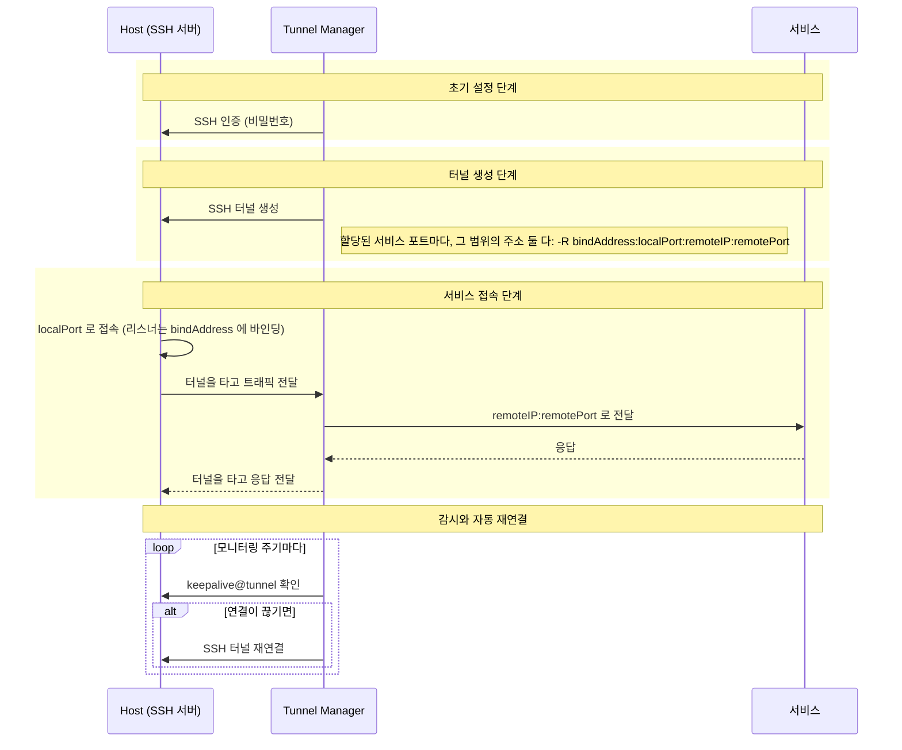
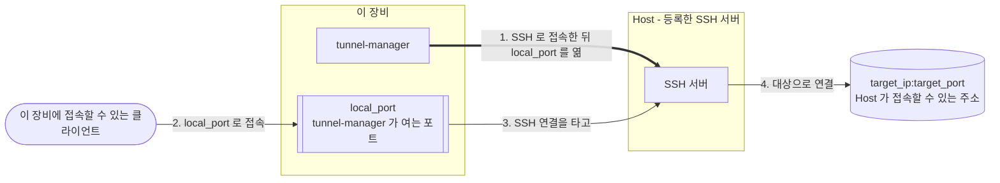
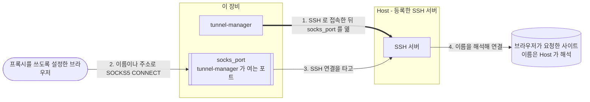

# Tunnel Manager 레퍼런스

[English](reference.md) | [README 로 돌아가기](README.ko.md)

설치와 설정과 API 와 각 화면이 하는 일까지, 여기에 전부 있습니다. 짧은 쪽은
[README](README.ko.md) 입니다.

Tunnel Manager 는 SSH 터널을 열고 그 상태를 계속 유지합니다. 접속할 SSH 서버(**Host**)와
내보낼 서비스(**서비스 포트**)를 등록하고 어느 Host 가 어느 서비스 포트를 담당할지 정해 두면,
할당 하나마다 터널을 하나씩 만들고 그때부터 계속 지켜봅니다. REST API 와 브라우저 UI 와
터널을 한 바이너리가 전부 맡습니다.

여기서 만드는 터널은 **역방향(reverse)** 터널입니다. 즉 대기 소켓이 Tunnel Manager 가 실행되는
장비가 아니라 **Host 쪽에** 열립니다. Host 의 `local_port` 로 접속한 클라이언트는 SSH 연결을
타고 Tunnel Manager 까지 오고, Tunnel Manager 가 `service_ip:service_port` 로 연결해 양방향으로
데이터를 전달합니다. Tunnel Manager 만 접속할 수 있는 서비스를 Host 에서 쓸 수 있게 만드는 것이
이 구조입니다. [로컬 포워딩](#로컬-포워딩)과 [Host 의 SOCKS5 프록시](#host-의-socks5-프록시)만
방향이 반대입니다. 포트는 이 장비에 열리고 연결은 Host 에서 나갑니다.

| 등록하는 것 | 항목 | 무엇인가 |
|-------------|------|----------|
| Host | `ip`, `port`, `user`, `private_key`, `key_passphrase`, `password`, `description`, `enabled`, `socks_enabled`, `socks_port`, `socks_bind_scope`, `socks_allowed_sources` | Tunnel Manager 가 접속하는 SSH 서버입니다. 개인키로 접속할 수도, 비밀번호로 접속할 수도, 둘 다 등록할 수도 있으며 둘 중 하나는 반드시 있어야 합니다. 키와 키 암호와 비밀번호는 모두 암호화해서 저장합니다. `socks_` 항목은 이 Host 가 가질 수 있는 [SOCKS5 프록시](#host-의-socks5-프록시)입니다. |
| 서비스 포트 | `service_ip`, `service_port`, `local_port` | 내보낼 서비스와, 그 서비스를 담당하는 Host 마다 열 포트입니다. |
| 할당 | `host_id`, `sp_id`, `bind_scope` | Host 하나와 서비스 포트 하나를 짝지은 것입니다. 이 Host 가 이 서비스 포트를 담당한다는 뜻이며, 터널은 여기서 만들어집니다. Host 나 서비스 포트를 등록할 때 같이 만들어집니다. `bind_scope` 는 포워딩된 포트를 Host 의 어느 범위에 열도록 요청할지이고, `loopback` 또는 `wildcard` 이며, 안 주면 와일드카드입니다. |
| 로컬 포워딩 | `local_port`, `bind_scope`, `target_ip`, `target_port`, `description` | 이 장비에 여는 포트입니다. 거기로 온 연결을 Host 하나의 SSH 연결을 타고 Host 가 보는 `target_ip:target_port` 로 나릅니다. 그 Host 에만 딸립니다. |

`ip` 와 `service_ip` 는 IPv4 와 IPv6 를 모두 받습니다. IPv6 주소는 `2001:db8::1` 처럼 그대로 적고,
연결할 때 필요한 대괄호는 쓰이는 자리에서 붙습니다. `fe80::1%eth0` 같은 영역(zone) 표기는 거부합니다.

**활성(enabled) Host 의 할당 하나가 터널 하나입니다.** 서비스 포트 셋을 담당하는 Host 는 터널
셋을 실행하고, 아무것도 담당하지 않는 Host 는 서비스 포트가 몇 개 저장돼 있든 터널을 하나도
실행하지 않습니다. Host 를 등록하면 그 시점에 있는 서비스 포트 전부가 그 Host 에 할당되고,
서비스 포트를 등록하면 그 시점에 있는 Host 전부가 그것을 받습니다. 요청이 따로 지정하지 않는
한 그렇기 때문에, 할당에 손대지 않는 설치본은 예전과 똑같이 Host 와 서비스 포트의 모든 짝을
실행합니다. 그다음부터 어느 Host 가 무엇을 담당하는지는 Hosts 화면의 행에 있는
**Service ports** 버튼과 [Host 가 담당하는 서비스 포트](#host-가-담당하는-서비스-포트) 로 바꿉니다.

**Host 접속은 키로도, 비밀번호로도, 둘 다로도 합니다.** `private_key` 에 PEM 개인키 파일의
내용을 그대로 보내고, 키에 암호가 걸려 있으면 `key_passphrase` 를 같이 보냅니다. 키는 등록하는
그 자리에서 읽어 보기 때문에, 키가 아닌 파일, 암호가 필요한데 암호를 안 준 키, 키를 못 여는
암호는 다음 접속 때가 아니라 그 자리에서 거부됩니다. 둘 다 등록하면 키를 먼저 시도하고
비밀번호로 넘어가므로, 터널이 실행 중인 Host 에 키를 새로 넣어도 터널이 끊기지 않습니다.
터널이 이미 연결된 동안 등록한 키는 그 다음 연결부터 쓰입니다.

키와 키 암호와 비밀번호는 프로세스 밖으로 다시 나가지 않습니다. 어떤 응답에도 실리지 않고,
Host 를 수정할 때 그 칸들은 비어 있는 채로 옵니다. 빈 칸은 저장된 값을 그대로 둔다는 뜻이고,
키를 보내면 저장된 키와 그 키의 암호가 함께 바뀝니다.

**바이너리 말고 따로 설치할 것이 없습니다.** 데이터베이스는 프로세스가 스스로 만드는 SQLite
파일 하나이고, 설정은 전부 그 파일 안에 있으며 브라우저 화면에서 고칩니다. UI 는 실행 파일
안에 들어 있습니다. 데이터베이스 서버도, 설정 파일도, 옆에 딸려 다녀야 할 디렉터리도 없습니다.

## 목차

- [시스템 요구사항](#시스템-요구사항)
- [동작 방식](#동작-방식)
- [설치 및 실행](#설치-및-실행)
- [HTTPS 와 인증서](#https-와-인증서)
- [첫 기동과 계정 설정](#첫-기동과-계정-설정)
- [내장 UI](#내장-ui)
- [설정](#설정)
- [업데이트](#업데이트)
- [제거](#제거)
- [스크립트에서 API 호출하기](#스크립트에서-api-호출하기)
- [OpenAPI 와 Swagger UI](#openapi-와-swagger-ui)
- [API 엔드포인트](#api-엔드포인트)
- [터널 상태 읽기](#터널-상태-읽기)
- [암호화 키](#암호화-키)
- [비root로 실행하는 경우](#비root로-실행하는-경우)
- [라이선스](#라이선스)

## 시스템 요구사항

릴리즈 바이너리를 실행하는 데는 아무것도 필요 없습니다. SQLite 엔진도 UI 도, 그 밖에 필요한
것도 전부 바이너리 안에 들어 있습니다.

| 하려는 일 | 필요한 것 |
|-----------|-----------|
| 릴리즈 바이너리 실행 | 없음 |
| 소스에서 빌드 | Go 1.26 이상 |
| 컨테이너로 실행 | Docker 와 Docker Compose |

SQLite 드라이버가 순수 Go 구현(`modernc.org/sqlite` 위의 `github.com/glebarez/sqlite`)이라서
바이너리는 `CGO_ENABLED=0` 으로 빌드되고, 내려받은 장비에 C 라이브러리가 없어도 됩니다.

### 지원 플랫폼

`make release` 가 아래 각각에 대해 바이너리를 하나씩 만듭니다. 그 밖에 Go 가 지원하는 곳에서도
`go build` 로 빌드됩니다. 아래 주의사항만 보면 됩니다.

| 플랫폼 | 릴리즈 바이너리 |
|--------|-----------------|
| Linux amd64 | `tunnel-manager-linux-amd64` |
| Linux arm64 | `tunnel-manager-linux-arm64` |
| macOS 인텔 | `tunnel-manager-darwin-amd64` |
| macOS 애플 실리콘 | `tunnel-manager-darwin-arm64` |
| Windows amd64 | `tunnel-manager-windows-amd64.exe` |

유닉스에서는 기동할 때 프로세스가 열 수 있는 파일 디스크립터 한도를 스스로 올립니다. 터널 하나마다
여러 개를 쓰기 때문입니다. Windows 에는 프로세스마다 걸리는 그런 한도가 없어서 이 단계가 아무것도
하지 않습니다. 그 밖에 다른 점은 없습니다.

같이 들어 있는 systemd 유닛은 Linux 용입니다. 다른 플랫폼에서는 그 시스템이 쓰는 방법으로 프로세스를
계속 띄워 두어야 합니다.

**실제로 실행해 본 것은 Linux 바이너리뿐입니다.** 나머지는 그 플랫폼의 컴파일러와 vet 검사를 통과한
것까지만 확인했습니다.

## 동작 방식

### 조정 루프

Tunnel Manager 는 어떠해야 하는지와 지금 어떠한지를 끊임없이 비교합니다.

| 상태 | 무엇인가 | 어디서 오나 |
|------|----------|-------------|
| 목표 상태 | 활성 Host 에 할당된 서비스 포트 전부 | `hosts`, `service_ports`, `host_service_ports` 행 |
| 실제 상태 | 지금 실행 중인 터널 | 프로세스 안의 매니저와 그것이 쓰는 `tunnels` 행 |

**조정 패스(reconcile pass)** 는 둘을 비교해서 차이만 메웁니다. 목표에 있는데 실행 중이 아닌
것은 시작하고, 실행 중인데 목표에 없는 것은 중지하고, 접속 정보(서버 주소, 원격 주소, 로컬
포트, 사용자, 비밀번호)가 행과 어긋난 채 실행 중인 터널은 중지하고 새 정보로 다시 시작합니다.

지금 API 요청은 이렇게 처리됩니다.

```text
POST /api/service-port
  트랜잭션 { INSERT INTO service_ports } 커밋
  조정 루프 깨우기
  201 Created          <- 터널을 기다리지 않고 바로 응답한다

조정 루프
  목표 = 활성 Host 의 할당
  실제 = 실행 중인 터널
  목표에 있는데 실행 중이 아니다 -> 시작한다
  실행 중인데 목표에 없다        -> 중지한다
  실행 중인데 설정이 옛것이다    -> 중지하고 다시 시작한다
```

패스는 세 시점에 실행됩니다.

| 언제 | 왜 |
|------|-----|
| 기동할 때, API 가 아무것도 응답하기 전에 | 첫 요청이 조회하는 시점에는 저장된 행의 터널이 이미 시작돼 있습니다 |
| `POST`·`PUT`·`DELETE` 가 커밋된 직후 | 다음 주기를 기다리지 않고 바로 반영됩니다 |
| 조정 주기마다 (기본 5초) | 실패한 패스가 못 한 일을 다시 시도합니다 |

터널이 생기기 전에 응답이 나가므로, **쓰기가 성공했다고 터널이 연결됐다는 뜻은 아닙니다.**
그것은 `GET /api/status` 로 확인합니다. [터널 상태 읽기](#터널-상태-읽기)를 보십시오.

### 할당

**터널 하나는 할당 하나를 뜻하고 그 밖의 무엇도 뜻하지 않습니다.** `host_service_ports`
테이블에는 Host 와 서비스 포트의 짝마다 행이 하나씩 있고, 그 짝이 행의 전부라서 같은 할당을
두 번 담는 일은 데이터베이스가 직접 막습니다.

| 무슨 일이 일어나면 | 할당은 어떻게 되나 |
|--------------------|--------------------|
| Host 를 등록하면 | 그 시점에 저장돼 있는 서비스 포트를 전부 받습니다. 요청이 `assign_all_service_ports` 를 false 로 보내면 그러지 않습니다 |
| 서비스 포트를 등록하면 | 그 시점에 저장돼 있는 Host 가 전부 그것을 받습니다. 요청이 `assign_to_all_hosts` 를 false 로 보내면 그러지 않습니다 |
| Host 를 비활성으로 바꾸면 | 할당은 그대로 남습니다. 그 Host 의 터널만 멈추고, 다시 활성으로 바꾸면 다시 연결됩니다 |
| Host 나 서비스 포트를 지우면 | 그것을 가리키는 할당도 같은 트랜잭션에서 지워집니다 |
| 이 테이블이 생긴 버전으로 올린 뒤 첫 기동 | 모든 Host 가 모든 서비스 포트를 받습니다 |

마지막 줄은 업그레이드를 위한 것입니다. 테이블이 생기기 전의 조정 루프는 모든 Host 가 모든
서비스 포트를 담당한다고 전제했기 때문에 그 사실이 어디에도 저장돼 있지 않았고, 새 테이블을
비운 채로 기동하면 "아무 Host 도 아무것도 담당하지 않는다" 로 읽혀서 터널이 전부 끊깁니다.
그래서 테이블을 만드는 그 기동에서만 채우고 그 뒤로는 채우지 않습니다. 나중에 또 채우면
그동안 해제해 둔 할당이 되돌아오는데, 그것을 해제해 두라고 있는 테이블이기 때문입니다.

없는 Host 나 없는 서비스 포트를 가리키는 할당은 아무것도 만들지 못하고 조정 패스가 그냥
지나갑니다. 주소도 포트도 접속 정보도 전부 사라진 행에 있었으니 만들 재료가 없습니다.

**포워딩된 포트가 어디까지 닿는지는 할당에 붙어 있습니다.** 행의 `bind_scope` 가 그 포트를
Host 의 어느 주소에 열도록 요청할지이고, 주소 하나가 아니라 **둘을 묶은 범위**를 가리킵니다.

| `bind_scope` | Host 에 요청하는 주소 | 무엇을 위한 것인가 |
|--------------|------------------------|--------------------|
| `loopback` | `127.0.0.1` 과 `::1` | 그 포트를 Host 자신에서만 응답하게 하려는 것 |
| `wildcard`, 그리고 빈 값 | `0.0.0.0` 과 `::` | 그 포트를 Host 에 닿을 수 있는 곳이면 어디서나 응답하게 하려는 것 |

**범위를 고르면 두 주소를 다 요청합니다.** 두 주소 체계는 서로를 대신하지 못하기 때문입니다.
`127.0.0.1` 에 연 포트는 `::1` 로 붙는 클라이언트에 닿지 않고, 두 와일드카드도 마찬가지입니다.
범위를 고른 사람은 주소 체계 하나가 아니라 그 시스템을 두고 고른 것이므로 둘 다 요청하고, SSH
서버가 그중 무엇을 받아들였는지는 터널 행에 나옵니다.
[터널 상태 읽기](#터널-상태-읽기)를 보십시오. 주소를 직접 적는 칸은 없습니다. 이 프로그램은
Host 에 인터페이스를 물어보지 않으므로 여기 적는 주소는 추측이고, 틀린 추측은 열리지 않는
포워딩 하나로 조용히 끝납니다.

범위를 할당이 들고 있는 이유는 Host 와 서비스 포트 양쪽에 다 할 말이 있기 때문입니다. Host
하나가 서비스 포트를 여럿 담당하는데 그중 하나는 그 시스템 안에서만 쓰여야 하고 다른 하나는
바깥에서 닿아야 할 수 있습니다. 서비스 포트 하나를 Host 여럿이 담당하는데 그중 일부만 남이
들어와서는 안 되는 망에 면해 있을 수 있습니다. 한쪽에 두면 다른 한쪽에 답 하나가 강요됩니다.

컬럼이 생기기 전에 저장된 할당은 빈 값을 들고 있고 그것이 곧 와일드카드라서, 업그레이드가
지금 도는 터널의 도달 범위를 좁히지 않습니다. v3.8.3 에서 **Host** 에 바인드 주소를 지정해 둔
설치본은 그 답이 그 Host 의 모든 할당으로 옮겨집니다. 거기 적힌 것이 루프백 주소면
`loopback` 이 되고, 그 밖의 답은 빈 값이든 시스템의 어느 인터페이스 주소든 전부 와일드카드가
됩니다. 할당 자체를 한 번만 채우는 것과 마찬가지로 컬럼을 추가하는 그 기동에서만 옮기고 그
뒤로는 옮기지 않습니다. 나중에 또 옮기면 그동안 골라 둔 것을 덮어쓰기 때문입니다.

### 터널 하나의 동작



**이 모든 것에 앞서 Host 의 호스트 키를 검사합니다.** 검사는 핸드셰이크 안에서 이루어지므로
그 Host 가 신뢰하는 서버가 아니면 비밀번호도 개인키도 건네지 않고, 아무도 키를 승인하지 않은
Host 는 터널을 하나도 만들지 못합니다. [호스트 키 승인](#호스트-키-승인)을 보십시오.

요청하는 주소는 할당의 `bind_scope` 가 가리키는 둘이고, 아무것도 고르지 않았으면
와일드카드입니다. [할당](#할당)을 보십시오. 둘 다 SSH 연결 하나 위에서 요청하므로 **터널
하나가 포워딩 둘을 가집니다.** 서버가 한쪽만 열고 다른 쪽을 거부하면 그 터널은 요청한 것의
절반으로만 트래픽을 나릅니다. 그래도 행은 하나입니다. 사람이 고른 것이 한 줄이기 때문입니다.

Host 쪽 리스너가 정말 요청한 자리에 열리는지는 Host 의 SSH 서버 설정에 달려 있습니다.
`GatewayPorts` 가 꺼져 있으면 무엇을 요청했든 루프백 주소에 바인딩되고, 켜져 있으면 루프백
범위를 골랐더라도 모든 인터페이스에 바인딩됩니다. 터널이 연결된 뒤에는 tunnel-manager 가 그
포워딩된 포트에 직접 접속해 보고 결과를 알려줍니다.
[포워딩된 포트에 접속되는지](#포워딩된-포트에-접속되는지)를 보십시오.

모니터링 주기와 조정 주기는 다른 일을 합니다. 모니터는 이미 연결된 터널이 아직 응답하는지
확인하고 끊겼으면 다시 연결합니다. 조정 루프는 동작해야 할 터널이 애초에 전부 있는지를 봅니다.

### 로컬 포워딩

**로컬 포워딩은 터널과 방향이 반대입니다.** 터널은 Host 가 포트를 열고 거기로 온 것을 이
장비가 닿는 서비스로 나릅니다. 로컬 포워딩은 **이 장비가** `local_port` 를 열고, 거기로 온
연결을 Host 의 SSH 연결을 타고 Host 가 닿는 주소 `target_ip:target_port` 로 나릅니다.
`ssh -L` 이 하는 일을 터널처럼 유지하는 것입니다.



**로컬 포워딩은 Host 하나에 딸립니다.** 따로 된 행이고, 만든 그 Host 만 담당하며 할당이
없습니다. 서비스 포트는 담당하는 Host 여럿이 나눠 쓰지만 로컬 포워딩은 그렇지 않습니다.
Hosts 화면에서 그 Host 행의 **Local forwards** 버튼이나 API 로 추가하고 고치고 켜고 끄고
지웁니다.
[Host 의 로컬 포워딩](#host-의-로컬-포워딩)을 보십시오. Host 를 지우면 그 로컬 포워딩도 같은
트랜잭션에서 지워집니다.

**로컬 포워딩마다 번호가 붙고, 번호는 Host 별로 매겨집니다.** 응답의 `number` 가 그것이고 1 부터
셉니다. 어느 Host 의 첫 로컬 포워딩도, 다른 Host 의 첫 로컬 포워딩도 똑같이 1 번이므로, 하나를
가리키려면 Host 와 번호가 같이 있어야 합니다. `/api/host/1/local-forward/1` 과
`/api/host/2/local-forward/1` 은 서로 다른 로컬 포워딩입니다. 새로 추가하면 **그 Host 가 아직 쓰지 않는 가장
작은 번호**를 받습니다. 지워서 생긴 빈자리를 다음에 추가하는 것이 받으므로, 한 Host 의 번호는
빠진 자리 없이 1, 2, 3 으로 이어집니다. 대신 로그나 메모에 적어 둔 번호는 그때 그 행이 아니라
지금 그 번호를 가진 행을 가리킵니다.

| 항목 | 무엇인가 |
|------|----------|
| `local_port` | 이 장비에 여는 포트. 1 ~ 65535 |
| `bind_scope` | 이 장비의 어느 주소에 열지. 아래 참고 |
| `target_ip` | Host 에서 연결해 나갈 곳. IPv4 나 IPv6 주소이며 이름은 받지 않음 |
| `target_port` | 대상의 포트. 1 ~ 65535 |
| `description` | 자유 텍스트 |
| `enabled` | 도는지 여부. 생성에서 빼면 도는 로컬 포워딩이 되고, 수정에서 빼면 저장된 값을 유지 |

**여기서 `bind_scope` 는 Host 가 아니라 이 장비의 이야기입니다.** 할당과 같은 두 낱말을 받고
같은 주소 쌍을 가리킵니다.

| `bind_scope` | 이 장비에서 `local_port` 를 여는 곳 |
|--------------|--------------------------------------|
| `wildcard`, 그리고 빈 값 | `0.0.0.0` 과 `::`. 기본값입니다 |
| `loopback` | `127.0.0.1` 과 `::1` |

**와일드카드는 이 장비를 Host 쪽 망으로 들어가는 문으로 만듭니다.** 이 장비의 `local_port`
에 닿는 사람이면 누구나 Host 에 로그인하지 않고 Host 가 보는 `target_ip:target_port` 에
닿습니다. SSH 로그인은 tunnel-manager 가 이미 해 두었기 때문입니다. 이 장비 밖에서 쓸 일이
없으면 `loopback` 을 고르고, 쓸 일이 있으면 그 포트 앞에 방화벽을 두십시오.

쌍의 두 주소를 각자의 주소 체계로 다 열어 보고 **하나만 열려도 진행합니다.** IPv6 가 없는
장비는 IPv4 쪽만 엽니다. 둘 다 안 열리면, 예를 들어 다른 프로그램이 그 포트를 쥐고 있으면,
`error` 를 알리고 다시 시도합니다. Windows 에서는 wildcard 를 두 주소 체계를 함께 받는 `::`
소켓 하나로 열기 때문에, 다른 프로그램이 어느 주소로든 그 포트를 쥐고 있으면 `error` 입니다.

**`local_port` 는 어느 Host 의 것이든 로컬 포워딩과 SOCKS5 프록시 전체에서 유일합니다.** 전부
같은 이 장비에 포트를 열기 때문입니다. 다른 로컬 포워딩이나 Host 의
[SOCKS5 프록시](#host-의-socks5-프록시)가 이미 쓰는 포트로 만들려는 로컬 포워딩은 `409` 로
거부되고, 이 서버가 듣도록 저장된 포트(`api_port`)나, 기동이 다른 포트로 옮겨 갔을 때 지금
듣고 있는 포트와 같은 것도 마찬가지입니다. 반대 방향도 같습니다. 설정 화면 저장이나 설정
가져오기로 `api_port` 를 바꿀 때 로컬 포워딩이나 SOCKS5 프록시가 여는 포트면 `409` 로 거부하고
아무것도 저장하지 않습니다. 거부 응답에는 그 로컬 포워딩, 또는 `socks_host` 에 그 Host 가 실리고,
`suggested_port`(그 포트 위로 로컬 포워딩, SOCKS5 프록시, 저장된 `api_port`, 지금 듣고 있는 포트,
요청한 `api_port` 어느 것도 쓰지 않는 첫 포트)가 같이 실립니다. 설정 화면은 로컬 포워딩이나
프록시를, 저장일 때는 API 포트를 대신 다른 포트로 옮기는 창을 띄웁니다. 1024 미만 포트는 이
프로세스가 직접 여므로 [비root로 실행하는 경우](#비root로-실행하는-경우)의 규칙을 따릅니다.

**꺼진 로컬 포워딩도 `local_port` 를 계속 쥡니다.** 포트를 열지 않고 SSH 연결도 하지 않지만,
위의 검사는 모두 도는 것과 똑같이 셉니다. 그래서 다른 로컬 포워딩, SOCKS5 프록시, `api_port`
가 그 포트를 쓰려 하면 똑같이 `409` 로 거부되고, 다시 켤 때 포트가 이미 남에게 넘어가 있는
일이 없습니다.

**로컬 포워딩은 자신이 켜져 있고 그 Host 가 활성일 때만 돕니다.** 끄면 다음 조정 때 멈춰서
포트를 닫고 SSH 연결을 끊습니다. 조정 루프가 터널과 같은 방식으로 로컬
포워딩을 띄우고 다시 만들고 멈춥니다. 행 하나가 자기 SSH 연결 하나이고, Host, 접속 정보,
신뢰하는 호스트 키, 포트, 범위, 대상 중 무엇이 바뀌면 멈췄다가 다시 띄웁니다. 설명만 바꾸면
아무것도 다시 만들지 않습니다.

**`local_port` 는 SSH 연결이 서 있는 동안만 열려 있습니다.** 연결이 선 뒤에 열고 연결이
끊기면 닫습니다. 그래서 실어 나를 Host 가 없는 동안 접속한 클라이언트는 받아졌다가 끊기는 것이
아니라 곧바로 거부됩니다. 연결은 터널처럼 모니터링 주기마다 확인하고, 끊긴 연결은 같은 주기
뒤에 다시 연결합니다.

**로그인이 거부되거나 호스트 키가 거부되면 멈춥니다.** 같은 비밀번호나 키로 다시 해 봐야 똑같이
실패하므로, 만들어진 재료가 바뀔 때까지 기다립니다. Host 에 새 접속 정보를 넣거나 키를
승인하면 됩니다. [호스트 키 승인](#호스트-키-승인)을 보십시오.

`connected` 는 SSH 연결이 서 있고 `local_port` 가 열려 있다는 뜻입니다. 대상이 응답한다는
뜻은 아닙니다. 클라이언트 연결마다 Host 에서 따로 대상으로 연결하고, 대상에 닿지 못하면 그
연결 하나만 닫히며 이유는 로그에 남습니다. Host 의 SSH 서버도 이 방향의 포워딩을 허용해야
합니다. OpenSSH 는 `AllowTcpForwarding` 이 `no` 나 `remote` 면 거부합니다.

| `status` | 뜻 |
|----------|----|
| `disabled` | Host 가 비활성입니다. 로컬 포워딩이 켜져 있든 꺼져 있든 아무것도 열지 않습니다 |
| `off` | Host 는 활성이고 로컬 포워딩이 꺼져 있습니다. 아무것도 열지 않습니다 |
| `stopped` | Host 도 로컬 포워딩도 켜져 있는데 도는 로컬 포워딩이 없습니다. 조정 루프가 아직 그 행에 오지 않았거나 띄우는 데 실패한 것이고, 실패했다면 로그에 나옵니다 |
| `starting` | 첫 연결을 맺는 중입니다 |
| `connected` | SSH 연결이 서 있고 `local_port` 가 열려 있습니다 |
| `reconnecting` | 연결이 끊겼거나 시도가 실패해서 다시 연결하는 중입니다. `retry_count` 가 그 횟수입니다 |
| `error` | 마지막 시도가 실패했고 `last_error` 에 이유가 있습니다. 로그인이 거부된 경우는 Host 를 고칠 때까지 여기 머물고, 그 밖에는 모니터링 주기 뒤에 다시 시도합니다 |
| `host_key_unapproved`, `host_key_mismatch` | 터널과 마찬가지로 호스트 키가 거부됐습니다. 키를 승인할 때까지 여기 머뭅니다 |

**상태는 로컬 포워딩을 돌리는 프로세스의 메모리에 있고**, 로컬 포워딩 API 와
`GET /api/status` 가 그것을 돌려줍니다. `GET /api/status` 는 터널 옆에 로컬 포워딩을 같이
싣고 터널과 합쳐서 셉니다. [터널 상태 읽기](#터널-상태-읽기)를 보십시오.

**`enabled` 가 생긴 업그레이드는 로컬 포워딩을 전부 켜진 채로 둡니다.** 그 전에 저장된
로컬 포워딩은 모두 돌고 있었으므로, 그 열을 추가하는 기동이 전부를 켜고 다른 기동은 그러지
않습니다. 그 뒤에 끈 로컬 포워딩은 재시작해도 꺼진 채로 있습니다.

**번호가 생긴 업그레이드는 기동할 때 저장된 로컬 포워딩에 번호를 매깁니다.** Host 마다 1 부터,
만들어진 순서대로 매깁니다. 목록을 그려 온 순서가 그 순서였으므로, 로컬 포워딩은 이미 보이던
자리에 그대로 나오고 부르는 방법 말고는 달라지는 것이 없습니다. 전체가 한 트랜잭션입니다. 전부
번호를 받거나, 아니면 저장된 행이 그대로 남은 채 기동이 멈추고 이유를 알려줍니다. 옛 모양을
발견한 기동만 이 일을 하므로, 새 버전을 한 설치본에 두 번 띄워도 번호는 한 번만 매겨집니다.

**내보내기 파일에는 Host 마다 그 로컬 포워딩이 실립니다.** Host 의 `local_forwards` 가
그것입니다. [내보내기와 가져오기](#내보내기와-가져오기)를 보십시오.

### Host 의 SOCKS5 프록시

**Host 는 SOCKS5 프록시를 하나 가질 수 있습니다.** `ssh -D` 가 하는 일을 로컬 포워딩처럼
유지하는 것입니다. **이 장비가** `socks_port` 를 열고, 그 포트를 프록시로 쓰는 브라우저가 SOCKS5
`CONNECT` 로 사이트를 요청하면, 그 사이트로 가는 연결은 Host 의 SSH 연결을 타고 Host 에서
나갑니다. 대상은 브라우저가 연결마다 정하므로 포트 하나로 Host 가 닿는 곳 어디에나 닿습니다.
이름은 받은 그대로 Host 에 넘겨 Host 쪽에서 해석하므로, Host 쪽 망에서만 통하는 이름도
쓸 수 있습니다.



**Hosts 화면의 Host 추가·수정 폼에서 켭니다.** **SOCKS5 프록시 켜기** 를 체크하면 포트, 여는
범위, **허용할 접속 주소** 칸이 나타나고, 포트는 1080 으로 채워져 있습니다. API 로는 같은 네
항목을 Host 에 실어 보냅니다. [Host 관리](#host-관리)를 보십시오.

| 항목 | 무엇인가 |
|------|----------|
| `socks_enabled` | Host 가 프록시를 가질지. 보내지 않으면 꺼짐 |
| `socks_port` | 이 장비에 여는 포트. 1 ~ 65535. 프록시가 켜져 있으면 필수 |
| `socks_bind_scope` | 이 장비의 어느 주소에 열지. `wildcard`(`0.0.0.0` 과 `::`) 또는 `loopback`(`127.0.0.1` 과 `::1`). 안 주면 와일드카드 |
| `socks_allowed_sources` | 클라이언트가 접속해 올 수 있는 주소. 비우면 모든 주소를 받음 |

**기본은 와일드카드이고, 프록시는 비밀번호를 묻지 않습니다.** 프록시는 보통 다른 장비의
브라우저가 쓰는 것이라 `loopback` 으로 열면 쓸모가 없으므로, 따로 고르지 않으면 모든
인터페이스에 엽니다. 그러면 이 장비의 `socks_port` 에 닿는 사람은 누구나 Host 쪽 망으로
들어올 수 있습니다. 와일드카드로 여는 프록시에는 **허용할 접속 주소를 채우십시오.** Chrome 과
Firefox 에는 SOCKS5 프록시에 비밀번호를 넣을 자리가 없으므로, 로그인 대신 클라이언트의
출발지 주소로 프록시를 제한합니다. 그 포트 앞의 방화벽이 나머지 절반입니다.

`socks_allowed_sources` 는 IPv4·IPv6 주소와 CIDR 을 쉼표나 공백으로 나눠 받습니다. 예:
`203.0.113.0/24, 198.51.100.7`. 주소 하나는 그 주소만을 뜻합니다. IPv6 꼴로 적은 IPv4 주소
`::ffff:192.0.2.1` 은 `192.0.2.1` 과 같습니다. 읽을 수 없는 값이나 `%eth0` 같은 영역(zone)이
붙은 주소는 `400` 으로 거부하고 아무것도 저장하지 않습니다.

**목록에 없는 주소에서 온 클라이언트는 곧바로 닫힙니다.** 한 바이트도 읽지 않고 SOCKS 응답도
보내지 않습니다. 거부는 프록시마다 1 분에 한 번까지만 `tunnel.socks_source_refused` 로
기록하고, 지난 기록 뒤로 거부한 건수를 같이 남깁니다. 누가 포트를 훑어도 로그가 넘치지
않습니다.

프록시가 알아듣는 것은 인증 없는 SOCKS5 의 `CONNECT` 이고, 대상은 IPv4 주소, IPv6 주소,
이름입니다.

| 클라이언트가 요청하는 것 | 받는 것 |
|--------------------------|---------|
| `CONNECT` | 연결. Host 가 연결하지 못하면 SOCKS 실패 응답 |
| `BIND`, `UDP ASSOCIATE` | "지원하지 않는 명령" 응답 |
| 사용자 이름과 비밀번호, 그리고 인증 없는 방식은 안 받음 | 받을 수 있는 방식이 없다는 응답 뒤 연결을 닫음 |
| SOCKS4 나 SOCKS4a | 응답 없이 연결을 닫음 |

Host 가 닿지 못하는 대상에는 SSH 서버가 알려준 내용에 맞춰 SOCKS 실패 응답을 줍니다. 연결
거부, 네트워크나 호스트에 닿지 못함, SSH 서버가 허용하지 않음, 그 밖에는 일반 실패입니다.
Host 에서의 연결에는 10 초를 주고, 클라이언트가 요청을 보내는 데에도 10 초를 줍니다. 이런
실패는 브라우저를 쓰다 보면 늘 생기는 일이라 `debug` 수준으로만 기록합니다.

**`socks_port` 는 이 장비에서 유일합니다.** 프록시를 켜거나 다른 포트로 옮길 때, 다른 Host 의
프록시가 여는 포트, 어느 Host 든 로컬 포워딩이 여는 포트, 이 서버가 듣도록 저장된
포트(`api_port`), 지금 듣고 있는 포트면 `409` 로 거부합니다. 켜져 있는 프록시는 Host 가
비활성이어도 그 포트를 쥡니다. Host 를 활성으로 바꾸는 순간 열리기 때문입니다. 반대 방향도
같아서, 로컬 포워딩과 새 `api_port` 는 프록시가 쥔 포트를 받지 못합니다.
[로컬 포워딩](#로컬-포워딩)을 보십시오. 1024 미만 포트는
[비root로 실행하는 경우](#비root로-실행하는-경우)의 규칙을 따릅니다.

**프록시는 그 Host 가 활성이고** 프록시가 포트와 함께 켜져 있을 때 돕니다. 같은 Host 의 터널이나
로컬 포워딩과 따로 자기 SSH 연결 하나를 쓰고, 조정 루프가 로컬 포워딩처럼 띄우고 다시 만들고
멈춥니다. 프록시의 포트, 범위, 허용 주소나 Host 의 주소, 접속 정보, 신뢰하는 호스트 키가
바뀌면 멈췄다가 다시 띄우며, 그 프록시를 지나던 연결도 같이 끊깁니다.

**`socks_port` 는 SSH 연결이 서 있는 동안만 열려 있습니다.** `local_port` 와 같습니다. 연결이
선 뒤에 열고 끊기면 닫으며, 모니터링 주기 뒤에 다시 연결합니다. 로그인이 거부되거나 호스트
키가 거부되면 만들어진 재료가 바뀔 때까지 멈춥니다. [호스트 키 승인](#호스트-키-승인)을
보십시오.

상태는 Host 의 `socks_status` 에, 그 옆 `socks_last_error` 와 함께 실립니다. Hosts 화면은
**SOCKS5 프록시** 칸에 포트와 상태 배지로 보여줍니다. 프록시가 없는 Host 는 그 칸이 `-` 이고,
오류는 행 아래 줄에 나옵니다.

| `socks_status` | 뜻 |
|----------------|----|
| `off` | 프록시가 꺼져 있습니다. 아무것도 열지 않습니다 |
| `disabled` | 프록시는 켜져 있고 Host 가 비활성입니다. 아무것도 열지 않습니다 |
| `stopped` | Host 는 활성인데 도는 프록시가 없습니다. 조정 루프가 아직 오지 않았거나 띄우는 데 실패한 것이고, 실패했다면 로그에 나옵니다 |
| `starting`, `connected`, `reconnecting`, `error`, `host_key_unapproved`, `host_key_mismatch` | 도는 프록시가 알리는 값이고, 뜻은 로컬 포워딩과 같습니다. [로컬 포워딩](#로컬-포워딩)을 보십시오 |

`connected` 는 SSH 연결이 서 있고 `socks_port` 가 열려 있다는 뜻이지 사이트가 응답한다는 뜻은
아닙니다. 상태는 메모리에 있고, `GET /api/status` 에는 없으며 상태 화면도 세지 않습니다. Host 의
SSH 서버는 로컬 포워딩처럼 이 방향의 포워딩을 허용해야 합니다.

**쓰려면 브라우저가 이 장비를 가리키게 합니다.** 프록시가 `192.0.2.20:1080` 에 있다면:

- Firefox (영어 화면 기준): **Settings**, **Network Settings**, **Manual proxy configuration**.
  **SOCKS Host** 와 **Port** 에 `192.0.2.20` 과 `1080` 을 넣고 **SOCKS v5** 를 고른 뒤,
  **Proxy DNS when using SOCKS v5** 를 체크합니다. 그래야 이름을 브라우저가 도는 장비가 아니라
  Host 가 해석합니다.
- Chrome: 명령줄에 프록시를 주고 띄웁니다.

  ```bash
  google-chrome --proxy-server="socks5://192.0.2.20:1080"
  ```

  Chrome 은 `127.0.0.1` 같은 루프백 주소를 프록시로 보내지 않습니다. Host 가 자기 루프백
  주소에서 내주는 페이지에 닿으려면 `--proxy-bypass-list="<-loopback>"` 를 더합니다.

**내보내기 파일에는 Host 마다 그 프록시가 실립니다.** 위의 네 항목이 그 Host 에 들어갑니다.
그 항목이 없는 파일은 Host 의 프록시를 그대로 둡니다.
[내보내기와 가져오기](#내보내기와-가져오기)를 보십시오.

## 설치 및 실행

**설치라고 할 것이 파일 하나 놓기로 끝납니다.** 릴리즈 페이지에서 플랫폼에 맞는 바이너리를 내려받아
실행 권한을 주고 띄우면 됩니다. 데이터베이스 파일도 계정도 나머지 전부도 첫 기동이 알아서
만듭니다.

```bash
chmod +x tunnel-manager-linux-amd64
./tunnel-manager-linux-amd64
```

플래그는 이것이 전부입니다.

| 플래그 | 하는 일 |
|--------|---------|
| `-db <경로>` | 데이터베이스 파일. 설정과 등록한 호스트와 계정이 전부 이 안에 있으며, 없으면 상위 디렉터리까지 만들어 생성합니다 |
| `-install` | 이 프로그램을 이 시스템의 서비스로 설치하고 종료합니다. 실행 파일을 제자리에 놓고, 데이터 디렉터리를 만들고, 부팅할 때 올라오고 꺼져도 스스로 다시 뜨도록 서비스를 등록합니다. root 권한이, Windows 에서는 관리자 권한이 필요합니다. [서비스로 설치하기](#서비스로-설치하기) 참조 |
| `-uninstall` | 서비스를 멈추고, 등록을 지우고, 설치된 실행 파일을 지우고 종료합니다. 데이터는 남깁니다. [설치본 제거하기](#설치본-제거하기) 참조 |
| `-bin` | `-install` 이 실행 파일을 놓을 자리이자, 등록이 남아 있지 않은 장비에서 `-uninstall` 이 실행 파일을 찾을 자리입니다. 지정하지 않으면 그 플랫폼이 관리자가 설치한 프로그램을 두는 자리입니다. `-install` 이나 `-uninstall` 과 같이 씁니다 |
| `-purge` | `-uninstall` 과 같이 쓰면 데이터 디렉터리까지 지웁니다. 이것으로 지운 것은 되돌릴 수 없습니다 |
| `-reset-settings` | 저장된 설정을 전부 기본값으로 되돌리고, 무엇이 바뀌었는지 찍고 종료합니다. 등록한 호스트, 서비스 포트, 계정, 인증서는 그대로 둡니다. [서버가 안 뜰 때](#서버가-안-뜰-때) 참조 |
| `-trust-proxy-headers` | 이 서버 앞에 있는 것이 붙인 `X-Forwarded-Proto` 헤더를 믿습니다. 이 프로세스까지 평문으로 들어온 연결에서도 세션 쿠키에 `Secure` 가 붙습니다. 주지 않으면 꺼져 있습니다. [리버스 프록시 뒤에 둘 때](#리버스-프록시-뒤에-둘-때) 참조 |
| `-version` | 버전을 찍고 종료합니다 |
| `-help` | 플래그를 찍고 종료합니다 |

### 파일이 어디에 생기나

**디렉터리 하나가 이 설치의 전부입니다.** `-db` 가 데이터베이스 파일을 지정하고, 이 설치를
이루는 나머지 전부가 그 파일이 있는 디렉터리에 들어갑니다.

```text
<데이터베이스 파일이 있는 디렉터리>/
    tunnel-manager.db          설정, Host, 서비스 포트, 계정
    tunnel-manager.db-wal      SQLite 가 옆에 두는 쓰기 선행 로그
    tunnel-manager.db-shm      SQLite 가 옆에 두는 공유 메모리 파일
    initial-password           첫 기동이 쓰고 계정 설정이 지웁니다
    keys/tunnel-manager.key    SSH 비밀번호를 암호화하는 키
    logs/tunnel-manager.log    로그 파일과 그 옆의 회전된 파일들
```

키 파일과 로그 파일은 플래그가 아니라 **설정**입니다. Settings 화면에 있고 기본값은 각각
`keys/tunnel-manager.key` 와 `logs/tunnel-manager.log` 입니다. **둘 다 작업 디렉터리가
아니라 데이터베이스 파일이 있는 디렉터리를 기준으로 읽습니다.** 작업 디렉터리는 띄우는
방법마다 달라서, 상대 경로를 그것에 맞춰 읽으면 장비마다 키가 다른 자리에 생깁니다.

**둘 다 그 디렉터리 아래에 있어야 합니다.** 받는 것은 상대 경로이고, `logs/a/b/x.log` 나
`x.log` 까지가 허용되는 전부입니다. 절대 경로와 `..` 로 밖으로 나가는 경로는 저장할 때
거부합니다. 로그 파일은 프로세스가 만들어 뒤에 붙여 쓰고 로그 화면이 그 끝을 읽어 오므로,
설치본 밖으로 나갈 수 있는 경로는 이 프로세스가 장비의 아무 파일에나 쓰고, 열 수 있는 아무
파일이나 읽게 하는 통로가 됩니다. 아직 허용되던 때 그런 경로를 저장해 둔 설치본은 그 대신
기본값으로 올라오고, 무엇을 무엇으로 되돌렸는지 알립니다.

```text
warn  a stored path setting names a place outside the directory the database file is in,
      which is no longer allowed, and was put back to its default
      {"setting": "logging.file.path", "from": "/var/log/tunnel-manager/x.log",
       "to": "logs/tunnel-manager.log"}
```

**설치 디렉터리 밖에 두었던 키는 그 뒤로 읽지 않습니다.** 기동이 데이터베이스 옆에 새 키를
만들고, 옛 키로 봉인한 비밀번호는 그 키로는 열리지 않습니다. [암호화 키](#암호화-키)에서
기동이 멈추는 것이 이것입니다. 키 파일을 설치 디렉터리 안으로 옮기고 그 자리를 설정에
적으십시오.

**프로세스를 띄운 디렉터리에는 아무것도 생기지 않습니다.**

이 데이터베이스에 행으로 들어가지 않고 파일로 남는 것은 로그 하나뿐이고, 이유는 셋입니다.
로거는 데이터베이스를 열기 전에 준비돼 있어야 합니다. 데이터베이스를 여는 단계가 가장 실패하기
쉬운 단계이고, 그 이유를 말할 곳이 있어야 하기 때문입니다. 커넥션 풀에 커넥션이 하나라서,
로그 한 줄마다 프로세스가 원래 하려던 질의들 뒤에 줄을 서게 됩니다. 그리고 데이터베이스가
자기 질의를 바로 그 로거로 찍기 때문에, 로그를 남기는 일이 로그를 남기는 질의가 됩니다.

`-db` 를 안 주면 그 플랫폼이 사용자 데이터를 두는 자리에서 경로를 만듭니다.

| 띄운 방법 | `-db` | 설치가 위치하는 디렉터리 |
|-----------|-------|---------------------------|
| 플래그 없이, Windows | 안 줌 | `%AppData%\tunnel-manager\` |
| 플래그 없이, macOS | 안 줌 | `~/Library/Application Support/tunnel-manager/` |
| 플래그 없이, Linux | 안 줌 | `$XDG_CONFIG_HOME/tunnel-manager/`, 그 변수가 없으면 `~/.config/tunnel-manager/` |
| 같이 주는 systemd 유닛 | `/var/lib/tunnel-manager/tunnel-manager.db` | `/var/lib/tunnel-manager/` |
| Docker Compose | `/data/tunnel-manager.db` | `/data/`. compose 파일이 호스트의 `./_data` 에 연결합니다 |

`$XDG_CONFIG_HOME` 도 `$HOME` 도 없는 장비에는 그런 자리가 없습니다. 이때는 경로를 임의로 정하지
않고 그 사실을 알립니다.

```text
Failed to work out where the database file goes: no default location for the database file
is available: neither $XDG_CONFIG_HOME nor $HOME are defined. Give -db an absolute path
```

기동 로그에는 실제로 연 데이터베이스 파일·키 파일·로그 파일의 절대 경로가 찍히므로, 어느
파일을 쓰고 있는지는 로그를 보면 항상 알 수 있습니다.

### Docker Compose 를 쓰는 경우

```bash
git clone https://github.com/jollaman999/tunnel-manager.git
cd tunnel-manager
docker-compose up -d
```

이미지는 바이너리를 `-db /data/tunnel-manager.db` 로 띄우고, compose 파일이 `/data` 를
호스트의 `./_data` 에 연결합니다. 컨테이너를 지웠다 다시 만들어도 데이터베이스와 키와
로그가 남는 이유가 이것입니다.

임시 비밀번호 파일도 그 디렉터리에 써지므로 호스트에서도 읽을 수 있습니다.

```bash
docker compose exec tunnel-manager cat /data/initial-password
```

### systemd 서비스로 실행하는 경우

[`-install`](#서비스로-설치하기) 이 쓰는 systemd 유닛은 `-db` 를 절대 경로로 줍니다.

```ini
ExecStart=/usr/local/bin/tunnel-manager -db /var/lib/tunnel-manager/tunnel-manager.db
StateDirectory=tunnel-manager
```

`StateDirectory=tunnel-manager` 가 `/var/lib/tunnel-manager` 를 만들어 `User=` 의 계정에게
넘겨주고, 데이터베이스와 키와 로그와 임시 비밀번호가 전부 그 안에 들어갑니다. 유닛은
`User=root` 로 써지니 계정을 바꾸려면 [비root로 실행하는 경우](#비root로-실행하는-경우)를
보십시오.

### 서비스로 설치하기

**`-install` 은 이 프로그램을 실행한 장비의 서비스로 만듭니다.** 실행 파일을 그 플랫폼이
관리자가 설치한 프로그램을 두는 자리에 놓고, 데이터 디렉터리를 만들고, 그 플랫폼의 서비스
관리자에 서비스를 등록하고 띄웁니다. 그다음부터 서비스는 부팅할 때 올라오고, 꺼지면 스스로
다시 뜹니다.

```bash
sudo ./tunnel-manager-linux-amd64 -install
```

Windows 에서는 **관리자 권한으로 실행**한 PowerShell 이나 명령 프롬프트에서 같은 명령을
실행합니다. 그렇지 않은 자리에서 실행하면 설치는 거부하고 아무것도 건드리지 않습니다.

```powershell
.\tunnel-manager-windows-amd64.exe -install
```

경로를 지정하지 않았을 때 무엇이 어디에 들어가는지는 이렇습니다.

| | Linux | macOS | Windows |
|---|-------|-------|---------|
| 실행 파일 | `/usr/local/bin/tunnel-manager` | `/usr/local/bin/tunnel-manager` | `C:\Program Files\tunnel-manager\tunnel-manager.exe` |
| 데이터 디렉터리 | `/var/lib/tunnel-manager` | `/Library/Application Support/tunnel-manager` | `C:\ProgramData\tunnel-manager` |
| 서비스 등록 | systemd 유닛. 이미 등록된 유닛이 있으면 그 자리에 쓰고, 없으면 `/etc/systemd/system/tunnel-manager.service` | LaunchDaemon `/Library/LaunchDaemons/io.github.jollaman999.tunnel-manager.plist` | 서비스 제어 관리자의 `tunnel-manager` 서비스 |
| 실행 계정 | `root` | `root` | `LocalSystem` |
| 꺼졌을 때 다시 띄우기 | `Restart=always`, 5초 뒤 | `KeepAlive` | 5초 간격으로 세 번 |

`-bin` 은 실행 파일을, `-db` 는 데이터베이스를 다른 자리에 둡니다. 여기서 지정한 데이터베이스
경로가 서비스 등록에 그대로 들어가고, 나중에 제거가 그 등록에서 읽어내는 것도 그 경로입니다.

```bash
sudo ./tunnel-manager-linux-amd64 -install -bin /opt/tunnel-manager/tunnel-manager \
  -db /opt/tunnel-manager/tunnel-manager.db
```

**설치되는 바이너리는 최신 릴리즈이지, 방금 실행한 파일이 아닙니다.** `-install` 은 GitHub 에서
최신 릴리즈를 읽어 이 플랫폼과 아키텍처에 맞는 자산을 내려받습니다. 그 릴리즈에 `SHA256SUMS`
파일이 들어 있으면 내려받은 파일을 그 안의 해당 줄과 대조하고, 체크섬이 맞지 않으면 파일을
놓지 않고 설치를 멈춥니다. 그 밖의 경우 - 릴리즈를 읽지 못했거나, 이 플랫폼용 자산이 릴리즈에
없거나, 내려받기가 실패한 경우 - 에는 지금 실행 중인 파일을 대신 설치하고 그 이유를 같이
찍습니다. 둘 중 무엇이 설치됐는지는 보고에 나옵니다.

```text
tunnel-manager install
  executable    /usr/local/bin/tunnel-manager
  taken from    the v3.5.1 release, checksum verified
  md5 before    no file was there
  md5 after     0b7f4b1c9d2e5a6f8c3d1e4b7a9f2c5d
  data          /var/lib/tunnel-manager
  database      /var/lib/tunnel-manager/tunnel-manager.db
  service       /etc/systemd/system/tunnel-manager.service
  registration  new, nothing was registered before
  state         started
```

이미 설치돼 있는 장비에서 `-install` 이 하는 일은 등록이 갖고 있는 경로에 따라 갈립니다.

| 등록 | `-install` 이 하는 일 |
|------|------------------------|
| 등록된 서비스가 없음 | 서비스를 등록하고 띄웁니다 |
| 실행 파일도 데이터베이스도 같은 경로 | 서비스를 멈추고, 실행 파일을 덮어쓰고, 다시 등록하고 띄웁니다. 덮어쓰기 전후의 md5 가 둘 다 보고에 나옵니다 |
| 실행 파일이나 데이터베이스가 다른 경로 | 거부하고 양쪽 경로를 알려주며, 아무것도 건드리지 않습니다. 먼저 `-uninstall` 을 실행하십시오 |

**옛 설치본을 고아로 남길 설치는 하지 않고 거부합니다.** 다른 경로에 등록된 설치본은 이번
설치가 건드리지 않을 실행 파일과 데이터베이스를 갖고 있습니다. 새 등록은 다른 파일을 가리키게
되고, 옛 파일들은 장비 어디에서도 가리키지 않는 채로 디스크에 남아 나중에 어떤 제거도 찾지
못합니다.

### 설치본 제거하기

`-uninstall` 은 서비스를 멈추고, 등록을 지우고, 그 등록이 띄우던 실행 파일을 지웁니다.

```bash
sudo tunnel-manager -uninstall
```

**데이터는 남깁니다.** 어디에 남았는지는 보고가 알려줍니다.

```text
tunnel-manager uninstall
  taken from    the registration of this system
  executable    /usr/local/bin/tunnel-manager, removed
  data          /var/lib/tunnel-manager, left in place
  database      /var/lib/tunnel-manager/tunnel-manager.db
  service       /etc/systemd/system/tunnel-manager.service, removed
  state         stopped and taken out of the service manager
```

**명령줄에 경로를 적을 필요가 없습니다.** 이 프로그램은 상태 파일을 어디에도 두지 않습니다.
등록 자체가 실행 파일 경로와 `-db` 경로를 둘 다 갖고 있고, 제거가 읽는 것이 그 등록입니다.

| 플랫폼 | 제거가 경로를 읽어내는 곳 |
|--------|---------------------------|
| Linux | `systemctl show tunnel-manager -p FragmentPath -p ExecStart` |
| macOS | `/Library/LaunchDaemons/io.github.jollaman999.tunnel-manager.plist` 의 `ProgramArguments` |
| Windows | 서비스 제어 관리자가 `tunnel-manager` 서비스에 대해 갖고 있는 `BinaryPathName` |

**등록된 서비스가 없는 장비에서는 아무것도 지우지 않습니다.** 무엇이 이 설치본의 것인지
말해주는 것은 등록 하나뿐이라, 등록이 이미 없어진 장비에서는 남은 것을 `-bin` 과 `-db` 로
지목해야 합니다.

```bash
sudo tunnel-manager -uninstall -bin /usr/local/bin/tunnel-manager \
  -db /var/lib/tunnel-manager/tunnel-manager.db
```

두 플래그는 등록이 말해주지 않는 것만 채우고, 등록이 경로를 갖고 있으면 등록이 이깁니다.
플래그를 대신 받아들이는 제거는 장비의 무엇도 자기 것이라 하지 않는 경로를 지우면서 정작
등록된 파일은 남겨 둘 것입니다.

`-purge` 는 데이터 디렉터리까지 지웁니다.

```bash
sudo tunnel-manager -uninstall -purge
```

> **`-purge` 가 지운 것은 되돌릴 수 없습니다.** 데이터베이스와 그 안의 Host 와 자격증명
> 전부가, 저장된 비밀번호를 암호화한 키와 함께 그 디렉터리와 같이 사라집니다. 그 키 파일 없이
> 떠 둔 데이터베이스 백업은 소용없습니다. 그 안의 비밀번호는 계속 못 읽습니다. `-purge` 는
> 지우기 전에 어느 디렉터리를 지우는지 화면에 먼저 찍습니다.

`-purge` 가 통째로 지우라고 넘기는 디렉터리는, 손으로 친 `-db` 나 이 프로그램이 쓴 것이 아닐
수도 있는 등록에서 읽어낸 `-db` 에서 계산한 것입니다. 그래서 설치본 하나의 데이터 디렉터리가
아닌 것은 거부합니다.

| `-purge` 가 거부하는 것 | 왜 |
|-------------------------|-----|
| 지정된 데이터베이스 파일이 들어 있지 않은 디렉터리 | 그 디렉터리는 애초에 이 설치본의 것이 아닙니다 |
| 절대 경로가 아닌 경로 | 어디서 실행했느냐에 따라 가리키는 자리가 달라집니다 |
| 파일시스템 루트와 그 바로 아래의 디렉터리 | `/`, `/var`, `/opt`, `C:\ProgramData` 는 이 설치본보다 훨씬 많은 것을 담고 있습니다 |
| `/var/lib`, `/var/log`, `/var/tmp`, `/var/cache`, `/usr/bin`, `/usr/lib`, `/usr/local`, `/usr/share`, `/etc/systemd`, `/Library/Application Support`, `/Library/LaunchDaemons`, `C:\Windows\System32`, `C:\Program Files\Common Files` | 설치본 하나보다 많은 것이 들어 있는 자리입니다 |
| 홈 디렉터리, 곧 `/home` 이나 `/Users` 바로 아래의 디렉터리 | 데이터베이스 파일을 홈에 뒀다는 것이 그 사람의 모든 것을 지울 이유는 아닙니다 |

**Windows 에서는 실행 중인 실행 파일을 지우지 못합니다.** Windows 는 프로세스가 도는 동안 그
실행 이미지를 붙잡고 있고, `-uninstall` 은 보통 설치된 바로 그 실행 파일로 실행합니다. 그때는
파일을 다음 부팅 때 지우도록 넘기고, 보고에 `removed` 대신
`removed at the next reboot of this machine` 이라고 적습니다.

**실제로 돌려 본 것은 Linux 뿐입니다.** macOS 와 Windows 백엔드는 컴파일러와 그 플랫폼용 vet
도구, 그리고 만들어지는 plist 와 서비스 설정을 고정한 단위 테스트로만 확인했습니다. 어느
쪽도 그 OS 에서 설치하거나 띄우거나 제거해 본 적이 없습니다.

### 소스에서 빌드하기

```bash
git clone https://github.com/jollaman999/tunnel-manager.git
cd tunnel-manager
make
./tunnel-manager
```

`make` 는 `CGO_ENABLED=0` 으로 바이너리를 만듭니다. `make release` 는 위 표의 플랫폼마다
하나씩 만듭니다.

## HTTPS 와 인증서

**API 와 UI 는 HTTPS 로 제공되고, 인증서는 이 설치본이 스스로 만든 것입니다.** 브라우저로
`https://<주소>:<포트>/` 를 엽니다. 첫 기동이 인증서를 만들어 데이터베이스 파일에 저장하므로,
미리 준비할 것도 어딘가에 놓아 둘 파일도 없습니다.

**포트는 여전히 하나입니다.** 같은 포트로 평문 요청이 들어오면 같은 주소의 `https` 로
`307` 리다이렉트를 돌려주므로, 아직 `http://` 로 적힌 북마크나 스크립트도 가려던 곳에
도착합니다. `307` 은 메서드와 본문을 그대로 두는 상태 코드입니다. `301` 이나 `302` 는
브라우저가 `GET` 으로 바꿔 버립니다. 평문으로 도착한 요청의 본문은 읽지 않습니다. 이미 평문
그대로 네트워크에 전송됐고, 클라이언트가 TLS 위로 다시 보내기 때문입니다. 방화벽에 새로 열어야
할 포트도 없습니다.

| 생성되는 인증서 | |
|-----------------|--|
| 만드는 시점 | 첫 기동. 저장된 인증서를 읽을 수 없거나 기간이 지난 경우에도 다시 만듭니다 |
| 키 | ECDSA P-256 |
| 유효기간 | 5년 |
| 포함되는 이름 | `localhost`, `127.0.0.1`, `::1`, 이 장비의 호스트명, 그리고 인터페이스들의 주소 |
| 저장 위치 | 설정 옆, 데이터베이스 파일 안. 개인키는 Host 의 SSH 비밀번호와 같은 키로 암호화되므로 데이터베이스 파일만 복사해서는 개인키를 가져갈 수 없습니다 |
| 서명 | 자기 자신 |

기동할 때 지문과, 인증서에 담긴 이름들과, 만료일이 로그에 남습니다.

### 브라우저 경고

**이 인증서는 어느 CA 도 서명하지 않은 자체 서명 인증서이므로 브라우저는 경고하고 스크립트는 거부합니다.**
어느 기관도 발급하지 않은 인증서는 원래 그렇게 보이며, 경고를 저절로 없애는 설정은 없습니다.

경고에서 확인할 것은 지문입니다. 지문은 기동 로그에 있고, 일단 들어가면 설정 화면에도 있습니다.
표기는 `openssl x509 -fingerprint -sha256` 과 같은 형식으로, 대문자 16진수 32바이트를
콜론으로 이었습니다. 브라우저의 인증서 보기에 나오는 값과 맞춰 보십시오. 같으면 이 서버에
연결된 것이고, 다르면 다른 무언가가 대신 응답하고 있는 것입니다.

```bash
openssl s_client -connect 127.0.0.1:8888 </dev/null 2>/dev/null \
  | openssl x509 -noout -fingerprint -sha256
```

경고를 매번 넘기는 대신 없애려면, 브라우저를 쓰는 장비의 신뢰 저장소에 이 인증서를 넣으면
됩니다. 설정 화면이 그 용도로 인증서를 PEM 으로 보여줍니다. 핸드셰이크에서 모든 클라이언트에게
보내는 것과 같은 바이트입니다. 다른 방법은 내 인증서를 등록하는 것입니다.

`curl` 은 이 인증서를 종료 코드 `60` 으로 거부합니다. `--cacert <파일>` 로 인증서를 알려
주거나 `-k` 로 검사를 건너뛰십시오.
[스크립트에서 API 호출하기](#스크립트에서-api-호출하기) 의 예제는 대신 `CURL_CA_BUNDLE` 을
한 번 지정합니다. 그 셸의 모든 `curl` 이 그 값을 읽습니다.

### 내 인증서 등록하기

**설정 화면에 인증서와 개인키를 넣는 칸이 하나씩 있고, 둘 다 PEM 입니다.** 발급받은 것을
붙여 넣고 Register certificate 를 누릅니다. 다음 연결부터 그 인증서로 제공되며 프로세스는
재기동하지 않습니다. 스크립트에서는 `PUT /api/certificate` 가 같은 일을 합니다.

발급처가 중간 CA 인증서를 같이 줬다면 같은 칸에, 서버 인증서 아래로, 받은 순서대로 붙여
넣습니다. 서버 인증서가 맨 앞이며 이는 TLS 가 요구하는 순서입니다. 체인은 통째로 저장되고
통째로 제공됩니다.

개인키는 생성된 것과 마찬가지로 암호화해서 저장합니다. 화면에 보여주지도 않고 응답으로
돌려주지도 않습니다.

붙여 넣은 내용은 저장하기 전에 읽어 보므로, 잘못된 것은 제공되지 않고 이유가 돌아옵니다.

| 붙여 넣은 것 | 어떻게 되나 |
|--------------|-------------|
| PEM 블록이 없는 텍스트 | 거부. 두 칸 중 어느 쪽이 그런지 알려줍니다 |
| 두 칸을 서로 바꿔 넣음 | 거부. 그렇게 보인다고 알려줍니다 |
| 암호(passphrase)가 걸린 개인키 | 거부. 암호를 제거하는 `openssl pkey` 명령을 같이 알려줍니다 |
| 다른 인증서의 개인키 | 거부 |
| 기간이 지난 인증서 | 거부. 어차피 아무도 연결하지 못합니다 |
| 확장 키 용도에 `serverAuth` 가 없는 인증서 | 거부. 모든 클라이언트가 그런 인증서를 서버에서 받으면 거부하므로, 받아들이면 고칠 화면조차 남지 않습니다 |
| 아직 유효 시작 전인 인증서 | **저장**. 언제부터 쓸 수 있는지 경고로 알려줍니다. 두 장비의 시계가 몇 분 차이 나는 것은 흔한 일이고, 거부하면 그런 인증서는 아예 등록할 수 없게 됩니다 |

거부될 때는 아무것도 저장되지 않으므로, 제공 중인 인증서는 원래 있던 그대로입니다.

### 인증서 갱신

설정 화면의 **Make a new certificate** 는 쓰고 있는 인증서를 새 자체 서명 인증서로
바꿉니다. 첫 기동이 하는 생성과 같은 것이라, 새 인증서에는 이 장비가 **지금** 응답하는
이름과 주소가 담깁니다. 주소가 바뀐 장비에 필요한 것이 이것입니다. 스크립트에서는
`POST /api/certificate/renew` 가 같은 일을 합니다.

**재기동은 필요 없습니다.** 인증서는 핸드셰이크마다 고르므로 다음 연결부터 새 인증서가
나갑니다. 지문이 바뀌었으므로 두 가지가 따라옵니다.

- 버튼을 누른 그 페이지는 아직 옛 인증서로 제공되고 있습니다. 이미 열린 연결은 열릴 때
  쓰던 인증서를 그대로 유지합니다. 페이지를 다시 읽어야 새 인증서가 보입니다.
- 옛 인증서를 신뢰하도록 설정해 둔 브라우저와 스크립트는 새 지문도 신뢰하기 전까지 다시
  경고합니다.

교체가 일어나면 옛 지문과 새 지문이 함께 로그에 남습니다. 이 설치본이 바꾼 지문인지 아닌지를
나중에 가릴 수 있어야 하기 때문입니다.

### HTTPS 끄기

설정 화면의 **Serve over HTTPS**, API 로는 `api_https_enabled` 가 이를 정합니다. 다른
설정과 마찬가지로 다음 기동부터 반영됩니다.

끄면 API 포트는 HTTP 만 받습니다. 인증서도 없고 리다이렉트도 없으며, 화면이 보내는 모든 것이
평문 그대로 전송됩니다. 이 계정의 비밀번호와 Host 의 SSH 비밀번호도 그 안에 있습니다. 꺼져
있는 동안 인증서 관련 세 호출은 `409` 로 응답합니다. 읽거나 교체할 인증서가 없기 때문입니다.

인증서는 데이터베이스에 그대로 남습니다. HTTPS 를 다시 켜면 있던 그 인증서가, 같은 지문으로
다시 제공됩니다.

끌 수 있게 해 둔 이유는, 자체 서명 인증서가 걸림돌이 되는 환경이 있고, 화면에
접속하지 못하는 운영자는 화면에서 아무것도 고칠 수 없기 때문입니다.

### 리버스 프록시 뒤에 둘 때

TLS 를 끝내고 이 서버까지는 평문으로 연결하는 프록시를 앞에 두면, 서버가 보는 것은 평범한
HTTP 연결입니다. 그런데 세션 쿠키에 `Secure` 가 붙는 것은 TLS 인 연결에서뿐이라, 브라우저는
처음부터 끝까지 HTTPS 인데도 쿠키는 그 표시 없이 오가게 됩니다.

`-trust-proxy-headers` 가 그렇지 않다고 알려주는 것입니다. 이 플래그를 주면
`X-Forwarded-Proto: https` 를 달고 온 요청은 TLS 로 들어온 것으로 보고, 세션 쿠키 둘에
`Secure` 를 붙입니다.

```bash
./tunnel-manager -db /var/lib/tunnel-manager/tunnel-manager.db -trust-proxy-headers
```

**주지 않으면 꺼져 있고, 이것 말고 정하는 것은 없습니다.** 이 헤더는 아무 클라이언트나 보낼
수 있어서, 운영자가 띄운 프록시만이 이 서버에 닿을 수 있는 곳에서만 읽을 값어치가 있습니다.
직접 노출된 서버는 그대로 두십시오. 거기서 이것을 켜면 클라이언트가 자기 연결을 안전한
것으로 표시할 수 있게 됩니다.

설정이 아니라 플래그인 이유는, 이것이 프로세스가 도는 동안 바꿀 무엇이 아니라 이 프로세스를
둘러싼 배치를 서술하는 것이기 때문이고, 설정으로 두면 앞에 아무것도 없는 설치본의 Settings
화면에까지 이 질문이 올라가기 때문입니다.

## 첫 기동과 계정 설정

**API 와 UI 는 로그인 뒤에 있습니다.** 계정은 하나이고 첫 기동 때 만들어집니다. 첫 기동
전에 이 절을 읽으십시오. 모르면 로그인을 못 합니다.

1. 첫 기동이 `user` 테이블의 유일한 행을 만듭니다. 이 행에는 **아직 사용자명이 없고**
   설정이 필요한 상태로 표시됩니다.
2. 임시 비밀번호는 **데이터베이스 파일이 있는 디렉터리**의 `initial-password` 파일에 권한
   `0600` 으로 써집니다. Windows 에서는 디렉터리의 ACL 을 물려받지 않고 소유자·SYSTEM·Administrators
   만 읽을 수 있는 ACL 로 만들어지고, 이전 릴리즈가 남긴 파일은 기동할 때 그 ACL 로 좁혀집니다.
   대문자와 숫자 52자입니다.
3. **로그에는 경로만 남고 값은 안 남습니다.** 로그는 콘솔에도 나가고 보관·회전되는 파일에도
   쌓이므로, 로그에 비밀번호를 적으면 아무도 안 보는 곳에 계정 설정보다 오래 남습니다.
   파일이 유일한 사본입니다.
4. 그 비밀번호로 로그인합니다. 이 시점에는 사용자명을 보지 않으므로 빈 값으로 보냅니다.
   응답에 `"setup_required": true` 가 실리고 UI 는 설정 화면으로 갑니다. 설정 화면에서
   계속 쓸 사용자명과 비밀번호를 정합니다.
5. **설정이 끝나면 임시 비밀번호 파일이 지워집니다.** 그 시점에 파일 속 비밀번호는 계정을
   더 이상 열지 못하므로, 남겨 두면 읽을 수 있는 죽은 자격증명 사본일 뿐입니다. 임시
   비밀번호로 열린 다른 세션도 같이 끊깁니다. 설정을 하고 있는 그 세션만 남습니다.
6. **설정이 끝나기 전에는 세션이 `POST /api/setup` 말고 아무것도 못 부릅니다.** `/api` 아래
   다른 경로는 전부 `403` 과 `The account setup is not finished` 로 응답합니다.

설정에서 정하는 비밀번호는 **12바이트 이상 72바이트 이하**여야 합니다. 글자 수가 아니라
바이트 수입니다. 한글 한 글자는 3바이트입니다. 상한이 72인 이유는 비밀번호를 해시하는
bcrypt 가 앞의 72바이트까지만 읽기 때문입니다. 그 뒤는 로그인에서 검사되지 않으므로,
조용히 잘라 쓰지 않고 거부합니다.

설정은 **한 번만** 됩니다. 현재 비밀번호를 묻지 않기 때문에 나중에 자격증명을 바꾸는
통로가 아니며, 두 번째 호출은 `409` 로 응답합니다.

세션은 마지막으로 쓰인 시점부터 12시간 유지되고, 요청이 있을 때마다 그 시한이 미뤄집니다.
세션은 메모리에만 있으므로 재기동하면 전부 사라지고 다시 로그인해야 합니다.

### 사용자명과 비밀번호 바꾸기

Settings 화면에서 둘 다 바꿉니다. 스크립트에서는 `PUT /api/account` 가 같은 일을 합니다.
현재 비밀번호와 함께 바꾸려는 것만 보냅니다. `username`, `new_password`, 또는 둘 다입니다.
안 보낸 값은 그대로 둡니다. 둘 다 안 보낸 요청은 거부되고, 계정이 이미 가진 값을 보낸
요청도 거부됩니다. 새 비밀번호는 설정 때와 같은 12바이트 이상 72바이트 이하입니다.

**현재 비밀번호는 매번 요구합니다.** 사용자명만 바꿀 때도 그렇습니다. 그것이 계정 변경과
자리를 비운 사이 열려 있는 화면을 가르는 것이고, 설정을 두 번 못 돌게 막아 둔 이유와
같습니다.

**이 세션만 남고 다른 세션은 전부 끊깁니다.** 둘 중 무엇을 바꿨든 그렇습니다. 이름만
바꿔도 그렇습니다. 세션은 이름이 아니라 계정을 가리키므로, 이름만 바꾸고 세션을 두면
로그인할 때 입력하는 값만 바뀌고 이미 들어와 있는 쪽은 그대로 남습니다. 자격증명을 바꾸는
이유의 절반은 누가 알고 있을지도 모른다는 것이라서, 규칙을 하나로 둡니다. 자격증명이
바뀌었으니 그것을 바꾼 세션만 남고 전부 끊깁니다. 바꾼 세션은 이미 가지고 있는 CSRF 토큰을
포함해 그대로 쓰므로, 요청을 보낸 화면이 무슨 일이 일어났는지 표시할 수 있습니다. 응답에
다른 클라이언트가 몇 개 끊겼는지 실립니다.

현재 비밀번호가 틀리면 `401` 로 응답하고 아무것도 바꾸지 않습니다. 화면은 새 비밀번호를
두 번 받는데, 두 번째 값은 브라우저 밖으로 나가지 않습니다. 같은 값을 두 번 받은 서버는
두 번째 값에서 알아낼 것이 없기 때문입니다.

```bash
curl -s -b cookies.txt -X PUT "$BASE/api/account" \
  -H "X-CSRF-Token: $CSRF" -H 'Content-Type: application/json' \
  -d '{"current_password":"<지금 비밀번호>","username":"operator"}'
```

```json
{
  "success": true,
  "data": {
    "username": "operator",
    "username_changed": true,
    "password_changed": false,
    "sessions_ended": 1
  }
}
```

## 내장 UI

브라우저로 `https://<주소>:<포트>/` 를 엽니다. `/` 는 `/ui/` 로 리다이렉트하고, UI 는
`/ui/` 에서 제공됩니다. 처음에는 브라우저가 인증서를 경고합니다. 무엇과 맞춰 보는지는
[HTTPS 와 인증서](#https-와-인증서) 를 보십시오.

**따로 배포할 것이 없습니다.** 화면 파일이 바이너리 안에 들어 있어서, 옆에 딸려 다녀야 할
디렉터리도 없고 설정할 경로도 없습니다.

| 화면 | 경로 | 무엇을 보여주고 무엇을 하나 |
|------|------|------------------------------|
| 상태 | `/ui/status` | 네 칸짜리 숫자(목표, 연결됨, 재시도 중, 에러. 넷 다 두 종류를 합쳐 셉니다)와 그 차이를 설명하는 한 줄, 그리고 두 종류의 행마다 한 줄씩 Host, 종류, 서비스 포트, 상태, 서버, 여는 곳, 닿는 곳, 포트 도달 여부, 재시도 횟수, 마지막 연결 시각. 로컬 포워딩 행의 서비스 포트 칸은 `-` 이고, 여는 곳과 닿는 곳 칸은 그 주소가 어느 장비의 것인지를 같이 적습니다. 두 종류가 포트를 여는 끝이 서로 반대이기 때문입니다. 포트 도달 여부 칸은 두 종류 모두 채워지고 묻는 것이 서로 다릅니다. 터널에서는 Host 에 열린 포트이고, 로컬 포워딩에서는 Host 에서 닿는 대상입니다. 무언가 잘못된 터널은 그 아래에 표 전체 폭으로 무엇이 잘못됐는지가 한 줄 붙고, 포워딩된 포트에 접속하지 못한 터널은 그 자리에 어느 SSH 서버에서 무엇을 고쳐야 하는지와 그 밖에 확인할 것이 붙습니다. 연결된 터널은 그 아래에 그 포워딩의 주소에 대해 아는 것이 붙는데, 요청한 것과 SSH 서버가 응답한 것과 여기서 연 연결로 확인한 것을 갈라서 적습니다. 포트가 열렸다고는 쓰지 않습니다. 행은 한 번에 한 페이지씩 나오고 처음에는 10줄이며, 표 위에서 페이지 크기와 페이지를 고릅니다. 숫자는 페이지가 아니라 설치본 전체를 셉니다. 5초마다 다시 조회하고, 보고 있던 페이지를 그대로 유지합니다. |
| 호스트 | `/ui/hosts` | Host 마다 한 줄씩 ID, IP, 포트, 사용자, 설명, 활성 여부, SOCKS5 프록시, 수정 시각. 행은 한 번에 한 페이지씩 나오고 처음에는 10줄이며, 표 위에서 크기(10, 20, 30, 50, 100)와 페이지를 고릅니다. 고른 값은 이 화면만의 것으로 기억하고, 가장 작은 크기 한 페이지에 다 들어가는 목록에는 조작부가 아예 안 붙습니다. 추가, 수정, 활성·비활성 전환, 삭제를 합니다. 추가·수정 폼에는 개인키를 붙여 넣는 칸과 키 파일을 끌어다 놓는 영역, 그리고 키에 걸린 암호를 넣는 칸이 있고, 추가 폼에는 기본으로 켜져 있는 **Assign all service ports** 체크가 있어서 이 Host 가 처음에 무엇을 담당할지를 정합니다. 그 옆의 **Host 에서의 도달 범위** 목록이 그 체크로 만들어지는 할당 전부가 출발할 범위입니다. 행의 **Service ports** 를 누르면 서비스 포트 전부가 패널로 열리고 이 Host 가 담당하는 것에 체크가 켜져 있으며, 행마다 도달 범위가 옆에 붙습니다. 위에서 범위를 고른 뒤 체크한 것 전부에 적용하거나 한 행만 따로 바꿀 수 있고, 체크하지 않은 행은 건드리지 않습니다. 저장할 때 바뀐 것만 보내므로, 패널에서 체크 하나를 바꿔도 읽지 않은 페이지는 그대로 있습니다. 행의 **Local forwards** 를 누르면 그 Host 의 로컬 포워딩이 상태와 함께 한 페이지씩 패널로 열리고, 거기서 추가, 수정, 켜기·끄기, 삭제를 한 행씩 또는 체크한 행을 한꺼번에 합니다. [로컬 포워딩](#로컬-포워딩)을 보십시오. 추가·수정 폼에서는 Host 의 SOCKS5 프록시도 켜고, 그 칸에 포트와 상태가 나옵니다. [Host 의 SOCKS5 프록시](#host-의-socks5-프록시)를 보십시오. |
| 서비스 포트 | `/ui/service-ports` | 서비스 포트마다 한 줄씩 ID, 서비스 IP, 서비스 포트, 로컬 포트, 설명, 수정 시각. 행은 호스트 화면과 같은 방식으로 한 페이지씩 나오며, 크기와 페이지를 따로 기억합니다. 추가, 수정, 삭제를 합니다. 추가 폼에는 기본으로 켜져 있는 **Assign to all hosts** 체크가 있어서 처음에 어느 Host 가 이것을 담당할지를 정하고, 그 옆의 **Host 에서의 도달 범위** 목록이 그 체크로 만들어지는 할당이 출발할 범위입니다. 그 뒤로 어느 Host 가 담당하는지와 그 할당마다 어디까지 닿는지를 바꾸는 자리는 호스트 화면입니다. |
| 로그 | `/ui/logs` | 로그 파일의 끝부분. 최신 줄이 아래입니다. 레벨 필터와 보여줄 줄 수를 고를 수 있고 5초마다 다시 읽습니다. 지금 쓰고 있는 파일만 읽고 회전된 파일은 안 보여줍니다. 줄은 화면의 언어로 보여주고 파일은 영어로 남습니다. [화면의 언어](#화면의-언어) 참조 |
| 설정 | `/ui/settings` | 저장은 됐지만 아직 그 값으로 실행되고 있지 않은 항목과 그 카드 안에서 바로 누르는 재기동, 저장된 설정 전부와 저장이 무엇을 바꿨는지 (언어를 고르지 않은 브라우저에 이 설치본을 어느 언어로 보여줄지도 여기에 있습니다), 지금 서비스 중인 인증서와 갱신 버튼·수동 등록 칸, 이 계정의 아이디와 비밀번호, 터널 설정과 매니저 설정을 각각 암호화된 파일 하나로 내보내는 내보내기와 그 파일을 받아 들이는 가져오기, 서비스를 내렸다 다시 올리는 재기동, 그리고 맨 아래에 제거. [설정](#설정) 참조 |
| 업데이트 | `/ui/update` | 이 설치본이 무엇으로 돌고 있는지와 최신 릴리즈가 무엇인지, 그리고 그 둘을 다시 볼지 말지를 정하는 설정 둘입니다. 최신 릴리즈는 화면을 그릴 때가 아니라 주기적으로 읽어 두므로 화면을 열어도 릴리즈 API 에 부담이 없고, 지금 확인하려면 버튼을 누릅니다. 릴리즈가 더 새 것이고 이 프로세스가 서비스 등록으로 떠 있는 것이면 설치 버튼이 나오며, 계정 비밀번호를 받고 마지막에 서비스를 재기동합니다. [업데이트](#업데이트) 참조 |
| 매뉴얼 | `/ui/manual` | 이 설치가 무엇으로 이루어져 있는지를 그림과 글로 한 화면에 담았습니다. 무엇을 하는 프로그램인지, 터널 하나가 끝에서 끝까지 어떻게 동작하는지, Host 와 서비스 포트와 그 사이의 할당, 포트에 접속하지 못했다는 것이 무슨 뜻인지, 두 가지 주기, 파일이 어디에 생기는지입니다. 서버에 아무것도 요청하지 않기 때문에 로그인 화면도 같은 내용을 보여줄 수 있습니다. |
| 로그인 | `/ui/login` | 세션이 없는 클라이언트가 도착하는 화면. 첫 로그인에서는 사용자명을 비워 둡니다. 계정 설정이 아직이면 설정 화면으로 이어집니다. **Manual** 버튼을 누르면 매뉴얼이 이 화면 위에 패널로 열립니다. 세션이 없어도 열립니다. 매뉴얼이 가장 아쉬운 때가 아직 아무것도 안 되는 때이기 때문입니다. |

바이너리의 버전이 모든 화면 오른쪽 아래에 보입니다. 로그인 화면도 마찬가지입니다.

**화면은 밝은 테마와 어두운 테마로 나옵니다.** 전환 버튼은 모든 화면 오른쪽 위에 있고
로그인 화면에도 있습니다. 한 번도 누르지 않았으면 브라우저가 정하며, 화면을 열어 둔 채로
브라우저를 밝은 쪽에서 어두운 쪽으로 바꿔도 페이지를 다시 읽지 않고 따라갑니다. 누른 값은
그 브라우저의 로컬 스토리지에 `tm_theme` 로 남고 어디로도 전송되지 않습니다. 어느 테마로
보느냐는 화면의 일이지 설치본의 일이 아니고, 같은 서버를 보는 두 사람이 서로 다른 것을
원할 수 있기 때문입니다.

**화면은 13개 언어로 나옵니다.** 고르는 자리는 모든 화면 오른쪽 위, 테마 버튼 옆의 목록이고
로그인 화면에도 있습니다. 목록에는 각 언어가 자기 이름으로 적혀 있습니다. English, 한국어,
日本語, 中文, Español, Français, Deutsch, Português (Brasil), Русский, العربية, हिन्दी,
Tiếng Việt, ไทย 입니다. 아랍어는 오른쪽에서 왼쪽으로 쓰는 언어라 페이지 전체가 그 방향으로
뒤집힙니다. 언어를 고르지 않은 브라우저에 무엇을 보여줄지는 설치본의 설정입니다. 그 설정과
언어가 정해지는 순서는 [화면의 언어](#화면의-언어) 에 있습니다.

폼은 보내기 전에 입력을 검사합니다. 포트는 숫자만 받고 1 에서 65535 사이여야 하며, IP 칸은
주소를 이루는 문자만 받고 IPv4 나 IPv6 로 읽혀야 합니다. 무엇이 잘못됐는지는 그 칸 옆에 적히고,
맞을 때까지 브라우저 밖으로 아무것도 나가지 않습니다.

**끌어다 놓은 키 파일은 브라우저 안에서 읽습니다.** 나가는 것은 붙여 넣었을 때와 똑같이 키의
텍스트뿐이고 파일 자체는 업로드하지 않습니다. 개인키보다 훨씬 큰 파일이나 파일이 아닌 것을
끌어다 놓으면 영역 아래에 그 사실이 적히고 칸은 그대로 둡니다. 물론 붙여 넣어도 됩니다. 키가
다른 터미널 안에 있을 때는 붙여 넣는 쪽이 편합니다.

UI 파일은 일부러 세션 없이 제공합니다. 누구에게나 같은 바이트이고 그 자체에 데이터가 없기
때문입니다. 화면이 보여주는 내용은 전부 `/api/**` 에서 가져오고, 로그인이 지키는 것은
`/api/**` 입니다.

### 화면의 언어

화면을 어느 언어로 표시할지는 이 순서로 정해지고, 처음 만나는 답이 이깁니다.

1. **이 브라우저의 구석에서 고른 언어.** 테마와 마찬가지로 그 브라우저의 로컬 스토리지에
   `tm_lang` 으로 남고 어디로도 전송되지 않습니다.
2. **설치본에 정해 둔 언어.** Settings 화면의 `ui_default_language` 설정입니다. 아무것도
   고르지 않은 사람 모두에게 보여줄 언어이고, 세션이 생긴 뒤에 읽습니다.
3. **브라우저가 요청하는 언어.** 13개와 맞춰 봅니다. 먼저 태그 전체를 맞춰 보므로 `pt-BR` 로
   맞춘 브라우저는 브라질 포르투갈어 카탈로그를 받고, 그다음에 언어 부분만 맞춰 보므로
   `pt-PT` 로 맞춘 브라우저도 영어가 아니라 같은 카탈로그를 받습니다.
4. 영어.

구석에서 고른 것이 설정을 이기는 것은 의도한 것입니다. 설정은 아무 말도 안 한 사람에게
설치본이 보여주는 언어이고, 언어를 고른 사람은 지금 읽고 있는 바로 그 화면에서 이미 말을
한 사람입니다.

**로그인 화면은 설정을 따르지 않습니다.** 설정을 읽으려면 세션이 있어야 하는데 로그인
화면에는 세션이 없으므로, 이 브라우저에서 고른 언어로, 고른 것이 없으면 브라우저가 요청하는
언어로 표시합니다. 이것은 버그가 아니라 그렇게 만든 것입니다. 로그인이 되는 순간 페이지를
다시 읽지 않고도 설정이 반영되고, 설정을 저장하는 순간에도 반영됩니다.

코드는 `en`, `ko`, `ja`, `zh`, `es`, `fr`, `de`, `pt-BR`, `ru`, `ar`, `hi`, `vi`, `th` 이고,
`ui_default_language` 가 받는 값이 이것입니다. [설정](#설정) 을 보십시오.

**번역되는 것은 화면이 말하는 전부입니다.** 서버의 응답도 포함됩니다. 거부 응답에는
`error_code` 에 코드가, `error_args` 에 그 문장에 들어갈 값이 실려 오고, 화면은 그 코드의
문장을 자기 언어로 표시합니다. `error` 는 전과 똑같이 영어 문장 그대로입니다. 로그 줄에는
`log_id` 가 실려 오고, 로그 화면은 그 식별자의 문장을 그 줄의 필드로 채워 표시합니다.
**로그 파일 자체는 영어로 남습니다.** `grep` 이 훑는 것도, 문의에 첨부하는 것도 그 파일이고,
화면을 따라가는 파일이라면 마지막으로 고른 언어가 무엇이냐에 따라 다른 언어로 쌓였을
것입니다. 거부 응답의 모양은 [스크립트에서 API 호출하기](#스크립트에서-api-호출하기) 에,
로그 줄의 모양은 [설정과 제거](#설정과-제거) 에 있습니다.

언어마다 카탈로그가 하나씩이고, 바이너리 안에서 `/ui/lang/<code>.json` 으로 제공되므로
외부와 통신하지 않는 호스트에 설치해도 13개 언어가 전부 있습니다. 모든 카탈로그의 키는 같고,
화면이 보여줄 수 있는 문장 하나에 키 하나입니다. 어떤 언어에 아직 말이 없는 키는 빈칸으로
두지 않고 영어로 표시합니다. 페이지가 가져오는 것은 쓰는 언어의 카탈로그와 영어 카탈로그
둘뿐입니다.

**언어를 더하는 일**은 카탈로그 하나와 코드 목록 넷을 고치는 일입니다. 테스트가 다섯을 비교하기
때문에, 한 곳에만 더하고 나머지에 빠뜨리면 페이지가 아니라 빌드가 실패합니다.

| 어디 | 무엇 |
|------|------|
| `internal/web/static/lang/<code>.json` | 카탈로그. `en.json` 의 키를 전부 갖춰야 합니다 |
| `internal/web/static/app.js` 의 `languages` | 코드, 그 언어가 스스로를 부르는 이름, 오른쪽에서 왼쪽으로 쓰는지 |
| `internal/web/static/index.html` 의 `codes` 와 `rightToLeft` | 같은 두 목록. `app.js` 를 받기 전에 head 에서 읽습니다 |
| `internal/settings/settings.go` 의 `uiLanguages` | `ui_default_language` 를 검사하는 기준 |
| `internal/web/web_test.go` 의 `catalogCodes` | 테스트가 나머지 넷과 맞춰 보는 목록 |

**번역이 아직 못 하는 것.** 수를 세는 문장이 하나와 여럿, 두 갈래뿐입니다. 영어는 그렇지만
러시아어나 아랍어는 그렇지 않아서, 각 카탈로그는 두 갈래로 버티도록 문장을 골랐습니다.
아랍어에서는 `/` 로 시작하는 경로의 그 슬래시가 나머지와 떨어져 그려질 수 있습니다.
브라우저가 왼쪽에서 오른쪽으로 쓰는 글을 오른쪽에서 왼쪽으로 가는 줄에 놓는 방식 때문이고,
경로 자체는 온전합니다. 그리고 어느 카탈로그도 아직 원어민이 읽어 보지 않았으므로, 어색하게
읽히는 문장이 있으면 알려 주십시오.

## 설정

**설정 파일이 없습니다.** 모든 설정은 데이터베이스 파일 안에 있는 `settings` 행 하나의
열이고, 고치는 자리는 Settings 화면입니다. 같은 값을 `GET /api/settings` 와
`PUT /api/settings` 로도 읽고 쓸 수 있습니다.

| 화면 표기 | API 항목 | 변경 보고 이름 | 기본값 | 언제 반영되나 |
|-----------|----------|----------------|--------|---------------|
| API port | `api_port` | `api.port` | `8888` | 다음 기동부터 |
| Serve over HTTPS | `api_https_enabled` | `api.https_enabled` | `true` | 다음 기동부터 |
| Monitoring interval (seconds) | `monitoring_interval_sec` | `monitoring.interval_sec` | `5` | 다음 기동부터 |
| Reconcile interval (seconds) | `reconcile_interval_sec` | `reconcile.interval_sec` | `5` | 다음 기동부터 |
| Encryption key file | `security_key_file` | `security.key_file` | `keys/tunnel-manager.key` | 다음 기동부터 |
| Log level | `logging_level` | `logging.level` | `info` | **저장하는 즉시** |
| Log format | `logging_format` | `logging.format` | `json` | 다음 기동부터 |
| Log file | `logging_file_path` | `logging.file.path` | `logs/tunnel-manager.log` | 다음 기동부터 |
| Log size before it is rotated (MB) | `logging_file_max_size` | `logging.file.max_size` | `100` | 다음 기동부터 |
| Rotated log files kept | `logging_file_max_backups` | `logging.file.max_backups` | `5` | 다음 기동부터 |
| Days a rotated log file is kept | `logging_file_max_age` | `logging.file.max_age` | `30` | 다음 기동부터 |
| Compress rotated log files | `logging_file_compress` | `logging.file.compress` | `true` | 다음 기동부터 |
| Language this installation is shown in | `ui_default_language` | `ui.default_language` | 빈 값. 아무 언어도 정하지 않음 | **저장하는 즉시** |
| 새 릴리즈를 확인 | `update_check_enabled` | `update.check_enabled` | `true` | **저장하는 즉시** |
| 확인 주기 (시간) | `update_check_interval_hours` | `update.check_interval_hours` | `24` | **저장하는 즉시** |
| 새 릴리즈를 묻지 않고 설치 | `update_auto_install` | `update.auto_install` | `false` | **저장하는 즉시** |

**저장하는 즉시 반영되는 설정은 로그 레벨과 언어, 그리고 업데이트 설정 셋입니다.** 로그 레벨은 기동할 때 만들어진
모든 로거에 반영되며, 데이터베이스가 질의를 찍는 로거도 포함됩니다. `debug` 를 켜는 이유의
절반이 그 질의 로그입니다. 언어는 이 프로세스가 아예 읽지 않습니다. 저장 요청의 응답과 그
뒤의 모든 조회에서 브라우저가 읽기 때문에, 재기동이 반영할 것이 없습니다. 빈 언어는 빈칸이
아니라 값입니다. 이 설치본이 언어를 정하지 않는다는 뜻이고, 브라우저는 자기가 요청하는 언어를
받습니다. 이 설정이 생기기 전에 모든 브라우저가 받던 것이 그것입니다. 나머지는 저장만 되고
다음 기동에 읽힙니다. 화면이 항목마다 그렇게 적고, 저장 응답도 변경마다 `now` 인지 `restart`
인지 표시합니다.

값이 규칙을 어기면 저장되기 전에 거부됩니다.

| 항목 | 규칙 |
|------|------|
| `api_port` | 1 에서 65535. 로컬 포워딩이나 SOCKS5 프록시가 여는 포트로 바꾸면 `409` 로 거부됨. [로컬 포워딩](#로컬-포워딩) 참조 |
| `monitoring_interval_sec`, `reconcile_interval_sec` | 0 보다 커야 함 |
| `security_key_file`, `logging_file_path` | 비어 있으면 안 되고, 데이터베이스 파일이 있는 디렉터리 아래의 경로여야 함. 절대 경로와 `..` 로 밖으로 나가는 경로는 거부됨. [파일이 어디에 생기나](#파일이-어디에-생기나) 참조 |
| `logging_level` | `debug`, `info`, `warn`, `error`, `dpanic`, `panic`, `fatal` 중 하나 |
| `logging_format` | `json` 또는 `console` |
| `logging_file_max_size`, `logging_file_max_backups`, `logging_file_max_age` | 0 이상 |
| `ui_default_language` | 비어 있거나, `en`, `ko`, `ja`, `zh`, `es`, `fr`, `de`, `pt-BR`, `ru`, `ar`, `hi`, `vi`, `th` 중 하나를 그대로 적은 것. `EN` 이나 `ko-KR` 은 거부됨 |
| `update_check_interval_hours` | 1 에서 8760. 0 은 끔이 아니라 거부입니다. 0 이면 타이머가 다시 걸리는 속도만큼 요청을 보내게 되고 상대는 요청 수를 세는 API 입니다. 끄는 것은 `update_check_enabled` 입니다 |

```bash
curl -s -b cookies.txt -X PUT "$BASE/api/settings" \
  -H 'Content-Type: application/json' \
  -H "X-CSRF-Token: $CSRF" \
  -d '{"api_port":9999,"logging_level":"debug"}'
```

```json
{
  "success": true,
  "data": {
    "settings": { "api_port": 9999, "logging_level": "debug", "...": "..." },
    "changes": [
      { "name": "api.port", "from": "8888", "to": "9999", "applied": "restart" },
      { "name": "logging.level", "from": "info", "to": "debug", "applied": "now" }
    ],
    "restart_required": true
  }
}
```

요청 본문은 저장된 값 위에 덮이므로, 일부 항목만 적어 보내면 그것만 바뀌고 나머지는
그대로 남습니다.

조회 응답에는 저장된 설정과 함께, 지금 이 프로세스가 실행 중인 값과 다른 항목이 실립니다.

```bash
curl -s -b cookies.txt "$BASE/api/settings"
```

```json
{
  "success": true,
  "data": {
    "api_port": 9999,
    "logging_level": "debug",
    "...": "...",
    "pending_restart": [
      { "name": "api.port", "running": "8888", "stored": "9999" }
    ]
  }
}
```

`pending_restart` 는 서버가 조회할 때마다 계산합니다. 기동할 때 읽은 설정을 저장된 설정과
비교하고, `running` 은 지금 이 프로세스가 실행 중인 값, `stored` 는 재기동하면 적용될
값입니다. 클라이언트가 달라도 세션이 달라도 같은 것이 보이고, 재기동하면 따로 지우는 것
없이 비워집니다. 다시 시작된 프로세스가 저장된 설정으로 실행되기 때문입니다. 로그 레벨과 언어는
저장하는 즉시 반영되므로 여기에 들어가지 않습니다. 저장된 값 그대로 실행 중이면 `[]` 입니다.

**저장된 `api_port` 를 다른 프로그램이 잡고 있어도 기동은 멈추지 않습니다.** 대신 시스템이
고른 포트, 로컬 포워드도 SOCKS5 프록시도 쓰지 않는 포트에서 받고, 그 사실을 `api_server.port_taken_fallback`
로그에 `reason`, `stored_port`, `port` 로 남깁니다. 다른 프로그램이 `0.0.0.0` 하나에만 잡고 있어도 잡힌
포트로 보고, `reason` 은 `in_use` 입니다. Windows 에서는 Hyper-V 나 WinNAT 가 예약한 범위처럼 시스템이
잡아 둔 포트도 접근 거부로 실패하므로 같은 식으로 대체하고, `reason` 을 `reserved` 로 남깁니다. 재기동이면 시스템이 고른 포트보다 먼저 재기동 전에
쓰던 포트를 다시 시도하고, 거기서 받으면 `reused_previous` 를 `true` 로 남깁니다. 그 포트는 저장하지 않습니다. 다음 기동은 다시 저장된
포트부터 시도하고, 그때까지 `pending_restart` 에 `api.port` 가 실제로 쓰는 포트를 `running` 으로
해서 나옵니다. Docker 가 포트를 번호로 게시하거나 방화벽이 번호로 열어 둔 곳에서는 대신 연
포트가 밖에서 닿지 않을 수 있으니, 저장된 포트를 비우고 재기동하세요.

### 서비스 재기동

Settings 화면에 **Restart** 버튼이 있고, 스크립트에서는 `POST /api/restart` 가 같은 일을
합니다. 다음 기동을 기다리는 설정을 실제로 적용하는 것이 이것입니다. API 가 응답을 멈추고,
터널이 전부 끊겼다가 서비스가 올라오면서 다시 연결되므로, 재기동이 걸리는 동안 터널을 지나던
것은 전부 끊깁니다. 아래의 제거와 달리 계정 비밀번호를 다시 묻지 않습니다. 되돌릴 수 없는
일이 아니기 때문입니다.

응답을 먼저 쓰고 약 3초 뒤에 종료합니다. 그 3초가 브라우저가 "재기동 중" 화면을 표시하는
시간입니다. 그다음에는 시그널을 받았을 때와 같은 순서로 종료합니다. API 서버를 정리하고,
리다이렉트 서버를 정리하고, 포트를 해제하고, 조정 루프를 멈추고, 터널을 끊습니다. 그것이 전부 끝난
뒤에야 프로세스가 자기 자리에서 같은 인자와 같은 환경으로 프로그램을 다시 실행합니다.

**같은 프로세스입니다.** 유닉스는 프로세스를 새로 만드는 대신 실행 중인 프로세스의 이미지를
바꾸므로 PID 가 그대로입니다. systemd 도 도커도 아무 일이 없었던 것으로 보고, 이중으로
실행되지 않으며, 포트를 두고 다투는 두 번째 인스턴스도 생기지 않습니다. 포트를 먼저 해제하는
이유는 곧이어 실행되는 프로그램이 같은 포트를 열기 때문입니다. 디스크의 바이너리를 바꿔 놓고
재기동하면 새 바이너리가 실행됩니다. 그 시점에 파일을 읽습니다.

**윈도우에는 exec 가 없습니다.** 윈도우에서는 정상 종료까지가 전부고, 다시 시작하는 것은 이
서비스를 관리하는 쪽의 몫입니다. 손으로 띄운 경우에는 다시 시작되지 않습니다. 두 응답 모두
`comes_back` 을 담고 있어서, 화면이 누르기 전에 이 설치가 둘 중 어느 쪽인지 알려 줄 수 있습니다.
`GET /api/restart` 는 아무것도 하지 않고 그 값만 응답합니다.

세션은 메모리에 있으므로 프로세스와 함께 사라집니다. 서비스가 다시 시작되면 화면이 로그인을 다시
요구합니다.

```bash
curl -s -b cookies.txt -X POST "$BASE/api/restart" \
  -H "X-CSRF-Token: $CSRF"
```

```json
{
  "success": true,
  "data": {
    "exit_in_sec": 3,
    "comes_back": true
  }
}
```

### 서버가 안 뜰 때

설정이 파일에 있을 때는 잘못 넣어도 파일을 고치면 됐습니다. 이제는 데이터베이스 안에 있고,
그것을 고칠 화면은 뜨지 않는 그 서버가 제공합니다. 빠져나오는 길이 `-reset-settings` 입니다.

```bash
./tunnel-manager -db <경로> -reset-settings
```

설정을 전부 기본값으로 되돌리고, 무엇이 바뀌었는지 찍고 종료합니다. 다음 기동은 기본값으로
실행되고 Settings 화면에 다시 접속할 수 있습니다. 기본 API 포트를 여는 로컬 포워드나 SOCKS5
프록시가 있으면 다음 기동이 다른 포트로 뜰 수 있어서, 그것을 경고
(`settings.default_port_held_by_forward` 나 `settings.default_port_held_by_socks`)로 알립니다.

**되돌아가는 것은 설정뿐입니다.** 등록한 호스트, 서비스 포트, 계정, 인증서는 같은
데이터베이스 파일 안에 그대로 있습니다. 다시 등록할 것이 없고, 로그인도 쓰던 비밀번호
그대로 합니다.

저장된 값이 위 규칙을 어겨서 못 뜰 때는 그 사실과 이 플래그를 함께 알립니다.

```text
fatal  failed to read the settings  {"error": "the stored settings are refused: invalid API port: 0.
       Start with -reset-settings to put every setting back to its default"}
```

저장된 API 포트를 다른 프로그램이 잡고 있는 것은 여기에 해당하지 않습니다. 프로세스는 다른
포트로 뜨고 그 포트를 로그에 남깁니다. [설정](#설정) 참조. 권한 없이 1024 아래 포트를 여는
것처럼 포트를 못 여는 다른 이유는 지금처럼 기동을 끝냅니다.

## 업데이트

업데이트 화면은 이 설치본이 무엇으로 돌고 있는지와 최신 릴리즈가 무엇인지를 말하고,
그 릴리즈를 설치할 수 있습니다.

**읽는 것은 이 저장소의 릴리즈 페이지 하나뿐입니다.** 저장소가 공개라 자격증명을 싣지 않습니다.
자격증명이 필요한 요청이라면 그것은 운영자의 장비가 닿는 방식으로는 릴리즈에 닿지 못한다는
뜻입니다.

### 확인

읽는 시점은 화면을 열 때가 아니라 주기입니다. 두 사람이 화면을 열어도 요청은 한 번도 안 나가고,
보이는 것은 마지막 확인이 찾은 것과 그 시각입니다. `지금 확인` 버튼이 다시 읽습니다.

`update_check_enabled` 가 주기를 끄고 `update_check_interval_hours` 가 얼마마다 볼지를 정합니다.
둘 다 저장하는 즉시 반영됩니다. 하루에서 한 시간으로 바꾸면 이미 돌던 하루를 기다리지 않습니다.

**확인에 실패한 것과 최신인 것은 다릅니다.** 화면이 둘 중 무엇인지 말합니다. 실패는 실패로
남겨 그리며, 직전의 성공한 답을 그대로 두지 않습니다.

**숫자 세 개로 안 읽히는 태그는 새 것으로 치지 않습니다.** 비교는 `v3.8.1` 과 `3.8.1` 만 받습니다.
접미사가 붙은 태그, 네 자리 태그, 낱말인 태그는 전부 "알 수 없음" 이고, 화면이 그렇게 말하며
설치를 시작하지 않습니다. "새 것 있음" 이라는 답이 곧 도는 서비스의 실행 파일을 바꾸는 근거인데,
이쪽이 이해하지 못하는 버전은 그 근거가 못 됩니다.

### 설치

릴리즈가 더 새 것이고 이 프로세스가 서비스 등록으로 떠 있을 때만 버튼이 나옵니다. 제거와 같이
계정 비밀번호를 받습니다. 실행 파일을 바꾸고 마지막에 재기동해서 터널을 전부 내리기 때문입니다.

**`-install` 이 하는 일과 같습니다. 실제로 `-install` 입니다.** 이 프로그램을 별도 프로세스로
다시 띄우면서 그 플래그를 줍니다. 프로세스는 자기 파일을 바꾼 뒤 자기를 다시 실행할 수 없어서,
그 일을 아직 바꾸지 않은 프로세스에 넘깁니다. 릴리즈를 내려받아 릴리즈가 공개한 `SHA256SUMS`
로 대조하고 자리에 놓은 뒤, 서비스 매니저가 서비스를 재기동합니다.

**응답은 설치가 시작됐다고만 말하고 끝났다고는 말하지 않습니다.** 끝을 보고할 프로세스가 곧
재기동되는 그것입니다. 화면이 그렇게 말하고, 서비스가 돌아온 뒤 페이지를 다시 열라고 합니다.
모서리의 버전이 실제로 반영된 것입니다.

등록된 서비스가 아니라 누군가 직접 띄운 것으로 돌고 있으면 버튼 자체가 안 나옵니다. `-install`
이 서비스를 등록해 버리고, 그 뒤에 프로세스를 다시 띄워 줄 것이 없기 때문입니다. 버튼 자리에
그 사실을 적고, `POST /api/update/install` 은 `409` 로 답합니다.

### 묻지 않고 설치

`update_auto_install` 은 켜지 않으면 꺼져 있습니다. 켜면 새 것으로 읽힌 릴리즈를 아무도 누르지
않아도 설치합니다.

**동작하면 서비스가 내려갑니다.** 릴리즈가 나온 시각이 몇 시든 그때 터널이 전부 내려갔다 다시
섭니다. 그래도 되는지는 그 터널 위로 무엇이 지나가고 그때 누가 그것에 기대고 있는지에 달렸는데,
이 프로그램이 알 수 없는 것입니다. 기본값이 운영자에게 맡겨 두는 이유입니다.

위의 모든 조건이 그대로 걸립니다. 확인 실패, 비교 불가, 더 새 것이 아닌 릴리즈는 전부 그냥
지나가고, 등록된 서비스가 아닌 설치본은 여기까지 오지 않습니다.

**내보낸 설정 파일이 이 설정을 싣습니다.** 이것이 켜진 설치본에서 내보낸 파일은 가져가는 곳에서도
이것을 켭니다. [내보내기와 가져오기](#내보내기와-가져오기) 를 보십시오.

## 제거

Settings 화면 맨 아래에서 이 설치를 지웁니다. 터널을 전부 끊고, 설치를 이루는 파일들을
지우고, 프로세스가 끝납니다. 스크립트에서는 `POST /api/uninstall` 이 같은 일을 합니다.

> **암호화 키를 지우는 것은 되돌릴 수 없습니다.** 모든 Host 의 SSH 비밀번호가 그 키로
> 암호화돼 있습니다. 미리 떠 둔 데이터베이스 백업이 있어도 소용없습니다. 그 안의 비밀번호는
> 계속 못 읽고, 새로 설치한 곳에 Host 를 비밀번호와 함께 전부 다시 등록해야 합니다.

| 지웁니다 | 그대로 둡니다 |
|----------|---------------|
| 데이터베이스 파일과, SQLite 가 옆에 두는 `-wal`·`-shm` 파일 | **실행 파일** |
| 암호화 키 파일 | 실행 파일을 띄우는 서비스 등록 |
| 임시 비밀번호 파일 (아직 남아 있으면) | 파일들이 있던 디렉터리 |
| 로그 파일과 그 옆의 회전된 로그 파일들 | |

**실행 파일은 지우지 않습니다.** Windows 는 실행 중인 프로세스가 자기 실행 이미지를 못 지우고,
유닉스에서도 프로세스가 끝날 때까지 디스크에 남아서 절반만 된 일이 됩니다. `-install` 로
설치한 서비스라면 실행 파일과 서비스 등록은 `-uninstall` 이 지웁니다. compose 파일은 손으로
지우십시오.

**계정의 비밀번호를 다시 입력받고** 아무것도 건드리기 전에 확인합니다. 그러지 않으면 자리를
비운 사이 열려 있는 화면이 한 번의 클릭으로 이 일을 하게 되고, 지나가는 사람이 댈 수 없는
것이 비밀번호이기 때문입니다. 틀리면 `401` 을 주고 아무것도 멈추지 않습니다.

순서가 중요하고, 그 순서는 고정돼 있습니다. 조정 루프를 먼저 멈춥니다. 터널을 다시 시작하는
것이 그것이기 때문입니다. 그다음 터널을 끊어서 원격 호스트에 리스너를 남기지 않고, 그다음
데이터베이스를 닫고 파일을 지우고, 그다음 응답을 씁니다. 프로세스는 그로부터 3초쯤 뒤에
끝납니다. 브라우저가 응답을 받을 시간을 두기 위해서입니다.

```bash
curl -s -b cookies.txt -X POST "$BASE/api/uninstall" \
  -H 'Content-Type: application/json' \
  -H "X-CSRF-Token: $CSRF" \
  -d '{"password":"<your-password>"}'
```

```json
{
  "success": true,
  "data": {
    "removed": [
      { "path": "/var/lib/tunnel-manager/tunnel-manager.db", "what": "the database" },
      { "path": "/var/lib/tunnel-manager/keys/tunnel-manager.key", "what": "the encryption key" },
      { "path": "/var/lib/tunnel-manager/logs/tunnel-manager.log", "what": "the log file" }
    ],
    "failed": [],
    "exit_in_sec": 3
  }
}
```

지우지 못한 파일은 이유와 함께 `failed` 에 실리고 디스크에 남습니다. 손으로 정리하십시오.
그 하나 때문에 나머지를 멈추지는 않습니다. Windows 에서는 이 프로세스가 쓰고 있는 로그
파일을 열린 채로 지울 수 없는데, 로그 파일에서 멈추면 애초에 지워질 수 없던 파일 하나 때문에
데이터베이스와 키가 남게 됩니다.

## 스크립트에서 API 호출하기

**`/api` 아래 모든 경로는 세션이 필요하고, `POST`·`PUT`·`DELETE` 는 CSRF 토큰도 필요합니다.**

1. `POST /api/login` 에 사용자명과 비밀번호를 보냅니다. 서버가 내려주는 쿠키를
   보관합니다. HTTPS 로 부르면 이름이 `__Host-tm_session` 과 `__Host-tm_csrf` 이고,
   평문 HTTP 면 `tm_session` 과 `tm_csrf` 입니다. `__Host-` 는 그 쿠키가 이 호스트
   것뿐이라고 브라우저에 알리는 표시인데, 브라우저는 `Secure` 가 붙은 쿠키에서만 그
   이름을 받습니다. 그래서 HTTPS 를 꺼 둔 설치에는 접두사 없는 이름으로 나갑니다.
   쿠키를 파일에 모아 두면 어느 쪽이 왔든 그대로 남으므로, 스크립트가 어느 쪽인지 알고
   있을 필요는 없습니다.
2. 응답의 `data.csrf_token` 을 꺼내서 **모든** `POST`·`PUT`·`DELETE` 에 `X-CSRF-Token`
   헤더로 붙입니다.
3. `GET` 은 토큰이 필요 없습니다. 바꾸는 것이 없기 때문입니다.

CSRF 는 cross site request forgery, 즉 다른 사이트가 내 브라우저를 시켜 내 쿠키가 붙은
요청을 보내게 하는 공격입니다. 그 사이트는 내 로그인 응답을 읽을 수도 없고 헤더를 붙일
수도 없으므로, 토큰을 검사하면 막힙니다.

서버는 `Access-Control-Allow-Origin` 헤더를 하나도 보내지 않습니다. CORS 는 브라우저가
페이지에 적용하는 규칙이지 이 서버가 하는 검사가 아니므로 `curl` 과 스크립트와 서버 간
호출은 영향이 없고, 다른 출처의 브라우저 페이지만 막힙니다.

아래 예제가 세션 하나의 처음부터 끝까지입니다. 쿠키는 파일 하나에 모아 둡니다. `-c` 가
서버에서 내려온 쿠키를 그 파일에 적고, `-b` 가 그것을 다시 보냅니다.

```bash
BASE=https://127.0.0.1:8888

# 인증서가 자체 서명된 것이라 curl 에 그 인증서를 알려준다. 설정 화면이 PEM 으로
# 보여준다. 대신 호출마다 -k 를 붙여 검사를 건너뛸 수도 있다.
# [HTTPS 와 인증서](#https-와-인증서) 참조.
export CURL_CA_BUNDLE=tm-cert.pem

# 1. 로그인한다. -c 가 쿠키 둘을 내려온 이름 그대로 cookies.txt 에 적는다.
curl -s -c cookies.txt -X POST "$BASE/api/login" \
  -H 'Content-Type: application/json' \
  -d '{"username":"operator","password":"<your-password>"}' > login.json

# {"success":true,"data":{"setup_required":false,"csrf_token":"<token>"}}

# 2. 응답에서 토큰을 꺼낸다.
CSRF=$(python3 -c 'import json; print(json.load(open("login.json"))["data"]["csrf_token"])')

# 3. 읽기는 쿠키만 있으면 된다.
curl -s -b cookies.txt "$BASE/api/status"

# 4. 쓰기는 헤더까지 필요하다.
curl -s -b cookies.txt -X POST "$BASE/api/host" \
  -H 'Content-Type: application/json' \
  -H "X-CSRF-Token: $CSRF" \
  -d '{"ip":"192.0.2.10","port":22,"user":"ubuntu","password":"<host-password>","description":"example"}'

curl -s -b cookies.txt -X POST "$BASE/api/service-port" \
  -H 'Content-Type: application/json' \
  -H "X-CSRF-Token: $CSRF" \
  -d '{"service_ip":"198.51.100.20","service_port":8080,"local_port":18080}'

# 5. 스크립트가 끝나면 로그아웃한다.
curl -s -b cookies.txt -X POST "$BASE/api/logout" -H "X-CSRF-Token: $CSRF"
```

맨 처음 로그인할 때는 사용자명을 비우고 임시 비밀번호로 로그인한 다음, 다른 것을 하기
전에 계정 설정부터 끝냅니다. `initial-password` 는 데이터베이스 파일이 있는 디렉터리에
있습니다.

```bash
curl -s -c cookies.txt -X POST "$BASE/api/login" \
  -H 'Content-Type: application/json' \
  -d "{\"username\":\"\",\"password\":\"$(cat initial-password)\"}" > login.json

CSRF=$(python3 -c 'import json; print(json.load(open("login.json"))["data"]["csrf_token"])')

curl -s -b cookies.txt -X POST "$BASE/api/setup" \
  -H 'Content-Type: application/json' \
  -H "X-CSRF-Token: $CSRF" \
  -d '{"username":"operator","password":"<your-password>"}'
```

무엇이 잘못됐을 때 어떻게 보이는지는 이렇습니다.

| 응답 | 무슨 뜻인가 |
|------|-------------|
| `401 Authentication required` | 세션 쿠키를 안 보냈거나 세션이 만료됐습니다. 다시 로그인하십시오. |
| `403 The request carries no valid X-CSRF-Token header...` | 쓰기에 토큰이 없거나 틀렸습니다. 로그인 응답의 `data.csrf_token` 을 보내십시오. |
| `403 The account setup is not finished...` | 계정에 아직 사용자명이 없습니다. `POST /api/setup` 을 먼저 부르십시오. |
| `401 Invalid username or password` | 로그인이 거부됐습니다. 둘 중 무엇이 틀렸는지는 일부러 알려주지 않습니다. |
| `400 The settings are refused: ...` | 설정이 위 규칙 중 하나를 어겼습니다. 아무것도 저장되지 않았습니다. |
| `401 The password does not open this account` | 제거 요청의 비밀번호가 틀렸습니다. 아무것도 멈추지 않았고 아무것도 지워지지 않았습니다. |

모든 응답은 같은 모양입니다. `{"success":true,"data":...}` 또는
`{"success":false,"error":"..."}` 입니다. 거부 응답에는 두 항목이 더 실립니다. `error_code` 는
그 거부의 이름이고, `error_args` 는 문장에 들어간 값을 문장이 쓰는 이름 그대로 담으며 값이
없으면 빠집니다. `error` 는 화면이 어느 언어든 영어 문장이므로 그것을 읽던 스크립트는 그대로
동작합니다. 화면이 번역하는 것은 코드이고, 스크립트도 문장이 아니라 코드를 보는 편이 낫습니다.

```json
{
  "success": false,
  "error": "No such service port: 99",
  "error_code": "assignment.service_port.not_found",
  "error_args": { "ids": "99" }
}
```

## OpenAPI 와 Swagger UI

**브라우저로 `https://<이 서버>:8888/ui/api-docs/` 를 엽니다.** 아래 표에 있는 호출이
전부 그 화면에 있고, 호출마다 받는 필드와 돌려주는 답이 같이 있습니다. 각 호출에 있는
**Try it out** 을 누르면 이 서버로 실제 요청이 나갑니다.

이 화면도 다른 화면들처럼 바이너리 안에서 나옵니다. 그리려고 네트워크에서 받아오는 것이
하나도 없으므로, 이 서버 말고는 아무 데도 닿지 못하는 시스템에서도 떠오릅니다. 화면 자체에
세션은 필요 없습니다. 보여주는 내용이 설치본마다 같고, 지금 읽고 있는 이 문서에 이미 적혀
있기 때문입니다. 세션이 필요한 쪽은 그 화면이 보내는 호출입니다.

**나가는 요청은 진짜입니다.** 그 화면에서 `POST /api/uninstall` 을 누르면 설치본이
지워지고, `DELETE /api/host/{id}` 를 누르면 Host 가 삭제됩니다. 버튼 뒤에 연습용은
없습니다.

### 그 화면에서 로그인하기

붙여넣고 끝나는 토큰 하나는 없습니다. 이 API 는 세션 쿠키와 CSRF 헤더 구조라서 두 단계를
거칩니다.

1. `POST /api/login` 을 찾아 **Try it out** 을 누르고, 본문에 사용자명과 비밀번호를 넣고
   **Execute** 를 누릅니다. 응답이 내려주는 쿠키를 브라우저가 보관합니다. 로그인 화면으로
   로그인했을 때와 똑같습니다. 응답에 `data.csrf_token` 이 들어 있습니다.
2. 그 토큰을 복사해서 화면 위쪽의 **Authorize** 를 누르고 붙여넣습니다. 그때부터
   `X-CSRF-Token` 헤더로 나갑니다.

1번까지만 해도 `GET` 은 전부 됩니다. 읽기에는 쿠키만 있으면 되고 브라우저가 알아서
보내기 때문입니다. 2번이 필요한 것은 `POST`·`PUT`·`DELETE` 이고, 안 하면 `403` 에
`auth.csrf.refused` 로 돌아옵니다. 스크립트가 같은 이유로 받는 것과 같은 거절입니다.
[스크립트에서 API 호출하기](#스크립트에서-api-호출하기) 를 보세요.

같은 브라우저에서 이미 화면에 로그인해 두었다면 여기도 로그인된 상태입니다. 출처가 같고
쿠키가 같기 때문입니다. 그래도 토큰은 **Authorize** 에 직접 넣어야 하고, 새 토큰을 얻는
가장 빠른 길이 1번입니다. 토큰은 `tm_csrf` 쿠키에도 들어 있습니다(HTTPS 면
`__Host-tm_csrf`). 그 쿠키에 `HttpOnly` 가 붙어 있지 않은 것이 그래서이고, 세션 쿠키에는
붙어 있어 어느 페이지도 읽지 못합니다.

### 스펙 파일

이 화면은 `/api` 아래 모든 경로를 적은 스펙 파일로 그려집니다. OpenAPI 2.0 이고, 소스에서
생성해 저장소에 커밋하고 바이너리에 박아 둔 것이라 아래 둘은 같은 파일입니다.

| 어디 | 무엇 |
|------|------|
| 저장소 | `internal/web/static/openapi.json` |
| 도는 서버 | `https://<이 서버>:8888/ui/openapi.json` |

```bash
curl -sk https://127.0.0.1:8888/ui/openapi.json > openapi.json
```

이쪽도 세션이 필요 없습니다. 스펙에 없는 경로가 라우터에 등록되거나 아무 경로도 답하지
않는 것이 스펙에 남아 있으면 이 저장소의 테스트가 실패하므로, 둘이 조용히 어긋나지는
않습니다.

### 도구에 넣기

**Postman** 은 *Import* 에 이 파일을 넣으면 호출 하나하나가 컬렉션의 요청으로 들어옵니다.
**Insomnia** 는 *Import From* → *File* 입니다. 둘 다 로그인까지 해 주지는 않습니다.
`POST /api/login` 을 먼저 부르면 그다음부터는 쿠키가 클라이언트에 남습니다. 쓰기에는
로그인 응답의 토큰을 `X-CSRF-Token` 헤더로 붙입니다. 스펙에 이 헤더가 `CSRFToken` 이라는
이름의 API key 로 적혀 있으므로, 보안 정의를 읽는 도구는 그 값을 넣을 칸을 만들어 줍니다.

**클라이언트 코드 생성**은 `openapi-generator` 가 이 파일을 그대로 읽습니다.

```bash
openapi-generator-cli generate -i openapi.json -g python -o ./client
```

생성된 코드는 경로와 본문과 응답을 압니다. 세션이 쿠키에 있다는 것은 모릅니다. 생성된
클라이언트가 쓰는 HTTP 라이브러리의 쿠키 보관을 켜 두지 않으면, 로그인 다음 호출부터
전부 `401` 로 돌아옵니다.

## API 엔드포인트

`POST /api/login` 을 뺀 `/api` 아래 전부가 세션을 요구합니다. `GET` 이 아닌 것은 전부
`X-CSRF-Token` 헤더를 요구합니다.

### 페이징

`GET /api/host`, `GET /api/service-port`, `GET /api/status` 는 한 번에 한 페이지씩 줍니다.
전부 돌려주는 목록은 설치본이 커지는 만큼 같이 커집니다. 응답도, 그 응답을 만드는 메모리도,
그것을 가지고 있는 화면도 행 수만큼 커지는데 그 전부를 한 번에 보지는 않습니다.

| 인자 | 기본값 | 받는 값 |
|------|--------|---------|
| `page` | `1` | 페이지 번호이며 1부터 셉니다. 1보다 작으면 1로 읽고, 마지막 페이지를 넘어간 번호는 거부하지 않고 **마지막 페이지**로 답합니다 |
| `size` | `10` | 한 페이지의 행 수. `10`, `20`, `30`, `50`, `100` 중 하나이며 그 밖의 값은 `400` 으로 거부합니다 |

범위를 넘어간 페이지가 오류가 아닌 이유는, 화면이 열려 있는 동안에도 행이 지워지기
때문입니다. 클라이언트가 보고 있던 페이지가 다시 조회할 때는 없을 수 있고, 사라진 페이지에 오류를 내면
남아 있는 행이 있어야 할 자리에 빈 화면이 남습니다. 저장된 행이 하나도 없는 목록은 `items` 가
빈 1페이지입니다.

`size` 를 아무 수나 받지 않고 목록에서 고르게 한 이유는, 요청이 크기를 마음대로 정할 수 있으면
한 번의 요청으로 전체 행을 가져갈 수 있기 때문입니다. 페이징이 막으려는 것이 바로 그것입니다.

**`/api/host` 와 `/api/service-port` 는 응답 모양이 바뀌었습니다.** 전에는 `data` 가 행의
배열이었고, 이제는 페이지를 담은 객체입니다.

```json
{
  "success": true,
  "data": {
    "items": [ "..." ],
    "total": 25,
    "page": 2,
    "size": 10
  }
}
```

`items` 가 그 페이지이고, `total` 은 전체 행 수이며, `page` 와 `size` 는 실제로 응답한 값이라
요청한 값과 늘 같지는 않습니다. `data[0]` 을 읽던 클라이언트는 이제 `data.items[0]` 을 읽습니다.

`GET /api/host/:id/local-forward` 도 그 Host 의 로컬 포워딩 전부를 그런 배열로 돌려주었는데,
이제 `page` 와 `size` 를 받고 이 모양으로 응답합니다. [Host 의 로컬 포워딩](#host-의-로컬-포워딩)을
보십시오.

`/api/status` 는 원래 객체였습니다. 이제 `tunnels` 가 두 종류를 한 목록에 담은 상태 행의 한
페이지이고 그 옆에 `page` 와 `size` 가 붙습니다. **숫자는 페이지가 아니라 전체 행을
셉니다.** 그 숫자들은 지금 보고 있는 페이지가 아니라 설치본 전체의 상태를 나타냅니다.

```bash
# Host 를 20개씩 해서 2페이지, 그리고 상태 행의 마지막 페이지. 범위를 넘어간 페이지는
# 마지막 페이지로 오므로 큰 수를 주면 그것을 받습니다.
curl -s -b cookies.txt "$BASE/api/host?page=2&size=20"
curl -s -b cookies.txt "$BASE/api/status?page=99999&size=10"
```

### 계정

| 메서드 | 경로 | 하는 일 |
|--------|------|---------|
| `POST` | `/api/login` | `username` 과 `password` 를 받아 세션·CSRF 쿠키를 내리고 `setup_required` 와 `csrf_token` 을 응답 |
| `POST` | `/api/logout` | 세션을 지우고 쿠키 둘을 만료시킴 |
| `GET` | `/api/setup` | 계정에 아직 사용자명과 비밀번호가 없는지 알려 줌. 로그인 화면이 쓰므로 세션 없이 답함 |
| `POST` | `/api/setup` | 아직 설정이 필요한 계정에 사용자명과 비밀번호를 한 번 정함 |
| `GET` | `/api/account` | 계정의 사용자명 조회 |
| `PUT` | `/api/account` | `current_password` 와 `username`·`new_password` 중 하나 또는 둘을 받아 바꾸고, 다른 세션을 전부 끊음 |

### Host 관리

| 메서드 | 경로 | 하는 일 |
|--------|------|---------|
| `POST` | `/api/host` | Host 생성. `enabled` 는 선택이고, 안 보내면 활성으로 만듭니다. `bind_scope` 는 이 요청이 만드는 할당들을 어느 범위에 열지입니다 |
| `GET` | `/api/host` | Host 한 페이지를 등록된 순서로 조회. `page` 와 `size` 를 받음, [페이징](#페이징) 참고 |
| `GET` | `/api/host/:id` | 특정 Host 조회 |
| `PUT` | `/api/host/:id` | Host 수정. 모든 항목이 선택이며, `enabled` 를 false 로 하면 그 Host 의 터널이 멈춤 |
| `DELETE` | `/api/host/:id` | Host 삭제. 그것을 가리키는 할당과 그 로컬 포워딩도 같이 지움 |
| `GET` | `/api/host/:id/service-port` | 서비스 포트 한 페이지에 이 Host 의 할당을 얹어서 조회, [Host 가 담당하는 서비스 포트](#host-가-담당하는-서비스-포트) 참고 |
| `PUT` | `/api/host/:id/service-port` | 이 Host 의 할당을 추가하고 해제함 |
| `GET` | `/api/host/:id/local-forward` | 이 Host 의 로컬 포워딩 한 페이지를 상태와 함께 조회, [Host 의 로컬 포워딩](#host-의-로컬-포워딩) 참고 |
| `POST` | `/api/host/:id/local-forward` | 이 Host 에 로컬 포워딩 추가 |

생성과 수정의 본문은 아래 항목을 받습니다.

| 항목 | 생성할 때 | 수정할 때 |
|------|-----------|-----------|
| `ip`, `port`, `user` | 필수 | 선택. 빠뜨린 것은 그대로 둡니다 |
| `private_key` | PEM 개인키 파일의 내용. `password` 가 있으면 선택 | 비었거나 없으면 저장된 키를 그대로 둡니다. 키를 보내면 저장된 키와 그 키의 암호가 함께 바뀝니다 |
| `key_passphrase` | 키에 암호가 걸린 경우에만 필수 | 키와 같이 보냅니다. `private_key` 없이 혼자 오면 거부합니다 |
| `password` | `private_key` 가 있으면 선택 | 비었거나 없으면 저장된 비밀번호를 그대로 둡니다 |
| `bind_scope` | 선택. `loopback` 또는 `wildcard` 이고, 빼거나 빈 값으로 보내면 와일드카드입니다 | 읽지 않습니다. Host 는 범위를 들고 있지 않으며, 할당 하나의 범위는 `PUT /api/host/:id/service-port` 로 바꿉니다 |
| `description`, `enabled` | 선택 | 선택 |
| `assign_all_service_ports` | 선택. 안 보내면 저장돼 있는 서비스 포트를 전부 받습니다. 아무것도 담당하지 않는 Host 로 등록하려면 false 로 보냅니다 | 읽지 않습니다. 무엇을 담당하는지는 `PUT /api/host/:id/service-port` 로 바꿉니다 |
| `socks_enabled`, `socks_port` | 선택. `socks_enabled` 가 true 면 `socks_port` 는 필수입니다 | 선택. 빠뜨린 것은 그대로 둡니다 |
| `socks_bind_scope` | 선택. `loopback` 또는 `wildcard` 이고, 빼거나 빈 값으로 보내면 와일드카드입니다 | 선택. 빼거나 빈 값으로 보내면 저장된 범위를 그대로 둡니다 |
| `socks_allowed_sources` | 선택. 비우면 모든 주소를 받습니다 | 선택. 빼면 저장된 목록을 그대로 두고, `""` 로 보내면 모든 주소를 받습니다 |

키도 비밀번호도 없는 생성은 거부하고, 쓸 수 없는 키도 거부합니다. 거부 응답은 셋 중 무엇인지를
알려줍니다. PEM 이 아니다, 암호가 걸렸는데 암호를 안 보냈다, 보낸 암호로 키가 안 열린다.
어느 경우에도 아무것도 저장되지 않습니다.

**어떤 응답에도 `private_key`, `key_passphrase`, `password` 는 실리지 않습니다.** 생성 응답도
마찬가지입니다. 저장이 제대로 됐는지는 Host 가 접속되는지로 확인하고, 그것은 상태 조회에
나옵니다.

**`bind_scope` 는 이 요청 하나가 만드는 할당들을 어느 범위에 열지입니다.** 그 일괄에만
적용되고 다른 자리에서는 읽지 않습니다. Host 는 서비스 포트를 하나씩 정하기 전에 등록되므로
여기서 주는 답 하나가 그 일괄이 출발하는 값이 됩니다. 요청이 `assign_all_service_ports` 를
false 로 보내면 할당이 만들어지지 않으므로 이 항목도 아무것도 정하지 않습니다. `loopback` 과
`wildcard` 만 받고 그 밖의 값은 `400` 으로 거부하며, 빼면 와일드카드입니다. 이것이 이 기능이
생기기 전 모든 포워딩이 요청하던 값입니다.

Host 자신은 범위를 들고 있지 않으므로 `PUT /api/host/:id` 는 이 항목을 읽지 않고, 어떤 응답에도
실리지 않습니다. `socks_bind_scope` 는 이것과 다른 것으로, Host 의 SOCKS5 프록시를 이 장비의
어디에 열지입니다. 할당 하나가 어느 범위에 열리는지는
[Host 가 담당하는 서비스 포트](#host-가-담당하는-서비스-포트)에서 읽고 바꾸며, 두 범위가 무슨
뜻인지는 [할당](#할당)에 있습니다.

할당을 다른 범위로 옮기면 그 할당의 터널 하나만 다시 만들어집니다. 범위는 터널을 구성하는
값의 일부이기 때문입니다. 같은 Host 의 다른 할당은 그대로 돕니다.

```bash
# 키로 접속하는 Host. 키는 파일 내용 그대로 보내므로 줄바꿈이 살아 있어야 한다.
# 아래는 jq 로 파일을 읽어 본문을 만든다.
jq -n --arg key "$(cat ~/.ssh/id_ed25519)" \
  '{ip:"192.0.2.10",port:22,user:"ubuntu",private_key:$key,description:"example"}' |
curl -s -b cookies.txt -X POST "$BASE/api/host" \
  -H 'Content-Type: application/json' \
  -H "X-CSRF-Token: $CSRF" \
  --data-binary @-
```

**SOCKS5 항목은 Host 의 프록시를 만드는 재료입니다.**
[Host 의 SOCKS5 프록시](#host-의-socks5-프록시)를 보십시오. 포트 없이 켜거나 허용 주소를 읽을
수 없으면 `400` 으로 거부합니다. 다른 Host 의 프록시, 로컬 포워딩, 이 서버가 쥔 포트로 켜거나
옮기면 `409` 로 거부합니다. 어느 경우에도 아무것도 저장하지 않습니다. Host 를 싣는 응답에는
저장된 네 항목과, 늘 낱말로 적힌 `socks_bind_scope`, 그리고 `socks_status` 와
`socks_last_error` 가 실립니다.

```bash
# Host 3 의 SOCKS5 프록시를 포트 1080 으로 켜고, 두 출발지만 받는다.
curl -s -b cookies.txt -X PUT "$BASE/api/host/3" \
  -H 'Content-Type: application/json' \
  -H "X-CSRF-Token: $CSRF" \
  -d '{"socks_enabled":true,"socks_port":1080,"socks_allowed_sources":"203.0.113.0/24, 198.51.100.7"}'
```

### Host 가 담당하는 서비스 포트

**`GET /api/host/:id/service-port` 는 서비스 포트 한 페이지를 주되 각 행에 `assigned` 를
붙여서**, 이 Host 가 그것을 담당하는지 알려줍니다. 페이지는 할당이 아니라 서비스 포트를 기준으로
끊고 `GET /api/service-port` 와 똑같이 id 순으로 정렬하므로, 어떤 행이든 두 목록에서 같은
페이지에 있습니다. 그 Host 가 담당하든 아니든 그렇습니다. `page` 와 `size` 를 받습니다.
[페이징](#페이징)을 보십시오. 없는 Host 는 `404` 로 답합니다. 서비스 포트를 전부 주면서
아무것도 할당 안 됐다고 답하면, 아무것도 담당하지 않는 Host 와 구분이 안 되기 때문입니다.

```json
{
  "success": true,
  "data": {
    "items": [
      { "id": 1, "service_ip": "198.51.100.20", "service_port": 8080,
        "local_port": 18080, "description": "", "assigned": true,
        "bind_scope": "wildcard" }
    ],
    "total": 1,
    "page": 1,
    "size": 10
  }
}
```

행의 `bind_scope` 는 이 Host 의 그 할당이 어느 범위에 열리는지입니다. **이 Host 가 담당하지
않는 행에서는 빈 값**입니다. 범위는 할당이 들고 있으므로 할당되지 않은 서비스 포트에는 범위가
없고, 화면이 거기서 만들 행은 다른 것을 고르기 전까지 와일드카드에서 출발합니다.

**`PUT /api/host/:id/service-port` 는 전체 집합이 아니라 변경분을 받습니다.** 목록은 한 번에
한 페이지씩 나가므로 클라이언트는 한 페이지만 가지고 있고 읽지 않은 페이지의 행은 모릅니다.
클라이언트가 그대로 전체 집합을 보내면 그 한 페이지만 담기게 되고, 체크 하나를 바꾸려던 요청이 그 밖의
할당을 전부 지워 버립니다.

```bash
curl -s -b cookies.txt -X PUT "$BASE/api/host/1/service-port" \
  -H 'Content-Type: application/json' \
  -H "X-CSRF-Token: $CSRF" \
  -d '{"add":[1,3],"remove":[2],"rescope":[1],"bind_scope":"loopback"}'
```

```json
{ "success": true, "data": { "added": 2, "removed": 1, "rescoped": 1 } }
```

| 항목 | 하는 일 |
|------|---------|
| `add` | 이 Host 에 줄 서비스 포트. 새로 만들어지는 할당은 `bind_scope` 로 써집니다 |
| `remove` | 이 Host 에서 뗄 서비스 포트 |
| `rescope` | `bind_scope` 로 옮길 할당. 같은 방식으로 id 를 적습니다. 이 Host 가 담당하지 않는 id 는 아무것도 옮기지 않습니다 |
| `bind_scope` | `loopback` 또는 `wildcard` 이고, 빼면 와일드카드입니다. `add` 로 쓰이는 행이 출발하는 값이자 `rescope` 가 지목한 행이 옮겨 갈 값입니다 |

**이미 있는 할당은 `rescope` 가 지목하지 않는 한 지금 들고 있는 범위 그대로 남습니다.** 목록을
둘로 가른 이유가 이것입니다. 반대로 하면, 이미 켜져 있던 체크를 다시 켠 클라이언트나 이 기능이
생기기 전에 만들어진 클라이언트가 누군가 루프백으로 묶어 둔 할당을 와일드카드로 넓히게 됩니다.
언급하지도 않은 요청이 도달 범위를 넓히는 것은 무슨 일이 있어도 일어나면 안 되는 일입니다.
`add` 는 아무것도 넓히지 않습니다. 화면의 일괄 적용은 목록에 있는 것이 아니라 체크된 것으로
`rescope` 를 채우므로, 체크하지 않은 행은 건드리지 않습니다.

`added`, `removed`, `rescoped` 는 요청이 아니라 실제로 쓰인 행을 셉니다. 이미 할당된 서비스
포트를 또 할당하라고 해도 행이 새로 써지지 않고, 할당돼 있지 않은 것을 해제하라고 해도 없어지는
행이 없으며, 이 Host 가 담당하지 않는 할당을 `rescope` 에 적어도 옮겨지는 행이 없습니다. 세
목록 모두 선택이고, 아무것도 바꾸지 않는 요청도 거부하지 않고 응답합니다.

| 보낸 것 | 어떻게 되나 |
|---------|-------------|
| 같은 서비스 포트를 `add` 와 `remove` 에 함께 | `400`, 그것이 무엇인지 알려줍니다. 어느 쪽이 이길지는 요청의 의도를 넘겨짚는 일이고, 그 결과로 터널이 실행되는지 아닌지가 갈립니다 |
| 저장돼 있지 않은 서비스 포트 id | `400`, 그것이 무엇인지 알려줍니다. 아무것도 쓰지 않습니다 |
| `loopback` 도 `wildcard` 도 아닌 `bind_scope` | `400`, 어느 항목인지 알려줍니다. 아무것도 쓰지 않습니다 |
| 저장돼 있지 않은 Host id | `404` |

변경은 전부 반영되거나 하나도 반영되지 않습니다. 커밋되면 조정 루프를 깨우므로 터널도 곧
따라옵니다.

### 호스트 키 승인

**Host 는 그 SSH 서버의 키가 승인되기 전까지 아무 데도 닿지 못합니다.** 검사는 핸드셰이크
안에서, 인증보다 먼저 이루어지므로 검사를 통과하지 못한 서버에는 Host 의 SSH 비밀번호도
개인키도 건네지 않습니다. 서버가 내민 키는 비교하고 승인할 것이 있어야 하므로 기록해 두지만,
신뢰하는 키로는 절대 기록하지 않습니다. 어떤 키가 맞는 키인지는 이쪽에서 보이는 것으로는 알 수
없고, 그것을 정하는 것은 서버에서 직접 지문을 읽어 본 사람뿐입니다.

Host 를 담은 응답은 모두 `host_key_fingerprint` 와 `pending_host_key_fingerprint` 를
가집니다. 앞은 그 Host 가 신뢰하는 키이고, 뒤는 거부된 연결에서 어떤 서버가 내민 키입니다.
둘 다 키 자체가 아니라 SHA256 지문입니다. 지문은 `ssh` 가 첫 연결에서 찍어 주는 것이자 서버의
호스트 키 파일에 대해 `ssh-keygen -lf` 가 알려주는 것이라, 시스템 자체와 대조할 수 있는 유일한
형태이기 때문입니다. 아직 승인된 키가 없는 Host 는 앞이 비어 있고, 기다리는 것이 없는 Host 는
뒤가 비어 있습니다.

기다리는 Host 는 둘 중 한 상태이고, 둘은 같은 질문이 아닙니다. 어느 쪽인지는 그 Host 의 터널
행의 `status` 에, 그리고 아래 목록의 `mismatch` 에 있습니다.

| 상태 | 무엇인가 |
|------|----------|
| `host_key_unapproved` | 이 Host 에 신뢰하는 키가 없습니다. 모든 Host 가 여기서 출발하고, 이 검사가 생기기 전에 등록된 Host 는 업그레이드가 전부 여기에 놓습니다 |
| `host_key_mismatch` | 이 Host 가 신뢰하는 키가 있는데 서버가 다른 키를 내밀었습니다. 서버를 다시 만들면서 키가 새로 생겼거나, 이 연결이 그 서버에 닿고 있지 않거나 둘 중 하나이며, 여기서는 그 둘을 구분할 수 없습니다 |

| 메서드 | 경로 | 하는 일 |
|--------|------|---------|
| `GET` | `/api/host-key` | 키가 기다리고 있는 Host 한 페이지. 설치본 전체를 봅니다. `page` 와 `size` 를 받음, [페이징](#페이징) 참고 |
| `POST` | `/api/host/:id/host-key` | Host 하나에서 기다리는 키를 승인 |
| `POST` | `/api/host-key` | 여러 Host 의 키를 한 요청으로 승인 |

목록의 행은 비교에 필요한 것만 담고 Host 의 나머지는 담지 않습니다. 패널 하나에 백 행까지
올라오는데, 포트와 계정과 설명은 거기서 아무도 보지 않는 백 줄이기 때문입니다.

```json
{
  "success": true,
  "data": {
    "items": [
      { "host_id": 1, "ip": "192.0.2.10", "mismatch": true,
        "fingerprint": "SHA256:<서버가 내민 키>",
        "trusted_fingerprint": "SHA256:<이 Host 가 신뢰하는 키>" }
    ],
    "total": 1,
    "page": 1,
    "size": 10
  }
}
```

한 번도 승인된 적 없는 Host 는 `trusted_fingerprint` 가 비어 있고 `mismatch` 는 false
입니다. `mismatch` 를 따로 담는 것은, 클라이언트가 그 항목을 빈 문자열과 비교하게 두지 않기
위해서입니다. 승인에 계정 비밀번호를 물을지 말지가 여기서 갈립니다.

```bash
# Host 하나에서 기다리는 키를 승인한다. 지문을 같이 보내므로, 목록을 읽은 뒤에 SSH 서버가
# 내민 키가 화면에 있던 키를 승인하려는 누름으로 승인되는 일이 없다.
curl -s -b cookies.txt -X POST "$BASE/api/host/1/host-key" \
  -H 'Content-Type: application/json' \
  -H "X-CSRF-Token: $CSRF" \
  -d '{"fingerprint":"SHA256:<화면에 있는 지문>","password":"<계정 비밀번호>"}'
```

| 항목 | 받는 것 |
|------|---------|
| `fingerprint` | 필수. 서버와 대조한 그 지문. 그것이 아직 행이 들고 있는 키일 때만 승인이 이루어집니다 |
| `password` | Host 의 비밀번호가 아니라 **이 계정**의 비밀번호. 그 Host 가 이미 신뢰하는 키를 들고 있을 때만 필요하고, 그 밖에서는 읽지 않습니다 |

**아직 키가 없는 Host 는 세션만으로 승인합니다.** 뒤집을 신뢰가 없고, 그 누름이 Host 를
등록하는 길목에 있기 때문입니다. 신뢰하는 키를 갈아 끼우는 것은 다른 일입니다. 비밀번호가
없으면, 자리를 비운 화면에 열려 있는 세션이 서버 대신 응답하고 있는 무언가를 누름 한 번으로
신뢰하게 됩니다.

`POST /api/host-key` 는 같은 승인을 목록에 대고 하는 것이고, 업그레이드의 모습 때문에
있습니다. 이 검사가 생기기 전에 등록된 Host 가 같은 순간에 전부 첫 승인을 기다립니다. 한 Host
의 지문은 다른 Host 에 대해 아무것도 말해 주지 않으므로 요청의 Host 마다 자기 지문을 담고,
비밀번호는 Host 마다가 아니라 요청 하나에 한 번 묻습니다.

```bash
curl -s -b cookies.txt -X POST "$BASE/api/host-key" \
  -H 'Content-Type: application/json' \
  -H "X-CSRF-Token: $CSRF" \
  -d '{"hosts":[{"host_id":2,"fingerprint":"SHA256:<화면에 있는 지문>"}]}'
```

```json
{
  "success": true,
  "data": {
    "approved": 1,
    "refused": 0,
    "hosts": [
      { "host_id": 2, "approved": true,
        "fingerprint": "SHA256:<이 Host 가 이제부터 신뢰하는 키>" }
    ]
  }
}
```

**거부된 Host 하나가 나머지 목록까지 끌고 내려가지 않습니다.** 그 Host 는 `approved` 가
false 이고 거부가 붙은 채로 `hosts` 에 돌아옵니다. `error` 와 `error_code`, 그리고 문장에 값이
들어가는 거부라면 `error_args` 까지로, 거부를 담는 응답의 모양 그대로입니다. 나머지 목록은
그대로 진행됩니다. 한 요청이 적을 수 있는
Host 는 **1000개**까지입니다. 요청의 모든 Host 를 트랜잭션 하나 안에서 읽고 쓰는데 데이터베이스는
연결 하나로 돌아가므로, 목록의 길이가 곧 다른 아무것도 처리되지 않는 시간의 길이입니다.

| 보낸 것 | 어떻게 되나 |
|---------|-------------|
| 기다리는 것과 다른 지문 | `409`, 기다리는 지문이 무엇인지 알려줍니다. 아무것도 쓰지 않고, 일괄 승인에서는 그 Host 만의 거부입니다 |
| 신뢰하는 키를 갈아 끼우는데 비밀번호가 없거나 틀림 | `401`. 요청의 어느 Host 에도 아무것도 쓰지 않습니다 |
| 기다리는 키가 없는 Host | `409`. 이미 승인됐거나, 마지막 승인 이후로 그 Host 에 아무것도 연결하지 않은 것입니다 |
| 저장돼 있지 않은 Host id | 단건 승인은 `404`, 일괄 승인은 그 Host 만의 거부 |
| 한 요청에 Host 가 1000개를 넘음 | `400`. 아무것도 읽지 않습니다 |

승인은 조정 루프를 깨우므로, 그 Host 의 터널은 다음 패스가 아니라 곧바로 다시 만들어집니다.
기다리는 것이 있는 동안 상태 화면은 표 위에 줄 하나를 띄우는데, `GET /api/status` 의 숫자
둘로 그립니다. 그것을 누르면 이 목록이 열립니다.

### Host 의 로컬 포워딩

| 메서드 | 경로 | 하는 일 |
|--------|------|---------|
| `GET` | `/api/host/:id/local-forward` | 이 Host 의 로컬 포워딩 한 페이지를 상태와 함께 등록된 순서로 조회. `page` 와 `size` 를 받음, [페이징](#페이징) 참고 |
| `POST` | `/api/host/:id/local-forward` | 이 Host 에 로컬 포워딩 추가 |
| `GET` | `/api/host/:id/local-forward/:number` | 이 Host 의 로컬 포워딩 하나 조회 |
| `PUT` | `/api/host/:id/local-forward/:number` | 로컬 포워딩 수정. `enabled` 로 켜고 끔. 딸린 Host 도 번호도 바뀌지 않음 |
| `DELETE` | `/api/host/:id/local-forward/:number` | 로컬 포워딩 삭제 |

**로컬 포워딩 하나는 Host 와 번호를 같이 적어야 가리켜집니다.** `:number` 는 그 행의 `number`
이지 따로 있는 id 가 아닙니다. 번호는 Host 별로 매겨지므로 `/api/host/1/local-forward/1` 과
`/api/host/2/local-forward/1` 은 서로 다른 로컬 포워딩이고, 번호만으로는 아무것도 가리키지
못합니다. 로컬 포워딩이 무엇이고 번호를 어떻게 매기며 상태가 무슨 뜻인지는
[로컬 포워딩](#로컬-포워딩)에 있습니다.

**이 세 경로는 전에 `/api/local-forward/:id` 였습니다.** 그때는 id 가 Host 와 무관하게 하나였고,
옛 경로로 부르면 라우터가 `404` 로 답합니다.

```bash
curl -s -b cookies.txt -X POST "$BASE/api/host/1/local-forward" \
  -H 'Content-Type: application/json' \
  -H "X-CSRF-Token: $CSRF" \
  -d '{"local_port":15432,"bind_scope":"loopback","target_ip":"198.51.100.30","target_port":5432,"description":"database"}'
```

```json
{
  "success": true,
  "data": {
    "items": [
      { "host_id": 1, "number": 1, "bind_scope": "loopback", "local_port": 15432,
        "target_ip": "198.51.100.30", "target_port": 5432, "description": "database",
        "enabled": true,
        "status": "connected", "last_error": "", "retry_count": 0,
        "last_connected_at": "<연결된 시각>",
        "created_at": "<...>", "updated_at": "<...>" }
    ],
    "total": 1,
    "page": 1,
    "size": 10
  }
}
```

그 뒤에 `GET /api/host/1/local-forward` 가 돌려주는 것이 이것입니다. 한 페이지이고, 페이징하는
다른 목록과 같은 모양입니다. [페이징](#페이징)을 보십시오. 생성, 조회, 수정은 `items` 안의 것과
같은 객체 하나로 응답합니다. 응답의 `bind_scope` 는 언제나 `loopback` 이나 `wildcard` 이고 비어
있지 않습니다.

**이 목록은 전에는 행 전부를 주었고 `data` 가 그 배열이었습니다.** 이제 페이징하고 `data` 는 위의
객체이므로, `data[0]` 을 읽던 클라이언트는 `data.items[0]` 을 읽습니다.

생성과 수정의 본문은 같은 항목을 받고, 수정은 전부를 받습니다. `local_port`, `target_ip`,
`target_port` 는 둘 다에서 필수이고, **수정에서 `bind_scope` 를 빼면 와일드카드로 바뀝니다.**
지금 범위를 유지하려면 그 범위를 보내십시오. `enabled` 는 수정에서 빼도 유지되는 유일한
항목입니다. 빼면 켜져 있든 꺼져 있든 그대로 두고, 생성에서 빼면 도는 로컬 포워딩이 됩니다.

```bash
# Host 1 의 1 번 로컬 포워딩을 끕니다. 수정은 항목 전부를 받으므로 유지할 값도 다시 보냅니다.
curl -s -b cookies.txt -X PUT "$BASE/api/host/1/local-forward/1" \
  -H 'Content-Type: application/json' \
  -H "X-CSRF-Token: $CSRF" \
  -d '{"local_port":15432,"bind_scope":"loopback","target_ip":"198.51.100.30","target_port":5432,"description":"database","enabled":false}'
```

쓰기의 응답은 조정 루프가 그 행에 닿기 전에 만들어지므로, 응답의 상태는 로컬 포워딩이 뜨거나
다시 만들어지기 전의 것일 수 있습니다. 어떻게 됐는지는 목록을 다시 읽어서 봅니다.

| 보낸 것 | 어떻게 되나 |
|---------|-------------|
| 1 ~ 65535 밖의 포트, IP 주소가 아닌 `target_ip`, `loopback` 도 `wildcard` 도 아닌 `bind_scope` | `400`. 아무것도 쓰지 않습니다 |
| 다른 로컬 포워딩이 여는 `local_port` | `409`, 그 포트를 알려줍니다 |
| 이 서버가 듣도록 저장된 포트와 같은 `local_port` | `409`, 그 포트를 알려줍니다 |
| 저장돼 있지 않은 Host id, 또는 그 Host 에 없는 번호 | `404` |

### 서비스 포트 관리

| 메서드 | 경로 | 하는 일 |
|--------|------|---------|
| `POST` | `/api/service-port` | 서비스 포트 생성. `assign_to_all_hosts` 는 선택이며, 안 보내면 저장돼 있는 Host 가 전부 그것을 받고 false 로 보내면 어느 Host 에도 할당되지 않은 상태로 등록됩니다. `bind_scope` 는 이 요청이 만드는 할당들을 어느 범위에 열지입니다 |
| `GET` | `/api/service-port` | 서비스 포트 한 페이지를 등록된 순서로 조회. `page` 와 `size` 를 받음, [페이징](#페이징) 참고 |
| `GET` | `/api/service-port/:id` | 특정 서비스 포트 조회 |
| `PUT` | `/api/service-port/:id` | 서비스 포트 수정. `service_ip`, `service_port`, `local_port` 가 모두 필수 |
| `DELETE` | `/api/service-port/:id` | 서비스 포트 삭제. 그것을 가리키는 할당도 같이 지움 |

생성의 `bind_scope` 는 `assign_to_all_hosts` 가 만드는 할당 일괄을 어느 범위에 열지이고,
`POST /api/host` 와 같습니다. `PUT /api/service-port/:id` 는 받지 않습니다. 답 하나가 모든
Host 에 걸리는 일괄을 대표할 수 있는 것은 두 낱말이 어느 시스템에서나 같은 뜻이기 때문입니다.
주소를 직접 적는 칸이 없는 또 하나의 이유가 이것입니다. 주소는 시스템 한 대의 인터페이스를
가리키므로, 나머지는 자기에게 없는 주소에 포트를 열라는 요청을 받게 됩니다.

### 상태 조회

| 메서드 | 경로 | 하는 일 |
|--------|------|---------|
| `GET` | `/api/status` | 설치본 전체의 숫자와 상태 행 한 페이지. 서비스 포트 터널과 로컬 포워딩이 각자 `kind` 를 달고 함께 실립니다. `page` 와 `size` 를 받음, [페이징](#페이징) 참고 |
| `GET` | `/api/status/:hostId` | 그 Host 와 그 Host 의 터널. 페이징하지 않음. 한 Host 의 터널은 그 Host 가 담당하는 서비스 포트 수만큼입니다 |

### 설정과 제거

| 메서드 | 경로 | 하는 일 |
|--------|------|---------|
| `GET` | `/api/settings` | 저장된 설정과, 지금 프로세스가 실행 중인 값과 다른 항목(`pending_restart`) 조회 |
| `PUT` | `/api/settings` | 본문의 설정을 저장된 값 위에 덮고, 무엇이 바뀌었는지와 재기동이 필요한지를 응답 |
| `GET` | `/api/certificate` | 지금 서비스 중인 인증서. 지문, subject, 발급자, 포함된 이름들, 유효기간, 남은 일수 |
| `POST` | `/api/certificate/renew` | 자체 서명 인증서를 새로 만들어 다음 연결부터 서비스 |
| `PUT` | `/api/certificate` | `cert_pem` 과 `key_pem` 을 받아 저장하고 다음 연결부터 서비스 |
| `GET` | `/api/restart` | 재기동하면 무슨 일이 일어나는지. 몇 초 뒤에 종료하는지와 스스로 다시 시작되는지 |
| `POST` | `/api/restart` | 서비스를 정상 종료하고, exec 가 있는 플랫폼에서는 이 프로세스 자리에서 프로그램을 다시 실행 |
| `POST` | `/api/uninstall` | `password` 를 받아 설치를 지우고 프로세스를 끝냄 |
| `GET` | `/api/logs` | 로그 파일의 끝부분. `lines` 로 줄 수를 정하고 상한은 2000 입니다 |
| `POST` | `/api/logs/clear` | `password` 를 받아 지금 쓰고 있는 로그 파일을 비웁니다. 옆에 있는 회전된 파일은 건드리지 않습니다 |
| `GET` | `/api/update` | 마지막 확인 결과입니다. 도는 버전, 최신 릴리즈, 그것이 더 새 것인지, 여기서 설치를 시작할 수 있는지 |
| `POST` | `/api/update/check` | 지금 최신 릴리즈를 읽고, `GET /api/update` 가 그다음에 답할 것을 답합니다 |
| `POST` | `/api/update/install` | `password` 를 받아 설치를 시작합니다. 시작했다고만 답하고 끝났다고는 답하지 않습니다. 설치가 마지막에 하는 일이 이 요청에 답하던 서비스를 재기동하는 것입니다 |

인증서 관련 세 호출은 `api_https_enabled` 가 꺼져 있으면 `409` 로 응답합니다. 쓰는 인증서가
없기 때문입니다. 조회든 교체든 응답에 개인키는 들어가지 않습니다. 개인키는 Host 의 SSH
비밀번호와 같은 암호화 키로 암호화돼 저장되고 프로세스 밖으로 나가지 않습니다. `cert_pem` 에는
체인을 넣을 수 있고, 서버 인증서가 먼저 오고 중간 CA 가 그 뒤에 옵니다.

교체는 다음 연결부터 적용되고 이미 열려 있는 연결에는 적용되지 않습니다. TLS 는 핸드셰이크에서
인증서를 정하고 그 뒤로는 다시 보지 않기 때문입니다. 그래서 갱신 요청의 응답은 옛 인증서 위로
돌아오고, 브라우저는 페이지를 다시 읽기 전까지 옛 지문을 계속 보여줍니다. 교체가 일어나면 옛
지문과 새 지문이 함께 로그에 남습니다.

`/api/logs` 의 응답에는 줄과 함께 그것을 어떻게 가져왔는지가 실립니다. `path` 는 읽은 파일,
`requested` 와 `max_lines` 는 요청한 줄 수와 상한, `capped` 는 그 상한이 실제로 걸렸는지,
`size` 와 `read` 는 파일 크기와 그 끝에서 실제로 읽은 양입니다. 파일을 끝에서부터 읽기 때문에
파일이 아무리 커도 `read` 는 작게 유지됩니다.

각 줄은 `level`, `time`, `caller`, `message`, `extra` 로 나뉘어 오고, `raw` 에 써진 그대로가,
`parsed` 에 나누기가 됐는지가 담깁니다. 나누지 못한 줄도 `parsed` 를 false 로 해서 그대로
돌려줍니다. 이상해 보이는 줄이야말로 읽을 가치가 있는 줄이기 때문입니다.

`message` 는 파일에 적힌 영어 문장이고, `extra` 의 필드 가운데 `log_id` 가 그 줄의 이름입니다.
`tunnel.connected` 같은 꼴이고, 로그 화면이 이것으로 문장을 찾아 자기 언어로 보여주며, 값은
같은 줄의 나머지 필드에서 가져옵니다. 이름이 없던 판이 쓴 줄이나 다른 무언가가 파일에 쓴
줄에는 `log_id` 가 없고, 그런 줄은 적힌 그대로 보여줍니다.

### 내보내기와 가져오기

| 메서드 | 경로 | 하는 일 |
|--------|------|---------|
| `POST` | `/api/export/tunnels` | `password` 를 받아 Host 전부(그 로컬 포워딩 포함)와 서비스 포트 전부를 암호화한 파일 하나로 응답 |
| `POST` | `/api/import/tunnels` | `password`, `file`, `overwrite` 를 받아 파일에 든 것을 저장 |
| `POST` | `/api/export/settings` | `password` 를 받아 저장된 설정을 암호화한 파일 하나로 응답 |
| `POST` | `/api/import/settings` | `password` 와 `file` 을 받아 파일에 든 설정을 저장 |

이 넷은 설정을 한 설치에서 다른 설치로 옮깁니다. 내보내기는 파일을 생성하고 가져오기는 그 파일을
받으므로, 파일을 어디에 얼마나 두는지는 운영자가 정하고 두 설치가 서로 통신할 필요가
없습니다.

**내보내기가 생성하는 것은 한 줄짜리 텍스트입니다.** `tmpwenc:v1:` 이라는 표시로 시작하고 그
뒤는 전부 base64 라서, 파일 전체가 ASCII 이고 입력칸이나 메시지, 티켓에 붙여 넣어도 줄바꿈
때문에 깨지지 않습니다. 그 안에 담긴 것은 키를 유도할 때 쓴 파라미터, 솔트, 논스, 그리고
암호화된 설정입니다. 파라미터와 솔트는 암호화하지 않고 위변조만 검사하는데, 그래야 비밀번호가
틀린 것과 파일이 상한 것을 구분해서 알려줄 수 있습니다. 사람이 읽을 수 있는 내용은 파일 안에
하나도 없습니다. 가져오기 화면이 긴 한 줄을 받는 것도, 파일을 끌어다 놓는 것과 내용을 붙여
넣는 것이 같은 일인 것도 그래서입니다.

**파일에는 Host 마다 어느 서비스 포트를 담당하는지가 적힙니다.** Host 쪽 `assigned_local_ports`
가 그것이며, 행의 id 가 아니라 로컬 포트로 적습니다. id 는 파일을 내보낸 설치본의 것이지만
로컬 포트는 한 설치본의 서비스 포트 사이에서 유일해서 양쪽에서 같은 것을 가리키기 때문입니다.
이 목록은 가져온 뒤에 그 Host 가 담당하게 될 전부이지 기존 것에 더할 목록이 아닙니다. 그래서
가져오기가 쓴 Host 는 파일에 적힌 것만 담당하고 그 밖의 것은 담당하지 않으며, 건너뛴 Host 는
가지고 있던 할당을 그대로 둡니다. 파일에는 있는데 이 설치본에는 없는 로컬 포트는 Host 와
포트를 함께 건너뛴 할당으로 응답에 실리고, 가져오기의 나머지는 그대로 진행됩니다.

할당을 저장하기 전에 만들어진 파일에는 이 항목이 아예 없습니다. 그런 파일은 담긴 Host 전부가
담긴 서비스 포트 전부를 담당하는 것으로 읽습니다. 적혀 있지 않았을 뿐 그 파일의 뜻이 그것이었고,
"아무것도 담당하지 않는다" 로 읽으면 가져오기는 멀쩡히 끝나는데 터널이 하나도 없는 설치본이
남습니다. 아무것도 담당하지 않는 Host 는 파일에 `[]` 로 적히며, 반대쪽에서 같은 구분을 합니다.

**할당마다 어디까지 닿는지도 같이 갑니다.** Host 쪽 `assigned_bind_scopes` 가 그것이고, 같은
로컬 포트를 키로 씁니다. 거기 항목이 없는 할당은 와일드카드이며 그것이 데이터베이스에서 빈
값이 뜻하는 것이라, 그 밖의 답만 적습니다. v3.8.3 에서 내보낸 파일에는 이 항목이 없고 대신
Host 마다 `bind_address` 하나가 있습니다. 그것도 읽습니다. 거기 적힌 것이 루프백 주소면 그
Host 의 모든 할당이 `loopback` 이 되고 그 밖의 답은 전부 와일드카드가 되는데, 업그레이드가
쓰는 규칙과 같습니다. 읽기만 하고 쓰지는 않으므로 가져오기가 누군가 좁혀 둔 것을 조용히
되돌리지 못하며, 이 버전이 쓰는 파일에는 `bind_address` 가 아예 없습니다.

**Host 마다 그 로컬 포워딩도 같이 갑니다.** Host 의 `local_forwards` 가 그것이고, 내보내기
응답의 `local_forwards` 는 그 개수입니다. `assigned_local_ports` 와 마찬가지로 이 목록은
가져온 뒤에 그 Host 가 가질 전부이며, 항목이 없는 것과 빈 목록은 다른 답입니다.

목록의 로컬 포워딩마다 `enabled` 가 실리고, 내보내기는 언제나 그것을 적습니다. `enabled` 가
없는 로컬 포워딩, 곧 로컬 포워딩을 끌 수 있기 전에 만든 파일의 로컬 포워딩은 모두 켜진 채로
저장됩니다. 그 파일을 만든 곳에서 전부 돌고 있었기 때문입니다.

| 파일의 Host 에 있는 `local_forwards` | 그 Host 를 쓰는 가져오기가 하는 일 |
|--------------------------------------|------------------------------------|
| 없음, 또는 `null` | 그 Host 의 로컬 포워딩을 그대로 둡니다. 로컬 포워딩이 생기기 전에 만든 파일은 이에 대해 아무 말도 하지 않습니다 |
| `[]` | 그 Host 의 로컬 포워딩을 전부 지웁니다 |
| 목록 | 그 Host 의 로컬 포워딩을 목록으로 바꿉니다 |

건너뛴 Host 는 파일이 무엇을 말하든 로컬 포워딩을 그대로 둡니다. 내보내기는 언제나 목록을
적고, 없는 Host 에는 `[]` 를 적습니다. 가져오기가 쓴 로컬 포워딩은 응답에 `added` 나
`replaced` 로 실립니다. **파일이 같은 `local_port` 를 두 번 열거나, 그 안의 로컬 포워딩이
생성 규칙을 통과하지 못하거나, 이 서버가 듣도록 저장된 포트를 열거나, 가져오기가 그대로 두는
로컬 포워딩이 여기서 이미 쥔 포트를 열면 가져오기는 거부되고 아무것도 쓰지 않습니다.** 마지막
경우에는 그 로컬 포워딩의 Host 를 알려줍니다.

**Host 마다 그 SOCKS5 프록시도 같이 갑니다.** Host 의 `socks_enabled`, `socks_port`,
`socks_bind_scope`, `socks_allowed_sources` 가 그것이고, 내보내기는 넷을 언제나 적습니다.
파일에 없는 항목은 Host 가 가진 값을 그대로 두므로, 프록시가 생기기 전에 만든 파일은 어떤
프록시도 끄지 않습니다. 건너뛴 Host 는 파일이 무엇을 말하든 프록시를 그대로 둡니다. 가져오기가
켜는 프록시는 응답에 종류 `socks` 로 실립니다. **파일이 프록시와 로컬 포워딩 사이에서 같은
포트를 두 번 열거나, 파일이 켜는 프록시가 이 서버가 듣는 포트나 여기 있는 다른 Host 의 프록시나
로컬 포워딩이 여는 포트를 열면 가져오기는 거부되고 아무것도 쓰지 않습니다.**

**Host 가 신뢰하는 키도 같이 건너갑니다.** `host_key` 에 담기므로, 설정을 옮긴다고 신뢰를
버리게 되지 않고 파일을 가져간 설치본은 모든 Host 를 다시 승인하지 않고도 연결합니다. 공개
키라서 암호화하지 않고 행이 들고 있는 그대로 적습니다. 거부된 연결에서 어떤 서버가 내민 키는
어느 파일에도 담기지 않으며, 행을 덮어쓰는 가져오기는 그때까지 있던 것도 버립니다. 그것은
가져간 설치본이 아직 말을 걸어 본 적 없는 시스템에 대한 질문이고, 맞는 키가 무엇인지는 방금
파일이 말해 줬기 때문입니다.

**파일 전체는 내보내기에 준 비밀번호로 암호화하며, 그 파일을 지키는 것은 그 비밀번호뿐입니다.**
그 안에는 Host 마다 SSH 비밀번호와 개인키와 키 암호가 평문으로 적힙니다. 그것이 이 파일의
목적입니다. 데이터베이스는 이 셋을 저장한 장비의 암호화 키로 암호화해 두고 그 키는 그 장비를
떠나지 않으므로, 암호화된 그대로 담은 파일은 다른 설치에서 열리지 않습니다. 그래서 내보낼 때
복호화하고, 가져간 설치의 암호화 키로 다시 암호화해서 저장합니다. 내보낸 파일은 그 파일에
적힌 모든 Host 의 접속 정보 그 자체로 취급하십시오.

내보내기가 `GET` 이 아니라 `POST` 인 것은 비밀번호를 본문으로 받기 때문입니다. URL 에 넣으면
이 서버의 접근 로그와 요청한 브라우저의 기록에 남습니다. 비밀번호는 계정 비밀번호와 같은
12~72 바이트로 제한하고, 어디에도 저장하지 않습니다. 비밀번호를 잊은 파일은 이 프로그램을
포함해 누구도 열 수 없습니다.

가져오기는 여기 없는 것을 추가하고 이미 있는 것은 **건너뜁니다.** 무엇을 왜 건너뛰었는지는
응답에 담깁니다. 대신 덮어쓰려면 같은 파일을 `overwrite` 를 true 로 해서 다시 보냅니다.
교체된 행은 id 를 그대로 유지하므로 그 Host 의 터널은 새로 만들어지지 않고 다시 연결됩니다.
파일의 모든 행이 `added`, `replaced`, `skipped` 중 하나로 응답에 실리고, 덮어쓸지는 그것을
보고 정합니다. 가져오기 전체가 트랜잭션 하나라서, 중간에 거부된 파일은 데이터베이스를 원래
상태 그대로 둡니다. 터널 자체는 담기지 않습니다. 조정 루프가 Host 와 서비스 포트와 그 사이의
할당에서 만들기 때문입니다. 영어 문장인 `reason` 과 `name` 에는 `reason_code` 와 `reason_values`,
`name_code` 와 `name_values` 가 함께 실립니다. 화면은 이 코드와 값으로 그 문장을 자기 언어로 씁니다.

설정 가져오기는 설정을 **저장만 합니다.** `api_port` 와 `api_https_enabled` 를 포함해 어느
것도 실행 중인 프로세스에 반영하지 않습니다. 저장된 값은 다음 기동 때 적용되고, 그때까지는
`GET /api/settings` 의 `pending_restart` 에 차이가 실립니다. 그래서 가져오기가 지금 응답
중인 요청 밑에서 포트를 바꿔 버리는 일이 없습니다. 설정 화면의 검사를 통과하지 못하는 파일은
거부되고 아무것도 저장되지 않습니다. `api_port` 가 여기서 로컬 포워딩이 여는 포트로 바뀌는
파일도 저장과 같이 `409` 로 거부되고 아무것도 저장되지 않습니다.

열리지 않는 파일은 넷 중 무엇인지 구분해서 응답합니다. 비밀번호가 틀렸는지, 이 프로그램이 쓴
파일이 아닌지, 망가졌는지, 다른 종류를 담고 있는지입니다.

```bash
# 내보내고, 나온 파일은 비밀을 두는 곳에 둔다.
curl -s -b cookies.txt -X POST "$BASE/api/export/tunnels" \
  -H "X-CSRF-Token: $CSRF" -H 'Content-Type: application/json' \
  -d '{"password":"<파일을 암호화할 비밀번호>"}' |
jq -r '.data.file' > tunnels.tmexport

# 다른 설치에서 가져온다.
jq -n --arg file "$(cat tunnels.tmexport)" \
  '{password:"<같은 비밀번호>",file:$file,overwrite:false}' |
curl -s -b cookies.txt -X POST "$BASE/api/import/tunnels" \
  -H "X-CSRF-Token: $CSRF" -H 'Content-Type: application/json' \
  --data-binary @-
```

### UI

| 메서드 | 경로 | 하는 일 |
|--------|------|---------|
| `GET` | `/` | `302` 로 `/ui/` 로 보냄 |
| `GET` | `/ui` | `302` 로 `/ui/` 로 보냄 |
| `GET` | `/ui/version.json` | 바이너리의 버전. `{"version":"3.0.0"}` |
| `GET` | `/ui/lang/<code>.json` | 언어 하나의 카탈로그. `en` 부터 `th` 까지. [화면의 언어](#화면의-언어) 참조 |
| `GET` | `/ui/openapi.json` | `/api` 의 OpenAPI 스펙. [OpenAPI 와 Swagger UI](#openapi-와-swagger-ui) 참조 |
| `GET` | `/ui/api-docs/` | 그 스펙으로 그린 Swagger UI |
| `GET` | `/ui/*` | 바이너리 안의 UI 를 제공 |

`/ui/version.json` 은 `/ui/` 의 나머지와 마찬가지로 세션 없이 열립니다. 로그인 화면에도 버전이
보여야 하고, 그 번호는 공개 저장소의 릴리즈 페이지에 어차피 있습니다.

Host 의 SSH 비밀번호와 계정의 비밀번호 해시는 어떤 응답에도 실리지 않습니다.

## 터널 상태 읽기

```bash
curl -s -b cookies.txt https://127.0.0.1:8888/api/status
```

```json
{
  "success": true,
  "data": {
    "connected_tunnels": 2,
    "desired_tunnels": 2,
    "error_tunnels": 0,
    "host_keys_mismatched": 0,
    "host_keys_unapproved": 0,
    "page": 1,
    "reconnecting_tunnels": 0,
    "size": 10,
    "total_rows": 2,
    "tunnels": [
      {
        "host_id": 1,
        "status": "connected",
        "last_error": "",
        "retry_count": 0,
        "last_connected_at": "2026-09-24T23:18:56.203964519+09:00",
        "server": "192.0.2.10:2222",
        "local": "0.0.0.0:8080",
        "remote": "198.51.100.20:18080",
        "server_banner": "SSH-2.0-OpenSSH_9.9",
        "forward_reach": "reachable",
        "error_kind": "",
        "open_reach": "ipv4",
        "listen_addresses": "0.0.0.0,::",
        "kind": "service_port",
        "sp_id": 1
      },
      {
        "host_id": 1,
        "status": "connected",
        "last_error": "",
        "retry_count": 0,
        "last_connected_at": "2026-09-24T23:18:56.120064834+09:00",
        "server": "192.0.2.10:2222",
        "local": "127.0.0.1:15432",
        "remote": "198.51.100.30:80",
        "server_banner": "",
        "forward_reach": "reachable",
        "error_kind": "",
        "open_reach": "",
        "listen_addresses": "",
        "kind": "local_forward",
        "sp_id": null,
        "number": 1
      }
    ]
  }
}
```

`tunnels` 에는 **두 종류가 함께** 실립니다. 서비스 포트 터널과 로컬 포워딩이 한 목록에
들어가고, 어느 쪽인지는 `kind` 가 `service_port` 또는 `local_forward` 로 말합니다. 정렬은
Host, 그 다음 종류, 그 다음 터널이면 서비스 포트, 로컬 포워딩이면 그 번호 순이라 한 Host 의
행은 한자리에 모입니다. `page` 와 `size` 가 어느 페이지를 어느 크기로 준 것인지 나타내고, 페이지를
자르는 기준은 두 종류를 더한 `total_rows` 입니다. [페이징](#페이징)을 보십시오.

**`local` 과 `remote` 는 두 종류 사이에서 뜻이 뒤집히므로 `kind` 를 같이 놓고 읽어야
합니다.** 서비스 포트 행에서 `local` 은 **Host** 에 열리는 주소이고 `remote` 는 여기서 대신
닿아 주는 서비스입니다. 로컬 포워딩 행에서는 반대로 `local` 이 **이 장비**에 열리는 주소이고
`remote` 가 Host 에서 닿는 대상입니다. 둘 다 주소와 포트라 생김새가 같습니다. 위의 예에서는
`0.0.0.0:18080` 과 `127.0.0.1:15432` 이고, 어느 장비 이야기인지 알려 주는 것은 `kind` 밖에
없습니다. `server` 는 그 아래의 SSH 연결이라 두 종류에서 뜻이 같습니다.

**로컬 포워딩 행은 뜻이 있는 칸만 채우고 나머지는 비웁니다.** 로컬 포워딩을 나르는 서비스
포트는 없으므로 `sp_id` 는 숫자가 아니라 `null` 이고, 그 자리를 대신하는 `number` 가 그 Host 의
몇 번째 로컬 포워딩인지를 말합니다. [Host 의 로컬 포워딩](#host-의-로컬-포워딩)에서 하나를
가리킬 때 쓰는 그 번호입니다. 터널 행에는 `number` 가 아예 실리지 않습니다. 0 으로 보내지 않고
칸 자체를 빼므로, `host_id` 와 `number` 가 있으면 로컬 포워딩 행이고 `host_id` 와 `sp_id` 가
있으면 터널 행입니다. `forward_reach` 는 두 종류에 다 실리고 묻는 것이 서로 다릅니다.
그것은 [로컬 포워딩이 대상에 닿는지](#로컬-포워딩이-대상에-닿는지)에 있습니다.
`server_banner`, `error_kind`, `open_reach`, `listen_addresses` 는 서비스 포트 행에만
채워지고 로컬 포워딩 행에서는 빈 값입니다. 로컬 포워딩은 Host 에 포트를 열지 않으므로 이
값들이 말할 대상이 없습니다.

숫자는 페이지가 아니라 전체 행을 셉니다. 행이 25개인 설치본은 10개짜리 페이지를 줘도 25를
보고하고, `connected_tunnels` 도 그 페이지에 올라온 것이 아니라 설치본 전체의 연결된 터널을
셉니다.

**숫자는 네 칸이고, 네 칸 모두 두 종류를 합쳐서 셉니다.** 이 응답을 읽는 쪽에서 보면 로컬
포워딩도 터널이므로, 네 숫자는 설치본의 얼마가 떠 있고 얼마가 저절로 돌아오는 중이며 얼마가
사람을 기다리는지를 종류와 상관없이 말합니다.

| 숫자 | 무엇을 세나 |
|------|-------------|
| `desired_tunnels` | 두 종류를 합쳐 **동작해야 할** 행의 수. 활성 Host 의 할당과, 켜져 있고 Host 가 활성인 로컬 포워딩입니다 |
| `connected_tunnels` | `connected` 인 행의 수 |
| `reconnecting_tunnels` | `reconnecting` 인 행의 수. 아무도 손대지 않아도 돌아오는 중인 것들입니다 |
| `error_tunnels` | `error` 인 행의 수. 사람을 기다리는 것들입니다 |
| `total_rows` | 두 종류의 행을 더한 수. 페이지는 이 수를 기준으로 자릅니다 |

**`reconnecting` 과 `error` 를 갈라 세는 이유는 사람이 할 일이 다르기 때문입니다.** 재시도
중인 행은 저절로 돌아오는 중이고 에러인 행은 사람을 기다립니다. 둘을 한 숫자로 합치면 지금
보고 있는 것이 어느 쪽인지 말해 주지 못합니다.

**네 숫자는 서로 더해서 맞아떨어지지 않으며, 그러라고 만든 것도 아닙니다.** `starting` 인 행과
호스트 키에서 멈춘 행은 상태 숫자 셋 중 어디에도 들어가지 않고, 뒤의 것은 아래 Host 숫자 둘이
답합니다. 아래는 행이 여섯인 설치본에서 받은 숫자입니다. 하나는 재시도 중이고 둘은 에러입니다.

```json
{
  "connected_tunnels": 3,
  "desired_tunnels": 6,
  "error_tunnels": 2,
  "host_keys_mismatched": 0,
  "host_keys_unapproved": 0,
  "page": 1,
  "reconnecting_tunnels": 1,
  "size": 10,
  "total_rows": 6
}
```

이 숫자들 사이에서 볼 만한 비교는 셋입니다.

| 비교 | 무슨 뜻인가 |
|------|-------------|
| `desired_tunnels` 가 `connected_tunnels` 보다 큼 | 트래픽을 전달해야 할 것이 전달하지 못하고 있습니다. 그중 얼마가 저절로 돌아오는 중이고 얼마가 사람을 기다리는지는 `reconnecting_tunnels` 와 `error_tunnels` 가 말하고, 이유는 각 행의 `status` 와 `last_error` 에 있습니다 |
| `error_tunnels` 가 0 보다 큼 | 저절로 낫지 않는 행이 있습니다. 거부된 로그인과 거부된 호스트 키는 그것을 이루는 무언가가 바뀔 때까지 그대로 머뭅니다. 손댈 거리를 세는 숫자가 이것입니다 |
| `total_rows` 가 `desired_tunnels` 보다 큼 | 아무도 돌리기를 바라지 않는 행이 저장돼 있습니다. 꺼 둔 로컬 포워딩은 `off`, 꺼진 Host 의 로컬 포워딩은 `disabled` 로 행에 남고, `total_rows` 말고는 어느 숫자에도 들어가지 않습니다. 꺼진 Host 의 터널 행은 남지 않습니다. 조정 패스가 지우므로 `total_rows` 에서도 빠집니다 |

**v3.13.0 이 주던 숫자 넷이 없어졌고, 이름이 남은 둘은 세는 대상이 넓어졌습니다.**
`total_tunnels`, `total_local_forwards`, `connected_local_forwards`,
`desired_local_forwards` 는 한 릴리즈 동안만 이 응답에 있었고 이제 없습니다. 서비스 포트
터널만 세던 `desired_tunnels` 와 `connected_tunnels` 는 이제 로컬 포워딩까지 같이 셉니다.
이 둘을 읽던 스크립트는 예전보다 큰 수를 읽게 되고, 없어진 넷을 읽던 스크립트는 아무것도 읽지
못합니다. `GET /api/status/:hostId` 는 다른 호출이라 한 Host 의 터널을 기준으로 한
`total_tunnels` 와 `connected_tunnels` 를 그대로 줍니다.

**그 옆에 숫자가 둘 더 있고, 이 둘은 터널이 아니라 Host 를 셉니다.**

| 숫자 | 무엇을 세나 |
|------|-------------|
| `host_keys_unapproved` | SSH 서버가 호스트 키를 내밀었는데 아직 승인된 키가 없는 Host 의 수 |
| `host_keys_mismatched` | 신뢰하는 키가 있는데 다른 키를 내민 Host 의 수 |

이 둘도 페이지가 아니라 설치본 전체를 세며, 앞의 숫자들과 같은 이유에 하나가 더 있습니다. 서비스
포트를 넷 담당하는 Host 는 같은 키로 네 번 거부되므로, 페이지를 기준으로 세면 같은 질문이 네
번 실립니다. 기다리는 것은 이 둘을 더한 값이고, 그 뒤의 목록은 `GET /api/host-key` 입니다.
[호스트 키 승인](#호스트-키-승인)을 보십시오.

`status` 는 여섯 중 하나입니다.

| 값 | 뜻 |
|----|-----|
| `starting` | 행은 써졌고 SSH 연결을 만드는 중 |
| `connected` | Host 에 리스너가 열려 있음 |
| `reconnecting` | 연결이 끊겼거나 keepalive 에 응답이 없어 다시 연결하는 중 |
| `error` | 시도가 실패함. 이유는 `last_error` 에 있음 |
| `host_key_unapproved` | SSH 서버가 호스트 키를 내밀었는데 이 Host 에 승인된 키가 없어 연결을 거부함. [호스트 키 승인](#호스트-키-승인) 참고 |
| `host_key_mismatch` | SSH 서버가 이 Host 가 신뢰하는 것과 다른 키를 내밀어 연결을 거부함. [호스트 키 승인](#호스트-키-승인) 참고 |

여기 적힌 값은 **서비스 포트** 행이 갖는 값입니다. 로컬 포워딩 행은 로컬 포워딩이 알리는 값을
가지며 `disabled`, `off`, `stopped` 도 거기 있습니다. [로컬 포워딩](#로컬-포워딩)을 보십시오.

`error_kind` 는 `last_error` 가 어떤 종류의 실패인지를 이름 붙인 것이고, 보낼 곳이 있는 한
종류에만 붙습니다. `forward_denied` 는 SSH 서버가 포워딩할 포트 열기를 거부한 것입니다. 그
밖의 실패와 오류가 아닌 행은 모두 빈 값입니다. `forward_reach` 와 마찬가지로 무슨 일이
있었는지만 말하고 왜인지는 말하지 않습니다. 서버가 거부하게 만드는 여러 설정이 여기서는
똑같아 보이기 때문입니다.

### 포워딩된 포트에 접속되는지

`connected` 는 SSH 연결이 유지되고 있다는 뜻입니다. 포워딩된 포트에 접속된다는 뜻은 아닙니다.
리스너를 여는 것은 **SSH 서버** 이고 어느 주소에 묶을지는 그 서버가 정하지 tunnel-manager 가
정하지 않습니다. tunnel-manager 는 할당의 바인드 범위가 가리키는 주소 둘을 요청하고, 루프백
범위를 고르지 않았으면 그 둘은 와일드카드 `0.0.0.0` 과 `::` 입니다.

**SSH 서버가 요청에 준 응답은 무엇을 묶었는지에 대한 측정이 아닙니다.** 포워딩 요청의 응답에는
포트만 실리고 주소는 실리지 않으며, 이 프로그램이 저쪽에 물어보는 것도 없습니다. 무엇에 묶을지를
정하는 것은 OpenSSH 는 `sshd_config` 의 `GatewayPorts`, Dropbear 는 명령줄의 `-a` 플래그입니다.
OpenSSH 를 놓고 실제로 재 본 결과입니다.

| `GatewayPorts` | 요청한 주소 | 서버가 실제로 묶은 것 | 두 번째 요청 |
|----------------|-------------|------------------------|--------------|
| `clientspecified` | `0.0.0.0` | `0.0.0.0` | `::` 가 열림 |
| `yes` | `0.0.0.0` | `0.0.0.0` 과 `::` | 거부 |
| `yes` | `127.0.0.1` | `0.0.0.0` 과 `::`, 즉 고른 범위가 무시됨 | 거부 |
| `no` | `0.0.0.0` | `127.0.0.1` 과 `::1`, 즉 고른 범위가 무시됨 | 거부 |

`man 5 sshd_config` 은 `yes` 를 "force remote port forwardings to bind to the wildcard
address", `no` 를 "force ... available to the local host only" 라고 적습니다. **둘 다 강제라서
클라이언트에게 묻지 않습니다.** 고른 범위가 그대로 묶이는 설정은 `clientspecified` 하나뿐입니다.
거부 역시 포트가 닫혔다는 뜻이 아닙니다. 첫 요청에서 두 주소 체계를 모두 묶은 서버도 두 번째를
거부하고, IPv6 가 아예 없는 서버도 거부해서, 이쪽에서 보면 같은 응답입니다.

터널 행마다 이것에 대해 아는 것이 네 필드에 담깁니다.

| 필드 | 무엇이 들어 있나 |
|------|------------------|
| `server_banner` | 핸드셰이크에서 SSH 서버가 보낸 배너. 예를 들어 `SSH-2.0-OpenSSH_10.5p1 Ubuntu-1ubuntu2`. 무엇을 고쳐야 하는지가 서버마다 달라서 어느 서버인지가 필요합니다 |
| `open_reach` | 요청 둘 중 SSH 서버가 무엇에 승낙했는지. `both`, IPv4 만 받고 IPv6 를 거부했으면 `ipv4`, 그 반대면 `ipv6`, 아직 아무것도 재지 않았으면 빈 값. 둘 다 거부당한 연결은 절반만 닿는 터널이 아니라 실패한 터널이고, 다른 실패와 똑같이 `status` 와 `last_error` 에 실립니다 |
| `forward_reach` | tunnel-manager 가 Host 의 그 포트로 TCP 연결을 시도해서 접속됐는지. `reachable`, `unreachable`, 아무것도 재지 않았거나 잴 수 없는 자리면 `unknown` |
| `listen_addresses` | 그 포트가 어느 주소에서 연결을 기다리고 있는지를 **Host 자신이 답한 것**. 콤마로 잇습니다. 예를 들어 `0.0.0.0,::`. 포워드를 연 뒤 같은 SSH 연결로 한 번 물어봅니다. 서버가 고른 범위를 무시해도 살아남는 유일한 값입니다 - `GatewayPorts yes` 인 Host 는 두 번째 요청에 아니라고 답하면서도 여기서는 두 패밀리를 다 답합니다. **빈 값은 답을 못 받았다는 뜻이지 아무것도 안 열렸다는 뜻이 아닙니다.** 셸이 없는 계정, `ss` 도 이 프로그램이 읽는 `netstat` 도 없는 Host, 아직 물어보지 않은 연결이 전부 빈 값입니다 |

넷 다 재는 시점은 터널이 연결된 직후 한 번과 다시 연결될 때마다이고, 상태를 조회할 때마다가
아닙니다. 이것을 정하는 것은 SSH 서버의 설정인데, 연결이 유지되는 동안에는 바뀌지 않습니다.

**상태 화면은 셋을 갈라서 말하고, 읽는 쪽도 그래야 합니다.**

| 무엇이라고 하나 | 무엇에 근거하나 |
|-----------------|------------------|
| **요청했다** | 할당의 범위가 가리키는 주소 둘. 이쪽이 고른 것이므로 확실히 압니다 |
| **확인했다** | 여기서 연 TCP 연결에 응답한 주소. `forward_reach` 가 `reachable` 인 경우입니다. 이쪽이 가진 유일한 증거입니다 |
| **모른다** | 그 밖의 전부. `open_reach` 도 여기 들어갑니다. 승낙은 포트가 열렸다는 뜻이 아니고, 거부는 닫혔다는 뜻이 아닙니다 |

포트가 열렸다고는 쓰지 않습니다. 여기서 연 연결에 응답한 포트는 그 접속한 주소에 열려 있다는
것까지가 할 수 있는 말의 전부입니다.

> **`unreachable` 은 어디서 접속하지 못했는지를 뜻하지, 왜 접속하지 못했는지는 뜻하지 않습니다.**
> 서버가 루프백에만 묶은 것과 중간 방화벽이 연결을 차단하는 것은 이쪽에서 보면 똑같고, 도착하지 않은
> 연결로는 둘을 구분할 수 없습니다. 어느 쪽을 고치기 전에 둘 다 확인하십시오.

**`loopback` 범위의 할당은 여기서 영원히 확인할 수 없고, 그것은 고장이 아닙니다.** 그 포트는
Host 자신의 주소에 열도록 요청한 것이고 그 시스템 바깥에서는 아무것도 거기 닿지 못하므로,
저쪽에서 아무리 잘 트래픽을 나르고 있어도 여기서 연 연결은 도착할 수 없습니다. 그 침묵을
`unreachable` 이 아니라 `unknown` 으로 적는 이유가 이것입니다. 시킨 대로 하고 있는 터널이
실패한 것처럼 그려지면 안 됩니다. 서버가 거부한 주소 체계도, 이 설치본이 IPv4 주소로만 알고
있는 Host 의 IPv6 쪽도 마찬가지입니다. 이 프로그램이 Host 에 대해 가진 주소는 그 하나뿐입니다.

### 로컬 포워딩이 대상에 닿는지

`forward_reach` 는 로컬 포워딩 행에도 실리고, **두 종류가 묻는 것은 서로 다릅니다.** 서비스
포트 행은 Host 가 연 포트가 여기서 연 연결에 응답하는지를 묻습니다. 로컬 포워딩 행은 대상이
**Host 에서** 연 연결에 응답하는지를 묻습니다. 그 포워딩에 붙는 클라이언트가 Host 에게 시키는
일이 바로 그것입니다.

| | 서비스 포트 행 | 로컬 포워딩 행 |
|---|----------------|-----------------|
| 무엇을 묻나 | Host 에 열린 포트가 여기서 연 연결에 응답하는가 | 대상이 Host 에서 연 연결에 응답하는가 |
| 누가 접속하나 | 이 프로세스. 포워딩의 양 끝 어느 쪽도 아닌 시스템에서 겁니다 | Host. 그 포워딩이 트래픽을 나르는 SSH 연결을 타고 겁니다 |
| 침묵을 무엇으로 적나 | 이쪽이 응답을 볼 수 있는 자리가 아니었으면 `unknown`, 볼 수 있는 자리였으면 `unreachable` | `unreachable` |

**로컬 포워딩은 침묵을 `unreachable` 로 적습니다. 터널은 같은 침묵을 `unknown` 으로
적습니다.** 재는 방법은 Host 에게 대상으로 접속해 보라고 시키는 것이고, 그 접속이 타는 연결은
이 포워딩의 클라이언트들이 타는 바로 그 연결입니다. 여기서 돌아온 답은 잠시 뒤 클라이언트가
들을 답이고, 그래서 여기서는 침묵이 뜻할 다른 것이 없습니다. 터널은 포워딩의 양 끝 어느 쪽도
아닌 제3의 자리, 곧 이 시스템에서 재고 포트가 열렸을 수 있는 주소를 다 시도하지도 못하므로,
거기서의 침묵은 이쪽이 응답을 볼 수 있는 자리가 아니었다는 뜻일 수 있습니다. 둘을 가르는 이유가
이것입니다.

로컬 포워딩의 `connected` 는 SSH 연결이 서 있고 로컬 포트가 열렸다는 뜻이지 대상에 대해서는
아무 말도 하지 않습니다. 대상을 답하는 것은 `forward_reach` 입니다. `connected` 이면서
`unreachable` 인 행은 아무것도 나르지 못하는 포워딩입니다. 포트는 여기 열려 있고, 거기 도착하는
연결은 Host 가 전부 닫습니다.

```json
{
  "host_id": 2,
  "status": "connected",
  "last_error": "",
  "retry_count": 0,
  "last_connected_at": "2026-09-24T23:19:43.888989884+09:00",
  "server": "192.0.2.11:2222",
  "local": "127.0.0.1:15433",
  "remote": "198.51.100.31:5432",
  "server_banner": "",
  "forward_reach": "unreachable",
  "error_kind": "",
  "open_reach": "",
  "listen_addresses": "",
  "kind": "local_forward",
  "sp_id": null,
  "number": 1
}
```

재는 시점은 포워딩이 연결된 직후 한 번과 다시 연결될 때마다이고, 터널과 같습니다. 연결이 서면
값은 `unknown` 으로 돌아가 그 연결을 재고 나서야 바뀌므로, `unknown` 은 방금 연결된
포워딩이지 재 보고 나온 값이 아닙니다. 끊겨서 다시 붙는 중인 포워딩은 다음 연결이 설
때까지 지난 연결에서 잰 값을 답니다. 아무것도 돌고 있지 않은 행에는 값이 아예 없습니다. 꺼 둔
포워딩과 꺼진 Host 의 포워딩은 떠 있을 때 잰 값을 보이는 대신 빈 값입니다.

`GET /api/status/:hostId` 는 그 Host 를 기준으로 한 `total_tunnels` 와
`connected_tunnels`, 그리고 그 Host 자체를 줍니다. 이 둘은 그 Host 의 터널만 세고 로컬
포워딩은 세지 않습니다. 이 호출은 로컬 포워딩을 싣지도 않습니다. 두 종류를 합쳐 세는 숫자는
`GET /api/status` 의 네 칸입니다. `desired_tunnels` 도, 호스트 키 숫자 둘도 담지 않습니다.
이 호출은 페이징하지 않고 그 Host 의 터널을 전부 줍니다.

## 암호화 키

Host 의 SSH 비밀번호는 AES-256-GCM 으로 암호화해서 저장합니다. 키는 **Encryption key file**
설정이 가리키는 파일에서 읽고 기본값은 `keys/tunnel-manager.key` 입니다. 그 파일이 없으면 첫
기동이 32바이트 키를 만들어 권한 `0600` 으로 저장하고, 있으면 그대로 읽습니다.

> **키를 잃어버리면 저장된 비밀번호를 하나도 복호화할 수 없습니다.** 등록된 Host 를 전부 다시
> 등록하는 것 말고는 방법이 없습니다. 데이터베이스 파일을 백업할 때 키 파일도 같이 백업해야
> 짝이 맞습니다.

키 파일을 그룹이나 다른 사용자가 읽을 수 있으면 기동을 거부합니다. `chmod 600` 으로 권한을
좁힌 뒤 다시 실행하십시오. Windows 에서는 키 파일을 만들 때와 불러올 때 소유자·SYSTEM·Administrators
만 읽을 수 있게 ACL 을 맞추며, 데이터베이스 파일·로그 파일과 이 프로그램이 그것들을 위해 만드는
디렉터리도 같습니다.

키로 저장된 비밀번호가 하나도 안 열리고 그중 암호화된 표시가 붙은 것이 하나라도 있으면,
기동을 멈춥니다. 겉보기에 멀쩡한 API 가 뜨는데 어떤 Host 에도 접속할 수 없는 상태를 만들지
않기 위해서입니다. 일부만 열리면 안 열리는 것들을 경고에 이름으로 남기고, 그 터널은 연결하지
않으며, 저장된 값은 그대로 둡니다. 안 열리는 비밀번호는 다른 어디에도 없어서 덮어쓰면 영영
사라지기 때문입니다. 그 Host 들은 API 로 비밀번호를 다시 설정하십시오.

이 설정의 경로는 데이터베이스 파일이 있는 디렉터리를 기준으로 읽습니다. 그래서 기본값이면
키가 데이터베이스 옆의 `keys/` 에 생깁니다. 그 디렉터리 아래에 있어야 합니다. 절대 경로는
거부되고, 아직 허용되던 때 저장해 둔 것은 다음 기동에 기본값으로 되돌립니다. 기동 로그에
실제로 연 파일의 절대 경로가 찍히니, 어느 키를 읽었는지는 로그를 보면 됩니다. [파일이 어디에
생기나](#파일이-어디에-생기나) 참조.

## 비root로 실행하는 경우

프로세스는 root 가 아니어도 실행됩니다. `not running as root` 경고를 남기고 올릴 수 있는 만큼만
올립니다.

- 파일 디스크립터 한도를 65535까지 올리려 하지만, root 가 아니면 소프트 리밋을 하드 리밋까지만
  올릴 수 있습니다. 하드 리밋이 그보다 낮으면 `max ulimit is low` 경고를 남기고 그대로
  진행합니다. 터널이 많으면 하드 리밋을 미리 올려 두어야 합니다.
- API 포트를 1024 미만으로 두면 비root 프로세스는 바인딩에 실패합니다. 1024 이상을 쓰거나
  실행 파일에 `CAP_NET_BIND_SERVICE` 를 주어야 합니다. 로컬 포워딩의 `local_port` 도 이
  프로세스가 직접 열므로 같습니다.
- 프로세스는 **데이터베이스 파일이 있는 디렉터리에 쓸 수 있어야** 합니다. 첫 기동 때 임시
  비밀번호 파일이 그 디렉터리에 생기기 때문입니다. 쓸 수 없는 디렉터리면 기동이 멈춥니다. 아무도
  비밀번호를 읽을 수 없는 계정은 아무도 로그인할 수 없는 API 이기 때문입니다.

`service_ports.local_port` 가 1024 미만이면 Host 의 sshd 가 리스너를 열어 주지 않습니다. 이
리스너는 Tunnel Manager 가 아니라 Host 의 sshd 가 만들기 때문에, 이 제약은 Tunnel Manager 를
실행하는 계정이 아니라 Host 에 등록한 SSH 접속 계정에 걸립니다. ssh(1) 에 적힌 대로 특권
포트는 원격 계정이 root 일 때만 포워딩됩니다. Host 의 SSH 계정이 root 가 아니면
`local_port` 는 1024 이상으로 잡아야 합니다.

### 소유권과 서비스 계정

따로 마련할 두 번째 디렉터리가 없습니다. 키와 로그의 기본값이 데이터베이스 파일이 있는
디렉터리 아래의 `keys/` 와 `logs/` 라서, 그 디렉터리에 쓸 수 있는 계정이면 필요한 것이 전부
갖춰집니다. 로그 파일을 못 만들어도 기동을 멈추지는 않습니다. 파일 로깅만 끄고 콘솔에 전부
남기며, 이유는 `logging to file is disabled` 경고에 적힙니다.

systemd 로 실행할 때는 `-install` 이 쓰는 유닛이 `User=root` 이므로 계정만 바꾸고
`StateDirectory=` 는 그대로 두면 됩니다.

```ini
[Service]
User=tunnel-manager
Group=tunnel-manager
```

`StateDirectory=tunnel-manager` 가 `/var/lib/tunnel-manager` 를 `User=`/`Group=` 소유로
만들어 주고, 이미 root 소유로 있던 디렉터리도 소유자가 바뀝니다. 이미 만들어져 있는 키
파일도 그 계정이 읽을 수 있어야 하니 소유자를 바꾸고 권한은 `0600` 으로 둡니다.

컨테이너는 `Dockerfile` 이 `USER root` 로 끝나서 root 로 실행됩니다. 비root 로 실행하려면
docker-compose.yaml 의 서비스에 `user: "<uid>:<gid>"` 를 주고, 호스트의 `./_data` 를 그
uid 소유로 만들어 두어야 합니다. root 로 한 번 띄운 뒤라면 그 디렉터리가 root 소유로 남아
있으니 소유자부터 바꿔야 합니다. 파일 디스크립터 한도는 docker-compose.yaml 의 `ulimits`
가 정하므로 컨테이너 안의 계정과는 상관이 없습니다.

## 라이선스

MIT License
