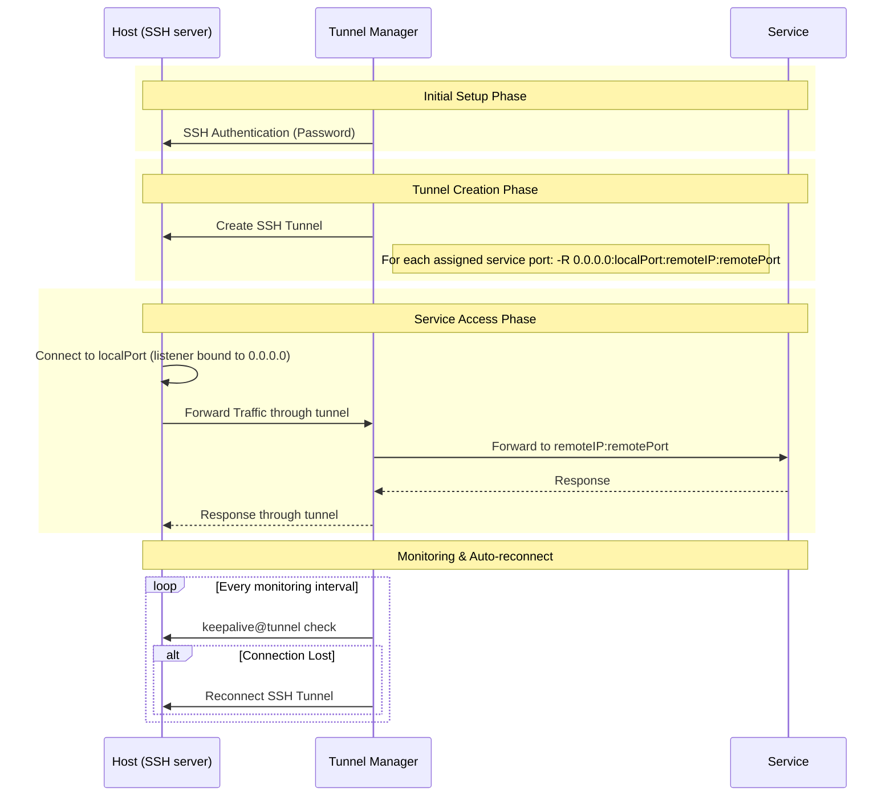

# Tunnel Manager reference

[Back to the README](../README.md)

This is everything: the install, the settings, the API and what the screens do.
The [README](../README.md) is the short version.

Tunnel Manager opens SSH tunnels and keeps them open. You register the SSH
servers it should log in to (a **Host**) and the services it should publish (a
**service port**), say which Host carries which service port, and it builds one
tunnel per assignment and watches it from then on. It is a single binary that
serves a REST API, a browser UI and the tunnels themselves.

The tunnels are **reverse** tunnels, which means the listening socket is opened
on the Host and not on the machine Tunnel Manager runs on. A client that
connects to `local_port` **on the Host** is carried through the SSH connection to
Tunnel Manager, which then connects to `service_ip:service_port` and copies the
bytes in both directions. That is how a service only Tunnel Manager can reach is
made reachable from the Host.

| What you register | Fields | What it is |
|-------------------|--------|------------|
| Host | `ip`, `port`, `user`, `private_key`, `key_passphrase`, `password`, `description`, `enabled` | An SSH server Tunnel Manager logs in to. It logs in with a private key, with a password, or with both; at least one of the two is required. The key, its passphrase and the password are all stored encrypted. |
| Service port | `service_ip`, `service_port`, `local_port` | The service to publish, and the port opened on every Host that carries it. |
| Assignment | `host_id`, `sp_id` | One Host paired with one service port: this Host is to carry it. It is what a tunnel is built from, and it is made for you as a Host or a service port is registered. |

Both `ip` and `service_ip` take an IPv4 or an IPv6 address. An IPv6 address is
written plainly, as `2001:db8::1`, and the brackets a dialer needs are put on
where the address is used. A zone, as in `fe80::1%eth0`, is refused.

**One assignment whose Host is enabled is one tunnel.** A Host that carries
three service ports runs three tunnels, and a Host that carries none runs none
however many service ports are stored. Registering a Host assigns it every
service port there is, and registering a service port assigns it to every Host
there is, unless the request says otherwise, so an installation that never
touches the assignments runs every combination the way it always did. What a
Host carries after that is changed with the **Service ports** button in its row
on the Hosts screen and through
[the service ports a Host carries](#the-service-ports-a-host-carries).

**A Host is logged in to with a key, with a password, or with both.** Send
`private_key` as the text of a PEM private key file, and `key_passphrase` next to
it when the key is protected by one. The key is read as it is registered, so a
file that is not a key, a key that needs a passphrase that was not given, and a
passphrase that does not open the key are all refused there and then instead of
at the next connection. Where both are registered the key is offered first and
the password is what the connection falls back to, so putting a key on a Host
whose tunnels are running cannot take them down. A key registered while those
tunnels are up is used the next time the connection is made.

Neither the key, nor its passphrase, nor the password ever leaves the process
again: no answer carries them, and a Host that is edited comes back with those
boxes empty. An empty box leaves what is stored as it is, and a key that is sent
replaces the stored key and its passphrase together.

**There is nothing to install beside the binary.** The database is a SQLite file
the process creates itself, the settings are kept in that file and are changed on
a screen in the browser, and the UI is compiled into the executable. No database
server, no configuration file, no directory that has to travel next to it.

## Contents

- [Requirements](#requirements)
- [How it works](#how-it-works)
- [Install and run](#install-and-run)
- [HTTPS and the certificate](#https-and-the-certificate)
- [First startup and the account](#first-startup-and-the-account)
- [The built-in UI](#the-built-in-ui)
- [Settings](#settings)
- [Uninstall](#uninstall)
- [Calling the API from a script](#calling-the-api-from-a-script)
- [API endpoints](#api-endpoints)
- [Reading the tunnel status](#reading-the-tunnel-status)
- [Encryption key](#encryption-key)
- [Running as a non-root user](#running-as-a-non-root-user)
- [License](#license)

## Requirements

To run a release binary: nothing. It carries the SQLite engine, the UI and
everything else it needs.

| To do this | You need |
|------------|----------|
| Run a release binary | Nothing else |
| Build from source | Go 1.23 or newer |
| Run the container | Docker and Docker Compose |

The SQLite driver is a pure Go one (`github.com/glebarez/sqlite` over
`modernc.org/sqlite`), so the binaries are built with `CGO_ENABLED=0` and need no
C library on the machine they land on.

### Platforms

`make release` builds a binary for each of these. `go build` works on anything
else Go supports, with the note below.

| Platform | Release binary |
|----------|----------------|
| Linux amd64 | `tunnel-manager-linux-amd64` |
| Linux arm64 | `tunnel-manager-linux-arm64` |
| macOS Intel | `tunnel-manager-darwin-amd64` |
| macOS Apple silicon | `tunnel-manager-darwin-arm64` |
| Windows amd64 | `tunnel-manager-windows-amd64.exe` |

On Unix the process raises its own limit on open file descriptors at startup,
because every tunnel holds several of them. Windows has no such per process
limit to raise, so that step does nothing there. Nothing else differs.

The bundled systemd unit is for Linux. On the other platforms the process has to
be kept running by whatever that system uses.

Only the Linux binaries have been run. The others are built and checked by the
compiler and the vet tool for their platform, and no more than that.

## How it works

### The reconcile loop

Tunnel Manager holds two pictures of the world and keeps comparing them.

| Picture | What it is | Where it comes from |
|---------|------------|---------------------|
| Desired | Every service port assigned to a Host, on every Host that is enabled | The `hosts`, `service_ports` and `host_service_ports` rows |
| Actual | The tunnels that are running right now | The manager inside the process, and the `tunnels` rows it writes |

A **reconcile pass** compares the two and closes the gap: what is desired but not
running is started, what is running but no longer desired is stopped, and a
tunnel whose connection settings (server address, remote address, local port,
user, password) no longer match the rows is stopped and started again with the
new ones.

This is what an API request does now:

```text
POST /api/service-port
  transaction { INSERT INTO service_ports } commit
  wake the reconcile loop
  201 Created          <- the answer does not wait for any tunnel

reconcile loop
  desired = the assignments whose Host is enabled
  actual  = the running tunnels
  desired but not running  -> start
  running but not desired  -> stop
  running with stale settings -> stop and start again
```

A pass runs at three moments:

| When | Why |
|------|-----|
| At startup, before the API answers anything | The tunnels of the stored rows are up by the time the first request can ask about them |
| Right after a `POST`, `PUT` or `DELETE` is committed | The change takes effect at once instead of waiting for the next tick |
| Every reconcile interval, 5 seconds by default | Anything a failed pass left undone is tried again |

Because the answer is sent before the tunnel exists, **a write that succeeds does
not mean the tunnel came up.** `GET /api/status` is what answers that. See
[Reading the tunnel status](#reading-the-tunnel-status).

### Assignments

**A tunnel stands for an assignment and for nothing else.** The
`host_service_ports` table holds one row per pair of a Host and a service port,
and the pair is the whole of the row, so the database itself refuses to hold the
same assignment twice.

| What happens | What becomes of the assignments |
|--------------|---------------------------------|
| A Host is registered | It is given every service port that is stored at that moment, unless the request sends `assign_all_service_ports` as false |
| A service port is registered | Every Host that is stored at that moment is given it, unless the request sends `assign_to_all_hosts` as false |
| A Host is disabled | They stay where they are. Its tunnels are stopped, and enabling it again brings them back |
| A Host or a service port is deleted | The assignments naming it go in the same transaction |
| The first startup after the upgrade that added the table | Every Host is given every service port |

The last row is what an upgrade needs. Every Host carrying every service port
was what the reconcile loop assumed before the table existed, so it was stored
nowhere, and a startup that left the new table empty would read as "no Host
carries anything" and take every tunnel down. It is filled in on the startup
that creates the table and on no other: a later startup would put back the
assignments that have since been taken away, which is the whole of what the
table is for.

An assignment naming a Host or a service port that is not there builds nothing
and is passed over by a reconcile pass. Nothing can be built from it: the
address, the port and the credentials all sit on the rows that are gone.

### A single tunnel



Whether the listener on the Host really opens on `0.0.0.0` is up to the SSH
server on the Host. When its `GatewayPorts` is off, the listener is bound to the
loopback address whatever address was asked for, and the log says so. Once the
tunnel is up, tunnel-manager tries the forwarded port itself and reports what it
found, see
[Whether the forwarded port can be reached](#whether-the-forwarded-port-can-be-reached).

The monitoring interval and the reconcile interval are two different jobs. The
monitor asks a tunnel that is already up whether it is still alive and reconnects
it when it is not. The reconcile loop asks whether the right set of tunnels
exists at all.

## Install and run

**An installation is one file.** Download the binary for your platform from the
releases page, make it executable and start it. It creates the database file, the
account and everything else it needs on the first startup.

```bash
chmod +x tunnel-manager-linux-amd64
./tunnel-manager-linux-amd64
```

The flags are all of them:

| Flag | What it does |
|------|--------------|
| `-db <path>` | The database file. It holds the settings, the registered hosts and the account, and it is created, directories above it included, if it is not there |
| `-reset-settings` | Puts every stored setting back to its default, prints what it changed and exits. The registered hosts, the service ports, the account and the certificate are left as they are. See [If the server will not start](#if-the-server-will-not-start) |
| `-version` | Prints the version and exits |
| `-help` | Prints the flags and exits |

### Where the files go

**One directory holds the whole installation.** `-db` names the database file,
and everything else this installation is made of sits in the directory that file
is in.

```text
<the directory the database file is in>/
    tunnel-manager.db          the settings, the hosts, the service ports, the account
    tunnel-manager.db-wal      the write ahead log SQLite keeps beside it
    tunnel-manager.db-shm      the shared memory file SQLite keeps beside it
    initial-password           written on the first startup, deleted by the setup
    keys/tunnel-manager.key    the key the SSH passwords are encrypted with
    logs/tunnel-manager.log    the log file and the rotated files beside it
```

The key file and the log file are **settings**, not flags: they are on the
Settings screen, and their defaults are `keys/tunnel-manager.key` and
`logs/tunnel-manager.log`. **A relative path in a setting is read against the
directory the database file is in, and not against the working directory.** The
working directory is never the same twice, so a relative default read against it
would put the key somewhere different on every host. Give a setting an absolute
path and that path wins, which is how the key or the log can be put outside the
installation directory on purpose.

**Nothing is created in the directory the process was started from.**

The log is the one thing that is a file rather than a row in that database, and
for three reasons. The logger has to stand before the database is open, because
opening it is the step most likely to fail and something has to be able to say
why. The pool holds a single connection, so every log line would queue behind
the queries the process is actually there to run. And the database reports its
own statements through that logger, which would make writing a log line a query
that writes a log line.

Left out, `-db` is worked out from the place the platform keeps user data in.

| Started | `-db` | The directory the installation lives in |
|---------|-------|------------------------------------------|
| No flags, Windows | Not given | `%AppData%\tunnel-manager\` |
| No flags, macOS | Not given | `~/Library/Application Support/tunnel-manager/` |
| No flags, Linux | Not given | `$XDG_CONFIG_HOME/tunnel-manager/`, or `~/.config/tunnel-manager/` when that variable is not set |
| The bundled systemd unit | `/var/lib/tunnel-manager/tunnel-manager.db` | `/var/lib/tunnel-manager/` |
| Docker Compose | `/data/tunnel-manager.db` | `/data/`, which the compose file binds to `./_data` on the host |

A machine with neither `$XDG_CONFIG_HOME` nor `$HOME` has no such place, and the
startup says so rather than inventing one:

```text
Failed to work out where the database file goes: no default location for the database file
is available: neither $XDG_CONFIG_HOME nor $HOME are defined. Give -db an absolute path
```

The startup logs the absolute path of the database file, of the key file and of
the log file it opened, so the log always says which files are in use.

### With Docker Compose

```bash
git clone https://github.com/jollaman999/tunnel-manager.git
cd tunnel-manager
docker-compose up -d
```

The image starts the binary with `-db /data/tunnel-manager.db`, and the compose
file binds `/data` to `./_data` on the host. That is what keeps the database,
the key and the logs when the container is replaced.

The initial password file is written inside that directory, so it is readable
from the host as well:

```bash
docker compose exec tunnel-manager cat /data/initial-password
```

### As a systemd service

`_scripts/systemd/tunnel-manager.service` starts the binary with an absolute
`-db`:

```ini
ExecStart=/usr/local/bin/tunnel-manager -db /var/lib/tunnel-manager/tunnel-manager.db
StateDirectory=tunnel-manager
```

`StateDirectory=tunnel-manager` makes `/var/lib/tunnel-manager` and hands it to
the account in `User=`, and the database, the key, the logs and the initial
password all sit in it. The unit ships with `User=root`; see
[Running as a non-root user](#running-as-a-non-root-user) to change that.

### From source

```bash
git clone https://github.com/jollaman999/tunnel-manager.git
cd tunnel-manager
make
./tunnel-manager
```

`make` builds the binary with `CGO_ENABLED=0`. `make release` builds one for
every platform in the table above.

## HTTPS and the certificate

**The API and the UI are served over HTTPS, with a certificate this installation
makes for itself.** Open `https://<address>:<port>/` in a browser. The first
startup generates the certificate and stores it in the database file, so there
is nothing to prepare beforehand and no file to put anywhere.

**It is still one port.** A request that arrives in the clear on it is answered
with a `307` redirect to the same address under `https`, so a bookmark or a
script that still says `http://` lands where it meant to. `307` keeps the method
and the body, which `301` and `302` turn into a `GET`. The body of a request
that arrived in the clear is never read: it is on the wire as it was written, and
the client sends it again over TLS. Nothing has to be opened in a firewall that
was not open before.

| The generated certificate | |
|---------------------------|--|
| Made | On the first startup, and again when the stored one cannot be read or has run out |
| Key | ECDSA on the P-256 curve |
| Good for | 5 years |
| Made out to | `localhost`, `127.0.0.1`, `::1`, the host name of the machine and the addresses of its interfaces |
| Stored | In the database file, next to the settings. The private key is encrypted with the same key the SSH passwords are sealed with, so a copy of the database file alone does not carry it |
| Signed by | Itself |

The startup writes the fingerprint to the log, with the names the certificate
covers and the day it runs out.

### The browser warning

**Nobody signed for this certificate, so a browser warns about it and a script
refuses it.** That is what a certificate no authority issued looks like, and no
setting makes the warning go away on its own.

The fingerprint is what the warning is worth checking against. It is in the
startup log, and on the Settings screen once you are in, written the way
`openssl x509 -fingerprint -sha256` writes it: 32 bytes in upper case hex
separated by colons. Hold what the browser shows in its certificate viewer
against it. The same fingerprint means the connection is to this server; a
different one means something is answering in its place.

```bash
openssl s_client -connect 127.0.0.1:8888 </dev/null 2>/dev/null \
  | openssl x509 -noout -fingerprint -sha256
```

To be rid of the warning rather than clicking through it, take the certificate
into the trust store of the machine you browse from. The Settings screen shows
it as PEM for that, which is the same bytes the server hands to every client
during the handshake. The other way out is to register a certificate of your own.

`curl` refuses the certificate with exit code `60`. Point it at the certificate
with `--cacert <file>`, or skip the check with `-k`. The example under
[Calling the API from a script](#calling-the-api-from-a-script) sets
`CURL_CA_BUNDLE` once instead, which every `curl` in that shell then reads.

### Registering a certificate of your own

**The Settings screen has two boxes, the certificate and its private key, both
as PEM.** Paste what you were issued and press Register certificate. It is
served from the next connection on, and the process is not restarted.
`PUT /api/certificate` is the same thing from a script.

If the issuer gave you intermediates, paste them into the same box, below the
server certificate and in the order they were given. The server certificate goes
first, which is the order TLS itself requires, and the chain is stored and served
whole.

The private key is stored encrypted, the same as the generated one. It is never
shown on the screen and never sent back.

What is pasted is read before it is stored, so a mistake is answered rather than
served:

| What was pasted | What happens |
|-----------------|--------------|
| Text with no PEM block in it | Refused, naming which of the two boxes it read that way |
| The two boxes filled the other way round | Refused, and it says that is what it looks like |
| A private key that is protected by a passphrase | Refused, with the `openssl pkey` line that takes the passphrase off |
| A private key that belongs to another certificate | Refused |
| A certificate that has run out | Refused: nothing would connect to it |
| A certificate whose extended key usage leaves `serverAuth` out | Refused: every client refuses such a certificate from a server, and there would be no screen left to correct it from |
| A certificate whose validity has not started yet | **Stored**, with a warning that says from when it works. Two clocks a few minutes apart are ordinary, and refusing it would make such a certificate impossible to install at all |

A refusal stores nothing, so what is being served is still what was there.

### Renewing the certificate

**Make a new certificate** on the Settings screen replaces the one in use with
another self-signed one. It is the same generation the first startup performs, so
the new certificate is made out to the names and addresses this machine answers
to **now**, which is what a machine that was given another address needs.
`POST /api/certificate/renew` is the same thing from a script.

**No restart.** The certificate is chosen per handshake, so the next connection
is served the new one. Two things follow from a fingerprint that changed:

- The page the button was pressed on is still being served the old certificate.
  A connection that is already open keeps the one it was opened under. Load the
  page again to see the new one.
- Every browser and every script that was told to trust the old certificate warns
  once more, until the new fingerprint is trusted as well.

A replacement is written to the log with both fingerprints, the old and the new,
so a fingerprint this installation changed can be told apart from one it did not.

### Turning HTTPS off

**Serve over HTTPS** on the Settings screen, `api_https_enabled` in the API, is
what decides it. Like the other settings it is taken up at the next start.

With it off the port speaks HTTP and nothing else. There is no certificate and no
redirect, and everything the screens send travels as it was written, the password
of this account and the SSH password of a Host among it. The three certificate
calls answer `409` while it is off, because there is no certificate in use to
read or to replace.

The certificate stays in the database. Turning HTTPS on again serves the one that
was there, with the same fingerprint it had.

It can be turned off because a certificate nobody signed for gets in the way in
some places, and an operator who cannot reach the screen cannot fix anything from
it.

## First startup and the account

**The API and the UI are behind a login.** There is one account, and it is
created on the first startup. Read this section before the first startup, or you
will not be able to log in.

1. The first startup creates the single row of the `user` table. It has **no
   username yet** and is marked as needing setup.
2. The initial password is written to a file named `initial-password` **in the
   directory the database file is in**, with permission `0600`. It is 52
   characters of upper case letters and digits.
3. **The log holds the path, never the password.** The log goes to the console
   as well as to a file that is kept and rotated, so a password written there
   would outlive the setup in places nobody is watching. The file is the only
   copy.
4. Log in with it. The username is ignored at this point, so send it empty. The
   answer carries `"setup_required": true`, and the UI moves to the setup screen.
   There you choose the username and the password the account keeps.
5. **The setup deletes the initial password file.** The password in it stops
   opening the account at that moment, so what is left would be nothing but a
   readable copy of a dead credential. Every other session that was opened with
   the initial password is dropped at the same time; the one doing the setup is
   kept.
6. **Until the setup is done, a session may call `POST /api/setup` and nothing
   else.** Every other path under `/api` answers `403` with `The account setup is
   not finished`.

The password chosen at the setup has to be **12 to 72 bytes** long. Bytes, not
characters: one Hangul syllable is three of them. The upper limit is 72 because
bcrypt, which hashes the password, reads no further than that, and anything past
the limit would not be part of what the login checks. A password that is too
long is refused rather than silently cut.

The setup runs **once**. It asks for no current password, so it is not a way to
change the credentials later; a second call answers `409`.

A session lives for 12 hours after the last request that used it, and every
request pushes that deadline out. Sessions are kept in memory, so a restart ends
all of them and you log in again.

### Changing the username and the password

The Settings screen changes both, and `PUT /api/account` is the same thing from a
script. Send the current password together with whichever of the two is changing:
`username`, `new_password` or both. A value that is not sent is left as it is,
and a request that sends neither is refused, as is one that sends the value the
account already has. The new password is held to the same 12 to 72 bytes the
setup holds it to.

**The current password is required every time**, the change that only renames the
account included. That is what tells a change apart from a session left open on
an unattended screen, and it is the same reason the setup cannot be run twice.

**Every other session is signed out, this one excepted.** It happens whichever of
the two was changed, the rename included: sessions point at the account rather
than at its name, so a rename that left them alone would change what you sign in
with and leave whoever is already signed in exactly where they were. Half the
reason to change credentials is that somebody else may know them, so the rule is
one rule: the credentials changed, therefore every session but the one that
changed them is gone. The session that made the change keeps working, including
the CSRF token it already holds, so the screen that asked for it can show what
happened. The answer says how many other clients were signed out.

A wrong current password answers `401` and changes nothing. The screen asks for
the new password twice; the second copy never leaves the browser, because a
server handed the same string twice learns nothing from the second one.

```bash
curl -s -b cookies.txt -X PUT "$BASE/api/account" \
  -H "X-CSRF-Token: $CSRF" -H 'Content-Type: application/json' \
  -d '{"current_password":"<the password now>","username":"operator"}'
```

```json
{
  "success": true,
  "data": {
    "username": "operator",
    "username_changed": true,
    "password_changed": false,
    "sessions_ended": 1
  }
}
```

## The built-in UI

Open `https://<address>:<port>/` in a browser. `/` answers with a redirect to
`/ui/`, which is where the UI is served from. The browser warns about the
certificate the first time; see [HTTPS and the certificate](#https-and-the-certificate)
for what to check it against.

**There is nothing to deploy for it.** The files are compiled into the binary, so
no directory travels next to it and no path has to be configured.

| Screen | Path | What it shows and does |
|--------|------|------------------------|
| Status | `/ui/status` | The three counts (desired, rows, connected), a sentence about the difference between them, and one line per tunnel: Host, service port, status, server, local, remote, port reached, retries, last connected. A tunnel with something wrong carries what went wrong on a line under it, across the whole table, and a tunnel whose forwarded port was not reached carries there what to change on the SSH server it named and what else to check. The tunnel rows come a page at a time, ten to a page to begin with, with the size and the page chosen above the table; the three counts stay counts of every tunnel and not of the page. It asks again every 5 seconds and comes back on the page being read. |
| Hosts | `/ui/hosts` | One row per Host with ID, IP, port, user, description, enabled and updated. The rows come a page at a time, ten to a page to begin with, with the size (10, 20, 30, 50 or 100) and the page chosen above the table. The choice is remembered for this screen on its own, and a list short enough to fit a page of the smallest size carries no controls at all. Add a Host, edit one, enable or disable one, delete one. The add and edit forms have a box to paste a private key into, an area to drop the key file onto, and a box for the passphrase of a key that has one, and the add form has an **Assign all service ports** tick, on by default, that says what the Host starts out carrying. **Service ports** in a row opens a panel of every service port with a tick against the ones this Host carries; only what was changed is sent when it is saved, so a tick made there leaves the pages that were not read alone. |
| Service Ports | `/ui/service-ports` | One row per service port with ID, service IP, service port, local port, description and updated. The rows come a page at a time the same way the Hosts do, with a size and a page of their own. Add, edit and delete. The add form has an **Assign to all hosts** tick, on by default, that says which Hosts carry it from the start; which Hosts carry it after that is changed from the Hosts screen. |
| Logs | `/ui/logs` | The end of the log file, newest last, with a level filter and a count to show. It asks again every 5 seconds. It reads the file the process is writing now; rotated files are not shown. The lines are shown in the language of the screen while the file stays English; see [The language of the screens](#the-language-of-the-screens). |
| Settings | `/ui/settings` | What is stored but not being run on yet, with a Restart in that card that puts it into place, every stored setting and what a save changed, among them the language this installation shows a browser that has picked none, the certificate being served with a button to renew it and boxes to register one of your own, the username and the password of this account, an export of the tunnel configuration and of the settings of this manager into one sealed file each and an import that takes such a file back, a Restart that takes the service down and brings it back, and the Uninstall at the bottom. See [Settings](#settings). |
| Manual | `/ui/manual` | What an installation is made of, drawn and said on one screen: what this does, one tunnel end to end, Hosts and service ports and the assignments between them, what an unreached port means, the two intervals, and where the files go. It asks the server for nothing, which is what lets the login screen show the same thing. |
| Login | `/ui/login` | Where a client without a session lands. Leave the username empty on the first sign in. It leads to the setup screen while the account still needs one. A **Manual** button opens the manual as a panel over it, without a session, because the state it is most needed in is the one where nothing works yet. |

The version of the binary is in the bottom right corner of every screen, the
login one included.

**The screens come in a light theme and a dark one**, and the switch is in the
top right corner of every screen, the login one included. Until it is pressed
the browser decides, and a browser that is changed from light to dark while a
screen is open is followed without the page being loaded again. A press is kept
in the local storage of that browser under `tm_theme` and is never sent
anywhere: which theme a screen is read in belongs to the screen and not to the
installation, and two people reading the same server may want different ones.

**The screens come in thirteen languages**, and the switch is the list in the
top right corner of every screen, beside the theme switch, the login one
included. Each language is listed under its own name: English, 한국어, 日本語,
中文, Español, Français, Deutsch, Português (Brasil), Русский, العربية, हिन्दी,
Tiếng Việt and ไทย. Arabic is written right to left, and the whole page turns
round with it. Which language a browser that has picked none is shown is a
setting of the installation; see
[The language of the screens](#the-language-of-the-screens) for that and for
the order in which the language is settled.

The forms check what is typed before anything is sent. A port takes digits only
and has to be between 1 and 65535; an IP field takes only what an address is
made of and has to read as an IPv4 or an IPv6 address. What is wrong is said
next to the field it is wrong in, and nothing leaves the browser until it is
right.

**A key file that is dropped is read in the browser.** What is sent is the text
of the key, exactly as a paste would be; the file itself is not uploaded, and a
file larger than a private key ever is, or anything dropped that is not a file,
is refused with a line under the drop area. The key can be pasted instead, which
is what a key that is in a terminal somewhere else wants.

The UI files are served without a session on purpose: they are the same bytes for
every client and carry no data. Everything they show is fetched from `/api/**`,
and that is what the login guards.

### The language of the screens

The language a screen is drawn in is settled in this order, and the first
answer that is there wins:

1. **What was picked in the corner of this browser.** The pick is kept in the
   local storage of that browser under `tm_lang`, as the theme is, and is never
   sent anywhere.
2. **What the installation was set to show**: the `ui_default_language`
   setting, on the Settings screen. It is what everybody who has said nothing
   is shown, and it is read once there is a session.
3. **What the browser asks for**, matched against the thirteen. A tag is
   matched whole first, so a browser set to `pt-BR` gets the Brazilian catalog,
   and then by its language alone, so one set to `pt-PT` gets that same catalog
   rather than English.
4. English.

A pick in the corner wins over the setting on purpose. The setting is what an
installation shows to somebody who has said nothing about it, and somebody who
has picked a language has said something, on the very screen they are reading.

**The login screen does not follow the setting.** Reading a setting needs a
session and the login screen has none, so it is drawn in what this browser
picked or, failing that, in what the browser asks for. That is how it is meant
to work and not something to report: the setting takes hold the moment the
login succeeds, without the page being loaded again, and again the moment it is
saved.

The codes are `en`, `ko`, `ja`, `zh`, `es`, `fr`, `de`, `pt-BR`, `ru`, `ar`,
`hi`, `vi` and `th`, and they are what `ui_default_language` takes; see
[Settings](#settings).

**What is translated is everything the screens say**, what the server answers
included. A refusal comes with a code in `error_code` and the values of its
sentence in `error_args`, and the screen draws the sentence for that code in
its own language, while `error` stays the English sentence it always was. A log
line comes with a `log_id`, and the Logs screen draws the sentence for that
identifier out of the fields of the line. **The log file itself stays
English.** It is what a `grep` runs over and what a support request carries,
and a file that followed the screen would be written in whatever language was
picked last. See [Calling the API from a script](#calling-the-api-from-a-script)
for the shape of a refusal and [Settings and uninstall](#settings-and-uninstall)
for the shape of a log line.

Each language is one catalog, served out of the binary as
`/ui/lang/<code>.json`, so an installation on a host that reaches nothing else
still has all thirteen. Every catalog carries the same keys, one per sentence
the screens can show, and a key a language has no words for is drawn in English
rather than left blank. The page fetches the catalog of the language in use and
the English one, and nothing else.

**Adding a language** is one catalog and four lists of codes, and a test holds
the five together, so a code added to one place and not to the others fails
the build rather than the page:

| Where | What |
|-------|------|
| `internal/web/static/lang/<code>.json` | The catalog, with every key of `en.json` |
| `internal/web/static/app.js`, `languages` | The code, the name the language calls itself, and whether it runs right to left |
| `internal/web/static/index.html`, `codes` and `rightToLeft` | The same two lists, read in the head before `app.js` is fetched |
| `internal/settings/settings.go`, `uiLanguages` | What `ui_default_language` is held against |
| `internal/web/web_test.go`, `catalogCodes` | The list the tests compare the other four with |

**What the translations do not do yet.** A count comes in two forms, one and
many, which is how English works and not how Russian or Arabic does, and each
catalog is worded to get by with the two. In Arabic a path that begins with `/`
can be drawn with that slash away from the rest of it: it is how a browser lays
left to right text into a right to left line, and the path itself is whole. And
none of the catalogs has been read by a native speaker yet, so a sentence that
reads oddly is worth a report.

## Settings

**There is no configuration file.** Every setting is a column of the one
`settings` row in the database file, and the Settings screen is where it is
changed. The same values are readable and writable through `GET /api/settings`
and `PUT /api/settings`.

| On the screen | Field in the API | Reported as | Default | When it applies |
|---------------|------------------|-------------|---------|-----------------|
| API port | `api_port` | `api.port` | `8888` | At the next start |
| Serve over HTTPS | `api_https_enabled` | `api.https_enabled` | `true` | At the next start |
| Monitoring interval (seconds) | `monitoring_interval_sec` | `monitoring.interval_sec` | `5` | At the next start |
| Reconcile interval (seconds) | `reconcile_interval_sec` | `reconcile.interval_sec` | `5` | At the next start |
| Encryption key file | `security_key_file` | `security.key_file` | `keys/tunnel-manager.key` | At the next start |
| Log level | `logging_level` | `logging.level` | `info` | **The moment it is saved** |
| Log format | `logging_format` | `logging.format` | `json` | At the next start |
| Log file | `logging_file_path` | `logging.file.path` | `logs/tunnel-manager.log` | At the next start |
| Log size before it is rotated (MB) | `logging_file_max_size` | `logging.file.max_size` | `100` | At the next start |
| Rotated log files kept | `logging_file_max_backups` | `logging.file.max_backups` | `5` | At the next start |
| Days a rotated log file is kept | `logging_file_max_age` | `logging.file.max_age` | `30` | At the next start |
| Compress rotated log files | `logging_file_compress` | `logging.file.compress` | `true` | At the next start |
| Language this installation is shown in | `ui_default_language` | `ui.default_language` | empty, which names none | **The moment it is saved** |

**The log level and the language are the two settings that take hold as they
are saved.** The level reaches every logger that was handed out at startup, the
one the database writes its statements through included, which is the half of
`debug` it is usually turned on for. The language is never read by this process
at all: the browser reads it, out of the answer to the save that stored it and
out of every read after that, so there is nothing a restart could put into
place. An empty language is a value and not a gap: it says this installation
names none, and a browser is shown what it asks for, which is what every browser
was shown before the setting existed. Everything else is stored and read at the
next start; the screen says so per field, and the answer to a save marks each
change as `now` or `restart`.

A save is refused before it is stored when a value would not hold:

| Setting | Rule |
|---------|------|
| `api_port` | 1 to 65535 |
| `monitoring_interval_sec`, `reconcile_interval_sec` | Above zero |
| `security_key_file` | Not empty |
| `logging_level` | `debug`, `info`, `warn`, `error`, `dpanic`, `panic` or `fatal` |
| `logging_format` | `json` or `console` |
| `logging_file_max_size`, `logging_file_max_backups`, `logging_file_max_age` | Zero or more |
| `ui_default_language` | Empty, or one of `en`, `ko`, `ja`, `zh`, `es`, `fr`, `de`, `pt-BR`, `ru`, `ar`, `hi`, `vi` and `th`, written exactly so: `EN` and `ko-KR` are refused |

```bash
curl -s -b cookies.txt -X PUT "$BASE/api/settings" \
  -H 'Content-Type: application/json' \
  -H "X-CSRF-Token: $CSRF" \
  -d '{"api_port":9999,"logging_level":"debug"}'
```

```json
{
  "success": true,
  "data": {
    "settings": { "api_port": 9999, "logging_level": "debug", "...": "..." },
    "changes": [
      { "name": "api.port", "from": "8888", "to": "9999", "applied": "restart" },
      { "name": "logging.level", "from": "info", "to": "debug", "applied": "now" }
    ],
    "restart_required": true
  }
}
```

The body is bound onto what is stored, so a request that names some of the
settings changes those and leaves the rest alone.

A read answers with the stored settings and, beside them, the ones this process
is not running on:

```bash
curl -s -b cookies.txt "$BASE/api/settings"
```

```json
{
  "success": true,
  "data": {
    "api_port": 9999,
    "logging_level": "debug",
    "...": "...",
    "pending_restart": [
      { "name": "api.port", "running": "8888", "stored": "9999" }
    ]
  }
}
```

`pending_restart` is what the server works out on every read, by holding the
settings it read when it started against the ones that are stored: `running` is
the value this process is on and `stored` is the one a restart would bring it
to. It is the same for every client and for every session, and a restart empties
it without anything being cleared, since the process comes back running on what
is stored. Neither the log level nor the language is ever in it, because both
are in place the moment they are saved. An installation that is running on
everything it has stored gets `[]`.

### Restarting the service

The Settings screen has a **Restart** button, and `POST /api/restart` is the same
thing from a script. It is what puts a stored setting that waits for a start into
place. The API stops answering, every tunnel comes down and is built again on the
way back, so everything going through a tunnel is cut for as long as the restart
takes. The password of the account is not asked for, unlike the uninstall below:
nothing here is final.

The answer is written first and the process goes about three seconds later, which
is the time the browser has to draw the screen that says the service is coming
back. Then the shutdown runs in the order a signal runs it in: the API server is
drained, the redirect server after it, the port is released, the reconcile loop
is stopped and the tunnels come down. Only once all of that has ended does the
process run the program again in place of itself, with the same arguments and the
same environment.

**It is the same process.** Unix replaces the image of a running process rather
than starting another one, so the PID does not change, systemd and Docker see
nothing happen, nothing is started twice and there is no second instance to fight
over the port. The port is released before the image is replaced, because the
program that replaces it binds that same port a moment later. Replacing the
binary on disk and then restarting is what runs the new one: the file is read at
that moment.

**Windows has no exec.** There the restart is an ordered stop and nothing else,
and starting the program again is left to whatever supervises the service; one
that was started by hand does not come back. Both answers carry `comes_back` so
that the screen can say which of the two this installation is before anything is
pressed, and `GET /api/restart` answers that without doing anything.

The sessions are held in memory, so they go with the process. The screen asks for
the login again once the service is back.

```bash
curl -s -b cookies.txt -X POST "$BASE/api/restart" \
  -H "X-CSRF-Token: $CSRF"
```

```json
{
  "success": true,
  "data": {
    "exit_in_sec": 3,
    "comes_back": true
  }
}
```

### If the server will not start

A setting that keeps the process from starting used to be a file you could edit.
It is in the database now, and the screen that would change it is served by the
server that will not start. `-reset-settings` is the way out.

```bash
./tunnel-manager -db <path> -reset-settings
```

It puts every setting back to its default, prints what it changed and exits. The
next start runs on the defaults, and the Settings screen is reachable again.

**Only the settings go back.** The registered hosts, the service ports, the
account and the certificate are in the same database file and are left as they
are: nothing has to be registered again, and you log in with the password you
already have.

A stored set that does not pass the rules above says so and names this flag:

```text
fatal  failed to read the settings  {"error": "the stored settings are refused: invalid API port: 0.
       Start with -reset-settings to put every setting back to its default"}
```

## Uninstall

The bottom of the Settings screen removes this installation. It stops every
tunnel, deletes the files the installation is made of and ends the process.
`POST /api/uninstall` is the same thing from a script.

> **Removing the encryption key cannot be undone.** The SSH password of every
> Host is sealed with that key. A backup of the database taken beforehand does
> not help: the passwords in it stay unreadable, and every Host has to be
> registered again with its password on a fresh installation.

| Removed | Left alone |
|---------|------------|
| The database file, with the `-wal` and `-shm` files SQLite keeps beside it | **The program file** |
| The encryption key file | The service entry that starts it |
| The initial password file, if it is still there | The directories the files were in |
| The log file and the rotated log files beside it | |

**The program file is not removed.** A running process cannot delete its own
image on Windows, and on Unix it would stay on disk until the process ends
anyway, which is half of a job rather than one done. Remove it by hand, along
with the systemd unit or the compose file if this was set up as a service.

The **password of the account is asked for again** and checked before anything is
touched. A session left open on an unattended screen is otherwise one press away
from this, and a password is the one thing a passer-by cannot supply. A wrong one
answers `401` and stops nothing.

The order matters and is fixed: the reconcile loop is stopped first, because it
is what starts tunnels again; then the tunnels come down, so no listener is left
behind on a remote host; then the database is closed and the files go; then the
answer is written; and the process ends about three seconds later, so the browser
has the time to receive it.

```bash
curl -s -b cookies.txt -X POST "$BASE/api/uninstall" \
  -H 'Content-Type: application/json' \
  -H "X-CSRF-Token: $CSRF" \
  -d '{"password":"<your-password>"}'
```

```json
{
  "success": true,
  "data": {
    "removed": [
      { "path": "/var/lib/tunnel-manager/tunnel-manager.db", "what": "the database" },
      { "path": "/var/lib/tunnel-manager/keys/tunnel-manager.key", "what": "the encryption key" },
      { "path": "/var/lib/tunnel-manager/logs/tunnel-manager.log", "what": "the log file" }
    ],
    "failed": [],
    "exit_in_sec": 3
  }
}
```

A file that could not be removed is reported under `failed` with the reason and
is left on disk for you to deal with. It does not stop the rest: on Windows the
log file this process is writing to cannot be deleted while it is open, and a run
that stopped there would leave the database and the key behind over the one file
that was never going to go.

## Calling the API from a script

**Every path under `/api` needs a session, and every `POST`, `PUT` and `DELETE`
needs a CSRF token as well.**

1. `POST /api/login` with the username and the password. Keep the cookies it
   sets, `tm_session` and `tm_csrf`.
2. Read `data.csrf_token` out of the answer and send it as an `X-CSRF-Token`
   header on **every** `POST`, `PUT` and `DELETE`.
3. `GET` needs no token. Nothing it reaches changes anything.

CSRF stands for cross site request forgery: another site making your browser send
a request with your cookies attached. The token defeats it because that site
cannot read the answer of your login and cannot set the header.

The server sends no `Access-Control-Allow-Origin` header at all. That is a rule
browsers apply to pages, not a check this server performs, so `curl`, scripts and
server to server calls are untouched; a page on another origin is not.

The example below is a complete session. It uses a cookie jar file: `-c` writes
the cookies the server sets, `-b` sends them back.

```bash
BASE=https://127.0.0.1:8888

# The certificate is the self-signed one, so curl is told where to find it. The
# Settings screen shows it as PEM; -k on every call skips the check instead.
# See [HTTPS and the certificate](#https-and-the-certificate).
export CURL_CA_BUNDLE=tm-cert.pem

# 1. Log in. -c stores tm_session and tm_csrf in cookies.txt.
curl -s -c cookies.txt -X POST "$BASE/api/login" \
  -H 'Content-Type: application/json' \
  -d '{"username":"operator","password":"<your-password>"}' > login.json

# {"success":true,"data":{"setup_required":false,"csrf_token":"<token>"}}

# 2. Take the token out of the answer.
CSRF=$(python3 -c 'import json; print(json.load(open("login.json"))["data"]["csrf_token"])')

# 3. A read needs the cookies and nothing else.
curl -s -b cookies.txt "$BASE/api/status"

# 4. A write needs the header as well.
curl -s -b cookies.txt -X POST "$BASE/api/host" \
  -H 'Content-Type: application/json' \
  -H "X-CSRF-Token: $CSRF" \
  -d '{"ip":"192.0.2.10","port":22,"user":"ubuntu","password":"<host-password>","description":"example"}'

curl -s -b cookies.txt -X POST "$BASE/api/service-port" \
  -H 'Content-Type: application/json' \
  -H "X-CSRF-Token: $CSRF" \
  -d '{"service_ip":"198.51.100.20","service_port":8080,"local_port":18080}'

# 5. Log out when the script is done.
curl -s -b cookies.txt -X POST "$BASE/api/logout" -H "X-CSRF-Token: $CSRF"
```

On the very first sign in, log in with an empty username and the initial
password, then finish the setup before anything else. `initial-password` sits in
the directory the database file is in.

```bash
curl -s -c cookies.txt -X POST "$BASE/api/login" \
  -H 'Content-Type: application/json' \
  -d "{\"username\":\"\",\"password\":\"$(cat initial-password)\"}" > login.json

CSRF=$(python3 -c 'import json; print(json.load(open("login.json"))["data"]["csrf_token"])')

curl -s -b cookies.txt -X POST "$BASE/api/setup" \
  -H 'Content-Type: application/json' \
  -H "X-CSRF-Token: $CSRF" \
  -d '{"username":"operator","password":"<your-password>"}'
```

What goes wrong, and what it looks like:

| Answer | What it means |
|--------|---------------|
| `401 Authentication required` | No session cookie was sent, or the session has run out. Log in again. |
| `403 The request carries no valid X-CSRF-Token header...` | The write carried no token, or the wrong one. Send `data.csrf_token` from the login. |
| `403 The account setup is not finished...` | The account still has no username. Call `POST /api/setup` first. |
| `401 Invalid username or password` | The login was refused. It does not say which of the two was wrong, on purpose. |
| `400 The settings are refused: ...` | A setting broke one of the rules above. Nothing was stored. |
| `401 The password does not open this account` | The uninstall carried the wrong password. Nothing was stopped and nothing was removed. |

Every answer has the same shape: `{"success":true,"data":...}` or
`{"success":false,"error":"..."}`. An answer that says no carries two fields
more: `error_code` names the refusal, and `error_args` holds the values its
sentence was written with, under the names the sentence uses, and is left out
when there are none. `error` is the English sentence whatever language the
screen is in, so a script that has been reading it goes on working; the code is
what the screen translates, and what a script should match on rather than the
words.

```json
{
  "success": false,
  "error": "No such service port: 99",
  "error_code": "assignment.service_port.not_found",
  "error_args": { "ids": "99" }
}
```

## API endpoints

Everything under `/api` requires a session, except `POST /api/login`. Everything
that is not a `GET` requires the `X-CSRF-Token` header.

### Paging

`GET /api/host`, `GET /api/service-port` and `GET /api/status` answer one page
at a time. A list that answers with everything grows with the installation: the
answer, the memory it is built in and the screen that holds it grow with the
number of rows, none of which is looked at at once.

| Parameter | Default | What it takes |
|-----------|---------|---------------|
| `page` | `1` | The page, counted from 1. Below 1 is read as 1, and a page past the last one is answered with the **last page** rather than refused |
| `size` | `10` | How many rows a page holds. One of `10`, `20`, `30`, `50` and `100`; anything else is refused with `400` |

A page past the end is not an error because rows are deleted while a screen is
open: the page a client sits on can be gone by the time it asks again, and an
error there would leave that screen empty where the rows that are left belong. A
list with nothing stored is page 1 with an empty `items`.

`size` is taken from that list rather than as any number, because a size a
request can pick freely is a way to ask for every row in one answer, which is
what the paging is here to prevent.

**`/api/host` and `/api/service-port` changed shape.** `data` used to be the
array of rows and is now an object carrying the page:

```json
{
  "success": true,
  "data": {
    "items": [ "..." ],
    "total": 25,
    "page": 2,
    "size": 10
  }
}
```

`items` is the page, `total` is how many rows there are in all, and `page` and
`size` are what was answered, which is not always what was asked for. A client
reading `data[0]` reads `data.items[0]` now.

`/api/status` was an object already. `tunnels` is one page of the tunnel rows
now and `page` and `size` stand beside it, while **the three counts are over
every row and not over the page**: they say what the installation is doing, not
what is on the page being looked at.

```bash
# The second page of twenty Hosts, and the last page of the tunnel rows: a page
# past the end comes back as the last one, so a large number asks for it.
curl -s -b cookies.txt "$BASE/api/host?page=2&size=20"
curl -s -b cookies.txt "$BASE/api/status?page=99999&size=10"
```

### Account

| Method | Path | What it does |
|--------|------|--------------|
| `POST` | `/api/login` | Takes `username` and `password`, sets the session and CSRF cookies, answers with `setup_required` and `csrf_token` |
| `POST` | `/api/logout` | Drops the session and expires both cookies |
| `GET` | `/api/setup` | Says whether the account still needs its username and password. Answers without a session, for the login screen |
| `POST` | `/api/setup` | Sets the username and the password once, on the account that still needs them |
| `GET` | `/api/account` | What the account is called |
| `PUT` | `/api/account` | Takes `current_password` and `username`, `new_password` or both, changes them and signs out every other session |

### Hosts

| Method | Path | What it does |
|--------|------|--------------|
| `POST` | `/api/host` | Creates a Host. `enabled` is optional and a Host that does not say is enabled |
| `GET` | `/api/host` | One page of the Hosts, oldest first. Takes `page` and `size`, see [Paging](#paging) |
| `GET` | `/api/host/:id` | Reads one Host |
| `PUT` | `/api/host/:id` | Updates a Host. Every field is optional; `enabled` false stops its tunnels |
| `DELETE` | `/api/host/:id` | Deletes a Host, and the assignments naming it |
| `GET` | `/api/host/:id/service-port` | One page of the service ports with the assignments of this Host laid over them, see [The service ports a Host carries](#the-service-ports-a-host-carries) |
| `PUT` | `/api/host/:id/service-port` | Adds and removes assignments of this Host |

The body of a create and of an update takes these fields.

| Field | On create | On update |
|-------|-----------|-----------|
| `ip`, `port`, `user` | Required | Optional; what is left out stays as it is |
| `private_key` | The text of a PEM private key file. Optional if a `password` is given | An empty or missing value keeps the stored key. A key that is sent replaces the stored key and its passphrase together |
| `key_passphrase` | Required only for a key that is protected by one | Sent with the key it belongs to. On its own, without `private_key`, it is refused |
| `password` | Optional if a `private_key` is given | An empty or missing value keeps the stored password |
| `description`, `enabled` | Optional | Optional |
| `assign_all_service_ports` | Optional. Left out, and the Host is given every service port that is stored. Send it as false to register a Host that carries none | Not read. What a Host carries is changed through `PUT /api/host/:id/service-port` |

A create that carries neither a key nor a password is refused, and so is a key
that cannot be used. The refusal says which of them it is: that the value is not
PEM, that the key is protected by a passphrase that was not sent, or that the
passphrase does not open the key. Nothing is stored in any of those cases.

**No answer ever carries `private_key`, `key_passphrase` or `password`**, this
one included. What was stored is confirmed by the Host connecting, which the
status says.

```bash
# A Host that is logged in to with a key. The key is sent as the text of the
# file, so the newlines in it have to survive: this reads the file with jq.
jq -n --arg key "$(cat ~/.ssh/id_ed25519)" \
  '{ip:"192.0.2.10",port:22,user:"ubuntu",private_key:$key,description:"example"}' |
curl -s -b cookies.txt -X POST "$BASE/api/host" \
  -H 'Content-Type: application/json' \
  -H "X-CSRF-Token: $CSRF" \
  --data-binary @-
```

### The service ports a Host carries

**`GET /api/host/:id/service-port` answers one page of the service ports with
`assigned` on each of them**, saying whether this Host carries it. The page is
taken over the service ports and not over the assignments, and ordered by id the
way `GET /api/service-port` is, so a row sits on the same page of both lists
whether the Host carries it or not. It takes `page` and `size`, see
[Paging](#paging). A Host that is not there is answered with `404` rather than
with every service port and nothing assigned, which is what a Host carrying
none looks like.

```json
{
  "success": true,
  "data": {
    "items": [
      { "id": 1, "service_ip": "198.51.100.20", "service_port": 8080,
        "local_port": 18080, "description": "", "assigned": true }
    ],
    "total": 1,
    "page": 1,
    "size": 10
  }
}
```

**`PUT /api/host/:id/service-port` takes a change and not the whole set.** The
list is served a page at a time, so a client holds one page and knows nothing of
the rows on the pages it has not read; a whole set sent from there would name
that page alone, and every assignment outside it would be deleted by a request
meant to tick one box.

```bash
curl -s -b cookies.txt -X PUT "$BASE/api/host/1/service-port" \
  -H 'Content-Type: application/json' \
  -H "X-CSRF-Token: $CSRF" \
  -d '{"add":[1,3],"remove":[2]}'
```

```json
{ "success": true, "data": { "added": 2, "removed": 1 } }
```

`added` and `removed` count the rows and not the request: a service port that is
already assigned is asked for again without a row being written, and one that is
not assigned is removed without a row going. Both lists are optional and a
request that changes nothing is answered, not refused.

| What was sent | What happens |
|---------------|--------------|
| The same service port in `add` and in `remove` | `400`, naming it. Which of the two would win is a guess at what the request meant, and what it decides is whether a tunnel runs |
| A service port id that is not stored | `400`, naming it. Nothing is written |
| A Host id that is not stored | `404` |

The whole of the change lands or none of it does, and the reconcile loop is
woken once it is committed, so the tunnels follow within the moment.

### Service ports

| Method | Path | What it does |
|--------|------|--------------|
| `POST` | `/api/service-port` | Creates a service port. `assign_to_all_hosts` is optional: left out, every stored Host is given it, and sent as false it is registered carried by none |
| `GET` | `/api/service-port` | One page of the service ports, oldest first. Takes `page` and `size`, see [Paging](#paging) |
| `GET` | `/api/service-port/:id` | Reads one service port |
| `PUT` | `/api/service-port/:id` | Updates a service port. `service_ip`, `service_port` and `local_port` are all required |
| `DELETE` | `/api/service-port/:id` | Deletes a service port, and the assignments naming it |

### Status

| Method | Path | What it does |
|--------|------|--------------|
| `GET` | `/api/status` | The counts of the installation and one page of the tunnel rows. Takes `page` and `size`, see [Paging](#paging) |
| `GET` | `/api/status/:hostId` | The Host and the tunnels of that Host. Not paged: a Host holds one tunnel per service port it carries |

### Settings and uninstall

| Method | Path | What it does |
|--------|------|--------------|
| `GET` | `/api/settings` | The stored settings, and in `pending_restart` the ones this process is not running on |
| `PUT` | `/api/settings` | Stores the settings in the body over the stored ones, and answers with what changed and whether a restart is needed |
| `GET` | `/api/certificate` | The certificate being served: fingerprint, subject, issuer, the names it covers, the validity and the days left |
| `POST` | `/api/certificate/renew` | Makes another self-signed certificate and serves it from the next connection on |
| `PUT` | `/api/certificate` | Takes `cert_pem` and `key_pem`, stores them and serves them from the next connection on |
| `GET` | `/api/restart` | What a restart would do here: how long before the service goes and whether it comes back on its own |
| `POST` | `/api/restart` | Takes the service down in order and runs the program again in place of this process, where the platform has exec |
| `POST` | `/api/uninstall` | Takes `password`, removes the installation and ends the process |
| `GET` | `/api/logs` | The end of the log file. `lines` says how many, up to 2000 |

The three certificate calls answer with a `409` while `api_https_enabled` is
off, because there is no certificate in use then. Neither the answer to a
replacement nor the answer to a read carries the private key: it is stored
encrypted with the same key the SSH passwords are sealed with and never leaves
the process. `cert_pem` may be a chain, with the server certificate first and
the intermediates behind it.

A replacement takes effect on the next connection and not on the ones that are
already open: TLS settles on a certificate during the handshake and the
connection never looks again. So the answer to a renewal arrives over the old
certificate, and the browser goes on showing the old fingerprint until the page
is loaded again. Both fingerprints, the old and the new, are written to the log
when a replacement happens.

The answer to `/api/logs` carries the lines and what was done to get them:
`path` is the file it read, `requested` and `max_lines` say what was asked for
and what the cap is, `capped` says whether the cap was the one that applied, and
`size` and `read` are the size of the file and how much of the end of it was
read. The file is read from the end, so `read` stays small however large the
file is.

Each line comes back split into `level`, `time`, `caller`, `message` and
`extra`, with `raw` holding the line as it was written and `parsed` saying
whether the split worked. A line that could not be split is still returned, with
`parsed` false: a line that looks wrong is the one worth reading.

`message` is the English sentence the file holds, and among the fields in
`extra` is `log_id`, the name of the line, as `tunnel.connected`: it is what the
Logs screen looks up to show the line in its own language, with the values taken
from the other fields of the same line. A line written by a version that had no
names, or by something else that wrote into the file, carries no `log_id` and is
shown as it was written.

### Export and import

| Method | Path | What it does |
|--------|------|--------------|
| `POST` | `/api/export/tunnels` | Takes `password`, answers with every Host and every service port sealed into one file |
| `POST` | `/api/import/tunnels` | Takes `password`, `file` and `overwrite`, and writes what the file holds |
| `POST` | `/api/export/settings` | Takes `password`, answers with the stored settings sealed into one file |
| `POST` | `/api/import/settings` | Takes `password` and `file`, and stores the settings the file holds |

These four carry a configuration from one installation to another. An export
hands out a file and an import takes one back, so you decide where the file is
kept and for how long, and neither installation has to reach the other.

**What an export hands out is one line of text.** It opens with the marker
`tmpwenc:v1:` and everything after it is base64, so the whole file is ASCII and
survives being pasted into a box, a message or a ticket without anything being
lost to a line ending. Encoded in there are the parameters the key was derived
with, the salt, the nonce and the encrypted configuration. The parameters and
the salt are authenticated rather than encrypted, which is what lets a wrong
password be told apart from a damaged file, and nothing readable is in the file
at all. That is why the import screen takes a single long line, and why dropping
the file onto it and pasting what is in it do the same thing.

**The file says which service ports each Host carries**, in
`assigned_local_ports` on the Host, named by local port and not by the id of the
row: the ids belong to the installation the file came from, while the local port
is unique across the service ports of an installation and so means the same on
both sides. The list is what the Host carries after the import and not what to
add to it, so a Host the import wrote is left carrying what the file names and
nothing besides; a Host that was skipped keeps the assignments it has. A local
port the file names and this installation does not hold is listed in the answer
as a skipped assignment, with the Host and the port, and the rest of the import
stands.

A file written before the assignments were stored carries no such field, and
every Host in it is taken to carry every service port in it. That is what such a
file meant without saying it, and read as "carries none" it would import
cleanly and leave the installation with no tunnel at all. A Host that carries
nothing is written into the file as `[]`, which is the same distinction from the
other side.

**The file holds the SSH password, the private key and the key passphrase of
every Host in the clear.** That is what it is for: the database keeps those
sealed with the encryption key of the machine they were stored on, and a file
carrying them as they are stored would open on no other installation. They are
unsealed on the way out and sealed again with the key of the installation that
takes them in. What keeps them meanwhile is the password the whole file is
sealed with, and nothing else, so treat an exported file as the credentials of
every Host it names.

The exports are `POST` and not `GET` because the password is in the body. In a
URL it would be written to the access log of this server and to the history of
the browser that asked. The password is held to the same 12 to 72 bytes the
account password is, and it is stored nowhere: a file whose password is
forgotten cannot be opened by anyone, this program included.

An import adds what is not registered here and **skips** what is, naming in the
answer what it skipped and why. Send the same file again with `overwrite` set to
true to replace those rows instead; a replaced row keeps its id, so the tunnels
of that Host reconnect rather than being built anew. Every row of the file is
listed in the answer as `added`, `replaced` or `skipped`, which is what you read
before deciding about an overwrite. The whole import is one transaction: a file
that is refused half way through leaves the database exactly as it was. The
tunnels themselves are not carried, since the reconcile loop builds them from
the Hosts, the service ports and the assignments between them.

The settings import **stores** the settings and puts none of them onto the
running process, `api_port` and `api_https_enabled` included. What is stored is
what the next startup runs on, and `GET /api/settings` reports the difference in
`pending_restart` until then, so an import cannot move the port out from under
the request that carries it. A file whose settings do not pass the rules of the
Settings screen is refused, and nothing is stored.

A file that does not open says which of the four it is: the password is wrong,
it is not a file this program wrote, it is damaged, or it holds the other kind.

```bash
# Export, and keep the file where you keep secrets.
curl -s -b cookies.txt -X POST "$BASE/api/export/tunnels" \
  -H "X-CSRF-Token: $CSRF" -H 'Content-Type: application/json' \
  -d '{"password":"<the password that seals the file>"}' |
jq -r '.data.file' > tunnels.tmexport

# Import it on the other installation.
jq -n --arg file "$(cat tunnels.tmexport)" \
  '{password:"<the same password>",file:$file,overwrite:false}' |
curl -s -b cookies.txt -X POST "$BASE/api/import/tunnels" \
  -H "X-CSRF-Token: $CSRF" -H 'Content-Type: application/json' \
  --data-binary @-
```

### UI

| Method | Path | What it does |
|--------|------|--------------|
| `GET` | `/` | Redirects to `/ui/` with a `302` |
| `GET` | `/ui` | Redirects to `/ui/` with a `302` |
| `GET` | `/ui/version.json` | The version of the binary, as `{"version":"3.0.0"}` |
| `GET` | `/ui/lang/<code>.json` | The catalog of one language, `en` to `th`; see [The language of the screens](#the-language-of-the-screens) |
| `GET` | `/ui/*` | Serves the UI out of the binary |

`/ui/version.json` is answered without a session, like the rest of `/ui/`. The
login screen shows the version too, and the number is on the release page of a
public repository either way.

The SSH password of a Host and the password hash of the account are left out of
every answer.

## Reading the tunnel status

```bash
curl -s -b cookies.txt https://127.0.0.1:8888/api/status
```

```json
{
  "success": true,
  "data": {
    "desired_tunnels": 1,
    "total_tunnels": 1,
    "connected_tunnels": 0,
    "page": 1,
    "size": 10,
    "tunnels": [
      {
        "host_id": 1,
        "sp_id": 1,
        "status": "starting",
        "last_error": "",
        "retry_count": 0,
        "last_connected_at": "0001-01-01T00:00:00Z",
        "server": "192.0.2.10:22",
        "local": "0.0.0.0:18080",
        "remote": "198.51.100.20:8080",
        "server_banner": "",
        "forward_reach": "unknown"
      }
    ]
  }
}
```

`tunnels` is one page of the rows, ordered by Host and then by service port, and
`page` and `size` say which page of which size it is. The three counts are over
every row: an installation of twenty-five tunnels reports twenty-five on a page
of ten, and `connected_tunnels` counts the connected tunnels of the
installation and not the ones that happen to be on the page. See
[Paging](#paging).

The three counts answer three different questions, and the gaps between them
mean different things.

| Count | What it counts |
|-------|----------------|
| `desired_tunnels` | How many tunnels **should** be running: the assignments whose Host is enabled, counted the same way a reconcile pass builds its desired state |
| `total_tunnels` | How many tunnel **rows** exist, one per tunnel that has been started at all, whatever state it ended in |
| `connected_tunnels` | How many of those rows say `connected` |

| Gap | What it means |
|-----|---------------|
| `desired > total` | A tunnel that should be running has not been started at all. Either a pass has not run yet, which lasts a moment, or the pass could not start it, for example because the stored password does not open with the encryption key in use. The reason is in the log. |
| `total > connected` | A tunnel was started and is not carrying traffic. Its row says why in `status` and `last_error`. |

`status` is one of:

| Value | Meaning |
|-------|---------|
| `starting` | The row was written and the SSH connection is being built |
| `connected` | The listener is open on the Host |
| `reconnecting` | The connection dropped or a keepalive went unanswered, and it is being built again |
| `error` | The attempt failed. `last_error` holds the reason |

### Whether the forwarded port can be reached

A tunnel that says `connected` is one the SSH connection stands for. It does not
mean the forwarded port can be reached: the listener is opened by the **SSH
server**, and which address it binds is that server's decision, not this one's.
tunnel-manager asks for `0.0.0.0:<local port>`, and with OpenSSH left at its
default of `GatewayPorts no`, or Dropbear started without `-a`, the server binds
loopback alone. The port then answers on the Host itself and nowhere else.

Two fields on every tunnel row say what is known about it.

| Field | What it holds |
|-------|---------------|
| `server_banner` | What the SSH server called itself on the handshake, for example `SSH-2.0-OpenSSH_10.5p1 Ubuntu-1ubuntu2`. It is what says which server is in front of you, and what to change on it differs by server |
| `forward_reach` | Whether tunnel-manager reached the forwarded port by opening a TCP connection to the Host at that port: `reachable`, `unreachable`, or `unknown` while nothing has been measured |

It is measured once when the tunnel comes up and again on every reconnect, not
on every status read: what decides it is the configuration of the SSH server,
which does not change under a connection that stands.

> **`unreachable` says where the port was not reached from, not why.** A server
> that bound the port to loopback alone and a firewall that drops the connection
> on the way look exactly the same from here, and a connection that never
> arrives cannot tell them apart. Check both before changing either.

`GET /api/status/:hostId` answers with the same counts except `desired_tunnels`,
plus the Host itself. It is not paged and carries every tunnel of that Host.

## Encryption key

The SSH password of a Host is encrypted with AES-256-GCM before it is stored. The
key is read from the file the **Encryption key file** setting names,
`keys/tunnel-manager.key` by default. If that file does not exist, the first
startup creates a 32 byte key with permission `0600`; if it does, it is read as
it is.

> **Lose the key and no stored password can be read again.** There is nothing to
> do about it but register every Host once more. Back the key file up together
> with the database file, or the two will not match.

If the key file can be read by the group or by others, the startup refuses to go
on. Narrow it with `chmod 600` and start again.

If the key opens none of the stored passwords and at least one of them is marked
as having been encrypted, the startup stops rather than serving an API that looks
healthy while no Host can be connected to. If it opens some but not all, the ones
it does not open are named in a warning, their tunnels are not built, and the
stored values are left untouched: a password that does not open exists nowhere
else and is gone once it is written over. Set those through the API again.

A relative path in this setting is read against the directory the database file
is in, so the default puts the key in `keys/` next to the database. An absolute
path is left alone and is how the key is kept somewhere else, on a volume of its
own for instance. The startup logs the absolute path of the file it opened, so
the log says which key was read.

## Running as a non-root user

The process starts without root. It logs a `not running as root` warning and
raises what it can.

- It tries to raise the file descriptor limit to 65535. Without root the soft
  limit can only go as high as the hard limit, and when the hard limit is lower
  it logs `max ulimit is low` and goes on. Raise the hard limit in advance if you
  run many tunnels.
- The API port below 1024 cannot be bound by a non-root process. Use 1024 or
  above, or give the executable `CAP_NET_BIND_SERVICE`.
- The process has to be allowed to **write to the directory the database file is
  in**. The initial password file goes there on the first startup, and a
  directory it cannot write to stops the startup, since an account whose password
  nobody can read is an API nobody can log in to.

A `service_ports.local_port` below 1024 will not be opened by the sshd on the
Host. That listener is created by the sshd and not by Tunnel Manager, so the
restriction applies to the SSH account registered for the Host and not to the
account Tunnel Manager runs as. As ssh(1) puts it, privileged ports are forwarded
only for the root user. If the SSH account on the Host is not root, keep
`local_port` at 1024 or above.

### Ownership and the service account

There is no second directory to arrange. The key and the logs default to `keys/`
and `logs/` under the directory the database file is in, so an account that may
write that directory has everything it needs. A log file that cannot be created
does not stop the startup: file logging is turned off, the console keeps
everything, and the reason is in the `logging to file is disabled` warning.

For systemd, `_scripts/systemd/tunnel-manager.service` ships with `User=root`.
Change the account and leave `StateDirectory=` alone:

```ini
[Service]
User=tunnel-manager
Group=tunnel-manager
```

`StateDirectory=tunnel-manager` makes `/var/lib/tunnel-manager` owned by
`User=`/`Group=`, and a directory that was already there owned by root changes
owner too. An existing key file has to be readable by that account as well, so
change its owner and leave the permission at `0600`.

The container runs as root, because `Dockerfile` ends with `USER root`. To run it
as somebody else, give the service in docker-compose.yaml a `user: "<uid>:<gid>"`
and make `./_data` on the host owned by that uid. If it ever ran as root, that
directory is owned by root and has to be changed first. The file descriptor limit
comes from `ulimits` in docker-compose.yaml and has nothing to do with the
account inside the container.

## License

MIT License
