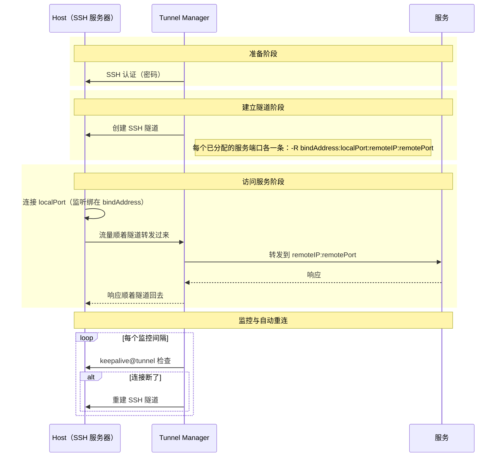

# Tunnel Manager 参考手册

[回到 README](README.zh.md)

这里是全部内容：安装、设置、API，以及各个页面都做什么。[README](README.zh.md) 是它的简版。

Tunnel Manager 建立 SSH 隧道，并让它们保持连接。你注册它要登录的 SSH 服务器（**Host**）和要
发布的服务（**服务端口**），指定哪台 Host 负责哪个服务端口，它就为每条分配关系建立一条隧道，
并持续维护。REST API、浏览器界面和隧道本身，全都由这一个可执行文件提供。

这里建的是**反向**隧道，也就是说监听套接字开在 Host 上，而不是开在 Tunnel Manager 所在的机器
上。客户端连接 **Host 的** `local_port`，流量通过 SSH 连接送到 Tunnel Manager，再由它连接
`service_ip:service_port`，双向转发数据。只有 Tunnel Manager 能访问的服务，就这样变成从 Host
也能访问。

| 你注册的内容 | 字段 | 是什么 |
|--------------|------|--------|
| Host | `ip`、`port`、`user`、`private_key`、`key_passphrase`、`password`、`bind_address`、`description`、`enabled` | Tunnel Manager 要登录的 SSH 服务器。可以用私钥登录，可以用密码登录，也可以两个都注册，但至少要有一个。密钥、密钥的密码和登录密码都加密保存。`bind_address` 是请求把转发端口开在这台 Host 的哪个地址上，不给就是 `0.0.0.0`。 |
| 服务端口 | `service_ip`、`service_port`、`local_port` | 要发布的服务，以及在负责它的每台 Host 上打开的端口。 |
| 分配关系 | `host_id`、`sp_id` | 一台 Host 配一个服务端口，表示这台 Host 负责它。隧道就是根据它建立的，你注册 Host 或服务端口时它会自动生成。 |

`ip` 和 `service_ip` 都收 IPv4 或 IPv6 地址。IPv6 地址照原样写成 `2001:db8::1`，建立连接时需要
的方括号，由用到这个地址的地方自己补上。带 zone 的写法，像 `fe80::1%eth0`，会被拒绝。

**一条分配关系，只要它的 Host 是启用的，就是一条隧道。** 负责三个服务端口的 Host 运行三条隧道，
一个都不负责的 Host 一条也不运行，保存了多少个服务端口都一样。注册一台 Host 时，现有的服务端口
全部分配给它；注册一个服务端口时，现有的 Host 全部分配到它，除非请求里另有指定。所以从不修改分配
关系的安装，运行的仍是原来的全组合。之后要修改一台 Host 负责什么，用 Hosts 页面上那一行里的
**Service ports** 按钮，或者调用[一台 Host 负责的服务端口](#一台-host-负责的服务端口)。

**登录一台 Host 可以用密钥、用密码，也可以两个都用。** `private_key` 要发 PEM 私钥文件的文本
内容，密钥带密码保护时把 `key_passphrase` 跟它一起发。密钥在注册时就读一遍，所以根本不是密钥
的文件、要密码却没给密码的密钥、打不开密钥的密码，都在那一刻就被拒绝，而不是拖到下一次连接。
两个都注册的话，先用密钥连接，失败后再用密码，所以给一台隧道正在运行的 Host 添加密钥不会中断隧道。
隧道运行期间注册的密钥，从下一次建立连接起使用。

密钥、密钥的密码和登录密码都不会再离开这个进程：任何响应里都没有它们，编辑一台 Host 时这几个
框是空的。框留空表示已保存的值不变，而发送的密钥会把已保存的密钥连同它的密码一起替换。

**除了这个可执行文件，没有别的要装。** 数据库是进程自己创建的 SQLite 文件，设置存在这个文件
里、在浏览器的页面上改，界面编译进了可执行文件。不用数据库服务器，没有配置文件，也没有必须
随它一起迁移的目录。

## 目录

- [运行条件](#运行条件)
- [工作原理](#工作原理)
- [安装与运行](#安装与运行)
- [HTTPS 与证书](#https-与证书)
- [首次启动与账号](#首次启动与账号)
- [内置界面](#内置界面)
- [设置](#设置)
- [卸载](#卸载)
- [在脚本里调用 API](#在脚本里调用-api)
- [API 接口](#api-接口)
- [读懂隧道状态](#读懂隧道状态)
- [加密密钥](#加密密钥)
- [以非 root 用户运行](#以非-root-用户运行)
- [许可证](#许可证)

## 运行条件

运行发布的可执行文件不需要任何准备。SQLite 引擎、界面和它需要的一切都内置在里面。

| 要做的事 | 需要什么 |
|----------|----------|
| 运行发布的可执行文件 | 不需要其他任何东西 |
| 从源码构建 | Go 1.26 或更新的版本 |
| 运行容器 | Docker 和 Docker Compose |

SQLite 驱动是纯 Go 写的（`github.com/glebarez/sqlite` 架在 `modernc.org/sqlite` 上），所以
可执行文件用 `CGO_ENABLED=0` 构建，在任何机器上都不需要 C 库。

### 支持的平台

`make release` 会给下面每一项各构建一个可执行文件。Go 支持的其他平台用 `go build` 也能构建，
只是要留意下面这段。

| 平台 | 发布的可执行文件 |
|------|------------------|
| Linux amd64 | `tunnel-manager-linux-amd64` |
| Linux arm64 | `tunnel-manager-linux-arm64` |
| macOS Intel | `tunnel-manager-darwin-amd64` |
| macOS Apple silicon | `tunnel-manager-darwin-arm64` |
| Windows amd64 | `tunnel-manager-windows-amd64.exe` |

在 Unix 上，进程启动时会自行提高可打开文件描述符的上限，因为每条隧道都要占用好几个。Windows
没有这种按进程计算的上限可提高，那一步在那里什么也不做。除此之外没有别的差别。

随附的 systemd unit 是给 Linux 用的。在其他平台上，需要用那个系统自己的方式让进程持续运行。

实际运行过的只有 Linux 的可执行文件。其余几个只是用对应平台的编译器和 vet 工具构建并检查过，
仅此而已。

## 工作原理

### 调谐循环

Tunnel Manager 持续比对期望状态和实际状态。

| 状态 | 是什么 | 从哪里来 |
|------|--------|----------|
| 期望 | 每台启用的 Host 上，分配给它的每一个服务端口 | `hosts`、`service_ports` 和 `host_service_ports` 里的行 |
| 实际 | 此刻正在运行的隧道 | 进程内部的管理器，以及它写下的 `tunnels` 行 |

一次**调谐**把两边比对一遍，再消除差异：期望有而未运行的就启动，运行中但不再期望的就停止，连接
参数（服务器地址、远端地址、本地端口、用户、密码）和表里不一致的隧道，停止后用新参数重新建立。

现在一个 API 请求是这样走的：

```text
POST /api/service-port
  事务 { INSERT INTO service_ports } 提交
  唤醒调谐循环
  201 Created          <- 响应不等待任何隧道

调谐循环
  期望 = Host 处于启用状态的那些分配关系
  实际 = 正在运行的隧道
  期望有而未运行    -> 启动
  运行中但不再期望  -> 停止
  运行中但设置过时  -> 停止后重建
```

调谐在三个时刻各运行一次：

| 什么时候 | 为什么 |
|----------|--------|
| 启动时，在 API 响应任何请求之前 | 第一个请求到达时，表里那些行的隧道已经建立 |
| 一次 `POST`、`PUT` 或 `DELETE` 提交之后立刻 | 改动立刻生效，不用等到下一个周期 |
| 每个调谐间隔，默认 5 秒 | 重试上一次没完成的工作 |

因为响应是在隧道存在之前就发出的，**写请求成功并不等于隧道已建立。** 回答这件事的是
`GET /api/status`。见[读懂隧道状态](#读懂隧道状态)。

### 分配关系

**一条隧道只代表一条分配关系，不代表别的。** `host_service_ports` 表里，一台 Host 配一个服务
端口就是一行，这一对就是这行的全部内容，所以数据库本身就不允许同一条分配关系存两次。

| 发生了什么 | 分配关系会怎样 |
|------------|----------------|
| 注册一台 Host | 那一刻存着的服务端口全部分给它，除非请求把 `assign_all_service_ports` 发成 false |
| 注册一个服务端口 | 那一刻存着的每台 Host 都分到它，除非请求把 `assign_to_all_hosts` 发成 false |
| 停用一台 Host | 分配关系保持不变。它的隧道会停止，重新启用就全部恢复 |
| 删除一台 Host 或一个服务端口 | 涉及它的分配关系在同一个事务里一起删除 |
| 加了这张表的那次升级之后的第一次启动 | 每台 Host 分到每一个服务端口 |

最后一行是为升级准备的。这张表存在之前，调谐循环假定的就是每台 Host 负责每一个服务端口，这件
事从来没有被记录过；而一次把新表留空的启动，读出来就是“没有 Host 负责任何服务端口”，会把所有
隧道都拆除。所以只在创建这张表的那次启动时填一遍，此后再不填：之后的启动会把已经被去掉的分配关系
又加回来，而能去掉它们正是这张表存在的意义。

指向不存在的 Host 或服务端口的分配关系无法建立任何隧道，调谐会直接跳过它。它建不出任何东西：
地址、端口和凭据都在那些已经不存在的行上。

### 一条隧道的全过程



请求的地址是 Host 上的 `bind_address`，没给就是 `0.0.0.0`，见 [Host](#host)。
Host 上的监听到底会不会开在那个地址上，由 Host 上的 SSH 服务器说了算。它的 `GatewayPorts`
关闭时，不管请求的是哪个地址，监听都绑定在回环地址上，日志里会记录。隧道建立后，
tunnel-manager 会自行测试那个转发端口，并报告结果，见
[转发端口是否可达](#转发端口是否可达)。

监控间隔和调谐间隔是两件不同的事。监控是检查一条已建立的隧道是否仍然存活，不存活就重连。调谐
循环检查的是应有的那一组隧道是否都存在。

## 安装与运行

**一套安装就是一个文件。** 到发布页面下载对应平台的可执行文件，加上执行权限再启动。数据库
文件、账号和它需要的其他东西，都在第一次启动时创建。

```bash
chmod +x tunnel-manager-linux-amd64
./tunnel-manager-linux-amd64
```

命令行参数就这几个：

| 参数 | 做什么 |
|------|--------|
| `-db <path>` | 数据库文件。设置、注册的 Host 和账号都在里面，文件不存在就创建，上层目录也一并创建 |
| `-install` | 把这个程序装成本系统的服务然后退出：把可执行文件放到位，建出数据目录，把服务注册成随开机启动、退出后自己回来。需要 root，Windows 上需要管理员。见[作为服务安装](#作为服务安装) |
| `-uninstall` | 停掉服务，删掉它的注册，删掉装上去的可执行文件然后退出。数据保留。见[卸载这套安装](#卸载这套安装) |
| `-bin` | `-install` 把可执行文件放到哪里，以及注册已经没有了的机器上 `-uninstall` 到哪里去找可执行文件。不给的话就是这个平台放管理员所装程序的地方。它和 `-install` 或 `-uninstall` 一起用 |
| `-purge` | 和 `-uninstall` 一起用时，连数据目录一起删掉。它删掉的东西拿不回来 |
| `-reset-settings` | 把每一项设置都还原成默认值，打印改了什么然后退出。注册的 Host、服务端口、账号和证书都原样留着。见[服务起不来的时候](#服务起不来的时候) |
| `-trust-proxy-headers` | 信任这台服务器前面那个东西加的 `X-Forwarded-Proto` 头，这样明文到达本进程的连接上，会话 cookie 也会标上 `Secure`。不给就是关的。见[放在反向代理后面](#放在反向代理后面) |
| `-version` | 打印版本号后退出 |
| `-help` | 打印参数后退出 |

### 文件放在哪里

**一个目录容纳整套安装。** `-db` 指定数据库文件，本安装的其他文件都位于这个文件所在的目录。

```text
<数据库文件所在的目录>/
    tunnel-manager.db          设置、Host、服务端口、账号
    tunnel-manager.db-wal      SQLite 在旁边留的预写日志
    tunnel-manager.db-shm      SQLite 在旁边留的共享内存文件
    initial-password           第一次启动时写出，初始化完成后删除
    keys/tunnel-manager.key    用来加密 SSH 密码的密钥
    logs/tunnel-manager.log    日志文件，轮转后的文件也在旁边
```

密钥文件和日志文件是**设置**，不是命令行参数：它们在 Settings 页面上，默认值是
`keys/tunnel-manager.key` 和 `logs/tunnel-manager.log`。**两者都是相对数据库文件所在的目录
来解析的，不是相对当前工作目录。** 工作目录每次都不一样，相对它解析的默认值会让密钥在每台
主机上落在不同的位置。

**两者都必须留在那个目录底下。** 它们收的是相对路径，`logs/a/b/x.log` 或 `x.log` 就是能写的
全部；绝对路径和用 `..` 爬出去的路径，在保存的时候就被拒绝。日志文件由进程创建并往后追加，
Logs 页面又把它的末尾读回来，所以一个能离开这套安装的路径，会让这项设置变成让本进程往机器上
任何一个文件里写、并读取它能打开的任何一个文件的通道。在还接受这种路径的时候存过一个的安装，
改用默认值启动，并说明它把什么换成了什么：

```text
warn  a stored path setting names a place outside the directory the database file is in,
      which is no longer allowed, and was put back to its default
      {"setting": "logging.file.path", "from": "/var/log/tunnel-manager/x.log",
       "to": "logs/tunnel-manager.log"}
```

**放在安装目录之外的密钥，从此不再读取。** 启动会在数据库旁边新建一把，用旧密钥封装的密码在
它下面打不开，[加密密钥](#加密密钥)里启动中止的正是这个。请把密钥文件移进安装目录，并在设置
里写它在那里的位置。

**进程启动时所在的那个目录里，什么都不会创建。**

只有日志是写成文件的，没有像别的东西那样写成数据库里的一行，这有三个原因。日志器必须在数据库
打开之前就先就位，因为打开数据库是最容易出问题的一步，总得有东西能说清它为什么失败。连接池里只有一条连接，
每写一行日志都要排在进程真正要执行的查询后面。而且数据库自己的语句也是通过这个日志器报出来的，
那样写一行日志就会变成一次写一行日志的查询。

不写 `-db` 的话，它由所在平台存放用户数据的位置推算出来。

| 怎么启动的 | `-db` | 本安装位于哪个目录 |
|------------|-------|----------------------|
| 不带参数，Windows | 没给 | `%AppData%\tunnel-manager\` |
| 不带参数，macOS | 没给 | `~/Library/Application Support/tunnel-manager/` |
| 不带参数，Linux | 没给 | `$XDG_CONFIG_HOME/tunnel-manager/`，这个变量没设时是 `~/.config/tunnel-manager/` |
| 随附的 systemd unit | `/var/lib/tunnel-manager/tunnel-manager.db` | `/var/lib/tunnel-manager/` |
| Docker Compose | `/data/tunnel-manager.db` | `/data/`，compose 文件把它绑到宿主机的 `./_data` |

`$XDG_CONFIG_HOME` 和 `$HOME` 都没有的机器上就没有这样的位置，启动时会明确报错，而不是自己编一个：

```text
Failed to work out where the database file goes: no default location for the database file
is available: neither $XDG_CONFIG_HOME nor $HOME are defined. Give -db an absolute path
```

启动时会把打开的数据库文件、密钥文件和日志文件的绝对路径都记进日志，所以日志里始终写着用的
是哪几个文件。

### 用 Docker Compose 运行

```bash
git clone https://github.com/jollaman999/tunnel-manager.git
cd tunnel-manager
docker-compose up -d
```

镜像用 `-db /data/tunnel-manager.db` 启动这个可执行文件，compose 文件把 `/data` 绑到宿主机
的 `./_data`。容器被替换时，数据库、密钥和日志靠它保留下来。

初始密码文件就写在那个目录里，所以从宿主机也读得到：

```bash
docker compose exec tunnel-manager cat /data/initial-password
```

### 作为 systemd 服务运行

[`-install`](#作为服务安装) 写出的 systemd unit 用绝对路径的 `-db` 启动这个可执行文件：

```ini
ExecStart=/usr/local/bin/tunnel-manager -db /var/lib/tunnel-manager/tunnel-manager.db
StateDirectory=tunnel-manager
```

`StateDirectory=tunnel-manager` 会建出 `/var/lib/tunnel-manager` 并交给 `User=` 里的账号，
数据库、密钥、日志和初始密码全都在里面。写出的 unit 里是 `User=root`，要改的话见
[以非 root 用户运行](#以非-root-用户运行)。

### 作为服务安装

**`-install` 把这个程序装成运行它的那台机器上的服务。** 它把可执行文件放到这个平台存放管理员
所装程序的地方，建出数据目录，向这个平台的服务管理器注册服务并启动它。此后服务随开机启动，
退出了也会自己再起来。

```bash
sudo ./tunnel-manager-linux-amd64 -install
```

在 Windows 上，这条命令要从用**以管理员身份运行**打开的 PowerShell 或命令提示符里执行。从别处
执行的话，安装会拒绝，什么都不碰：

```powershell
.\tunnel-manager-windows-amd64.exe -install
```

不指定路径时，东西放在哪里：

| | Linux | macOS | Windows |
|---|-------|-------|---------|
| 可执行文件 | `/usr/local/bin/tunnel-manager` | `/usr/local/bin/tunnel-manager` | `C:\Program Files\tunnel-manager\tunnel-manager.exe` |
| 数据目录 | `/var/lib/tunnel-manager` | `/Library/Application Support/tunnel-manager` | `C:\ProgramData\tunnel-manager` |
| 服务注册 | systemd unit。已经注册过的话就写在原来那个位置，没有的话写到 `/etc/systemd/system/tunnel-manager.service` | LaunchDaemon `/Library/LaunchDaemons/io.github.jollaman999.tunnel-manager.plist` | 服务控制管理器里的 `tunnel-manager` 服务 |
| 运行用的账号 | `root` | `root` | `LocalSystem` |
| 退出后再起来 | `Restart=always`，5 秒后 | `KeepAlive` | 每隔 5 秒重启，共三次 |

`-bin` 把可执行文件放到别处，`-db` 把数据库放到别处。这里给的数据库路径会原样进到服务注册里，
以后卸载从那份注册里读出来的也是这个路径：

```bash
sudo ./tunnel-manager-linux-amd64 -install -bin /opt/tunnel-manager/tunnel-manager \
  -db /opt/tunnel-manager/tunnel-manager.db
```

**装上去的是最新的发布版本，不一定是刚才运行的那个文件。** `-install` 从 GitHub 读取最新的
发布版本，下载对应这个平台和架构的文件。这个发布版本带 `SHA256SUMS` 的话，下载下来的文件会
和里面对应的那一行核对，校验和对不上就不放文件，安装到此为止。其余情况 - 读不到发布版本、
发布版本里没有这个平台的文件、下载失败 - 都改装当前运行的这个文件，并把原因一起打印出来。
装上的是哪一个，报告里写着：

```text
tunnel-manager install
  executable    /usr/local/bin/tunnel-manager
  taken from    the v3.5.1 release, checksum verified
  md5 before    no file was there
  md5 after     0b7f4b1c9d2e5a6f8c3d1e4b7a9f2c5d
  data          /var/lib/tunnel-manager
  database      /var/lib/tunnel-manager/tunnel-manager.db
  service       /etc/systemd/system/tunnel-manager.service
  registration  new, nothing was registered before
  state         started
```

在已经装过一遍的机器上，`-install` 做什么取决于注册里存的路径：

| 注册 | `-install` 做什么 |
|------|-------------------|
| 没有注册过的服务 | 注册服务并启动它 |
| 可执行文件和数据库都是同一个路径 | 停掉服务，覆盖可执行文件，重新注册并启动。覆盖前和覆盖后的 md5 都在报告里 |
| 可执行文件或数据库是别的路径 | 拒绝，把两边的路径都说出来，什么都不碰。先执行 `-uninstall` |

**会把旧的一套留在原地的安装，宁可拒绝也不做。** 注册在别的路径上的那套安装，有这次安装不会
去碰的可执行文件和数据库。新的注册会指向别的文件，旧的那些则留在磁盘上，机器上没有任何东西
指着它们，之后任何一次卸载都找不到。

### 卸载这套安装

`-uninstall` 停掉服务，删掉注册，并删掉那份注册所启动的可执行文件。

```bash
sudo tunnel-manager -uninstall
```

**数据保留**，报告里会说留在了哪里：

```text
tunnel-manager uninstall
  taken from    the registration of this system
  executable    /usr/local/bin/tunnel-manager, removed
  data          /var/lib/tunnel-manager, left in place
  database      /var/lib/tunnel-manager/tunnel-manager.db
  service       /etc/systemd/system/tunnel-manager.service, removed
  state         stopped and taken out of the service manager
```

**命令行上不用写路径。** 这个程序不在任何地方留状态文件：注册本身就存着可执行文件的路径和
`-db` 的路径，卸载读的就是这份注册。

| 平台 | 卸载从哪里读出路径 |
|------|--------------------|
| Linux | `systemctl show tunnel-manager -p FragmentPath -p ExecStart` |
| macOS | `/Library/LaunchDaemons/io.github.jollaman999.tunnel-manager.plist` 里的 `ProgramArguments` |
| Windows | 服务控制管理器为 `tunnel-manager` 服务保存的 `BinaryPathName` |

**没有注册的机器上什么都不删。** 说明哪些东西属于这套安装的只有注册，所以在注册已经没有了的
机器上，要用 `-bin` 和 `-db` 指出剩下的东西：

```bash
sudo tunnel-manager -uninstall -bin /usr/local/bin/tunnel-manager \
  -db /var/lib/tunnel-manager/tunnel-manager.db
```

这两个参数只补注册没有说明的部分；注册里有路径的话，以注册为准。反过来听参数的卸载，会删掉
机器上没有任何东西认领的路径，却把注册着的那个留下来。

`-purge` 连数据目录一起删掉。

```bash
sudo tunnel-manager -uninstall -purge
```

> **`-purge` 删掉的东西拿不回来。** 数据库、里面的每一个 Host 和每一份凭据，连同加密所存密码
> 的密钥，都跟着这个目录一起没了。没有那个密钥文件的数据库备份也不顶用：里面的密码依然读不
> 出来。`-purge` 在删之前会先在屏幕上打出要删的是哪个目录。

`-purge` 交给递归删除的那个目录，是从手打的 `-db`，或者从这个程序未必写过的注册里读出来的
`-db` 推算出来的。所以只要不是某一套安装的数据目录，就拒绝：

| `-purge` 拒绝的 | 为什么 |
|-----------------|--------|
| 不含指定数据库文件的目录 | 那个目录根本就不是这套安装的目录 |
| 不是绝对路径的路径 | 它指哪里取决于命令是在哪里执行的 |
| 文件系统的根，以及直接位于根下面的目录 | `/`、`/var`、`/opt`、`C:\ProgramData` 装着的东西远不止这套安装 |
| `/var/lib`、`/var/log`、`/var/tmp`、`/var/cache`、`/usr/bin`、`/usr/lib`、`/usr/local`、`/usr/share`、`/etc/systemd`、`/Library/Application Support`、`/Library/LaunchDaemons`、`C:\Windows\System32`、`C:\Program Files\Common Files` | 每一个装的都不止一套安装 |
| 家目录，也就是直接位于 `/home` 或 `/Users` 下面的目录 | 某人把数据库文件放在了自己家目录里，不构成删光他全部东西的理由 |

**在 Windows 上删不掉正在运行的可执行文件。** Windows 在进程运行期间一直占着它的映像，而
`-uninstall` 通常就是用装上去的那个可执行文件执行的。这时会把这个文件交给下一次开机去删，
报告里写的也不是 `removed`，而是 `removed at the next reboot of this machine`。

**真正跑起来过的只有 Linux。** macOS 和 Windows 的后端只经过编译器、对应平台的 vet 工具，
以及把生成的 plist 和服务配置固定下来的单元测试的检查。两者都没有在各自的操作系统上安装过、
启动过或者卸载过。

### 从源码构建

```bash
git clone https://github.com/jollaman999/tunnel-manager.git
cd tunnel-manager
make
./tunnel-manager
```

`make` 用 `CGO_ENABLED=0` 构建可执行文件。`make release` 给上面表里的每个平台各构建一个。

## HTTPS 与证书

**API 和界面都通过 HTTPS 提供，使用本安装自签的证书。** 在浏览器里打开
`https://<地址>:<端口>/`。证书在第一次启动时生成，存进数据库文件，所以事前什么都不用准备，
也没有文件要往哪里放。

**端口还是那一个。** 发到这个端口的明文请求，会收到一个 `307`，重定向到同一地址的 `https`
版本，所以还写着 `http://` 的书签或脚本仍然到达它本来的目标。`307` 保留方法和请求体，
`301` 和 `302` 则会把它们变成 `GET`。明文请求的请求体从来不会被读取：它原样留在链路上，
客户端会通过 TLS 重发一次。防火墙上也不用为此多开端口。

| 自己生成的证书 | |
|----------------|--|
| 什么时候生成 | 第一次启动时；已保存的那张无法读取或者过期了，再生成一次 |
| 密钥 | P-256 曲线上的 ECDSA |
| 有效期 | 5 年 |
| 签给谁 | `localhost`、`127.0.0.1`、`::1`、本机主机名，以及各网卡上的地址 |
| 存在哪 | 数据库文件里，挨着设置。私钥用加密 SSH 密码的那把密钥加密，所以只拿到数据库文件也无法使用它 |
| 谁签的 | 它自己 |

启动时会把指纹写进日志，连同证书覆盖的名字和到期的日子。

### 浏览器的警告

**没有机构为这张证书签名，所以浏览器会警告，脚本会拒绝。** 没有机构签发的证书就长这样，也没有
哪个设置能让这个警告自己消失。

核对这个警告值得用的是指纹。它在启动日志里，登录之后也在 Settings 页面上，写法和
`openssl x509 -fingerprint -sha256` 一样：32 个字节，大写十六进制，用冒号隔开。把浏览器证书
查看器里显示的指纹和它对比。指纹一样，说明连接的就是这台服务器；不一样，说明有其他东西在冒充
它响应。

```bash
openssl s_client -connect 127.0.0.1:8888 </dev/null 2>/dev/null \
  | openssl x509 -noout -fingerprint -sha256
```

不想每次点过警告而是想彻底摆脱它，就把证书装进你用来浏览的那台机器的信任库。
Settings 页面上按 PEM 显示它就是为了这个，那和服务器在握手时发给每个客户端的是同一串字节。另一条路是注册你自己的证书。

`curl` 会拒绝这张证书，退出码 `60`。用 `--cacert <文件>` 把证书指给它，或者用 `-k` 跳过检查。
[在脚本里调用 API](#在脚本里调用-api) 里的例子改成设一次 `CURL_CA_BUNDLE`，那个 shell 里的
每个 `curl` 都会读它。

### 注册自己的证书

**Settings 页面上有两个框，一个放证书，一个放它的私钥，都是 PEM。** 把签发给你的内容粘进去，
按 **Register certificate**。从下一个连接起就使用它，不需要重启进程。从脚本上做同一
件事是 `PUT /api/certificate`。

签发方给了中间证书的话，把它们粘进同一个框里，放在服务器证书下面，按给的顺序排。服务器证书在
最前面，这也是 TLS 本身要求的顺序，整条链会被整个存下来、整个发出去。

私钥和自己生成的那把一样是加密保存的。它不会显示在页面上，也不会被发回来。

粘进去的内容在保存之前就先解析一遍，所以内容有误会收到明确的拒绝，而不是被拿去提供服务：

| 粘进去的是什么 | 会怎样 |
|----------------|--------|
| 里面根本没有 PEM 块的文本 | 拒绝，并指出是两个框里的哪一个读出来是这样 |
| 两个框填反了 | 拒绝，并说它看着就是填反了 |
| 带密码保护的私钥 | 拒绝，并给出把密码去掉的那行 `openssl pkey` |
| 属于另一张证书的私钥 | 拒绝 |
| 已经过期的证书 | 拒绝：没有客户端会接受它 |
| 扩展密钥用途里没有 `serverAuth` 的证书 | 拒绝：服务器给出这样的证书，每个客户端都会拒绝，那就连改回来的页面都没有了 |
| 有效期还没开始的证书 | **保存**，并警告它从什么时候起才生效。两台机器的时钟差几分钟是常事，拒绝它会让这种证书根本无法注册 |

被拒绝就什么都没保存，所以正在使用的还是原来那张。

### 更换证书

Settings 页面上的 **Make a new certificate** 会把正在使用的那张换成另一张自签证书。这和
第一次启动时生成的是同一套流程，所以新证书签给的是这台机器**现在**响应的那些名字和地址，换了地址的机器要的正是这个。
从脚本上做同一件事是 `POST /api/certificate/renew`。

**不用重启。** 证书在每次握手时选择，所以下一个连接收到的就是新证书。指纹变了，随之有两件事：

- 按下按钮的那个页面，仍由旧证书提供服务。已建立的连接保持建立时的证书。重新加载页面才
  看得到新证书。
- 每个被告知信任旧证书的浏览器和脚本都会再警告一次，直到新指纹也被信任为止。

换证书时会把新旧两个指纹一起写进日志，这样本安装自己换掉的指纹，和不是它换的，分得出来。

### 关闭 HTTPS

Settings 页面上的 **Serve over HTTPS**，在 API 里是 `api_https_enabled`，决定这件事。和其他设置
一样，它在下一次启动时才生效。

关闭之后，那个端口只提供 HTTP。没有证书，也没有重定向，页面发送的一切都是明文，这个账号的
密码和 Host 的 SSH 密码都在其中。关闭时，三个证书接口都返回 `409`，因为那时没有正在使用的
证书可读、可换。

证书仍然留在数据库里。重新打开 HTTPS，使用的还是原来那张，指纹也和原来一样。

之所以留了个能关闭的选项，是因为没有机构签名的证书在有些环境里会造成阻碍，而一个连页面都打不开
的运维人员什么也修不了。

### 放在反向代理后面

前面摆一个终结 TLS、再用明文连到这台服务器的代理，服务器看到的就是一条普通的 HTTP 连接，而
会话 cookie 只有在 TLS 的连接上才会标上 `Secure`。这样一来，浏览器从头到尾都在 HTTPS 上，
cookie 却是不带这个标志跑的。

`-trust-proxy-headers` 就是用来说明情况不是这样的。加上它，带着 `X-Forwarded-Proto: https`
的请求就被当作从 TLS 上过来的，那两个会话 cookie 会标上 `Secure`。

```bash
./tunnel-manager -db /var/lib/tunnel-manager/tunnel-manager.db -trust-proxy-headers
```

**不给就是关的，而且它不决定别的任何事情。** 这个头任何客户端都能发，所以只有在运维自己跑的
代理是唯一能连到这台服务器的东西的地方，它才值得读。直接暴露在外的服务器就照原样留着：在那里
打开它，等于让客户端把自己的连接标成安全的。

它是命令行参数而不是设置，因为它描述的是这个进程周围的部署方式，不是运行期间要改的东西；而且
做成设置，就会把这个问题摆到前面什么都没有的那套安装的 Settings 页面上。

## 首次启动与账号

**API 和界面都要先登录才能用。** 账号只有一个，在第一次启动时创建。第一次启动之前先读这一节，
否则可能无法登录。

1. 第一次启动会创建 `user` 表里唯一的那一行。它**还没有用户名**，并被标成待初始化。
2. 初始密码写进一个叫 `initial-password` 的文件，**就放在数据库文件所在的目录里**，权限
   `0600`。它是 52 个字符的大写字母和数字。
3. **日志里只有路径，从来没有密码。** 日志既打到控制台，也打到一个会保留和轮转的文件里，写在
   那里的密码会在初始化之后继续留在无人关注的地方。那个文件是唯一的一份。
4. 用它登录。这时用户名不校验，发空即可。响应里带有 `"setup_required": true`，界面转到初始化
   页面。在那里设置这个账号今后使用的用户名和密码。
5. **初始化会删除初始密码文件。** 里面那个密码从那一刻起就不能登录了，留着也只是一份可读
   的废弃凭据。用初始密码建立的其他会话同时全部结束，正在做初始化的这个保留。
6. **初始化完成之前，一个会话只能调 `POST /api/setup`，其他都不允许。** `/api` 下面其他路径都
   返回 `403`，写着 `The account setup is not finished`。

初始化时定的密码长度必须在 **12 到 72 字节**之间。是字节不是字符：一个汉字就是三个字节。上限
是 72，因为给密码做哈希的 bcrypt 只读到这里，超出的部分根本不参与登录时的校验。太长的密码会
被拒绝，而不是悄悄截断。

初始化只做**一次**。它不要求当前密码，所以它不是以后用来改凭据的办法；再调一次返回 `409`。

一个会话在最后一次使用后保持 12 小时有效，每个请求都会把这个期限往后推。会话存在内存里，
所以重启一次就全没了，得重新登录。

### 修改用户名和密码

Settings 页面上两个都能改，从脚本上做同一件事是 `PUT /api/account`。把当前密码和要改的那一项
一起发过来：`username`、`new_password`，或者两个都发。没发的那一项保持不动；两个都不发的请求
会被拒绝，发的值和账号现在的一样也会被拒绝。新密码同样限制在 12 到 72 字节。

**每一次都要当前密码**，只改名字的那次也要。要求它，是为了区分本人在修改和有人利用无人看管的
屏幕上留下的会话这两种情况；初始化不能做第二次也是同一个道理。

**其他会话全部下线，只留这一个。** 不管改的是哪一项，改名也一样：会话指向的是账号而不是账号
的名字，改名却不处理它们，等于换了登录凭据，已经登录的人却仍然留在里面。想改
凭据，一半的理由就是别人可能已经知道了，所以规则就一条：凭据变了，那么除了执行这次修改的会话
以外，全部作废。做这次修改的会话继续能用，它的 CSRF 令牌也继续有效，这样发起请求的那个
页面才能把结果显示出来。响应里会说明有多少个其他客户端被下线了。

当前密码不对返回 `401`，什么都不改。页面会让你把新密码输两遍；第二遍从不离开浏览器，因为同一个
字符串发给服务器两次，服务器从第二次里得不到任何新信息。

```bash
curl -s -b cookies.txt -X PUT "$BASE/api/account" \
  -H "X-CSRF-Token: $CSRF" -H 'Content-Type: application/json' \
  -d '{"current_password":"<the password now>","username":"operator"}'
```

```json
{
  "success": true,
  "data": {
    "username": "operator",
    "username_changed": true,
    "password_changed": false,
    "sessions_ended": 1
  }
}
```

## 内置界面

在浏览器里打开 `https://<地址>:<端口>/`。`/` 会重定向到 `/ui/`，界面就是从那里提供的。第一次
进去时浏览器会对证书发出警告，核对方法见 [HTTPS 与证书](#https-与证书)。

**界面不用部署。** 这些文件编译进了可执行文件，所以没有哪个目录要跟着它走，也没有路径要配。

| 页面 | 路径 | 显示什么、能做什么 |
|------|------|--------------------|
| Status | `/ui/status` | 三个计数（期望、行数、已连接）、一句话说明它们之间的差是怎么回事，以及每条隧道一行：Host、服务端口、状态、服务器、本地、远端、端口是否可达、重试次数、上次连上的时间。出了问题的隧道会在它下面横跨整张表再加一行写清哪里不对；转发端口无法连接的隧道，多出来的那一行写的是要在它指出的那台 SSH 服务器上修改什么、还要检查什么。隧道行是一页一页出的，一开始每页十行，页大小和页码在表格上方选；三个计数始终是所有隧道的计数，不是这一页的。它每 5 秒刷新一次，刷新后仍停在你正在看的那一页。 |
| Hosts | `/ui/hosts` | 每台 Host 一行，有 ID、IP、端口、用户、描述、是否启用和更新时间。行是一页一页出的，一开始每页十行，页大小（10、20、30、50 或 100）和页码在表格上方选。这个选择只记在这个页面上，而短到一页最小页大小就放得下的列表，索性连控件都不显示。可以添加 Host、编辑、启用或停用、删除。添加和编辑表单里有粘贴私钥的框、拖放密钥文件的区域，还有给带密码的密钥填密码的框；添加表单里有一个默认勾上的 **Assign all service ports**，它决定这台 Host 一开始负责什么。行里的 **Service ports** 会打开一个面板，列出所有服务端口，这台 Host 负责的那些已勾选；保存时只发送改动过的部分，所以在这个面板里勾选一项，不会影响你没有查看的那些页。 |
| Service Ports | `/ui/service-ports` | 每个服务端口一行，有 ID、服务 IP、服务端口、本地端口、描述和更新时间。行和 Hosts 一样是一页一页出的，页大小和页码各记各的。可以添加、编辑和删除。添加表单里有一个默认勾上的 **Assign to all hosts**，它决定一开始哪些 Host 负责它；之后哪些 Host 负责它，在 Hosts 页面上修改。 |
| Logs | `/ui/logs` | 日志文件的末尾，最新的在最下面，可以按级别过滤，也可以选看多少行。它每 5 秒刷新一次。它读的是进程此刻正在写的那个文件，轮转后的文件不显示。行按页面的语言显示，文件本身还是英文；见[页面的语言](#页面的语言)。 |
| Settings | `/ui/settings` | 已经保存但还没生效的设置，那张卡片里有一个让它们生效的 Restart；所有已保存的设置，以及一次保存改了什么（没选过语言的浏览器看本安装用哪种语言，也在这里）；正在使用的证书，带一个重新生成它的按钮和两个注册你自己证书的框；这个账号的用户名和密码；把隧道配置和管理器的设置各加密成一个文件导出，以及把这样的文件导回来的导入；一个停止服务再重新启动的 Restart；还有最下面的卸载。见[设置](#设置)。 |
| Update | `/ui/update` | 本安装正在运行的版本，与最新发布并排显示，以及决定是否再去查看这两者的两个设置。最新发布是按计时读取的，不是在打开页面时读取，所以打开页面不会给发布 API 带来负担；要立刻读取就按按钮。若发布更新，且本进程是由服务注册启动的，页面会给出安装按钮，它会要求账户密码，并在最后重启服务。参见[更新](#更新)。 |
| Manual | `/ui/manual` | 一套安装由什么组成，在一个页面上用图和文字讲清楚：它做什么、一条隧道的完整流程、Host 和服务端口以及它们之间的分配关系、转发端口无法连接意味着什么、那两个间隔，还有文件放在哪里。它不向服务器请求任何数据，所以登录页面也能显示同样的内容。 |
| Login | `/ui/login` | 没有会话的客户端会落到这里。第一次登录时用户名留空。账号还没有用户名时，它会把你带到初始化页面。上面的 **Manual** 按钮会把手册作为面板盖在它上面打开，不需要会话，因为最需要手册的时刻，正是什么都还没运行起来的时候。 |

可执行文件的版本号在每个页面的右下角，登录页面也有。

**页面有浅色和深色两套主题**，开关在每个页面的右上角，登录页面也有。按之前由浏览器决定，而
一个页面开着时浏览器从浅色改成深色，页面不用重新加载就跟着变。按下的选择记在那个浏览器的本地
存储里，键是 `tm_theme`，从不发往任何地方：一个页面用哪套主题看，属于这个页面而不属于这套
安装，两个人看同一台服务器可能想要不一样的。

**页面有十三种语言**，选择语言的地方是每个页面右上角、主题开关旁边的那个列表，登录页面也有。
列表里每种语言都用它自己的名字写：English、한국어、日本語、中文、Español、Français、Deutsch、
Português (Brasil)、Русский、العربية、हिन्दी、Tiếng Việt、ไทย。阿拉伯语是从右往左写的，整个
页面会跟着翻转。没选过语言的浏览器看哪种语言，是本安装的一项设置；那项设置和语言按什么
顺序决定，见[页面的语言](#页面的语言)。

表单在发出去之前先检查输入。端口只收数字，必须在 1 到 65535 之间；IP 框只收地址里会出现的
字符，而且要能读成 IPv4 或 IPv6 地址。哪里不对就写在哪个字段旁边，改对之前什么都不会离开浏览器。

**拖进来的密钥文件是在浏览器里读的。** 发出去的是密钥的文本，和粘贴进去完全一样；文件本身不会
上传。超过私钥可能大小的文件，或者拖进来的根本不是文件，都会被拒绝，理由写在拖放区
下面。密钥也可以粘贴，密钥在其他终端里时就用粘贴。

界面文件特意不需要会话就提供：它们对每个客户端都是同样的字节，不带任何数据。它们显示的一切
都是从 `/api/**` 取的，而登录保护的正是那里。

### 页面的语言

页面用哪种语言显示，按下面的顺序决定，先找到的那个生效：

1. **这个浏览器角落选择的语言。** 和主题一样，记在那个浏览器的本地存储里，键是 `tm_lang`，
   从不发往任何地方。
2. **本安装设定的语言。** 就是 Settings 页面上的 `ui_default_language`。没有人选择时
   显示给所有人的就是它，有了会话之后才读取。
3. **浏览器请求的语言。** 把它和十三种比对。先比对整个标签，所以设成 `pt-BR` 的浏览器得到巴西
   葡萄牙语的目录；再只比对语言那一段，所以设成 `pt-PT` 的浏览器得到的也是同一份目录，而不是
   英文。
4. 英文。

角落里选的语言优先于设置，这是有意的。设置是给没有做出选择的人看的；选过语言的人，已经在他
正在读的这个页面上表明了选择。

**登录页面不跟随设置。** 读设置要有会话，登录页面没有，所以它按这个浏览器选的语言显示，没选过
就按浏览器请求的语言显示。这不是缺陷，是设计如此：登录一过，设置立刻生效，页面不用重新
加载；保存设置的那一刻也一样。

代码是 `en`、`ko`、`ja`、`zh`、`es`、`fr`、`de`、`pt-BR`、`ru`、`ar`、`hi`、`vi` 和 `th`，
`ui_default_language` 收的就是这些；见[设置](#设置)。

**翻译的是页面显示的一切**，服务器的响应也包括在内。一次拒绝会带一个 `error_code`，还有这句话
里填入的值 `error_args`，页面用自己的语言显示这个代码对应的句子，而 `error` 还是一直
以来那句英文。一行日志会带一个 `log_id`，Logs 页面按这个标识找到句子，用这一行的字段把它
填上。**日志文件本身还是英文。** `grep` 扫的是它，报问题时附上的也是它；文件要是跟着页面变，
就会用最后选择的语言来写。拒绝响应长什么样见[在脚本里调用 API](#在脚本里调用-api)，日志行
长什么样见[设置与卸载](#设置与卸载)。

每种语言是一份目录，从可执行文件里以 `/ui/lang/<code>.json` 提供，所以装在一台无法访问外网
的主机上，十三种语言也一样都在。每份目录的键都一样，页面能显示的每句话一个键；某种语言还
没有翻译的键，显示英文而不是空白。页面只取正在用的语言那份目录和英文那份，其他不取。

**加一种语言**，要改一份目录和四张代码清单。有测试把这五处放在一起比对，所以只加了一处、漏了
其他的，失败的是构建而不是页面：

| 哪里 | 什么 |
|------|------|
| `internal/web/static/lang/<code>.json` | 目录，`en.json` 的每个键都要有 |
| `internal/web/static/app.js` 里的 `languages` | 代码、这种语言叫自己的名字，以及是不是从右往左写 |
| `internal/web/static/index.html` 里的 `codes` 和 `rightToLeft` | 同样两张清单，在取到 `app.js` 之前就在 head 里读 |
| `internal/settings/settings.go` 里的 `uiLanguages` | 检查 `ui_default_language` 时对照的清单 |
| `internal/web/web_test.go` 里的 `catalogCodes` | 测试用来和其他四处比对的清单 |

**翻译还做不到的。** 计数的句子只有一个和多个两种形式，英文是这样，俄语和阿拉伯语不是，每份
目录都是通过斟酌措辞、靠这两种形式应付的。阿拉伯语里，以 `/` 开头的路径，那个斜杠可能被显示得
和后面的内容分开：这是浏览器把从左往右的文字放进从右往左的一行时的排法，路径本身是完整的。
还有，没有一份目录经过母语者审校，读起来别扭的句子欢迎反馈。

## 设置

**没有配置文件。** 每一项设置都是数据库文件里 `settings` 那唯一一行的一列，改它的地方是
Settings 页面。同样的值通过 `GET /api/settings` 和 `PUT /api/settings` 可读可写。

| 页面上叫什么 | API 里的字段 | 报出来时叫什么 | 默认值 | 什么时候生效 |
|--------------|--------------|----------------|--------|--------------|
| API port | `api_port` | `api.port` | `8888` | 下次启动 |
| Serve over HTTPS | `api_https_enabled` | `api.https_enabled` | `true` | 下次启动 |
| Monitoring interval (seconds) | `monitoring_interval_sec` | `monitoring.interval_sec` | `5` | 下次启动 |
| Reconcile interval (seconds) | `reconcile_interval_sec` | `reconcile.interval_sec` | `5` | 下次启动 |
| Encryption key file | `security_key_file` | `security.key_file` | `keys/tunnel-manager.key` | 下次启动 |
| Log level | `logging_level` | `logging.level` | `info` | **保存的那一刻** |
| Log format | `logging_format` | `logging.format` | `json` | 下次启动 |
| Log file | `logging_file_path` | `logging.file.path` | `logs/tunnel-manager.log` | 下次启动 |
| Log size before it is rotated (MB) | `logging_file_max_size` | `logging.file.max_size` | `100` | 下次启动 |
| Rotated log files kept | `logging_file_max_backups` | `logging.file.max_backups` | `5` | 下次启动 |
| Days a rotated log file is kept | `logging_file_max_age` | `logging.file.max_age` | `30` | 下次启动 |
| Compress rotated log files | `logging_file_compress` | `logging.file.compress` | `true` | 下次启动 |
| Language this installation is shown in | `ui_default_language` | `ui.default_language` | 空，即不指定任何语言 | **保存的那一刻** |
| 查看是否有新发布 | `update_check_enabled` | `update.check_enabled` | `true` | **保存的那一刻** |
| 查看间隔（小时） | `update_check_interval_hours` | `update.check_interval_hours` | `24` | **保存的那一刻** |
| 自动安装新发布 | `update_auto_install` | `update.auto_install` | `false` | **保存的那一刻** |

**保存的那一刻就生效的设置有两项：日志级别和语言。** 日志级别会传给启动时创建的每一个
日志器，包括数据库用来报告自己语句的那个，而这通常正是开 `debug` 想看的另一半。语言这个进程
本身不读取：是浏览器在读，从保存它的那次请求的响应里读，之后每次读取也都读得到，所以没有什么
需要靠重启来生效。空的语言是一个值，不是没填：它的意思是本安装不指定语言，浏览器显示它自己
请求的语言，也就是这项设置出现之前每个浏览器看到的那样。其余全部只是保存下来，下次启动时才读取；
页面上每个字段都注明了这一点，保存的响应里也把每处改动标成 `now` 或 `restart`。

值不符合规则的保存，在保存之前就被拒绝：

| 设置 | 规则 |
|------|------|
| `api_port` | 1 到 65535 |
| `monitoring_interval_sec`、`reconcile_interval_sec` | 大于零 |
| `security_key_file`、`logging_file_path` | 不能为空，而且要是数据库文件所在的目录底下的路径：绝对路径和用 `..` 爬出去的路径都会被拒绝。见[文件放在哪里](#文件放在哪里) |
| `logging_level` | `debug`、`info`、`warn`、`error`、`dpanic`、`panic` 或 `fatal` |
| `logging_format` | `json` 或 `console` |
| `logging_file_max_size`、`logging_file_max_backups`、`logging_file_max_age` | 零或更大 |
| `ui_default_language` | 空，或者 `en`、`ko`、`ja`、`zh`、`es`、`fr`、`de`、`pt-BR`、`ru`、`ar`、`hi`、`vi`、`th` 中的一个，一字不差：`EN` 和 `ko-KR` 都会被拒绝 |
| `update_check_interval_hours` | 1 到 8760。0 是被拒绝而不是被当作关闭：0 会让计时器以能重新装填的速度不断发出请求，而对面是一个会计数的 API。要关闭请用 `update_check_enabled` |

```bash
curl -s -b cookies.txt -X PUT "$BASE/api/settings" \
  -H 'Content-Type: application/json' \
  -H "X-CSRF-Token: $CSRF" \
  -d '{"api_port":9999,"logging_level":"debug"}'
```

```json
{
  "success": true,
  "data": {
    "settings": { "api_port": 9999, "logging_level": "debug", "...": "..." },
    "changes": [
      { "name": "api.port", "from": "8888", "to": "9999", "applied": "restart" },
      { "name": "logging.level", "from": "info", "to": "debug", "applied": "now" }
    ],
    "restart_required": true
  }
}
```

请求体是合并到已保存的值上的，所以只指定部分设置的请求就只改那几项，其余不变。

一次读取返回已保存的设置，并附上这个进程尚未运行的那些：

```bash
curl -s -b cookies.txt "$BASE/api/settings"
```

```json
{
  "success": true,
  "data": {
    "api_port": 9999,
    "logging_level": "debug",
    "...": "...",
    "pending_restart": [
      { "name": "api.port", "running": "8888", "stored": "9999" }
    ]
  }
}
```

`pending_restart` 是服务器在每次读取时计算的：把它启动时读取的设置和现在保存的比对，
`running` 是这个进程正在运行的值，`stored` 是重启之后会变成的值。它对每个客户端、每个会话都
一样，而重启会自动把它清空，因为进程恢复后运行的就是保存的值。日志级别和语言从不出现
在里面，因为两者保存的那一刻就已经生效了。已保存的设置全部生效的安装，得到的是 `[]`。

### 重启服务

Settings 页面上有一个 **Restart** 按钮，从脚本上做同一件事是 `POST /api/restart`。要让一项
需要下次启动才生效的设置生效，靠的就是它。API 会停止响应，每条隧道都会断开，恢复时再重建，
所以经过隧道的所有流量在重启期间都是中断的。它不像下面的卸载那样要账号密码：这里没有什么是不可挽回的。

响应先写出，进程大约三秒后才退出，这三秒是留给浏览器把“服务正在恢复”那个页面显示出来的时间。
之后的关闭按收到信号时的顺序进行：先排空 API 服务器，再排空重定向服务器，释放端口，停止调谐
循环，最后逐条断开隧道。这一切全部结束之后，进程才用同样的参数、同样的环境，原地重新运行程序。

**还是同一个进程。** Unix 是替换一个正在运行的进程的映像，而不是另起一个，所以 PID 不变，
systemd 和 Docker 看不出发生过什么，没有东西被启动两次，也不会冒出第二个实例来抢端口。端口
在替换映像之前就释放了，因为接替它的程序过一会儿要绑定同一个端口。先把磁盘上的可执行文件换掉再
重启，运行的就是新的：文件是在那一刻读取的。

**Windows 没有 exec。** 在那里重启就是一次有序的停止，仅此而已，重新启动程序的工作留给管理
这个服务的进程管理器；手动启动的不会恢复。两种响应里都带有 `comes_back`，这样在按下之前页面就能
说清本安装属于哪一种，而 `GET /api/restart` 不做任何操作就能返回这个。

会话存在内存里，所以随进程一起消失。服务恢复之后，页面会重新要求登录。

```bash
curl -s -b cookies.txt -X POST "$BASE/api/restart" \
  -H "X-CSRF-Token: $CSRF"
```

```json
{
  "success": true,
  "data": {
    "exit_in_sec": 3,
    "comes_back": true
  }
}
```

### 服务起不来的时候

从前，一项能让进程无法启动的设置，写在一个你可以直接打开来改的文件里。现在它在数据库里，而能改它的那个页面，
是由那个无法启动的服务器提供的。`-reset-settings` 就是这种情况下的出路。

```bash
./tunnel-manager -db <path> -reset-settings
```

它把每一项设置都还原成默认值，打印改了什么然后退出。下一次启动使用默认值，Settings 页面也
就可以再次打开了。

**还原的只有设置。** 注册的 Host、服务端口、账号和证书都在同一个数据库文件里，原样留着：什么
都不用重新注册，你也还是用现有的密码登录。

已保存的设置不符合上面的规则时，它会报错，并指出这个参数：

```text
fatal  failed to read the settings  {"error": "the stored settings are refused: invalid API port: 0.
       Start with -reset-settings to put every setting back to its default"}
```

## 更新

更新页面说明本安装正在运行什么、最新发布是什么，并且可以安装该发布。

**读取的只有本仓库的发布页面。** 请求不带任何凭据，因为仓库是公开的；一个需要凭据的请求意味着，
按运维人员机器的方式根本够不到该发布。

### 查看

读取发生在计时器上，而不是打开页面时。两个人同时打开页面不会产生任何请求，他们看到的是上次查看
所得到的结果，以及那次查看的时间。**立即查看** 按钮会重新读取。

`update_check_enabled` 关闭计时器，`update_check_interval_hours` 决定多久触发一次。两者保存即生效：
把间隔从一天改成一小时，不会等完那个已经在走的一天。

**查看失败与已是最新并不相同**，页面会说明是哪一种。失败会作为失败保留并显示，而不是让上一次的
成功结果继续留在那里。

**读不成三个数字的标签绝不会被当作更新。** 比较只接受 `v3.8.1` 和 `3.8.1`：带后缀的标签、分成四段
的标签、是一个单词的标签，都会得到"无法判断"，页面如此说明，也绝不会因此开始安装。因为"更新"这个
答案本身就是替换一个正在运行的服务的可执行文件的依据。

### 安装

只有在发布更新、并且本进程是由服务注册启动的情况下，才会给出按钮。它像卸载一样要求账户密码：它
替换可执行文件，并以一次重启收尾，而那会让所有隧道断开。

**它与 `-install` 所做的是同一件事，实际上它就是 `-install`。** 本程序会作为独立进程再次启动，并
带上该标志。一个进程无法在替换掉自己的文件之后再启动自己，所以这项工作交给一个尚未被替换的进程。
发布会被下载、与发布公布的 `SHA256SUMS` 比对、放到位，然后由服务管理器重启服务。

**响应只说安装已开始，绝不说已完成。** 本该报告结束的那个进程，正是被重启的那个。页面会这样说明，
并提示在服务回来之后重新打开页面：角落里的版本才是真正生效的那个。

如果本程序是以某人直接启动的方式运行，而不是注册的服务，按钮根本不会出现：`-install` 会去注册一个
服务，而此后没有东西会再次启动该进程。页面会在按钮的位置说明这一点，`POST /api/update/install`
返回 `409`。

### 不询问就安装

`update_auto_install` 除非在此开启，否则一直关闭。开启后，被读作更新的发布会在无人按下任何按钮的
情况下被安装。

**它触发时做的事就是让服务停机。** 无论发布在几点出现，那时所有隧道都会断开并重新建立。这是否可以
接受，取决于那些隧道上跑着什么、当时谁在依赖它们，而这是本程序无法判断的，也正是默认值把它留给运维
人员的原因。

上面所有条件同样适用：查看失败、无法比较的标签、并不更新的发布，都会被放过；不是注册服务的安装根本
到不了这一步。

**导出的配置会带上这个设置。** 从开启了它的安装导出的文件，会在导入的地方同样把它开启。参见
[导出与导入](#导出与导入)。

## 卸载

Settings 页面最下面可以把本安装删除。它会停止每条隧道，删除组成本安装的那些文件，
然后结束进程。从脚本上做同一件事是 `POST /api/uninstall`。

> **删除加密密钥是不可挽回的。** 每台 Host 的 SSH 密码都是用那把密钥加密的。事先备份的数据库
> 也无济于事：里面的密码依旧无法读取，每台 Host 都要连同密码在一套全新的安装上重新注册。

| 会删除 | 不动 |
|--------|------|
| 数据库文件，以及 SQLite 在旁边留的 `-wal` 和 `-shm` 文件 | **程序文件本身** |
| 加密密钥文件 | 启动它的那条服务配置 |
| 初始密码文件，如果它还在 | 这些文件所在的目录 |
| 日志文件，以及旁边轮转后的日志文件 | |

**程序文件本身不删。** 在 Windows 上，正在运行的进程无法删除自己的映像；在 Unix 上，它也要等到
进程结束才真正从磁盘上消失，那只能算做了一半。如果这套安装是用 `-install` 装的，程序文件和
服务注册由 `-uninstall` 删除；compose 文件请手动删除。

**账号密码会再问一遍**，并在动任何东西之前先核对。否则，一台无人看管的屏幕上留下的会话，
离这件事只有一次点击的距离，而密码正是路过的人给不出的。密码不对返回 `401`，什么也
不会被停止。

顺序是有讲究的，而且固定：先停止调谐循环，因为它是会重新启动隧道的那个；然后逐条断开隧道，
这样远端主机上不会留下无人管理的监听；再关闭数据库、删除文件；再写出响应；进程大约三秒后结束，
好让浏览器有时间收到它。

```bash
curl -s -b cookies.txt -X POST "$BASE/api/uninstall" \
  -H 'Content-Type: application/json' \
  -H "X-CSRF-Token: $CSRF" \
  -d '{"password":"<your-password>"}'
```

```json
{
  "success": true,
  "data": {
    "removed": [
      { "path": "/var/lib/tunnel-manager/tunnel-manager.db", "what": "the database" },
      { "path": "/var/lib/tunnel-manager/keys/tunnel-manager.key", "what": "the encryption key" },
      { "path": "/var/lib/tunnel-manager/logs/tunnel-manager.log", "what": "the log file" }
    ],
    "failed": [],
    "exit_in_sec": 3
  }
}
```

无法删除的文件会连同原因一起列在 `failed` 里，留在磁盘上由你处置。它不会阻止其余的步骤：在
Windows 上，这个进程正在写的日志文件打开着就无法删除，而在那里中止的一次卸载，会为了这一个
本来就无法删除的文件，把数据库和密钥都留在原地。

## 在脚本里调用 API

**`/api` 下面的每条路径都需要会话，而每个 `POST`、`PUT` 和 `DELETE` 还需要一个 CSRF 令牌。**

1. 用用户名和密码调 `POST /api/login`。把它设下的 cookie 留着。走 HTTPS 时它们叫
   `__Host-tm_session` 和 `__Host-tm_csrf`，走明文 HTTP 时叫 `tm_session` 和 `tm_csrf`。
   `__Host-` 是告诉浏览器这个 cookie 只属于这台主机的记号，而浏览器只在标了 `Secure` 的
   cookie 上接受这个名字，所以关掉了 HTTPS 的安装拿到的是不带前缀的名字。cookie jar 会把
   来的那一对原样存下来，脚本不需要知道是哪一对。
2. 从响应里取出 `data.csrf_token`，在**每一个** `POST`、`PUT` 和 `DELETE` 上作为
   `X-CSRF-Token` 头发出去。
3. `GET` 不需要令牌。它不修改任何数据。

CSRF 是跨站请求伪造：别的站点让你的浏览器带着你的 cookie 发请求。令牌能挡住它，是因为那个
站点读不到你登录的响应，也设置不了这个头。

服务器根本不发 `Access-Control-Allow-Origin` 头。那是浏览器施加在页面上的规则，不是这台
服务器做的检查，所以 `curl`、脚本和服务器之间的调用都不受影响；在另一个源上的页面则不行。

下面的例子是一个完整的会话。它用了一个 cookie jar 文件：`-c` 写入服务器设置的 cookie，`-b` 把
它们发回去。

```bash
BASE=https://127.0.0.1:8888

# 证书是自签的，所以告诉 curl 去哪里找它。Settings 页面按 PEM 显示证书；
# 换成每次调用都加 -k 则是跳过检查。
# 见 [HTTPS 与证书](#https-与证书)。
export CURL_CA_BUNDLE=tm-cert.pem

# 1. 登录。-c 把两个 cookie 按回来的名字存进 cookies.txt。
curl -s -c cookies.txt -X POST "$BASE/api/login" \
  -H 'Content-Type: application/json' \
  -d '{"username":"operator","password":"<your-password>"}' > login.json

# {"success":true,"data":{"setup_required":false,"csrf_token":"<token>"}}

# 2. 从响应里取出令牌。
CSRF=$(python3 -c 'import json; print(json.load(open("login.json"))["data"]["csrf_token"])')

# 3. 读操作只要 cookie，别的都不用。
curl -s -b cookies.txt "$BASE/api/status"

# 4. 写操作还要加上这个头。
curl -s -b cookies.txt -X POST "$BASE/api/host" \
  -H 'Content-Type: application/json' \
  -H "X-CSRF-Token: $CSRF" \
  -d '{"ip":"192.0.2.10","port":22,"user":"ubuntu","password":"<host-password>","description":"example"}'

curl -s -b cookies.txt -X POST "$BASE/api/service-port" \
  -H 'Content-Type: application/json' \
  -H "X-CSRF-Token: $CSRF" \
  -d '{"service_ip":"198.51.100.20","service_port":8080,"local_port":18080}'

# 5. 脚本结束时退出登录。
curl -s -b cookies.txt -X POST "$BASE/api/logout" -H "X-CSRF-Token: $CSRF"
```

第一次登录时，用空用户名和初始密码登录，然后先完成初始化再做其他操作。`initial-password`
就在数据库文件所在的目录里。

```bash
curl -s -c cookies.txt -X POST "$BASE/api/login" \
  -H 'Content-Type: application/json' \
  -d "{\"username\":\"\",\"password\":\"$(cat initial-password)\"}" > login.json

CSRF=$(python3 -c 'import json; print(json.load(open("login.json"))["data"]["csrf_token"])')

curl -s -b cookies.txt -X POST "$BASE/api/setup" \
  -H 'Content-Type: application/json' \
  -H "X-CSRF-Token: $CSRF" \
  -d '{"username":"operator","password":"<your-password>"}'
```

可能出现的错误，以及它们的形式：

| 响应 | 是什么意思 |
|------|------------|
| `401 Authentication required` | 没有发送会话 cookie，或者会话已经过期。重新登录。 |
| `403 The request carries no valid X-CSRF-Token header...` | 这个写操作没带令牌，或者带错了。把登录响应里的 `data.csrf_token` 发过来。 |
| `403 The account setup is not finished...` | 账号还没有用户名。先调 `POST /api/setup`。 |
| `401 Invalid username or password` | 登录被拒。它故意不说是两者中的哪一个错了。 |
| `400 The settings are refused: ...` | 某项设置违反了上面的规则。没有保存任何内容。 |
| `401 The password does not open this account` | 卸载时密码错误。没有停止任何隧道，也没有删除任何文件。 |

每个响应的结构都一样：`{"success":true,"data":...}` 或 `{"success":false,"error":"..."}`。
拒绝的响应还多两个字段：`error_code` 是这次拒绝的名字，`error_args` 包含填入那句话的值，
用的就是句子里的名字，没有值时不出现。不管页面是哪种语言，`error` 都是那句英文，所以一直在
读它的脚本照样能运行；页面翻译的是代码，脚本也应该判断代码而不是文字。

```json
{
  "success": false,
  "error": "No such service port: 99",
  "error_code": "assignment.service_port.not_found",
  "error_args": { "ids": "99" }
}
```

## API 接口

`/api` 下面的一切都需要会话，只有 `POST /api/login` 例外。不是 `GET` 的一切都需要
`X-CSRF-Token` 头。

### 分页

`GET /api/host`、`GET /api/service-port` 和 `GET /api/status` 一次返回一页。一次返回全部的列表会
随安装一起增长：响应本身、构造它用的内存、容纳它的页面，都随行数增长，而这些没有一个
是一眼能看完的。

| 参数 | 默认值 | 收什么 |
|------|--------|--------|
| `page` | `1` | 页码，从 1 数起。小于 1 当作 1，超过最后一页的页码返回的是**最后一页**，而不是报错 |
| `size` | `10` | 一页放多少行。只能是 `10`、`20`、`30`、`50` 和 `100` 之一；其他值返回 `400` |

超过末尾的页码不算错，是因为页面打开着的时候行会被删除：客户端停在的那一页，等它再请求一次时
可能已经不在了，那里报错会让本该显示剩余行的页面变成空白。一个什么都没存的列表，就是第 1 页
加一个空的 `items`。

`size` 只从那个清单里取，而不是任意数字，因为可以随意指定大小就等于可以要求把所有行放进一个
响应里，而分页正是为了防止这件事。

**`/api/host` 和 `/api/service-port` 的结构变了。** `data` 从前是行的数组，现在是一个包含
这一页的对象：

```json
{
  "success": true,
  "data": {
    "items": [ "..." ],
    "total": 25,
    "page": 2,
    "size": 10
  }
}
```

`items` 是这一页，`total` 是一共有多少行，`page` 和 `size` 是实际返回的页码和页大小，
它们不总等于请求要的。原来读 `data[0]` 的客户端，现在读 `data.items[0]`。

`/api/status` 本来就是个对象。`tunnels` 现在是隧道行的一页，`page` 和 `size` 排在它旁边，
而**三个计数是对所有行算的，不是对这一页算的**：它们说的是本安装在做什么，不是眼前这一页
上有什么。

```bash
# 二十台一页的 Host 的第二页，以及隧道行的最后一页：超过末尾会返回最后一页，
# 所以写一个很大的数就是在要最后一页。
curl -s -b cookies.txt "$BASE/api/host?page=2&size=20"
curl -s -b cookies.txt "$BASE/api/status?page=99999&size=10"
```

### 账号

| 方法 | 路径 | 做什么 |
|------|------|--------|
| `POST` | `/api/login` | 收 `username` 和 `password`，设置会话和 CSRF 两个 cookie，响应里带有 `setup_required` 和 `csrf_token` |
| `POST` | `/api/logout` | 销毁会话，并让两个 cookie 过期 |
| `GET` | `/api/setup` | 说明账号是否还没有用户名和密码。登录页要用，所以不需要会话也会响应 |
| `POST` | `/api/setup` | 给还没有用户名和密码的账号设置一次用户名和密码 |
| `GET` | `/api/account` | 这个账号叫什么 |
| `PUT` | `/api/account` | 收 `current_password`，以及 `username`、`new_password` 或两者，修改它们并让其他会话全部下线 |

### Host

| 方法 | 路径 | 做什么 |
|------|------|--------|
| `POST` | `/api/host` | 创建一台 Host。`enabled` 可以不填，未指定时 Host 为启用状态；`bind_address` 也可以不填，不填就是 `0.0.0.0` |
| `GET` | `/api/host` | Host 的一页，旧的在前。收 `page` 和 `size`，见[分页](#分页) |
| `GET` | `/api/host/:id` | 读一台 Host |
| `PUT` | `/api/host/:id` | 更新一台 Host。每个字段都可以不填；`enabled` 为 false 会停止它的隧道 |
| `DELETE` | `/api/host/:id` | 删除一台 Host，以及涉及它的分配关系 |
| `GET` | `/api/host/:id/service-port` | 服务端口的一页，附带这台 Host 的分配关系，见[一台 Host 负责的服务端口](#一台-host-负责的服务端口) |
| `PUT` | `/api/host/:id/service-port` | 为这台 Host 添加和移除分配关系 |

创建和更新的请求体收这些字段。

| 字段 | 创建时 | 更新时 |
|------|--------|--------|
| `ip`、`port`、`user` | 必填 | 可不填；没写的保持原样 |
| `private_key` | PEM 私钥文件的文本内容。给了 `password` 就可以不填 | 空的或者没发，保留已保存的密钥。发送的密钥会把已保存的密钥连同它的密码一起替换 |
| `key_passphrase` | 只有带密码保护的密钥才要填 | 跟着它所属的密钥一起发。单独发而没有 `private_key`，会被拒绝 |
| `password` | 给了 `private_key` 就可以不填 | 空的或者没发，保留已保存的密码 |
| `bind_address` | 可不填。不填或发成空就是 `0.0.0.0` | 可不填；没写的保持原样。要改回通配地址，发 `0.0.0.0` |
| `description`、`enabled` | 可不填 | 可不填 |
| `assign_all_service_ports` | 可不填。不填的话，现存的服务端口全部分给这台 Host。发成 false 则注册一台不负责任何服务端口的 Host | 不读取。一台 Host 负责什么，通过 `PUT /api/host/:id/service-port` 修改 |

既没有密钥又没有密码的创建会被拒绝，无法使用的密钥也一样。拒绝时会说明是哪一种：这个值不是
PEM、密钥有密码保护但没把密码发来、或者密码打不开这把密钥。这几种情况下什么都不会被保存。

**任何响应里都不会有 `private_key`、`key_passphrase` 或 `password`**，包括这里的。保存的
内容是否正确，由 Host 是否连接成功来确认，状态里有记录。

**`bind_address` 是请求把转发端口开在这台 Host 的哪个地址上。**只收 IPv4 或 IPv6 地址。这个
字符串会原样交给 Host 上的 sshd，所以写成名字就要由那边的、这边看不到的解析器去解析，解析
不出来的名字只会一次次以被拒绝的连接显现出来。不填或发成空就是 `0.0.0.0`，这也是这个字段
出现之前每条转发所请求的值，因此早先版本保存的 Host，可达范围一点没变。

它放在 Host 上而不是服务端口上，是因为这个地址指的是那台机器的接口。一个服务端口由三台 Host
负责，就是三台机器上的三个监听，而其中可能只有一台有对外的接口。放在服务端口上，对这三台的
答案就被强行合成了一个。

界面提供 `0.0.0.0`、`127.0.0.1` 和 `::1`，其他地址可以自己输入。这份列表不会去问 Host：某个
地址属于哪台机器的哪个接口，是那台机器自己的事实，要读它就得在那边执行命令，而这个程序没有
这种手段。

这个地址到底起什么作用，仍然由 SSH 服务器决定。`127.0.0.1` 不管 `GatewayPorts` 是什么，都把
端口留在 Host 自己身上；`0.0.0.0` 则把端口开给所有能访问到 Host 的人，但也只在服务器允许时
才如此，见[转发端口是否可达](#转发端口是否可达)。绑在回环地址上的 Host，它的隧道在那里会报成
`unreachable`，这正是该读数正常工作的样子：它是从本进程向 Host 发起连接量出来的，而开在
回环地址上的端口不会应答。

改动这个地址会重建这台 Host 的全部隧道，因为地址是构成一条隧道的值的一部分。

```bash
# 一台用密钥登录的 Host。密钥是按文件的文本内容发的，所以里面的换行必须原样保留：
# 这里用 jq 来读文件。
jq -n --arg key "$(cat ~/.ssh/id_ed25519)" \
  '{ip:"192.0.2.10",port:22,user:"ubuntu",private_key:$key,description:"example"}' |
curl -s -b cookies.txt -X POST "$BASE/api/host" \
  -H 'Content-Type: application/json' \
  -H "X-CSRF-Token: $CSRF" \
  --data-binary @-
```

### 一台 Host 负责的服务端口

**`GET /api/host/:id/service-port` 返回的是服务端口的一页，每一项上带有 `assigned`**，说明
这台 Host 是否负责它。分页是在服务端口上分的，不是在分配关系上分的，排序和
`GET /api/service-port` 一样按 id 来，所以不管这台 Host 是否负责，同一行在两个列表里都落在
同一页上。它收 `page` 和 `size`，见[分页](#分页)。不存在的 Host 返回 `404`，而不是把所有
服务端口都列出来、一个都没分配，因为后者正是一台不负责任何服务端口的 Host 的样子。

```json
{
  "success": true,
  "data": {
    "items": [
      { "id": 1, "service_ip": "198.51.100.20", "service_port": 8080,
        "local_port": 18080, "description": "", "assigned": true }
    ],
    "total": 1,
    "page": 1,
    "size": 10
  }
}
```

**`PUT /api/host/:id/service-port` 收的是改动，不是整套。** 列表是一页一页提供的，客户端手里
只有一页，对没读到的那些页上的行一无所知；从那里发出的“整套”只能包含这一页，而这一页之外的
分配关系，会被一个本意只是勾选一项的请求全部删除。

```bash
curl -s -b cookies.txt -X PUT "$BASE/api/host/1/service-port" \
  -H 'Content-Type: application/json' \
  -H "X-CSRF-Token: $CSRF" \
  -d '{"add":[1,3],"remove":[2]}'
```

```json
{ "success": true, "data": { "added": 2, "removed": 1 } }
```

`added` 和 `removed` 数的是行，不是请求里的项：已经分配过的服务端口再要一次，不会写新行；
本来就没分配的被移除，也不会有行消失。两个列表都可以不填，什么都不改的请求会正常响应，而不是
被拒绝。

| 发来的是什么 | 会怎样 |
|--------------|--------|
| 同一个服务端口既在 `add` 又在 `remove` 里 | `400`，并指出它。无论哪个优先都是在猜这个请求的意图，而它决定的是一条隧道是否运行 |
| 一个没保存过的服务端口 id | `400`，并指出它。不写入任何内容 |
| 一个没保存过的 Host id | `404` |

这次改动要么全部生效，要么完全不生效；提交之后会唤醒调谐循环，所以隧道随即跟进。

### 服务端口

| 方法 | 路径 | 做什么 |
|------|------|--------|
| `POST` | `/api/service-port` | 创建一个服务端口。`assign_to_all_hosts` 可以不填：不填时，现存的每台 Host 都分到它；发成 false 则注册成没有 Host 负责 |
| `GET` | `/api/service-port` | 服务端口的一页，旧的在前。收 `page` 和 `size`，见[分页](#分页) |
| `GET` | `/api/service-port/:id` | 读一个服务端口 |
| `PUT` | `/api/service-port/:id` | 更新一个服务端口。`service_ip`、`service_port` 和 `local_port` 都是必填的 |
| `DELETE` | `/api/service-port/:id` | 删除一个服务端口，以及涉及它的分配关系 |

### 状态

| 方法 | 路径 | 做什么 |
|------|------|--------|
| `GET` | `/api/status` | 本安装的几个计数，以及隧道行的一页。收 `page` 和 `size`，见[分页](#分页) |
| `GET` | `/api/status/:hostId` | 这台 Host 和它的隧道。不分页：一台 Host 负责几个服务端口就有几条隧道 |

### 设置与卸载

| 方法 | 路径 | 做什么 |
|------|------|--------|
| `GET` | `/api/settings` | 已保存的设置，以及 `pending_restart` 里这个进程尚未运行的那些 |
| `PUT` | `/api/settings` | 把请求体里的设置合并到已保存的设置上，响应里说明改了什么、是否需要重启 |
| `GET` | `/api/certificate` | 正在使用的证书：指纹、主体、签发者、覆盖的名字、有效期和剩余天数 |
| `POST` | `/api/certificate/renew` | 重新生成一张自签证书，从下一个连接起使用它 |
| `PUT` | `/api/certificate` | 收 `cert_pem` 和 `key_pem`，保存并从下一个连接起使用它们 |
| `GET` | `/api/restart` | 在这里重启会发生什么：服务多久之后停，以及它会不会自己回来 |
| `POST` | `/api/restart` | 按顺序停止服务，在有 exec 的平台上原地重新运行程序 |
| `POST` | `/api/uninstall` | 收 `password`，删除本安装并结束进程 |
| `GET` | `/api/logs` | 日志文件的末尾。`lines` 说要多少行，最多 2000 |
| `POST` | `/api/logs/clear` | 接收 `password`，清空当前正在写入的日志文件，旁边已轮转的文件不动 |
| `GET` | `/api/update` | 上次查看的结果：正在运行的版本、最新发布、它是否更新，以及能否从这里开始安装 |
| `POST` | `/api/update/check` | 立刻读取最新发布，并返回 `GET /api/update` 随后会返回的内容 |
| `POST` | `/api/update/install` | 接收 `password` 并开始安装。它只回答安装已开始，绝不回答已完成：安装最后做的事，正是重启那个在回答本请求的服务 |

`api_https_enabled` 关闭时，三个证书接口都返回 `409`，因为那时没有正在使用的证书。无论是
更换证书的响应还是读取的响应，都不带私钥：它是用加密 SSH 密码的那把密钥加密保存的，从不离开
这个进程。`cert_pem` 可以是一条链，服务器证书在最前面，中间证书跟在后面。

换上的证书从下一个连接起生效，已建立的连接不受影响：TLS 在握手时就把证书定下来了，之后
连接不会再更换。所以重新生成证书的响应是通过旧证书发回的，浏览器也会一直显示旧指纹，直到
页面重新加载。换证书时，新旧两个指纹都会写进日志。

`/api/logs` 的响应带有这些行，也带有读取它们的信息：`path` 是它读的文件，`requested` 和
`max_lines` 说明要的是多少、上限是多少，`capped` 说明这次是否达到了上限，`size` 和 `read` 是
文件的大小和从末尾读了多少。文件是从末尾读的，所以文件再大 `read` 也还是小的。

每一行返回时都解析成 `level`、`time`、`caller`、`message` 和 `extra`，`raw` 里是这行原始
的内容，`parsed` 说明是否解析成功。解析失败的行照样会返回，只是 `parsed` 是 false：看着不对劲
的那一行，恰恰是最值得读的。

`message` 是文件里写的那句英文，`extra` 的字段里有一个 `log_id`，是这一行的名字，形如
`tunnel.connected`：Logs 页面用它查到句子，用自己的语言显示，值取自同一行的其他字段。还没有
名字的老版本写的行，或者其他程序写进这个文件的行，没有 `log_id`，就按原样显示。

### 导出与导入

| 方法 | 路径 | 做什么 |
|------|------|--------|
| `POST` | `/api/export/tunnels` | 收 `password`，把每台 Host 和每个服务端口加密成一个文件返回 |
| `POST` | `/api/import/tunnels` | 收 `password`、`file` 和 `overwrite`，把文件里的内容写进来 |
| `POST` | `/api/export/settings` | 收 `password`，把已保存的设置加密成一个文件返回 |
| `POST` | `/api/import/settings` | 收 `password` 和 `file`，保存文件里的设置 |

这四个接口把配置从一套安装迁移到另一套。导出生成一个文件，导入接收一个文件，所以文件放在哪里、
保留多久由你决定，两套安装之间也不需要互相访问。

**导出生成的是一行文本。** 开头是 `tmpwenc:v1:` 这个标记，后面全是 base64，所以整个文件都是
ASCII，粘到输入框、消息或者工单里也不会因为换行而损坏。里面包含派生密钥时用的参数、盐、
随机数，以及加密后的配置。参数和盐不加密，只做防篡改校验，这样才能区分密码错误和文件损坏
并告诉你。文件里没有任何一处是人能直接读的。导入界面接收的是长长的一行，把文件拖进去和把内容
粘进去是同一件事，原因都在这里。

**文件里记录着每台 Host 负责哪些服务端口**，放在 Host 的 `assigned_local_ports` 里，用本地端口
来标识而不是用行的 id：id 只在文件来源的那套安装里有意义，而本地端口在一套安装的所有服务端口里
是唯一的，所以两边指的是同一个东西。这个列表是导入之后这台 Host 负责的全部，不是在原有基础上
再加：导入写入的 Host，负责的就是文件里列出的那些，其他都没有；被跳过的 Host 则保留它原有的
分配关系。文件里列出而本安装没有的本地端口，会作为被跳过的分配关系列在响应里，带有 Host 和
端口，导入的其余部分照常生效。

在分配关系还没被保存之前写出的文件里没有这个字段，那样的文件里每台 Host 都视为负责文件里的
每一个服务端口。那种文件当初隐含的意思正是如此，而读成“不负责任何服务端口”的话，它会顺利
导入完成，然后留下一套一条隧道都没有的安装。不负责任何服务端口的 Host 在文件里写成 `[]`，这是
同一件事的另一面。

**整个文件用导出时给的那个密码加密，这个密码是文件唯一的保护。** 文件内部，每台 Host 的 SSH
密码、私钥和密钥密码都是以明文写入的。这正是它的用途：数据库保存它们时用的是保存它们那台
机器的加密密钥，而这把密钥从不离开那台机器，文件里若带着用那把密钥加密后的内容，换到其他
任何安装都读不出来。所以它们在导出时被解密，再用接收方安装的密钥重新加密。请把导出的文件
当作它里面每台 Host 的凭据来对待。

导出用 `POST` 而不是 `GET`，因为密码在请求体里。放在 URL 里，它会被写进这台服务器的访问日志，
也会进发起请求的那个浏览器的历史记录。这个密码同样限制在账号密码那样的 12 到 72 字节，而且哪里
都不保存：密码忘了的文件，谁也打不开，这个程序自己也打不开。

导入会把这里没有的添加进来，已经有的**跳过**，并在响应里说明跳过了什么、为什么跳过。把同一个
文件再发一次、把 `overwrite` 设成 true，就是拿它去替换那些被跳过的行；被替换的行保留原来的
id，所以那台 Host 的隧道是重连而不是重建。文件里的每一行都会在响应里列成 `added`、`replaced`
或 `skipped`，决定要不要覆盖之前看的就是它。整个导入是一个事务：中途被拒绝的文件，留下的
数据库和原来完全一致。隧道本身不随文件走，因为调谐循环会根据 Host、服务端口和它们之间的
分配关系建立隧道。

设置的导入只把设置**保存下来**，一项都不应用到正在运行的进程上，`api_port` 和 `api_https_enabled`
也不例外。保存的是下次启动使用的值，在那之前 `GET /api/settings` 会把差别报在
`pending_restart` 里，所以一次导入不会把正在处理它的那个请求所用的端口改掉。设置不符合 Settings
页面那些规则的文件会被拒绝，不保存任何内容。

打不开的文件会说明是四种情况里的哪一种：密码错误、这不是这个程序写出来的文件、文件损坏了，或者
它包含的是另一种内容。

```bash
# 导出，文件请存放在保管机密的地方。
curl -s -b cookies.txt -X POST "$BASE/api/export/tunnels" \
  -H "X-CSRF-Token: $CSRF" -H 'Content-Type: application/json' \
  -d '{"password":"<the password that encrypts the file>"}' |
jq -r '.data.file' > tunnels.tmexport

# 在另一套安装上导入它。
jq -n --arg file "$(cat tunnels.tmexport)" \
  '{password:"<the same password>",file:$file,overwrite:false}' |
curl -s -b cookies.txt -X POST "$BASE/api/import/tunnels" \
  -H "X-CSRF-Token: $CSRF" -H 'Content-Type: application/json' \
  --data-binary @-
```

### 界面

| 方法 | 路径 | 做什么 |
|------|------|--------|
| `GET` | `/` | 用 `302` 重定向到 `/ui/` |
| `GET` | `/ui` | 用 `302` 重定向到 `/ui/` |
| `GET` | `/ui/version.json` | 可执行文件的版本号，形如 `{"version":"3.0.0"}` |
| `GET` | `/ui/lang/<code>.json` | 一种语言的目录，从 `en` 到 `th`；见[页面的语言](#页面的语言) |
| `GET` | `/ui/*` | 从可执行文件里提供界面 |

`/ui/version.json` 和 `/ui/` 下面其余的内容一样，不需要会话。登录页面上也显示版本号，何况
在一个公开仓库里，这个号在发布页面上本来就看得到。

Host 的 SSH 密码和账号的密码哈希，在任何响应里都不会出现。

## 读懂隧道状态

```bash
curl -s -b cookies.txt https://127.0.0.1:8888/api/status
```

```json
{
  "success": true,
  "data": {
    "desired_tunnels": 1,
    "total_tunnels": 1,
    "connected_tunnels": 0,
    "page": 1,
    "size": 10,
    "tunnels": [
      {
        "host_id": 1,
        "sp_id": 1,
        "status": "starting",
        "last_error": "",
        "retry_count": 0,
        "last_connected_at": "0001-01-01T00:00:00Z",
        "server": "192.0.2.10:22",
        "local": "0.0.0.0:18080",
        "remote": "198.51.100.20:8080",
        "server_banner": "",
        "forward_reach": "unknown"
      }
    ]
  }
}
```

`tunnels` 是这些行的一页，先按 Host 排再按服务端口排，`page` 和 `size` 说明这是多大的第几页。
三个计数是对所有行算的：一套有二十五条隧道的安装，在十行一页上报出来的还是二十五，而
`connected_tunnels` 数的是这套安装里连上的隧道，不是恰好落在这一页上的那些。见[分页](#分页)。

三个计数回答的是三个不同的问题，它们之间的差各有各的意思。

| 计数 | 数的是什么 |
|------|------------|
| `desired_tunnels` | **应该**运行多少条隧道：Host 处于启用状态的那些分配关系，算法和调谐时构造期望状态的一样 |
| `total_tunnels` | 存在多少条隧道**行**，凡是启动过的隧道都各占一行，不管它最后落在什么状态 |
| `connected_tunnels` | 这些行里有多少条写着 `connected` |

| 差 | 是什么意思 |
|----|------------|
| `desired > total` | 一条本应运行的隧道根本没有被启动过。要么是调谐还没有执行到，那只是一瞬间的事；要么是调谐无法启动它，比如已保存的密码用当前这把加密密钥无法解密。原因在日志里。 |
| `total > connected` | 隧道已启动，但没有在转发流量。它那一行的 `status` 和 `last_error` 里写着为什么。 |

`status` 是下面几种之一：

| 值 | 含义 |
|----|------|
| `starting` | 行已写入，SSH 连接正在建立 |
| `connected` | Host 上的监听已打开 |
| `reconnecting` | 连接断开，或者一次 keepalive 没有响应，正在重建 |
| `error` | 这次尝试失败了。`last_error` 里写着原因 |

### 转发端口是否可达

写着 `connected` 的隧道，说明 SSH 连接已建立。这不等于转发端口可以连接：监听是由 **SSH
服务器**打开的，它绑定哪个地址是那台服务器的决定，不是这边的。tunnel-manager 请求的是
`<绑定地址>:<本地端口>`，Host 没写别的地址时就是 `0.0.0.0`；而 OpenSSH 保持默认的
`GatewayPorts no`，或者 Dropbear 不带 `-a` 启动时，服务器只绑定回环地址。这样这个端口只在 Host 本机上响应，从其他地方无法访问。

每条隧道行上有两个字段，说明对这件事已知的信息。

| 字段 | 里面是什么 |
|------|------------|
| `server_banner` | SSH 服务器在握手时发送的版本标识，比如 `SSH-2.0-OpenSSH_10.5p1 Ubuntu-1ubuntu2`。它告诉你面前是哪一种服务器，而要在上面改什么，各家不一样 |
| `forward_reach` | tunnel-manager 是否连接上了转发端口，方法是向 Host 上打开的那个本地端口发起一条 TCP 连接：`reachable`、`unreachable`，还什么都没测过时是 `unknown` |

它在隧道建立时测一次，此后每次重连再测一次，而不是每读一次状态就测：决定这件事的是 SSH
服务器的配置，而配置在连接保持期间不会变化。

> **`unreachable` 说明的是从哪里无法连接，而不是为什么无法连接。** 一台只把端口绑定在回环地址上
> 的服务器，和一道在中间丢弃连接的防火墙，从这里看起来完全一样，一条根本没有到达的连接无法区分
> 两者。修改任何一边之前，两边都要检查。

`GET /api/status/:hostId` 返回同样的计数，只是没有 `desired_tunnels`，另外还带上 Host
本身。它不分页，这台 Host 的每条隧道都在里面。

## 加密密钥

Host 的 SSH 密码在保存之前，用 AES-256-GCM 加密。密钥从 **Encryption key file** 这项设置
指定的文件里读，默认是 `keys/tunnel-manager.key`。那个文件不存在的话，第一次启动会生成一把 32
字节的密钥，权限 `0600`；已经存在的话，照原样读。

> **密钥丢了，已保存的密码就再也无法读取。** 除了把每台 Host 重新注册一遍，没有别的办法。请把
> 密钥文件和数据库文件一起备份，否则两者会对不上。

密钥文件如果同组或其他人读得到，启动会拒绝继续。用 `chmod 600` 把权限收窄再启动。

如果这把密钥无法解密任何已保存的密码，而其中至少有一个被标记为加密过的，启动就会中止，而不是
提供一个看起来正常、却无法连接任何一台 Host 的 API。如果能解密一部分、无法解密另一部分，无法解密
的那些会在一条警告里列出，它们的隧道不会建立，已保存的值保持不变：一个无法解密的密码，别处再也
没有副本，被覆盖就丢失了。请通过 API 重新设置那几个。

这项设置里的路径，是相对数据库文件所在的目录来解析的，所以默认值把密钥放在数据库旁边的
`keys/` 里。它必须留在那个目录底下：绝对路径会被拒绝，还接受的时候存下来的那种，会在下次启动
时被放回默认值。启动时会把打开的那个文件的绝对路径记进日志，所以日志里写着读的是哪把密钥。
见[文件放在哪里](#文件放在哪里)。

## 以非 root 用户运行

这个进程不用 root 也能启动。它会记一条 `not running as root` 的警告，然后尽可能提高上限。

- 它会尝试把文件描述符上限提高到 65535。没有 root 时，软上限最多只能提高到硬上限，而硬上限更低
  时，它会记一条 `max ulimit is low` 然后继续运行。要运行很多隧道的话，请事先把硬上限调高。
- 1024 以下的 API 端口，非 root 进程无法绑定。请用 1024 或更大的端口，或者给可执行文件加上
  `CAP_NET_BIND_SERVICE`。
- 这个进程必须**能写数据库文件所在的那个目录**。初始密码文件在第一次启动时写到那里，无法写入
  的目录会让启动中止，因为一个谁也读不到密码的账号，就是一个谁也登不进去的 API。

`service_ports.local_port` 小于 1024 的话，Host 上的 sshd 不会打开它。那个监听是 sshd 创建
的，不是 Tunnel Manager 创建的，所以这条限制针对的是为这台 Host 注册的那个 SSH 账号，而不是
Tunnel Manager 自己在哪个账号下运行。正如 ssh(1) 所说，特权端口只为 root 用户转发。Host 上的
SSH 账号不是 root 的话，请把 `local_port` 留在 1024 或更大。

### 文件归属与服务账号

没有第二个目录要安排。密钥和日志默认落在数据库文件所在目录下的 `keys/` 和 `logs/` 里，所以
一个有权写那个目录的账号，需要的就都齐了。日志文件无法创建不会让启动中止：文件日志关闭，
控制台照样什么都有，原因写在 `logging to file is disabled` 这条警告里。

用 systemd 的话，`-install` 写出的 unit 里是 `User=root`。改账号时
别动 `StateDirectory=`：

```ini
[Service]
User=tunnel-manager
Group=tunnel-manager
```

`StateDirectory=tunnel-manager` 会让 `/var/lib/tunnel-manager` 归 `User=`/`Group=` 所有，
本来就在那里、属于 root 的目录也会跟着换主。已有的密钥文件也得让那个账号读得到，所以请改它的
属主，权限还留在 `0600`。

容器以 root 运行，因为 `Dockerfile` 最后是 `USER root`。想换个身份运行的话，给
docker-compose.yaml 里的服务加上 `user: "<uid>:<gid>"`，并把宿主机上的 `./_data` 改成归那个
uid 所有。如果它曾经以 root 运行过，那个目录属于 root，得先改过来。文件描述符上限来自
docker-compose.yaml 里的 `ulimits`，和容器里用哪个账号没有关系。

## 许可证

MIT License
